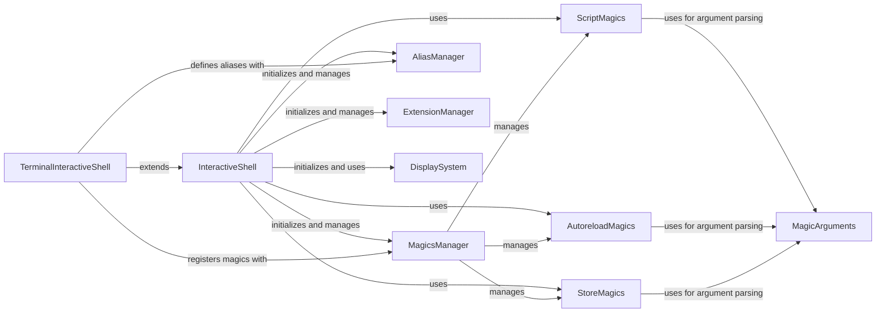

## Component Details

This graph illustrates the core components of IPython's Command & Extension Framework, highlighting how the `InteractiveShell` acts as the central hub, initializing and interacting with various managers for magics, aliases, and extensions. It also shows how specialized magic commands and extensions integrate with the system, often utilizing `MagicArguments` for parsing, and how the `DisplaySystem` handles output. The `TerminalInteractiveShell` demonstrates an extension of the core shell for specific environments.

### InteractiveShell
The central orchestrator of the IPython environment, responsible for managing command execution, namespace, history, and integrating with various sub-managers for magics, aliases, and extensions. It acts as the primary interface for user interactions and dispatches calls to the appropriate managers for handling specialized commands.

**Related Classes/Methods**:

- <a href="https://github.com/ipython/ipython/blob/master/IPython/core/interactiveshell.py#L330-L4075" target="_blank" rel="noopener noreferrer">`IPython.core.interactiveshell.InteractiveShell` (330:4075)</a>
- <a href="https://github.com/ipython/ipython/blob/master/IPython/core/interactiveshell.py#L2444-L2497" target="_blank" rel="noopener noreferrer">`IPython.core.interactiveshell.InteractiveShell:run_line_magic` (2444:2497)</a>
- <a href="https://github.com/ipython/ipython/blob/master/IPython/core/interactiveshell.py#L2509-L2558" target="_blank" rel="noopener noreferrer">`IPython.core.interactiveshell.InteractiveShell:run_cell_magic` (2509:2558)</a>
- <a href="https://github.com/ipython/ipython/blob/master/IPython/core/interactiveshell.py#L2376-L2408" target="_blank" rel="noopener noreferrer">`IPython.core.interactiveshell.InteractiveShell:init_magics` (2376:2408)</a>
- <a href="https://github.com/ipython/ipython/blob/master/IPython/core/interactiveshell.py#L2729-L2731" target="_blank" rel="noopener noreferrer">`IPython.core.interactiveshell.InteractiveShell:init_alias` (2729:2731)</a>
- <a href="https://github.com/ipython/ipython/blob/master/IPython/core/interactiveshell.py#L2737-L2739" target="_blank" rel="noopener noreferrer">`IPython.core.interactiveshell.InteractiveShell:init_extension_manager` (2737:2739)</a>

### MagicsManager
Manages the registration, lookup, and execution of IPython's line and cell magic commands. It acts as a central registry for all available magic functions, allowing `InteractiveShell` to dispatch magic calls efficiently.

**Related Classes/Methods**:

- <a href="https://github.com/ipython/ipython/blob/master/IPython/core/magic.py#L309-L522" target="_blank" rel="noopener noreferrer">`IPython.core.magic.MagicsManager` (309:522)</a>
- <a href="https://github.com/ipython/ipython/blob/master/IPython/core/magic.py#L464-L494" target="_blank" rel="noopener noreferrer">`IPython.core.magic.MagicsManager:register_function` (464:494)</a>

### AliasManager
Handles the creation, definition, and management of command aliases within the IPython environment. It allows users to define shortcuts for frequently used commands, enhancing productivity.

**Related Classes/Methods**:

- <a href="https://github.com/ipython/ipython/blob/master/IPython/core/alias.py#L196-L268" target="_blank" rel="noopener noreferrer">`IPython.core.alias.AliasManager` (196:268)</a>
- <a href="https://github.com/ipython/ipython/blob/master/IPython/core/alias.py#L233-L241" target="_blank" rel="noopener noreferrer">`IPython.core.alias.AliasManager:define_alias` (233:241)</a>

### ExtensionManager
Manages the dynamic loading, unloading, and reloading of IPython extensions. Extensions provide additional, modular functionality to the IPython shell, allowing for a highly customizable environment.

**Related Classes/Methods**:

- <a href="https://github.com/ipython/ipython/blob/master/IPython/core/extensions.py#L24-L135" target="_blank" rel="noopener noreferrer">`IPython.core.extensions.ExtensionManager` (24:135)</a>
- <a href="https://github.com/ipython/ipython/blob/master/IPython/core/extensions.py#L54-L67" target="_blank" rel="noopener noreferrer">`IPython.core.extensions.ExtensionManager:load_extension` (54:67)</a>
- <a href="https://github.com/ipython/ipython/blob/master/IPython/core/extensions.py#L106-L125" target="_blank" rel="noopener noreferrer">`IPython.core.extensions.ExtensionManager:reload_extension` (106:125)</a>

### MagicArguments
Provides decorators and utilities for parsing arguments of magic commands. It enables magic functions to define their expected arguments and options in a structured way, facilitating robust command-line parsing for magics.

**Related Classes/Methods**:

- <a href="https://github.com/ipython/ipython/blob/master/IPython/core/magic_arguments.py#L171-L190" target="_blank" rel="noopener noreferrer">`IPython.core.magic_arguments.construct_parser` (171:190)</a>
- <a href="https://github.com/ipython/ipython/blob/master/IPython/core/magic_arguments.py#L225-L242" target="_blank" rel="noopener noreferrer">`IPython.core.magic_arguments.magic_arguments` (225:242)</a>
- <a href="https://github.com/ipython/ipython/blob/master/IPython/core/magic_arguments.py#L269-L274" target="_blank" rel="noopener noreferrer">`IPython.core.magic_arguments.argument` (269:274)</a>
- <a href="https://github.com/ipython/ipython/blob/master/IPython/core/magic_arguments.py#L193-L196" target="_blank" rel="noopener noreferrer">`IPython.core.magic_arguments.parse_argstring` (193:196)</a>

### AutoreloadMagics
An IPython extension that provides magic commands to automatically reload Python modules when their source code changes. This facilitates a more dynamic development workflow by eliminating the need for manual restarts after code modifications.

**Related Classes/Methods**:

- <a href="https://github.com/ipython/ipython/blob/master/IPython/extensions/autoreload.py#L524-L744" target="_blank" rel="noopener noreferrer">`IPython.extensions.autoreload.AutoreloadMagics` (524:744)</a>
- <a href="https://github.com/ipython/ipython/blob/master/IPython/extensions/autoreload.py#L585-L688" target="_blank" rel="noopener noreferrer">`IPython.extensions.autoreload.AutoreloadMagics:autoreload` (585:688)</a>

### StoreMagics
An IPython extension that offers magic commands for storing and restoring user variables, aliases, and macros across IPython sessions. This enables the persistence of the interactive environment, allowing users to resume their work seamlessly.

**Related Classes/Methods**:

- <a href="https://github.com/ipython/ipython/blob/master/IPython/extensions/storemagic.py#L61-L230" target="_blank" rel="noopener noreferrer">`IPython.extensions.storemagic.StoreMagics` (61:230)</a>
- <a href="https://github.com/ipython/ipython/blob/master/IPython/extensions/storemagic.py#L80-L230" target="_blank" rel="noopener noreferrer">`IPython.extensions.storemagic.StoreMagics:store` (80:230)</a>

### TerminalInteractiveShell
A specialized subclass of `InteractiveShell` designed for terminal-based IPython environments. It extends the core shell's functionalities with terminal-specific behaviors, such as prompt management and alias initialization relevant to a terminal, while inheriting the core command and extension framework capabilities.

**Related Classes/Methods**:

- <a href="https://github.com/ipython/ipython/blob/master/IPython/terminal/interactiveshell.py#L203-L1115" target="_blank" rel="noopener noreferrer">`IPython.terminal.interactiveshell.TerminalInteractiveShell` (203:1115)</a>
- <a href="https://github.com/ipython/ipython/blob/master/IPython/terminal/interactiveshell.py#L966-L976" target="_blank" rel="noopener noreferrer">`IPython.terminal.interactiveshell.TerminalInteractiveShell:init_alias` (966:976)</a>
- <a href="https://github.com/ipython/ipython/blob/master/IPython/terminal/interactiveshell.py#L962-L964" target="_blank" rel="noopener noreferrer">`IPython.terminal.interactiveshell.TerminalInteractiveShell:init_magics` (962:964)</a>

### ScriptMagics
A collection of magic commands specifically designed for executing external scripts and managing their execution environment within IPython. It provides functionalities to run scripts and interact with their output.

**Related Classes/Methods**:

- <a href="https://github.com/ipython/ipython/blob/master/IPython/core/magics/script.py#L75-L393" target="_blank" rel="noopener noreferrer">`IPython.core.magics.script.ScriptMagics` (75:393)</a>
- <a href="https://github.com/ipython/ipython/blob/master/IPython/core/magics/script.py#L146-L170" target="_blank" rel="noopener noreferrer">`IPython.core.magics.script.ScriptMagics:_make_script_magic` (146:170)</a>
- <a href="https://github.com/ipython/ipython/blob/master/IPython/core/magics/script.py#L175-L336" target="_blank" rel="noopener noreferrer">`IPython.core.magics.script.ScriptMagics.shebang` (175:336)</a>

### DisplaySystem
Encompasses components responsible for handling and displaying various types of output, including rich formats like HTML. It manages the display hook and publisher for rendering diverse output formats within the IPython environment.

**Related Classes/Methods**:

- <a href="https://github.com/ipython/ipython/blob/master/IPython/core/display.py#L431-L459" target="_blank" rel="noopener noreferrer">`IPython.core.display.HTML` (431:459)</a>
- <a href="https://github.com/ipython/ipython/blob/master/IPython/core/display_functions.py#L85-L287" target="_blank" rel="noopener noreferrer">`IPython.core.display_functions.display` (85:287)</a>
- <a href="https://github.com/ipython/ipython/blob/master/IPython/core/displayhook.py#L25-L332" target="_blank" rel="noopener noreferrer">`IPython.core.displayhook.DisplayHook` (25:332)</a>
- <a href="https://github.com/ipython/ipython/blob/master/IPython/core/displaypub.py#L36-L159" target="_blank" rel="noopener noreferrer">`IPython.core.displaypub.DisplayPublisher` (36:159)</a>

### [FAQ](https://github.com/CodeBoarding/GeneratedOnBoardings/tree/main?tab=readme-ov-file#faq)