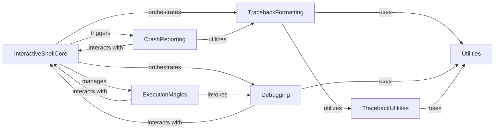

## Component Details

This graph illustrates the core components and their interactions within IPython's error handling and debugging subsystem. The `InteractiveShellCore` acts as the central orchestrator, managing the display of tracebacks through `TracebackFormatting`, initiating debugging sessions via the `Debugging` component, and triggering `CrashReporting` for unhandled exceptions. `ExecutionMagics` provides commands to invoke debugging functionalities. Supporting these are `TracebackUtilities` for common traceback operations and `Utilities` for general-purpose functionalities like text formatting and coloring, which are utilized by multiple components.

### InteractiveShellCore
The central component managing the IPython interactive environment. It handles user input, code execution, maintains session history and namespaces, and orchestrates interactions with various other subsystems for tasks like error handling, debugging, and magic command processing.

**Related Classes/Methods**:

- <a href="https://github.com/ipython/ipython/blob/master/IPython/core/interactiveshell.py#L330-L4075" target="_blank" rel="noopener noreferrer">`IPython.core.interactiveshell.InteractiveShell` (330:4075)</a>
- <a href="https://github.com/ipython/ipython/blob/master/IPython/core/interactiveshell.py#L2125-L2199" target="_blank" rel="noopener noreferrer">`IPython.core.interactiveshell.InteractiveShell:showtraceback` (2125:2199)</a>

### TracebackFormatting
This subsystem is responsible for generating and displaying formatted tracebacks in various styles (e.g., plain, context, verbose, minimal, and doctest-specific). It provides different levels of detail and can include syntax highlighting to improve readability of error messages.

**Related Classes/Methods**:

- <a href="https://github.com/ipython/ipython/blob/master/IPython/core/ultratb.py#L115-L433" target="_blank" rel="noopener noreferrer">`IPython.core.ultratb.ListTB` (115:433)</a>
- <a href="https://github.com/ipython/ipython/blob/master/IPython/core/ultratb.py#L441-L986" target="_blank" rel="noopener noreferrer">`IPython.core.ultratb.VerboseTB` (441:986)</a>
- <a href="https://github.com/ipython/ipython/blob/master/IPython/core/ultratb.py#L990-L1118" target="_blank" rel="noopener noreferrer">`IPython.core.ultratb.FormattedTB` (990:1118)</a>
- <a href="https://github.com/ipython/ipython/blob/master/IPython/core/ultratb.py#L1122-L1184" target="_blank" rel="noopener noreferrer">`IPython.core.ultratb.AutoFormattedTB` (1122:1184)</a>
- <a href="https://github.com/ipython/ipython/blob/master/IPython/core/ultratb.py#L1136-L1164" target="_blank" rel="noopener noreferrer">`IPython.core.ultratb.AutoFormattedTB:__call__` (1136:1164)</a>
- <a href="https://github.com/ipython/ipython/blob/master/IPython/core/ultratb.py#L1204-L1252" target="_blank" rel="noopener noreferrer">`IPython.core.ultratb.SyntaxTB` (1204:1252)</a>
- <a href="https://github.com/ipython/ipython/blob/master/IPython/core/doctb.py#L83-L444" target="_blank" rel="noopener noreferrer">`IPython.core.doctb.DocTB` (83:444)</a>

### Debugging
This component provides interactive debugging capabilities, allowing users to pause program execution, step through code line by line, inspect variables, and set breakpoints. It extends Python's built-in debugger with IPython-specific enhancements and terminal integration.

**Related Classes/Methods**:

- <a href="https://github.com/ipython/ipython/blob/master/IPython/core/debugger.py#L200-L1200" target="_blank" rel="noopener noreferrer">`IPython.core.debugger.Pdb` (200:1200)</a>
- <a href="https://github.com/ipython/ipython/blob/master/IPython/core/debugger.py#L1203-L1228" target="_blank" rel="noopener noreferrer">`IPython.core.debugger.InterruptiblePdb` (1203:1228)</a>
- <a href="https://github.com/ipython/ipython/blob/master/IPython/terminal/debugger.py#L25-L160" target="_blank" rel="noopener noreferrer">`IPython.terminal.debugger.TerminalPdb` (25:160)</a>
- <a href="https://github.com/ipython/ipython/blob/master/IPython/terminal/debugger.py#L28-L32" target="_blank" rel="noopener noreferrer">`IPython.terminal.debugger.TerminalPdb:__init__` (28:32)</a>

### CrashReporting
Responsible for handling unhandled exceptions that lead to an IPython crash. It generates detailed crash reports, including tracebacks, input history, and configuration information, to assist in debugging and issue resolution.

**Related Classes/Methods**:

- <a href="https://github.com/ipython/ipython/blob/master/IPython/core/crashhandler.py#L89-L227" target="_blank" rel="noopener noreferrer">`IPython.core.crashhandler.CrashHandler` (89:227)</a>
- <a href="https://github.com/ipython/ipython/blob/master/IPython/core/crashhandler.py#L208-L227" target="_blank" rel="noopener noreferrer">`IPython.core.crashhandler.CrashHandler:make_report` (208:227)</a>

### TracebackUtilities
A foundational layer providing common utility functions and base functionalities for traceback display and processing. It handles tasks such as managing color themes, and processing chained exceptions.

**Related Classes/Methods**:

- <a href="https://github.com/ipython/ipython/blob/master/IPython/core/tbtools.py#L375-L554" target="_blank" rel="noopener noreferrer">`IPython.core.tbtools.TBTools` (375:554)</a>

### ExecutionMagics
This component implements IPython's 'magic' commands that directly control code execution, profiling, and timing. It provides functionalities like running external scripts, activating the debugger, measuring execution time, and defining code transformations.

**Related Classes/Methods**:

- <a href="https://github.com/ipython/ipython/blob/master/IPython/core/magics/execution.py#L191-L1629" target="_blank" rel="noopener noreferrer">`IPython.core.magics.execution.ExecutionMagics` (191:1629)</a>

### Utilities
A collection of general utility functions and classes used across different IPython components, including text formatting and coloring.

**Related Classes/Methods**:

- `IPython.utils.PyColorize` (full file reference)

### [FAQ](https://github.com/CodeBoarding/GeneratedOnBoardings/tree/main?tab=readme-ov-file#faq)