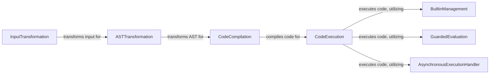

## Component Details

The Execution & Input Pipeline in IPython manages the complete lifecycle of user input, from initial parsing to final execution. It begins by transforming raw text input, handling IPython-specific syntax like magic commands and system calls. The processed input is then subjected to Abstract Syntax Tree (AST) transformations for advanced code manipulation. Subsequently, the code is compiled into executable bytecode, with caching mechanisms in place for efficiency. The compiled code is then executed within the appropriate user namespaces, incorporating secure evaluation and asynchronous execution capabilities. Throughout this process, the pipeline interacts with components responsible for managing built-in functions, handling exceptions, and maintaining various Python namespaces.

### InputTransformation
Manages the initial parsing and transformation of raw user input, converting IPython-specific syntax (like magic commands, system calls, and help queries) into standard Python code. This involves cleanup, line-based, and token-based transformations.

**Related Classes/Methods**:

- <a href="https://github.com/ipython/ipython/blob/master/IPython/core/inputtransformer2.py#L635-L644" target="_blank" rel="noopener noreferrer">`IPython.core.inputtransformer2.TransformerManager:transform_cell` (635:644)</a>

### ASTTransformation
Applies Abstract Syntax Tree (AST) transformations to the parsed code. These transformations can modify the structure of the code before compilation and execution, allowing for advanced features and syntax manipulation.

**Related Classes/Methods**:

- <a href="https://github.com/ipython/ipython/blob/master/IPython/core/interactiveshell.py#L3479-L3511" target="_blank" rel="noopener noreferrer">`IPython.core.interactiveshell.InteractiveShell:transform_ast` (3479:3511)</a>

### CodeCompilation
Responsible for compiling the transformed Python code (represented as an AST) into executable bytecode. It handles caching of compiled cells and manages the __future__ environment.

**Related Classes/Methods**:

- <a href="https://github.com/ipython/ipython/blob/master/IPython/core/interactiveshell.py#L560-L560" target="_blank" rel="noopener noreferrer">`IPython.core.interactiveshell.InteractiveShell:compile` (560:560)</a>
- <a href="https://github.com/ipython/ipython/blob/master/IPython/core/interactiveshell.py#L355-L355" target="_blank" rel="noopener noreferrer">`IPython.core.interactiveshell.InteractiveShell:compiler_class` (355:355)</a>
- <a href="https://github.com/ipython/ipython/blob/master/IPython/core/compilerop.py#L69-L192" target="_blank" rel="noopener noreferrer">`IPython.core.compilerop.CachingCompiler` (69:192)</a>

### CodeExecution
Executes the compiled Python code objects within the appropriate user namespaces. It handles the actual running of code and integrates with exception handling and asynchronous execution mechanisms.

**Related Classes/Methods**:

- <a href="https://github.com/ipython/ipython/blob/master/IPython/core/interactiveshell.py#L3513-L3634" target="_blank" rel="noopener noreferrer">`IPython.core.interactiveshell.InteractiveShell:run_ast_nodes` (3513:3634)</a>
- <a href="https://github.com/ipython/ipython/blob/master/IPython/core/interactiveshell.py#L3636-L3697" target="_blank" rel="noopener noreferrer">`IPython.core.interactiveshell.InteractiveShell:run_code` (3636:3697)</a>

### BuiltinManagement
A context manager that controls and modifies Python's built-in functions within the IPython environment. It allows for temporary overriding or removal of builtins like `exit`, `quit`, and `get_ipython` to provide IPython-specific behavior.

**Related Classes/Methods**:

- <a href="https://github.com/ipython/ipython/blob/master/IPython/core/builtin_trap.py#L46-L51" target="_blank" rel="noopener noreferrer">`IPython.core.builtin_trap.BuiltinTrap:__enter__` (46:51)</a>

### GuardedEvaluation
Provides a secure mechanism for evaluating Python expressions by enforcing various policies on access to namespaces, attributes, items, and function calls. This prevents unintended side effects or malicious code execution during introspection or partial evaluation.

**Related Classes/Methods**:

- <a href="https://github.com/ipython/ipython/blob/master/IPython/core/guarded_eval.py#L355-L388" target="_blank" rel="noopener noreferrer">`IPython.core.guarded_eval:guarded_eval` (355:388)</a>

### AsynchronousExecutionHandler
Manages the execution of asynchronous Python code (coroutines) within the IPython shell. It determines if a code block requires asynchronous execution and dispatches it to the appropriate event loop runner (e.g., asyncio, curio, trio).

**Related Classes/Methods**:

- <a href="https://github.com/ipython/ipython/blob/master/IPython/core/async_helpers.py#L138-L155" target="_blank" rel="noopener noreferrer">`IPython.core.async_helpers._should_be_async` (138:155)</a>

### [FAQ](https://github.com/CodeBoarding/GeneratedOnBoardings/tree/main?tab=readme-ov-file#faq)