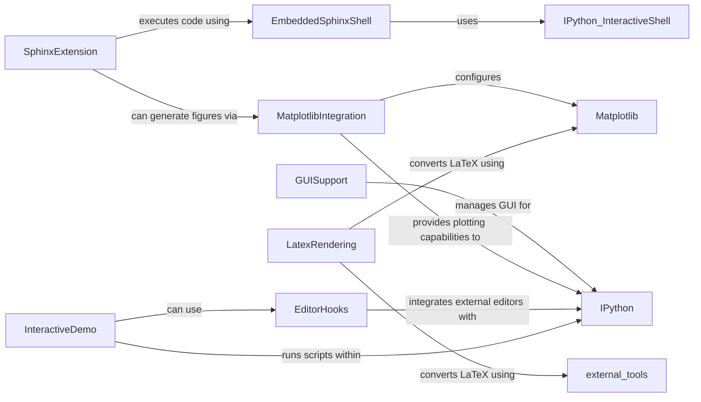

## Component Details

The `External Integrations` subsystem in IPython provides robust support for seamless interaction with various external libraries, GUI toolkits, and development tools. It encompasses functionalities for managing GUI event loops, configuring and rendering plots with Matplotlib, integrating with external text editors, and extending Sphinx for documentation generation with live IPython code execution and LaTeX rendering. This subsystem ensures that IPython can function as a versatile and extensible environment for scientific computing and interactive development.

### GUISupport
Manages the lifecycle of GUI applications and their event loops within IPython, providing a consistent interface for different GUI toolkits like Qt and wxPython. It ensures proper application creation and event loop management to prevent conflicts and allows IPython to integrate with interactive graphical environments.

**Related Classes/Methods**:

- <a href="https://github.com/ipython/ipython/blob/master/IPython/lib/guisupport.py#L138-L147" target="_blank" rel="noopener noreferrer">`IPython.lib.guisupport:start_event_loop_qt4` (138:147)</a>
- <a href="https://github.com/ipython/ipython/blob/master/IPython/lib/guisupport.py#L112-L120" target="_blank" rel="noopener noreferrer">`IPython.lib.guisupport:get_app_qt4` (112:120)</a>
- <a href="https://github.com/ipython/ipython/blob/master/IPython/lib/guisupport.py#L122-L136" target="_blank" rel="noopener noreferrer">`IPython.lib.guisupport:is_event_loop_running_qt4` (122:136)</a>
- <a href="https://github.com/ipython/ipython/blob/master/IPython/lib/guisupport.py#L69-L77" target="_blank" rel="noopener noreferrer">`IPython.lib.guisupport:get_app_wx` (69:77)</a>
- <a href="https://github.com/ipython/ipython/blob/master/IPython/lib/guisupport.py#L79-L95" target="_blank" rel="noopener noreferrer">`IPython.lib.guisupport:is_event_loop_running_wx` (79:95)</a>
- <a href="https://github.com/ipython/ipython/blob/master/IPython/lib/guisupport.py#L97-L106" target="_blank" rel="noopener noreferrer">`IPython.lib.guisupport:start_event_loop_wx` (97:106)</a>

### MatplotlibIntegration
Facilitates the deep integration of Matplotlib with IPython, handling backend activation, interactive plotting, and various figure rendering and saving functionalities to enhance data visualization within the IPython environment.

**Related Classes/Methods**:

- <a href="https://github.com/ipython/ipython/blob/master/IPython/core/pylabtools.py#L394-L415" target="_blank" rel="noopener noreferrer">`IPython.core.pylabtools:activate_matplotlib` (394:415)</a>
- <a href="https://github.com/ipython/ipython/blob/master/IPython/core/pylabtools.py#L321-L391" target="_blank" rel="noopener noreferrer">`IPython.core.pylabtools:find_gui_and_backend` (321:391)</a>
- <a href="https://github.com/ipython/ipython/blob/master/IPython/core/pylabtools.py#L418-L448" target="_blank" rel="noopener noreferrer">`IPython.core.pylabtools:import_pylab` (418:448)</a>
- <a href="https://github.com/ipython/ipython/blob/master/IPython/core/pylabtools.py#L129-L176" target="_blank" rel="noopener noreferrer">`IPython.core.pylabtools:print_figure` (129:176)</a>
- <a href="https://github.com/ipython/ipython/blob/master/IPython/core/pylabtools.py#L178-L196" target="_blank" rel="noopener noreferrer">`IPython.core.pylabtools:retina_figure` (178:196)</a>
- <a href="https://github.com/ipython/ipython/blob/master/IPython/core/pylabtools.py#L261-L314" target="_blank" rel="noopener noreferrer">`IPython.core.pylabtools:select_figure_formats` (261:314)</a>

### EditorHooks
Provides a flexible mechanism for IPython to integrate with external text editors, allowing users to edit code directly from the IPython environment using their preferred editor via the `%edit` magic command.

**Related Classes/Methods**:

- <a href="https://github.com/ipython/ipython/blob/master/IPython/lib/editorhooks.py#L18-L61" target="_blank" rel="noopener noreferrer">`IPython.lib.editorhooks:install_editor` (18:61)</a>

### SphinxExtension
Enables the embedding and execution of live IPython code blocks within Sphinx documentation, supporting interactive sessions, code highlighting, output capture, and figure generation for rich and dynamic documentation.

**Related Classes/Methods**:

- <a href="https://github.com/ipython/ipython/blob/master/IPython/sphinxext/ipython_directive.py#L1003-L1070" target="_blank" rel="noopener noreferrer">`IPython.sphinxext.ipython_directive.IPythonDirective:run` (1003:1070)</a>
- <a href="https://github.com/ipython/ipython/blob/master/IPython/sphinxext/ipython_directive.py#L944-L995" target="_blank" rel="noopener noreferrer">`IPython.sphinxext.ipython_directive.IPythonDirective:setup` (944:995)</a>
- <a href="https://github.com/ipython/ipython/blob/master/IPython/sphinxext/ipython_directive.py#L806-L885" target="_blank" rel="noopener noreferrer">`IPython.sphinxext.ipython_directive.EmbeddedSphinxShell:process_pure_python` (806:885)</a>
- <a href="https://github.com/ipython/ipython/blob/master/IPython/sphinxext/ipython_directive.py#L230-L337" target="_blank" rel="noopener noreferrer">`IPython.sphinxext.ipython_directive:block_parser` (230:337)</a>
- <a href="https://github.com/ipython/ipython/blob/master/IPython/sphinxext/ipython_directive.py#L711-L778" target="_blank" rel="noopener noreferrer">`IPython.sphinxext.ipython_directive.EmbeddedSphinxShell:process_block` (711:778)</a>
- <a href="https://github.com/ipython/ipython/blob/master/IPython/sphinxext/ipython_directive.py#L997-L1001" target="_blank" rel="noopener noreferrer">`IPython.sphinxext.ipython_directive.IPythonDirective:teardown` (997:1001)</a>

### LatexRendering
Offers utilities for converting LaTeX mathematical expressions into image formats (primarily PNG), supporting different rendering backends (Matplotlib or external tools like dvipng) for display within IPython or generated content.

**Related Classes/Methods**:

- <a href="https://github.com/ipython/ipython/blob/master/IPython/lib/latextools.py#L60-L108" target="_blank" rel="noopener noreferrer">`IPython.lib.latextools:latex_to_png` (60:108)</a>
- <a href="https://github.com/ipython/ipython/blob/master/IPython/lib/latextools.py#L111-L138" target="_blank" rel="noopener noreferrer">`IPython.lib.latextools:latex_to_png_mpl` (111:138)</a>
- <a href="https://github.com/ipython/ipython/blob/master/IPython/lib/latextools.py#L141-L200" target="_blank" rel="noopener noreferrer">`IPython.lib.latextools:latex_to_png_dvipng` (141:200)</a>
- <a href="https://github.com/ipython/ipython/blob/master/IPython/lib/latextools.py#L216-L238" target="_blank" rel="noopener noreferrer">`IPython.lib.latextools:genelatex` (216:238)</a>
- <a href="https://github.com/ipython/ipython/blob/master/IPython/lib/latextools.py#L23-L57" target="_blank" rel="noopener noreferrer">`IPython.lib.latextools.LaTeXTool` (23:57)</a>

### InteractiveDemo
Provides a framework for creating and running interactive, step-by-step demonstrations of Python code within IPython, allowing for controlled execution, visual feedback, and user interaction to showcase code functionalities.

**Related Classes/Methods**:

- <a href="https://github.com/ipython/ipython/blob/master/IPython/lib/demo.py#L206-L287" target="_blank" rel="noopener noreferrer">`IPython.lib.demo.Demo:__init__` (206:287)</a>
- <a href="https://github.com/ipython/ipython/blob/master/IPython/lib/demo.py#L301-L335" target="_blank" rel="noopener noreferrer">`IPython.lib.demo.Demo:reload` (301:335)</a>
- <a href="https://github.com/ipython/ipython/blob/master/IPython/lib/demo.py#L447-L450" target="_blank" rel="noopener noreferrer">`IPython.lib.demo.Demo:run_cell` (447:450)</a>
- <a href="https://github.com/ipython/ipython/blob/master/IPython/lib/demo.py#L556-L559" target="_blank" rel="noopener noreferrer">`IPython.lib.demo.IPythonDemo:run_cell` (556:559)</a>
- <a href="https://github.com/ipython/ipython/blob/master/IPython/lib/demo.py#L575-L593" target="_blank" rel="noopener noreferrer">`IPython.lib.demo.LineDemo:reload` (575:593)</a>

### [FAQ](https://github.com/CodeBoarding/GeneratedOnBoardings/tree/main?tab=readme-ov-file#faq)