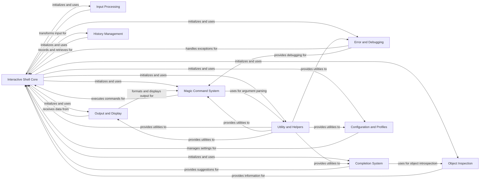

## Component Details

The IPython Core is the foundational and central component of IPython, responsible for initializing the interactive environment, managing the overall application lifecycle, and orchestrating the interactions between all other major systems. It handles the core execution loop, user namespaces, and built-in function management.

### Interactive Shell Core
This component represents the central logic of the IPython interactive session. It manages the user's environment, executes code, handles events, and integrates with various other IPython subsystems like history, display, and magics.

**Related Classes/Methods**:

- <a href="https://github.com/ipython/ipython/blob/master/IPython/core/interactiveshell.py#L330-L4075" target="_blank" rel="noopener noreferrer">`ipython.IPython.core.interactiveshell.InteractiveShell` (330:4075)</a>
- <a href="https://github.com/ipython/ipython/blob/master/IPython/core/interactiveshell.py#L594-L667" target="_blank" rel="noopener noreferrer">`ipython.IPython.core.interactiveshell.InteractiveShell:__init__` (594:667)</a>
- <a href="https://github.com/ipython/ipython/blob/master/IPython/core/interactiveshell.py#L3061-L3107" target="_blank" rel="noopener noreferrer">`ipython.IPython.core.interactiveshell.InteractiveShell:run_cell` (3061:3107)</a>
- <a href="https://github.com/ipython/ipython/blob/master/IPython/core/interactiveshell.py#L3636-L3697" target="_blank" rel="noopener noreferrer">`ipython.IPython.core.interactiveshell.InteractiveShell:run_code` (3636:3697)</a>
- <a href="https://github.com/ipython/ipython/blob/master/IPython/core/interactiveshell.py#L3449-L3477" target="_blank" rel="noopener noreferrer">`ipython.IPython.core.interactiveshell.InteractiveShell:transform_cell` (3449:3477)</a>
- <a href="https://github.com/ipython/ipython/blob/master/IPython/core/interactiveshell.py#L1912-L1915" target="_blank" rel="noopener noreferrer">`ipython.IPython.core.interactiveshell.InteractiveShell:init_history` (1912:1915)</a>
- <a href="https://github.com/ipython/ipython/blob/master/IPython/core/interactiveshell.py#L2266-L2299" target="_blank" rel="noopener noreferrer">`ipython.IPython.core.interactiveshell.InteractiveShell:init_completer` (2266:2299)</a>
- <a href="https://github.com/ipython/ipython/blob/master/IPython/core/interactiveshell.py#L2376-L2408" target="_blank" rel="noopener noreferrer">`ipython.IPython.core.interactiveshell.InteractiveShell:init_magics` (2376:2408)</a>
- <a href="https://github.com/ipython/ipython/blob/master/IPython/core/interactiveshell.py#L1923-L1946" target="_blank" rel="noopener noreferrer">`ipython.IPython.core.interactiveshell.InteractiveShell:init_traceback_handlers` (1923:1946)</a>
- <a href="https://github.com/ipython/ipython/blob/master/IPython/core/interactiveshell.py#L2125-L2199" target="_blank" rel="noopener noreferrer">`ipython.IPython.core.interactiveshell.InteractiveShell:showtraceback` (2125:2199)</a>
- <a href="https://github.com/ipython/ipython/blob/master/IPython/core/interactiveshell.py#L2444-L2497" target="_blank" rel="noopener noreferrer">`ipython.IPython.core.interactiveshell.InteractiveShell:run_line_magic` (2444:2497)</a>
- <a href="https://github.com/ipython/ipython/blob/master/IPython/core/interactiveshell.py#L2509-L2558" target="_blank" rel="noopener noreferrer">`ipython.IPython.core.interactiveshell.InteractiveShell:run_cell_magic` (2509:2558)</a>
- <a href="https://github.com/ipython/ipython/blob/master/IPython/core/interactiveshell.py#L1867-L1876" target="_blank" rel="noopener noreferrer">`ipython.IPython.core.interactiveshell.InteractiveShell:object_inspect` (1867:1876)</a>
- <a href="https://github.com/ipython/ipython/blob/master/IPython/core/interactiveshell.py#L1419-L1481" target="_blank" rel="noopener noreferrer">`ipython.IPython.core.interactiveshell.InteractiveShell:reset` (1419:1481)</a>
- <a href="https://github.com/ipython/ipython/blob/master/IPython/core/interactiveshell.py#L3731-L3784" target="_blank" rel="noopener noreferrer">`ipython.IPython.core.interactiveshell.InteractiveShell:enable_matplotlib` (3731:3784)</a>
- <a href="https://github.com/ipython/ipython/blob/master/IPython/core/interactiveshell.py#L3786-L3826" target="_blank" rel="noopener noreferrer">`ipython.IPython.core.interactiveshell.InteractiveShell:enable_pylab` (3786:3826)</a>
- <a href="https://github.com/ipython/ipython/blob/master/IPython/core/interactiveshell.py#L2606-L2627" target="_blank" rel="noopener noreferrer">`ipython.IPython.core.interactiveshell.InteractiveShell:system_piped` (2606:2627)</a>
- <a href="https://github.com/ipython/ipython/blob/master/IPython/core/interactiveshell.py#L2629-L2691" target="_blank" rel="noopener noreferrer">`ipython.IPython.core.interactiveshell.InteractiveShell:system_raw` (2629:2691)</a>
- <a href="https://github.com/ipython/ipython/blob/master/IPython/core/interactiveshell.py#L2696-L2723" target="_blank" rel="noopener noreferrer">`ipython.IPython.core.interactiveshell.InteractiveShell:getoutput` (2696:2723)</a>
- <a href="https://github.com/ipython/ipython/blob/master/IPython/core/interactiveshell.py#L2862-L2928" target="_blank" rel="noopener noreferrer">`ipython.IPython.core.interactiveshell.InteractiveShell:safe_execfile` (2862:2928)</a>
- <a href="https://github.com/ipython/ipython/blob/master/IPython/core/interactiveshell.py#L2930-L2986" target="_blank" rel="noopener noreferrer">`ipython.IPython.core.interactiveshell.InteractiveShell:safe_execfile_ipy` (2930:2986)</a>
- <a href="https://github.com/ipython/ipython/blob/master/IPython/core/interactiveshell.py#L2988-L3014" target="_blank" rel="noopener noreferrer">`ipython.IPython.core.interactiveshell.InteractiveShell:safe_run_module` (2988:3014)</a>
- <a href="https://github.com/ipython/ipython/blob/master/IPython/core/interactiveshell.py#L4035-L4067" target="_blank" rel="noopener noreferrer">`ipython.IPython.core.interactiveshell.InteractiveShell:atexit_operations` (4035:4067)</a>
- <a href="https://github.com/ipython/ipython/blob/master/IPython/core/interactiveshell.py#L4069-L4070" target="_blank" rel="noopener noreferrer">`ipython.IPython.core.interactiveshell.InteractiveShell:cleanup` (4069:4070)</a>
- <a href="https://github.com/ipython/ipython/blob/master/IPython/core/interactiveshell.py#L1180-L1198" target="_blank" rel="noopener noreferrer">`ipython.IPython.core.interactiveshell.InteractiveShell:debugger` (1180:1198)</a>
- <a href="https://github.com/ipython/ipython/blob/master/IPython/core/interactiveshell.py#L867-L877" target="_blank" rel="noopener noreferrer">`ipython.IPython.core.interactiveshell.InteractiveShell:init_displayhook` (867:877)</a>
- <a href="https://github.com/ipython/ipython/blob/master/IPython/core/interactiveshell.py#L852-L854" target="_blank" rel="noopener noreferrer">`ipython.IPython.core.interactiveshell.InteractiveShell:init_display_formatter` (852:854)</a>
- <a href="https://github.com/ipython/ipython/blob/master/IPython/core/interactiveshell.py#L2753-L2759" target="_blank" rel="noopener noreferrer">`ipython.IPython.core.interactiveshell.InteractiveShell:init_prefilter` (2753:2759)</a>
- <a href="https://github.com/ipython/ipython/blob/master/IPython/core/interactiveshell.py#L2729-L2731" target="_blank" rel="noopener noreferrer">`ipython.IPython.core.interactiveshell.InteractiveShell:init_alias` (2729:2731)</a>
- <a href="https://github.com/ipython/ipython/blob/master/IPython/core/interactiveshell.py#L2737-L2739" target="_blank" rel="noopener noreferrer">`ipython.IPython.core.interactiveshell.InteractiveShell:init_extension_manager` (2737:2739)</a>
- <a href="https://github.com/ipython/ipython/blob/master/IPython/core/interactiveshell.py#L2745-L2747" target="_blank" rel="noopener noreferrer">`ipython.IPython.core.interactiveshell.InteractiveShell:init_payload` (2745:2747)</a>
- <a href="https://github.com/ipython/ipython/blob/master/IPython/core/interactiveshell.py#L829-L837" target="_blank" rel="noopener noreferrer">`ipython.IPython.core.interactiveshell.InteractiveShell:init_builtins` (829:837)</a>
- <a href="https://github.com/ipython/ipython/blob/master/IPython/core/interactiveshell.py#L815-L817" target="_blank" rel="noopener noreferrer">`ipython.IPython.core.interactiveshell.InteractiveShell:init_logger` (815:817)</a>
- <a href="https://github.com/ipython/ipython/blob/master/IPython/core/interactiveshell.py#L1018-L1032" target="_blank" rel="noopener noreferrer">`ipython.IPython.core.interactiveshell.InteractiveShell:init_hooks` (1018:1032)</a>
- <a href="https://github.com/ipython/ipython/blob/master/IPython/core/interactiveshell.py#L1079-L1082" target="_blank" rel="noopener noreferrer">`ipython.IPython.core.interactiveshell.InteractiveShell:init_events` (1079:1082)</a>
- <a href="https://github.com/ipython/ipython/blob/master/IPython/core/interactiveshell.py#L779-L803" target="_blank" rel="noopener noreferrer">`ipython.IPython.core.interactiveshell.InteractiveShell:init_syntax_highlighting` (779:803)</a>
- <a href="https://github.com/ipython/ipython/blob/master/IPython/core/interactiveshell.py#L809-L813" target="_blank" rel="noopener noreferrer">`ipython.IPython.core.interactiveshell.InteractiveShell:init_pushd_popd_magic` (809:813)</a>
- <a href="https://github.com/ipython/ipython/blob/master/IPython/core/interactiveshell.py#L906-L965" target="_blank" rel="noopener noreferrer">`ipython.IPython.core.interactiveshell.InteractiveShell:init_virtualenv` (906:965)</a>
- <a href="https://github.com/ipython/ipython/blob/master/IPython/core/interactiveshell.py#L1205-L1281" target="_blank" rel="noopener noreferrer">`ipython.IPython.core.interactiveshell.InteractiveShell:init_create_namespaces` (1205:1281)</a>
- <a href="https://github.com/ipython/ipython/blob/master/IPython/core/interactiveshell.py#L1287-L1327" target="_blank" rel="noopener noreferrer">`ipython.IPython.core.interactiveshell.InteractiveShell:prepare_user_module` (1287:1327)</a>
- <a href="https://github.com/ipython/ipython/blob/master/IPython/core/interactiveshell.py#L1034-L1073" target="_blank" rel="noopener noreferrer">`ipython.IPython.core.interactiveshell.InteractiveShell:set_hook` (1034:1073)</a>
- <a href="https://github.com/ipython/ipython/blob/master/IPython/core/interactiveshell.py#L1948-L2049" target="_blank" rel="noopener noreferrer">`ipython.IPython.core.interactiveshell.InteractiveShell:set_custom_exc` (1948:2049)</a>
- <a href="https://github.com/ipython/ipython/blob/master/IPython/core/interactiveshell.py#L2051-L2073" target="_blank" rel="noopener noreferrer">`ipython.IPython.core.interactiveshell.InteractiveShell:excepthook` (2051:2073)</a>
- <a href="https://github.com/ipython/ipython/blob/master/IPython/core/interactiveshell.py#L2116-L2123" target="_blank" rel="noopener noreferrer">`ipython.IPython.core.interactiveshell.InteractiveShell:get_exception_only` (2116:2123)</a>
- <a href="https://github.com/ipython/ipython/blob/master/IPython/core/interactiveshell.py#L2215-L2239" target="_blank" rel="noopener noreferrer">`ipython.IPython.core.interactiveshell.InteractiveShell:showsyntaxerror` (2215:2239)</a>
- <a href="https://github.com/ipython/ipython/blob/master/IPython/core/interactiveshell.py#L2243-L2249" target="_blank" rel="noopener noreferrer">`ipython.IPython.core.interactiveshell.InteractiveShell:showindentationerror` (2243:2249)</a>
- <a href="https://github.com/ipython/ipython/blob/master/IPython/core/interactiveshell.py#L2302-L2343" target="_blank" rel="noopener noreferrer">`ipython.IPython.core.interactiveshell.InteractiveShell:complete` (2302:2343)</a>
- <a href="https://github.com/ipython/ipython/blob/master/IPython/core/interactiveshell.py#L2412-L2415" target="_blank" rel="noopener noreferrer">`ipython.IPython.core.interactiveshell.InteractiveShell:register_magic_function` (2412:2415)</a>
- <a href="https://github.com/ipython/ipython/blob/master/IPython/core/interactiveshell.py#L2582-L2600" target="_blank" rel="noopener noreferrer">`ipython.IPython.core.interactiveshell.InteractiveShell:define_macro` (2582:2600)</a>
- <a href="https://github.com/ipython/ipython/blob/master/IPython/core/interactiveshell.py#L3832-L3859" target="_blank" rel="noopener noreferrer">`ipython.IPython.core.interactiveshell.InteractiveShell:var_expand` (3832:3859)</a>
- <a href="https://github.com/ipython/ipython/blob/master/IPython/core/interactiveshell.py#L3886-L3889" target="_blank" rel="noopener noreferrer">`ipython.IPython.core.interactiveshell.InteractiveShell:ask_yes_no` (3886:3889)</a>
- <a href="https://github.com/ipython/ipython/blob/master/IPython/core/interactiveshell.py#L3891-L3893" target="_blank" rel="noopener noreferrer">`ipython.IPython.core.interactiveshell.InteractiveShell:show_usage` (3891:3893)</a>
- <a href="https://github.com/ipython/ipython/blob/master/IPython/core/interactiveshell.py#L3895-L3930" target="_blank" rel="noopener noreferrer">`ipython.IPython.core.interactiveshell.InteractiveShell:extract_input_lines` (3895:3930)</a>
- <a href="https://github.com/ipython/ipython/blob/master/IPython/core/interactiveshell.py#L3932-L4013" target="_blank" rel="noopener noreferrer">`ipython.IPython.core.interactiveshell.InteractiveShell:find_user_code` (3932:4013)</a>
- <a href="https://github.com/ipython/ipython/blob/master/IPython/core/interactiveshell.py#L3109-L3167" target="_blank" rel="noopener noreferrer">`ipython.IPython.core.interactiveshell.InteractiveShell:_run_cell` (3109:3167)</a>
- <a href="https://github.com/ipython/ipython/blob/master/IPython/core/interactiveshell.py#L3169-L3209" target="_blank" rel="noopener noreferrer">`ipython.IPython.core.interactiveshell.InteractiveShell:should_run_async` (3169:3209)</a>
- <a href="https://github.com/ipython/ipython/blob/master/IPython/core/interactiveshell.py#L3211-L3392" target="_blank" rel="noopener noreferrer">`ipython.IPython.core.interactiveshell.InteractiveShell:run_cell_async` (3211:3392)</a>
- <a href="https://github.com/ipython/ipython/blob/master/IPython/core/interactiveshell.py#L3513-L3634" target="_blank" rel="noopener noreferrer">`ipython.IPython.core.interactiveshell.InteractiveShell:run_ast_nodes` (3513:3634)</a>
- <a href="https://github.com/ipython/ipython/blob/master/IPython/core/interactiveshell.py#L3394-L3447" target="_blank" rel="noopener noreferrer">`ipython.IPython.core.interactiveshell.InteractiveShell:_format_exception_for_storage` (3394:3447)</a>
- <a href="https://github.com/ipython/ipython/blob/master/IPython/core/interactiveshell.py#L2786-L2802" target="_blank" rel="noopener noreferrer">`ipython.IPython.core.interactiveshell.InteractiveShell:_user_obj_error` (2786:2802)</a>
- <a href="https://github.com/ipython/ipython/blob/master/IPython/core/interactiveshell.py#L2804-L2816" target="_blank" rel="noopener noreferrer">`ipython.IPython.core.interactiveshell.InteractiveShell:_format_user_obj` (2804:2816)</a>
- <a href="https://github.com/ipython/ipython/blob/master/IPython/core/interactiveshell.py#L2818-L2843" target="_blank" rel="noopener noreferrer">`ipython.IPython.core.interactiveshell.InteractiveShell:user_expressions` (2818:2843)</a>
- <a href="https://github.com/ipython/ipython/blob/master/IPython/core/interactiveshell.py#L3017-L3059" target="_blank" rel="noopener noreferrer">`ipython.IPython.core.interactiveshell.InteractiveShell:_tee` (3017:3059)</a>
- <a href="https://github.com/ipython/ipython/blob/master/IPython/core/interactiveshell.py#L2417-L2442" target="_blank" rel="noopener noreferrer">`ipython.IPython.core.interactiveshell.InteractiveShell:_find_with_lazy_load` (2417:2442)</a>
- <a href="https://github.com/ipython/ipython/blob/master/IPython/core/interactiveshell.py#L1665-L1785" target="_blank" rel="noopener noreferrer">`ipython.IPython.core.interactiveshell.InteractiveShell:_ofind` (1665:1785)</a>
- <a href="https://github.com/ipython/ipython/blob/master/IPython/core/interactiveshell.py#L1829-L1831" target="_blank" rel="noopener noreferrer">`ipython.IPython.core.interactiveshell.InteractiveShell:_object_find` (1829:1831)</a>
- <a href="https://github.com/ipython/ipython/blob/master/IPython/core/interactiveshell.py#L1833-L1865" target="_blank" rel="noopener noreferrer">`ipython.IPython.core.interactiveshell.InteractiveShell:_inspect` (1833:1865)</a>
- <a href="https://github.com/ipython/ipython/blob/master/IPython/core/interactiveshell.py#L1788-L1827" target="_blank" rel="noopener noreferrer">`ipython.IPython.core.interactiveshell.InteractiveShell:_getattr_property` (1788:1827)</a>
- <a href="https://github.com/ipython/ipython/blob/master/IPython/core/interactiveshell.py#L1621-L1663" target="_blank" rel="noopener noreferrer">`ipython.IPython.core.interactiveshell.InteractiveShell:_find_parts` (1621:1663)</a>
- <a href="https://github.com/ipython/ipython/blob/master/IPython/core/interactiveshell.py#L467-L468" target="_blank" rel="noopener noreferrer">`ipython.IPython.core.interactiveshell.InteractiveShell:_exiter_default` (467:468)</a>
- <a href="https://github.com/ipython/ipython/blob/master/IPython/core/interactiveshell.py#L687-L688" target="_blank" rel="noopener noreferrer">`ipython.IPython.core.interactiveshell.InteractiveShell:_ipython_dir_changed` (687:688)</a>
- <a href="https://github.com/ipython/ipython/blob/master/IPython/core/interactiveshell.py#L706-L711" target="_blank" rel="noopener noreferrer">`ipython.IPython.core.interactiveshell.InteractiveShell:init_ipython_dir` (706:711)</a>
- <a href="https://github.com/ipython/ipython/blob/master/IPython/core/interactiveshell.py#L713-L719" target="_blank" rel="noopener noreferrer">`ipython.IPython.core.interactiveshell.InteractiveShell:init_profile_dir` (713:719)</a>
- <a href="https://github.com/ipython/ipython/blob/master/IPython/core/interactiveshell.py#L721-L747" target="_blank" rel="noopener noreferrer">`ipython.IPython.core.interactiveshell.InteractiveShell:init_instance_attrs` (721:747)</a>
- <a href="https://github.com/ipython/ipython/blob/master/IPython/core/interactiveshell.py#L749-L751" target="_blank" rel="noopener noreferrer">`ipython.IPython.core.interactiveshell.InteractiveShell:init_environment` (749:751)</a>
- <a href="https://github.com/ipython/ipython/blob/master/IPython/core/interactiveshell.py#L971-L981" target="_blank" rel="noopener noreferrer">`ipython.IPython.core.interactiveshell.InteractiveShell:save_sys_module_state` (971:981)</a>
- <a href="https://github.com/ipython/ipython/blob/master/IPython/core/interactiveshell.py#L1329-L1347" target="_blank" rel="noopener noreferrer">`ipython.IPython.core.interactiveshell.InteractiveShell:init_sys_modules` (1329:1347)</a>
- <a href="https://github.com/ipython/ipython/blob/master/IPython/core/interactiveshell.py#L840-L843" target="_blank" rel="noopener noreferrer">`ipython.IPython.core.interactiveshell.InteractiveShell:init_io` (840:843)</a>
- <a href="https://github.com/ipython/ipython/blob/master/IPython/core/interactiveshell.py#L845-L850" target="_blank" rel="noopener noreferrer">`ipython.IPython.core.interactiveshell.InteractiveShell:init_prompts` (845:850)</a>
- <a href="https://github.com/ipython/ipython/blob/master/IPython/core/interactiveshell.py#L860-L865" target="_blank" rel="noopener noreferrer">`ipython.IPython.core.interactiveshell.InteractiveShell:init_data_pub` (860:865)</a>
- <a href="https://github.com/ipython/ipython/blob/master/IPython/core/interactiveshell.py#L819-L827" target="_blank" rel="noopener noreferrer">`ipython.IPython.core.interactiveshell.InteractiveShell:init_logstart` (819:827)</a>
- <a href="https://github.com/ipython/ipython/blob/master/IPython/core/interactiveshell.py#L1158-L1161" target="_blank" rel="noopener noreferrer">`ipython.IPython.core.interactiveshell.InteractiveShell:init_pdb` (1158:1161)</a>
- <a href="https://github.com/ipython/ipython/blob/master/IPython/core/interactiveshell.py#L999-L1007" target="_blank" rel="noopener noreferrer">`ipython.IPython.core.interactiveshell.InteractiveShell:banner` (999:1007)</a>
- <a href="https://github.com/ipython/ipython/blob/master/IPython/core/interactiveshell.py#L880-L904" target="_blank" rel="noopener noreferrer">`ipython.IPython.core.interactiveshell.InteractiveShell:get_path_links` (880:904)</a>
- <a href="https://github.com/ipython/ipython/blob/master/IPython/core/interactiveshell.py#L805-L807" target="_blank" rel="noopener noreferrer">`ipython.IPython.core.interactiveshell.InteractiveShell:refresh_style` (805:807)</a>
- <a href="https://github.com/ipython/ipython/blob/master/IPython/core/interactiveshell.py#L1133-L1152" target="_blank" rel="noopener noreferrer">`ipython.IPython.core.interactiveshell.InteractiveShell:clear_main_mod_cache` (1133:1152)</a>
- `ipython.IPython.core.interactiveshell.InteractiveShell.set_custom_exc.validate_stb` (full file reference)
- `ipython.IPython.core.interactiveshell.InteractiveShell.showtraceback.contains_exceptiongroup` (full file reference)
- `ipython.IPython.core.interactiveshell.InteractiveShell.run_cell_async.error_before_exec` (full file reference)
- `ipython.IPython.core.interactiveshell.InteractiveShell.run_ast_nodes.compare` (full file reference)
- `ipython.IPython.core.interactiveshell.InteractiveShell._format_exception_for_storage.contains_exceptiongroup` (full file reference)
- `ipython.IPython.core.interactiveshell.InteractiveShell.safe_execfile_ipy.get_cells` (full file reference)
- <a href="https://github.com/ipython/ipython/blob/master/IPython/core/interactiveshell.py#L214-L244" target="_blank" rel="noopener noreferrer">`ipython.IPython.core.interactiveshell.make_main_module_type.IPythonMainModule` (214:244)</a>
- <a href="https://github.com/ipython/ipython/blob/master/IPython/core/interactiveshell.py#L212-L246" target="_blank" rel="noopener noreferrer">`ipython.IPython.core.interactiveshell.make_main_module_type` (212:246)</a>
- <a href="https://github.com/ipython/ipython/blob/master/IPython/core/interactiveshell.py#L156-L165" target="_blank" rel="noopener noreferrer">`ipython.IPython.core.interactiveshell.is_integer_string` (156:165)</a>
- <a href="https://github.com/ipython/ipython/blob/master/IPython/core/interactiveshell.py#L169-L182" target="_blank" rel="noopener noreferrer">`ipython.IPython.core.interactiveshell.softspace` (169:182)</a>
- <a href="https://github.com/ipython/ipython/blob/master/IPython/core/interactiveshell.py#L249-L283" target="_blank" rel="noopener noreferrer">`ipython.IPython.core.interactiveshell.ExecutionInfo` (249:283)</a>
- <a href="https://github.com/ipython/ipython/blob/master/IPython/core/interactiveshell.py#L286-L315" target="_blank" rel="noopener noreferrer">`ipython.IPython.core.interactiveshell.ExecutionResult` (286:315)</a>
- <a href="https://github.com/ipython/ipython/blob/master/IPython/core/shellapp.py#L146-L496" target="_blank" rel="noopener noreferrer">`ipython.IPython.core.shellapp.InteractiveShellApp` (146:496)</a>
- <a href="https://github.com/ipython/ipython/blob/master/IPython/core/shellapp.py#L342-L360" target="_blank" rel="noopener noreferrer">`ipython.IPython.core.shellapp.InteractiveShellApp:init_code` (342:360)</a>
- <a href="https://github.com/ipython/ipython/blob/master/IPython/core/shellapp.py#L381-L409" target="_blank" rel="noopener noreferrer">`ipython.IPython.core.shellapp.InteractiveShellApp:_exec_file` (381:409)</a>
- <a href="https://github.com/ipython/ipython/blob/master/IPython/core/shellapp.py#L411-L439" target="_blank" rel="noopener noreferrer">`ipython.IPython.core.shellapp.InteractiveShellApp._run_startup_files` (411:439)</a>
- <a href="https://github.com/ipython/ipython/blob/master/IPython/core/shellapp.py#L362-L379" target="_blank" rel="noopener noreferrer">`ipython.IPython.core.shellapp.InteractiveShellApp._run_exec_lines` (362:379)</a>
- <a href="https://github.com/ipython/ipython/blob/master/IPython/core/shellapp.py#L441-L452" target="_blank" rel="noopener noreferrer">`ipython.IPython.core.shellapp.InteractiveShellApp._run_exec_files` (441:452)</a>
- <a href="https://github.com/ipython/ipython/blob/master/IPython/core/shellapp.py#L454-L483" target="_blank" rel="noopener noreferrer">`ipython.IPython.core.shellapp.InteractiveShellApp._run_cmd_line_code` (454:483)</a>
- <a href="https://github.com/ipython/ipython/blob/master/IPython/core/shellapp.py#L485-L496" target="_blank" rel="noopener noreferrer">`ipython.IPython.core.shellapp.InteractiveShellApp._run_module` (485:496)</a>

### Input Processing
This component is responsible for handling raw user input, transforming it, prefiltering it for special commands or syntax, and splitting it into executable units.

**Related Classes/Methods**:

- <a href="https://github.com/ipython/ipython/blob/master/IPython/core/inputtransformer2.py#L48-L83" target="_blank" rel="noopener noreferrer">`ipython.IPython.core.inputtransformer2.PromptStripper` (48:83)</a>
- <a href="https://github.com/ipython/ipython/blob/master/IPython/core/inputtransformer2.py#L234-L263" target="_blank" rel="noopener noreferrer">`ipython.IPython.core.inputtransformer2.MagicAssign` (234:263)</a>
- <a href="https://github.com/ipython/ipython/blob/master/IPython/core/inputtransformer2.py#L266-L321" target="_blank" rel="noopener noreferrer">`ipython.IPython.core.inputtransformer2.SystemAssign` (266:321)</a>
- <a href="https://github.com/ipython/ipython/blob/master/IPython/core/inputtransformer2.py#L407-L448" target="_blank" rel="noopener noreferrer">`ipython.IPython.core.inputtransformer2.EscapedCommand` (407:448)</a>
- <a href="https://github.com/ipython/ipython/blob/master/IPython/core/inputtransformer2.py#L462-L506" target="_blank" rel="noopener noreferrer">`ipython.IPython.core.inputtransformer2.HelpEnd` (462:506)</a>
- <a href="https://github.com/ipython/ipython/blob/master/IPython/core/inputtransformer2.py#L571-L785" target="_blank" rel="noopener noreferrer">`ipython.IPython.core.inputtransformer2.TransformerManager` (571:785)</a>
- <a href="https://github.com/ipython/ipython/blob/master/IPython/core/inputtransformer2.py#L801-L803" target="_blank" rel="noopener noreferrer">`ipython.IPython.core.inputtransformer2.MaybeAsyncCommandCompiler` (801:803)</a>
- <a href="https://github.com/ipython/ipython/blob/master/IPython/core/inputtransformer2.py#L795-L798" target="_blank" rel="noopener noreferrer">`ipython.IPython.core.inputtransformer2.MaybeAsyncCompile` (795:798)</a>
- <a href="https://github.com/ipython/ipython/blob/master/IPython/core/inputtransformer2.py#L355-L363" target="_blank" rel="noopener noreferrer">`ipython.IPython.core.inputtransformer2:_tr_help` (355:363)</a>
- <a href="https://github.com/ipython/ipython/blob/master/IPython/core/inputtransformer2.py#L365-L373" target="_blank" rel="noopener noreferrer">`ipython.IPython.core.inputtransformer2:_tr_help2` (365:373)</a>
- <a href="https://github.com/ipython/ipython/blob/master/IPython/core/inputtransformer2.py#L508-L553" target="_blank" rel="noopener noreferrer">`ipython.IPython.core.inputtransformer2.make_tokens_by_line` (508:553)</a>
- <a href="https://github.com/ipython/ipython/blob/master/IPython/core/inputtransformer2.py#L144-L154" target="_blank" rel="noopener noreferrer">`ipython.IPython.core.inputtransformer2.find_end_of_continued_line` (144:154)</a>
- <a href="https://github.com/ipython/ipython/blob/master/IPython/core/inputtransformer2.py#L156-L181" target="_blank" rel="noopener noreferrer">`ipython.IPython.core.inputtransformer2.assemble_continued_line` (156:181)</a>
- <a href="https://github.com/ipython/ipython/blob/master/IPython/core/inputtransformer2.py#L26-L37" target="_blank" rel="noopener noreferrer">`ipython.IPython.core.inputtransformer2.leading_empty_lines` (26:37)</a>
- <a href="https://github.com/ipython/ipython/blob/master/IPython/core/inputtransformer2.py#L788-L792" target="_blank" rel="noopener noreferrer">`ipython.IPython.core.inputtransformer2.find_last_indent` (788:792)</a>
- <a href="https://github.com/ipython/ipython/blob/master/IPython/core/inputtransformer2.py#L115-L124" target="_blank" rel="noopener noreferrer">`ipython.IPython.core.inputtransformer2.cell_magic` (115:124)</a>
- <a href="https://github.com/ipython/ipython/blob/master/IPython/core/inputtransformer2.py#L556-L566" target="_blank" rel="noopener noreferrer">`ipython.IPython.core.inputtransformer2.has_sunken_brackets` (556:566)</a>
- <a href="https://github.com/ipython/ipython/blob/master/IPython/core/inputtransformer2.py#L127-L142" target="_blank" rel="noopener noreferrer">`ipython.IPython.core.inputtransformer2._find_assign_op` (127:142)</a>
- <a href="https://github.com/ipython/ipython/blob/master/IPython/core/inputtransformer2.py#L342-L352" target="_blank" rel="noopener noreferrer">`ipython.IPython.core.inputtransformer2._make_help_call` (342:352)</a>
- <a href="https://github.com/ipython/ipython/blob/master/IPython/core/inputtransformer2.py#L209-L211" target="_blank" rel="noopener noreferrer">`ipython.IPython.core.inputtransformer2.TokenTransformBase.__init__` (209:211)</a>
- <a href="https://github.com/ipython/ipython/blob/master/IPython/core/prefilter.py#L78-L329" target="_blank" rel="noopener noreferrer">`ipython.IPython.core.prefilter.PrefilterManager` (78:329)</a>
- <a href="https://github.com/ipython/ipython/blob/master/IPython/core/prefilter.py#L530-L571" target="_blank" rel="noopener noreferrer">`ipython.IPython.core.prefilter.PrefilterHandler` (530:571)</a>
- <a href="https://github.com/ipython/ipython/blob/master/IPython/core/prefilter.py#L389-L399" target="_blank" rel="noopener noreferrer">`ipython.IPython.core.prefilter.EmacsChecker` (389:399)</a>
- <a href="https://github.com/ipython/ipython/blob/master/IPython/core/prefilter.py#L446-L467" target="_blank" rel="noopener noreferrer">`ipython.IPython.core.prefilter.AutoMagicChecker` (446:467)</a>
- <a href="https://github.com/ipython/ipython/blob/master/IPython/core/prefilter.py#L62-L70" target="_blank" rel="noopener noreferrer">`ipython.IPython.core.prefilter.is_shadowed` (62:70)</a>
- <a href="https://github.com/ipython/ipython/blob/master/IPython/core/splitinput.py#L82-L145" target="_blank" rel="noopener noreferrer">`ipython.IPython.core.splitinput.LineInfo` (82:145)</a>
- <a href="https://github.com/ipython/ipython/blob/master/IPython/core/splitinput.py#L54-L79" target="_blank" rel="noopener noreferrer">`ipython.IPython.core.splitinput.split_user_input` (54:79)</a>

### Output and Display
This component manages how data and results are presented to the user. It includes mechanisms for formatting various data types, handling display hooks, publishing display data, and paging long outputs.

**Related Classes/Methods**:

- <a href="https://github.com/ipython/ipython/blob/master/IPython/core/displayhook.py#L25-L332" target="_blank" rel="noopener noreferrer">`ipython.IPython.core.displayhook.DisplayHook` (25:332)</a>
- <a href="https://github.com/ipython/ipython/blob/master/IPython/core/displayhook.py#L87-L97" target="_blank" rel="noopener noreferrer">`ipython.IPython.core.displayhook.DisplayHook:quiet` (87:97)</a>
- <a href="https://github.com/ipython/ipython/blob/master/IPython/core/displayhook.py#L210-L244" target="_blank" rel="noopener noreferrer">`ipython.IPython.core.displayhook.DisplayHook:update_user_ns` (210:244)</a>
- <a href="https://github.com/ipython/ipython/blob/master/IPython/core/displayhook.py#L250-L261" target="_blank" rel="noopener noreferrer">`ipython.IPython.core.displayhook.DisplayHook:log_output` (250:261)</a>
- <a href="https://github.com/ipython/ipython/blob/master/IPython/core/displayhook.py#L269-L285" target="_blank" rel="noopener noreferrer">`ipython.IPython.core.displayhook.DisplayHook:__call__` (269:285)</a>
- <a href="https://github.com/ipython/ipython/blob/master/IPython/core/displayhook.py#L100-L112" target="_blank" rel="noopener noreferrer">`ipython.IPython.core.displayhook.DisplayHook.semicolon_at_end_of_expression` (100:112)</a>
- <a href="https://github.com/ipython/ipython/blob/master/IPython/core/displayhook.py#L73-L85" target="_blank" rel="noopener noreferrer">`ipython.IPython.core.displayhook.DisplayHook.check_for_underscore` (73:85)</a>
- <a href="https://github.com/ipython/ipython/blob/master/IPython/core/displayhook.py#L114-L116" target="_blank" rel="noopener noreferrer">`ipython.IPython.core.displayhook.DisplayHook.start_displayhook` (114:116)</a>
- <a href="https://github.com/ipython/ipython/blob/master/IPython/core/displayhook.py#L122-L132" target="_blank" rel="noopener noreferrer">`ipython.IPython.core.displayhook.DisplayHook.write_output_prompt` (122:132)</a>
- <a href="https://github.com/ipython/ipython/blob/master/IPython/core/displayhook.py#L134-L164" target="_blank" rel="noopener noreferrer">`ipython.IPython.core.displayhook.DisplayHook.compute_format_data` (134:164)</a>
- <a href="https://github.com/ipython/ipython/blob/master/IPython/core/displayhook.py#L246-L248" target="_blank" rel="noopener noreferrer">`ipython.IPython.core.displayhook.DisplayHook.fill_exec_result` (246:248)</a>
- <a href="https://github.com/ipython/ipython/blob/master/IPython/core/displayhook.py#L169-L208" target="_blank" rel="noopener noreferrer">`ipython.IPython.core.displayhook.DisplayHook.write_format_data` (169:208)</a>
- <a href="https://github.com/ipython/ipython/blob/master/IPython/core/displayhook.py#L263-L267" target="_blank" rel="noopener noreferrer">`ipython.IPython.core.displayhook.DisplayHook.finish_displayhook` (263:267)</a>
- <a href="https://github.com/ipython/ipython/blob/master/IPython/core/displayhook.py#L287-L299" target="_blank" rel="noopener noreferrer">`ipython.IPython.core.displayhook.DisplayHook.cull_cache` (287:299)</a>
- <a href="https://github.com/ipython/ipython/blob/master/IPython/core/displaypub.py#L36-L159" target="_blank" rel="noopener noreferrer">`ipython.IPython.core.displaypub.DisplayPublisher` (36:159)</a>
- <a href="https://github.com/ipython/ipython/blob/master/IPython/core/displaypub.py#L162-L183" target="_blank" rel="noopener noreferrer">`ipython.IPython.core.displaypub.CapturingDisplayPublisher` (162:183)</a>
- <a href="https://github.com/ipython/ipython/blob/master/IPython/core/displaypub.py#L66-L148" target="_blank" rel="noopener noreferrer">`ipython.IPython.core.displaypub.DisplayPublisher:publish` (66:148)</a>
- <a href="https://github.com/ipython/ipython/blob/master/IPython/core/displaypub.py#L179-L183" target="_blank" rel="noopener noreferrer">`ipython.IPython.core.displaypub.CapturingDisplayPublisher:clear_output` (179:183)</a>
- <a href="https://github.com/ipython/ipython/blob/master/IPython/core/display.py#L290-L404" target="_blank" rel="noopener noreferrer">`ipython.IPython.core.display.DisplayObject` (290:404)</a>
- <a href="https://github.com/ipython/ipython/blob/master/IPython/core/display.py#L431-L459" target="_blank" rel="noopener noreferrer">`ipython.IPython.core.display.HTML` (431:459)</a>
- <a href="https://github.com/ipython/ipython/blob/master/IPython/core/display.py#L462-L465" target="_blank" rel="noopener noreferrer">`ipython.IPython.core.display.Markdown` (462:465)</a>
- <a href="https://github.com/ipython/ipython/blob/master/IPython/core/display.py#L478-L481" target="_blank" rel="noopener noreferrer">`ipython.IPython.core.display.Latex` (478:481)</a>
- <a href="https://github.com/ipython/ipython/blob/master/IPython/core/display.py#L484-L522" target="_blank" rel="noopener noreferrer">`ipython.IPython.core.display.SVG` (484:522)</a>
- <a href="https://github.com/ipython/ipython/blob/master/IPython/core/display.py#L524-L580" target="_blank" rel="noopener noreferrer">`ipython.IPython.core.display.ProgressBar` (524:580)</a>
- <a href="https://github.com/ipython/ipython/blob/master/IPython/core/display.py#L582-L644" target="_blank" rel="noopener noreferrer">`ipython.IPython.core.display.JSON` (582:644)</a>
- <a href="https://github.com/ipython/ipython/blob/master/IPython/core/display.py#L666-L733" target="_blank" rel="noopener noreferrer">`ipython.IPython.core.display.GeoJSON` (666:733)</a>
- <a href="https://github.com/ipython/ipython/blob/master/IPython/core/display.py#L735-L791" target="_blank" rel="noopener noreferrer">`ipython.IPython.core.display.Javascript` (735:791)</a>
- <a href="https://github.com/ipython/ipython/blob/master/IPython/core/display.py#L854-L1135" target="_blank" rel="noopener noreferrer">`ipython.IPython.core.display.Image` (854:1135)</a>
- <a href="https://github.com/ipython/ipython/blob/master/IPython/core/display.py#L1138-L1266" target="_blank" rel="noopener noreferrer">`ipython.IPython.core.display.Video` (1138:1266)</a>
- <a href="https://github.com/ipython/ipython/blob/master/IPython/core/display.py#L64-L85" target="_blank" rel="noopener noreferrer">`ipython.IPython.core.display:_display_mimetype` (64:85)</a>
- <a href="https://github.com/ipython/ipython/blob/master/IPython/core/display.py#L92-L106" target="_blank" rel="noopener noreferrer">`ipython.IPython.core.display:display_pretty` (92:106)</a>
- <a href="https://github.com/ipython/ipython/blob/master/IPython/core/display.py#L109-L126" target="_blank" rel="noopener noreferrer">`ipython.IPython.core.display:display_html` (109:126)</a>
- <a href="https://github.com/ipython/ipython/blob/master/IPython/core/display.py#L129-L144" target="_blank" rel="noopener noreferrer">`ipython.IPython.core.display:display_markdown` (129:144)</a>
- <a href="https://github.com/ipython/ipython/blob/master/IPython/core/display.py#L147-L161" target="_blank" rel="noopener noreferrer">`ipython.IPython.core.display:display_svg` (147:161)</a>
- <a href="https://github.com/ipython/ipython/blob/master/IPython/core/display.py#L164-L178" target="_blank" rel="noopener noreferrer">`ipython.IPython.core.display:display_png` (164:178)</a>
- <a href="https://github.com/ipython/ipython/blob/master/IPython/core/display.py#L181-L195" target="_blank" rel="noopener noreferrer">`ipython.IPython.core.display:display_jpeg` (181:195)</a>
- <a href="https://github.com/ipython/ipython/blob/master/IPython/core/display.py#L198-L212" target="_blank" rel="noopener noreferrer">`ipython.IPython.core.display:display_webp` (198:212)</a>
- <a href="https://github.com/ipython/ipython/blob/master/IPython/core/display.py#L215-L229" target="_blank" rel="noopener noreferrer">`ipython.IPython.core.display:display_latex` (215:229)</a>
- <a href="https://github.com/ipython/ipython/blob/master/IPython/core/display.py#L232-L248" target="_blank" rel="noopener noreferrer">`ipython.IPython.core.display:display_json` (232:248)</a>
- <a href="https://github.com/ipython/ipython/blob/master/IPython/core/display.py#L251-L265" target="_blank" rel="noopener noreferrer">`ipython.IPython.core.display:display_javascript` (251:265)</a>
- <a href="https://github.com/ipython/ipython/blob/master/IPython/core/display.py#L268-L282" target="_blank" rel="noopener noreferrer">`ipython.IPython.core.display:display_pdf` (268:282)</a>
- <a href="https://github.com/ipython/ipython/blob/master/IPython/core/display.py#L297-L344" target="_blank" rel="noopener noreferrer">`ipython.IPython.core.display.DisplayObject:__init__` (297:344)</a>
- <a href="https://github.com/ipython/ipython/blob/master/IPython/core/display.py#L365-L404" target="_blank" rel="noopener noreferrer">`ipython.IPython.core.display.DisplayObject.reload` (365:404)</a>
- <a href="https://github.com/ipython/ipython/blob/master/IPython/core/display.py#L354-L356" target="_blank" rel="noopener noreferrer">`ipython.IPython.core.display.DisplayObject._check_data` (354:356)</a>
- <a href="https://github.com/ipython/ipython/blob/master/IPython/core/display.py#L433-L448" target="_blank" rel="noopener noreferrer">`ipython.IPython.core.display.HTML:__init__` (433:448)</a>
- <a href="https://github.com/ipython/ipython/blob/master/IPython/core/display.py#L450-L451" target="_blank" rel="noopener noreferrer">`ipython.IPython.core.display.HTML:_repr_html_` (450:451)</a>
- <a href="https://github.com/ipython/ipython/blob/master/IPython/core/display.py#L453-L459" target="_blank" rel="noopener noreferrer">`ipython.IPython.core.display.HTML:__html__` (453:459)</a>
- <a href="https://github.com/ipython/ipython/blob/master/IPython/core/display.py#L464-L465" target="_blank" rel="noopener noreferrer">`ipython.IPython.core.display.Markdown:_repr_markdown_` (464:465)</a>
- <a href="https://github.com/ipython/ipython/blob/master/IPython/core/display.py#L480-L481" target="_blank" rel="noopener noreferrer">`ipython.IPython.core.display.Latex:_repr_latex_` (480:481)</a>
- <a href="https://github.com/ipython/ipython/blob/master/IPython/core/display.py#L521-L522" target="_blank" rel="noopener noreferrer">`ipython.IPython.core.display.SVG:_repr_svg_` (521:522)</a>
- <a href="https://github.com/ipython/ipython/blob/master/IPython/core/display.py#L554-L555" target="_blank" rel="noopener noreferrer">`ipython.IPython.core.display.ProgressBar:display` (554:555)</a>
- <a href="https://github.com/ipython/ipython/blob/master/IPython/core/display.py#L557-L558" target="_blank" rel="noopener noreferrer">`ipython.IPython.core.display.ProgressBar:update` (557:558)</a>
- <a href="https://github.com/ipython/ipython/blob/master/IPython/core/display.py#L561-L562" target="_blank" rel="noopener noreferrer">`ipython.IPython.core.display.ProgressBar:progress` (561:562)</a>
- <a href="https://github.com/ipython/ipython/blob/master/IPython/core/display.py#L569-L572" target="_blank" rel="noopener noreferrer">`ipython.IPython.core.display.ProgressBar:__iter__` (569:572)</a>
- <a href="https://github.com/ipython/ipython/blob/master/IPython/core/display.py#L591-L619" target="_blank" rel="noopener noreferrer">`ipython.IPython.core.display.JSON:__init__` (591:619)</a>
- <a href="https://github.com/ipython/ipython/blob/master/IPython/core/display.py#L643-L644" target="_blank" rel="noopener noreferrer">`ipython.IPython.core.display.JSON:_repr_json_` (643:644)</a>
- <a href="https://github.com/ipython/ipython/blob/master/IPython/core/display.py#L674-L722" target="_blank" rel="noopener noreferrer">`ipython.IPython.core.display.GeoJSON:__init__` (674:722)</a>
- <a href="https://github.com/ipython/ipython/blob/master/IPython/core/display.py#L725-L733" target="_blank" rel="noopener noreferrer">`ipython.IPython.core.display.GeoJSON:_ipython_display_` (725:733)</a>
- <a href="https://github.com/ipython/ipython/blob/master/IPython/core/display.py#L737-L781" target="_blank" rel="noopener noreferrer">`ipython.IPython.core.display.Javascript:__init__` (737:781)</a>
- <a href="https://github.com/ipython/ipython/blob/master/IPython/core/display.py#L869-L1038" target="_blank" rel="noopener noreferrer">`ipython.IPython.core.display.Image:__init__` (869:1038)</a>
- <a href="https://github.com/ipython/ipython/blob/master/IPython/core/display.py#L1041-L1055" target="_blank" rel="noopener noreferrer">`ipython.IPython.core.display.Image:_retina_shape` (1041:1055)</a>
- <a href="https://github.com/ipython/ipython/blob/master/IPython/core/display.py#L1057-L1062" target="_blank" rel="noopener noreferrer">`ipython.IPython.core.display.Image:reload` (1057:1062)</a>
- <a href="https://github.com/ipython/ipython/blob/master/IPython/core/display.py#L1083-L1095" target="_blank" rel="noopener noreferrer">`ipython.IPython.core.display.Image:_repr_mimebundle_` (1083:1095)</a>
- <a href="https://github.com/ipython/ipython/blob/master/IPython/core/display.py#L1120-L1122" target="_blank" rel="noopener noreferrer">`ipython.IPython.core.display.Image:_repr_png_` (1120:1122)</a>
- <a href="https://github.com/ipython/ipython/blob/master/IPython/core/display.py#L1124-L1126" target="_blank" rel="noopener noreferrer">`ipython.IPython.core.display.Image:_repr_jpeg_` (1124:1126)</a>
- <a href="https://github.com/ipython/ipython/blob/master/IPython/core/display.py#L1128-L1135" target="_blank" rel="noopener noreferrer">`ipython.IPython.core.display.Image._find_ext` (1128:1135)</a>
- <a href="https://github.com/ipython/ipython/blob/master/IPython/core/display.py#L1064-L1081" target="_blank" rel="noopener noreferrer">`ipython.IPython.core.display.Image:_repr_html_` (1064:1081)</a>
- <a href="https://github.com/ipython/ipython/blob/master/IPython/core/display.py#L1097-L1118" target="_blank" rel="noopener noreferrer">`ipython.IPython.core.display.Image:_data_and_metadata` (1097:1118)</a>
- <a href="https://github.com/ipython/ipython/blob/master/IPython/core/display.py#L1124-L1126" target="_blank" rel="noopener noreferrer">`ipython.IPython.core.display.Image:_repr_jpeg_` (1124:1126)</a>
- <a href="https://github.com/ipython/ipython/blob/master/IPython/core/display.py#L1120-L1122" target="_blank" rel="noopener noreferrer">`ipython.IPython.core.display.Image:_repr_png_` (1120:1122)</a>
- <a href="https://github.com/ipython/ipython/blob/master/IPython/core/display.py#L1083-L1095" target="_blank" rel="noopener noreferrer">`ipython.IPython.core.display.Image:_repr_mimebundle_` (1083:1095)</a>
- <a href="https://github.com/ipython/ipython/blob/master/IPython/core/display.py#L1041-L1055" target="_blank" rel="noopener noreferrer">`ipython.IPython.core.display.Image:_retina_shape` (1041:1055)</a>
- <a href="https://github.com/ipython/ipython/blob/master/IPython/core/display.py#L1057-L1062" target="_blank" rel="noopener noreferrer">`ipython.IPython.core.display.Image:reload` (1057:1062)</a>
- <a href="https://github.com/ipython/ipython/blob/master/IPython/core/display.py#L869-L1038" target="_blank" rel="noopener noreferrer">`ipython.IPython.core.display.Image:__init__` (869:1038)</a>
- <a href="https://github.com/ipython/ipython/blob/master/IPython/core/display.py#L1140-L1224" target="_blank" rel="noopener noreferrer">`ipython.IPython.core.display.Video:__init__` (1140:1224)</a>
- <a href="https://github.com/ipython/ipython/blob/master/IPython/core/display.py#L56-L61" target="_blank" rel="noopener noreferrer">`ipython.IPython.core.display._safe_exists` (56:61)</a>
- <a href="https://github.com/ipython/ipython/blob/master/IPython/core/display.py#L802-L806" target="_blank" rel="noopener noreferrer">`ipython.IPython.core.display._pngxy` (802:806)</a>
- <a href="https://github.com/ipython/ipython/blob/master/IPython/core/display.py#L809-L826" target="_blank" rel="noopener noreferrer">`ipython.IPython.core.display._jpegxy` (809:826)</a>
- <a href="https://github.com/ipython/ipython/blob/master/IPython/core/display.py#L829-L831" target="_blank" rel="noopener noreferrer">`ipython.IPython.core.display._gifxy` (829:831)</a>
- <a href="https://github.com/ipython/ipython/blob/master/IPython/core/display_trap.py#L32-L73" target="_blank" rel="noopener noreferrer">`ipython.IPython.core.display_trap.DisplayTrap` (32:73)</a>
- <a href="https://github.com/ipython/ipython/blob/master/IPython/core/display_trap.py#L48-L52" target="_blank" rel="noopener noreferrer">`ipython.IPython.core.display_trap.DisplayTrap:__enter__` (48:52)</a>
- <a href="https://github.com/ipython/ipython/blob/master/IPython/core/display_trap.py#L54-L59" target="_blank" rel="noopener noreferrer">`ipython.IPython.core.display_trap.DisplayTrap:__exit__` (54:59)</a>
- <a href="https://github.com/ipython/ipython/blob/master/IPython/core/display_trap.py#L65-L69" target="_blank" rel="noopener noreferrer">`ipython.IPython.core.display_trap.DisplayTrap.set` (65:69)</a>
- <a href="https://github.com/ipython/ipython/blob/master/IPython/core/display_trap.py#L71-L73" target="_blank" rel="noopener noreferrer">`ipython.IPython.core.display_trap.DisplayTrap.unset` (71:73)</a>
- <a href="https://github.com/ipython/ipython/blob/master/IPython/core/display_functions.py#L85-L287" target="_blank" rel="noopener noreferrer">`ipython.IPython.core.display_functions.display` (85:287)</a>
- <a href="https://github.com/ipython/ipython/blob/master/IPython/core/display_functions.py#L291-L306" target="_blank" rel="noopener noreferrer">`ipython.IPython.core.display_functions.update_display` (291:306)</a>
- <a href="https://github.com/ipython/ipython/blob/master/IPython/core/display_functions.py#L309-L354" target="_blank" rel="noopener noreferrer">`ipython.IPython.core.display_functions.DisplayHandle` (309:354)</a>
- <a href="https://github.com/ipython/ipython/blob/master/IPython/core/display_functions.py#L19-L29" target="_blank" rel="noopener noreferrer">`ipython.IPython.core.display_functions:_merge` (19:29)</a>
- <a href="https://github.com/ipython/ipython/blob/master/IPython/core/display_functions.py#L80-L82" target="_blank" rel="noopener noreferrer">`ipython.IPython.core.display_functions:_new_id` (80:82)</a>
- <a href="https://github.com/ipython/ipython/blob/master/IPython/core/display_functions.py#L357-L371" target="_blank" rel="noopener noreferrer">`ipython.IPython.core.display_functions.clear_output` (357:371)</a>
- <a href="https://github.com/ipython/ipython/blob/master/IPython/core/display_functions.py#L37-L77" target="_blank" rel="noopener noreferrer">`ipython.IPython.core.display_functions.publish_display_data` (37:77)</a>
- <a href="https://github.com/ipython/ipython/blob/master/IPython/core/display_functions.py#L324-L327" target="_blank" rel="noopener noreferrer">`ipython.IPython.core.display_functions.DisplayHandle:__init__` (324:327)</a>
- <a href="https://github.com/ipython/ipython/blob/master/IPython/core/display_functions.py#L332-L342" target="_blank" rel="noopener noreferrer">`ipython.IPython.core.display_functions.DisplayHandle:display` (332:342)</a>
- <a href="https://github.com/ipython/ipython/blob/master/IPython/core/display_functions.py#L344-L354" target="_blank" rel="noopener noreferrer">`ipython.IPython.core.display_functions.DisplayHandle:update` (344:354)</a>
- <a href="https://github.com/ipython/ipython/blob/master/IPython/core/page.py#L36-L44" target="_blank" rel="noopener noreferrer">`ipython.IPython.core.page.display_page` (36:44)</a>
- <a href="https://github.com/ipython/ipython/blob/master/IPython/core/page.py#L57-L79" target="_blank" rel="noopener noreferrer">`ipython.IPython.core.page.page_dumb` (57:79)</a>
- <a href="https://github.com/ipython/ipython/blob/master/IPython/core/page.py#L128-L239" target="_blank" rel="noopener noreferrer">`ipython.IPython.core.page.pager_page` (128:239)</a>
- <a href="https://github.com/ipython/ipython/blob/master/IPython/core/page.py#L242-L265" target="_blank" rel="noopener noreferrer">`ipython.IPython.core.page.page` (242:265)</a>
- <a href="https://github.com/ipython/ipython/blob/master/IPython/core/page.py#L268-L285" target="_blank" rel="noopener noreferrer">`ipython.IPython.core.page.page_file` (268:285)</a>
- <a href="https://github.com/ipython/ipython/blob/master/IPython/core/page.py#L81-L124" target="_blank" rel="noopener noreferrer">`ipython.IPython.core.page._detect_screen_size` (81:124)</a>
- <a href="https://github.com/ipython/ipython/blob/master/IPython/core/page.py#L288-L307" target="_blank" rel="noopener noreferrer">`ipython.IPython.core.page.get_pager_cmd` (288:307)</a>
- <a href="https://github.com/ipython/ipython/blob/master/IPython/core/page.py#L310-L323" target="_blank" rel="noopener noreferrer">`ipython.IPython.core.page.get_pager_start` (310:323)</a>
- <a href="https://github.com/ipython/ipython/blob/master/IPython/core/payloadpage.py#L13-L41" target="_blank" rel="noopener noreferrer">`ipython.IPython.core.payloadpage.page` (13:41)</a>
- <a href="https://github.com/ipython/ipython/blob/master/IPython/core/formatters.py#L90-L256" target="_blank" rel="noopener noreferrer">`ipython.IPython.core.formatters.DisplayFormatter` (90:256)</a>
- <a href="https://github.com/ipython/ipython/blob/master/IPython/core/formatters.py#L947-L985" target="_blank" rel="noopener noreferrer">`ipython.IPython.core.formatters.IPythonDisplayFormatter` (947:985)</a>
- <a href="https://github.com/ipython/ipython/blob/master/IPython/core/formatters.py#L988-L1039" target="_blank" rel="noopener noreferrer">`ipython.IPython.core.formatters.MimeBundleFormatter` (988:1039)</a>
- <a href="https://github.com/ipython/ipython/blob/master/IPython/core/formatters.py#L631-L772" target="_blank" rel="noopener noreferrer">`ipython.IPython.core.formatters.PlainTextFormatter` (631:772)</a>
- <a href="https://github.com/ipython/ipython/blob/master/IPython/core/formatters.py#L876-L911" target="_blank" rel="noopener noreferrer">`ipython.IPython.core.formatters.JSONFormatter` (876:911)</a>
- <a href="https://github.com/ipython/ipython/blob/master/IPython/core/formatters.py#L348-L628" target="_blank" rel="noopener noreferrer">`ipython.IPython.core.formatters.BaseFormatter` (348:628)</a>
- <a href="https://github.com/ipython/ipython/blob/master/IPython/core/formatters.py#L279-L294" target="_blank" rel="noopener noreferrer">`ipython.IPython.core.formatters:catch_format_error` (279:294)</a>
- `ipython.IPython.core.formatters:_default_formatter` (full file reference)
- `ipython.IPython.core.formatters:_default_mime_formatter` (full file reference)
- `ipython.IPython.core.formatters:_formatters_default` (full file reference)
- <a href="https://github.com/ipython/ipython/blob/master/IPython/core/formatters.py#L393-L409" target="_blank" rel="noopener noreferrer">`ipython.IPython.core.formatters.BaseFormatter:__call__` (393:409)</a>
- <a href="https://github.com/ipython/ipython/blob/master/IPython/core/formatters.py#L411-L418" target="_blank" rel="noopener noreferrer">`ipython.IPython.core.formatters.BaseFormatter:__contains__` (411:418)</a>
- <a href="https://github.com/ipython/ipython/blob/master/IPython/core/formatters.py#L420-L433" target="_blank" rel="noopener noreferrer">`ipython.IPython.core.formatters.BaseFormatter:_check_return` (420:433)</a>
- <a href="https://github.com/ipython/ipython/blob/master/IPython/core/formatters.py#L435-L456" target="_blank" rel="noopener noreferrer">`ipython.IPython.core.formatters.BaseFormatter:lookup` (435:456)</a>
- <a href="https://github.com/ipython/ipython/blob/master/IPython/core/formatters.py#L458-L490" target="_blank" rel="noopener noreferrer">`ipython.IPython.core.formatters.BaseFormatter:lookup_by_type` (458:490)</a>
- <a href="https://github.com/ipython/ipython/blob/master/IPython/core/formatters.py#L492-L530" target="_blank" rel="noopener noreferrer">`ipython.IPython.core.formatters.BaseFormatter:for_type` (492:530)</a>
- <a href="https://github.com/ipython/ipython/blob/master/IPython/core/formatters.py#L532-L571" target="_blank" rel="noopener noreferrer">`ipython.IPython.core.formatters.BaseFormatter:for_type_by_name` (532:571)</a>
- <a href="https://github.com/ipython/ipython/blob/master/IPython/core/formatters.py#L573-L612" target="_blank" rel="noopener noreferrer">`ipython.IPython.core.formatters.BaseFormatter:pop` (573:612)</a>
- <a href="https://github.com/ipython/ipython/blob/master/IPython/core/formatters.py#L758-L772" target="_blank" rel="noopener noreferrer">`ipython.IPython.core.formatters.PlainTextFormatter:__call__` (758:772)</a>
- <a href="https://github.com/ipython/ipython/blob/master/IPython/core/formatters.py#L892-L911" target="_blank" rel="noopener noreferrer">`ipython.IPython.core.formatters.JSONFormatter:_check_return` (892:911)</a>
- <a href="https://github.com/ipython/ipython/blob/master/IPython/core/formatters.py#L970-L985" target="_blank" rel="noopener noreferrer">`ipython.IPython.core.formatters.IPythonDisplayFormatter:__call__` (970:985)</a>
- <a href="https://github.com/ipython/ipython/blob/master/IPython/core/formatters.py#L1006-L1013" target="_blank" rel="noopener noreferrer">`ipython.IPython.core.formatters.MimeBundleFormatter:_check_return` (1006:1013)</a>
- <a href="https://github.com/ipython/ipython/blob/master/IPython/core/formatters.py#L1016-L1039" target="_blank" rel="noopener noreferrer">`ipython.IPython.core.formatters.MimeBundleFormatter:__call__` (1016:1039)</a>
- <a href="https://github.com/ipython/ipython/blob/master/IPython/core/formatters.py#L264-L272" target="_blank" rel="noopener noreferrer">`ipython.IPython.core.formatters._safe_repr` (264:272)</a>
- <a href="https://github.com/ipython/ipython/blob/master/IPython/core/formatters.py#L332-L334" target="_blank" rel="noopener noreferrer">`ipython.IPython.core.formatters._get_type` (332:334)</a>
- <a href="https://github.com/ipython/ipython/blob/master/IPython/core/formatters.py#L322-L329" target="_blank" rel="noopener noreferrer">`ipython.IPython.core.formatters._mod_name_key` (322:329)</a>
- `ipython.IPython.core.formatters._in_deferred_types` (full file reference)

### Error and Debugging
This component provides robust error handling, traceback formatting, and debugging capabilities. It includes different traceback modes (verbose, minimal, context), a debugger, and a crash handler for reporting issues.

**Related Classes/Methods**:

- <a href="https://github.com/ipython/ipython/blob/master/IPython/core/ultratb.py#L115-L433" target="_blank" rel="noopener noreferrer">`ipython.IPython.core.ultratb.ListTB` (115:433)</a>
- <a href="https://github.com/ipython/ipython/blob/master/IPython/core/ultratb.py#L441-L986" target="_blank" rel="noopener noreferrer">`ipython.IPython.core.ultratb.VerboseTB` (441:986)</a>
- <a href="https://github.com/ipython/ipython/blob/master/IPython/core/ultratb.py#L990-L1118" target="_blank" rel="noopener noreferrer">`ipython.IPython.core.ultratb.FormattedTB` (990:1118)</a>
- <a href="https://github.com/ipython/ipython/blob/master/IPython/core/ultratb.py#L1122-L1184" target="_blank" rel="noopener noreferrer">`ipython.IPython.core.ultratb.AutoFormattedTB` (1122:1184)</a>
- <a href="https://github.com/ipython/ipython/blob/master/IPython/core/ultratb.py#L1191-L1201" target="_blank" rel="noopener noreferrer">`ipython.IPython.core.ultratb.ColorTB` (1191:1201)</a>
- <a href="https://github.com/ipython/ipython/blob/master/IPython/core/ultratb.py#L1204-L1252" target="_blank" rel="noopener noreferrer">`ipython.IPython.core.ultratb.SyntaxTB` (1204:1252)</a>
- <a href="https://github.com/ipython/ipython/blob/master/IPython/core/ultratb.py#L134-L142" target="_blank" rel="noopener noreferrer">`ipython.IPython.core.ultratb.ListTB:__call__` (134:142)</a>
- <a href="https://github.com/ipython/ipython/blob/master/IPython/core/ultratb.py#L150-L240" target="_blank" rel="noopener noreferrer">`ipython.IPython.core.ultratb.ListTB:structured_traceback` (150:240)</a>
- <a href="https://github.com/ipython/ipython/blob/master/IPython/core/ultratb.py#L242-L287" target="_blank" rel="noopener noreferrer">`ipython.IPython.core.ultratb.ListTB:_format_list` (242:287)</a>
- <a href="https://github.com/ipython/ipython/blob/master/IPython/core/ultratb.py#L289-L399" target="_blank" rel="noopener noreferrer">`ipython.IPython.core.ultratb.ListTB:_format_exception_only` (289:399)</a>
- <a href="https://github.com/ipython/ipython/blob/master/IPython/core/ultratb.py#L401-L409" target="_blank" rel="noopener noreferrer">`ipython.IPython.core.ultratb.ListTB:get_exception_only` (401:409)</a>
- <a href="https://github.com/ipython/ipython/blob/master/IPython/core/ultratb.py#L411-L426" target="_blank" rel="noopener noreferrer">`ipython.IPython.core.ultratb.ListTB:show_exception_only` (411:426)</a>
- <a href="https://github.com/ipython/ipython/blob/master/IPython/core/ultratb.py#L428-L433" target="_blank" rel="noopener noreferrer">`ipython.IPython.core.ultratb.ListTB:_some_str` (428:433)</a>
- <a href="https://github.com/ipython/ipython/blob/master/IPython/core/ultratb.py#L454-L516" target="_blank" rel="noopener noreferrer">`ipython.IPython.core.ultratb.VerboseTB:__init__` (454:516)</a>
- <a href="https://github.com/ipython/ipython/blob/master/IPython/core/ultratb.py#L518-L658" target="_blank" rel="noopener noreferrer">`ipython.IPython.core.ultratb.VerboseTB:format_record` (518:658)</a>
- <a href="https://github.com/ipython/ipython/blob/master/IPython/core/ultratb.py#L660-L694" target="_blank" rel="noopener noreferrer">`ipython.IPython.core.ultratb.VerboseTB:prepare_header` (660:694)</a>
- <a href="https://github.com/ipython/ipython/blob/master/IPython/core/ultratb.py#L696-L721" target="_blank" rel="noopener noreferrer">`ipython.IPython.core.ultratb.VerboseTB:format_exception` (696:721)</a>
- <a href="https://github.com/ipython/ipython/blob/master/IPython/core/ultratb.py#L723-L794" target="_blank" rel="noopener noreferrer">`ipython.IPython.core.ultratb.VerboseTB:format_exception_as_a_whole` (723:794)</a>
- <a href="https://github.com/ipython/ipython/blob/master/IPython/core/ultratb.py#L796-L850" target="_blank" rel="noopener noreferrer">`ipython.IPython.core.ultratb.VerboseTB:get_records` (796:850)</a>
- <a href="https://github.com/ipython/ipython/blob/master/IPython/core/ultratb.py#L852-L910" target="_blank" rel="noopener noreferrer">`ipython.IPython.core.ultratb.VerboseTB:structured_traceback` (852:910)</a>
- <a href="https://github.com/ipython/ipython/blob/master/IPython/core/ultratb.py#L912-L964" target="_blank" rel="noopener noreferrer">`ipython.IPython.core.ultratb.VerboseTB:debugger` (912:964)</a>
- <a href="https://github.com/ipython/ipython/blob/master/IPython/core/ultratb.py#L966-L973" target="_blank" rel="noopener noreferrer">`ipython.IPython.core.ultratb.VerboseTB:handler` (966:973)</a>
- <a href="https://github.com/ipython/ipython/blob/master/IPython/core/ultratb.py#L977-L986" target="_blank" rel="noopener noreferrer">`ipython.IPython.core.ultratb.VerboseTB:__call__` (977:986)</a>
- <a href="https://github.com/ipython/ipython/blob/master/IPython/core/ultratb.py#L1004-L1039" target="_blank" rel="noopener noreferrer">`ipython.IPython.core.ultratb.FormattedTB:__init__` (1004:1039)</a>
- <a href="https://github.com/ipython/ipython/blob/master/IPython/core/ultratb.py#L1041-L1080" target="_blank" rel="noopener noreferrer">`ipython.IPython.core.ultratb.FormattedTB:structured_traceback` (1041:1080)</a>
- <a href="https://github.com/ipython/ipython/blob/master/IPython/core/ultratb.py#L1108-L1109" target="_blank" rel="noopener noreferrer">`ipython.IPython.core.ultratb.FormattedTB:plain` (1108:1109)</a>
- <a href="https://github.com/ipython/ipython/blob/master/IPython/core/ultratb.py#L1111-L1112" target="_blank" rel="noopener noreferrer">`ipython.IPython.core.ultratb.FormattedTB:context` (1111:1112)</a>
- <a href="https://github.com/ipython/ipython/blob/master/IPython/core/ultratb.py#L1114-L1115" target="_blank" rel="noopener noreferrer">`ipython.IPython.core.ultratb.FormattedTB:verbose` (1114:1115)</a>
- <a href="https://github.com/ipython/ipython/blob/master/IPython/core/ultratb.py#L1117-L1118" target="_blank" rel="noopener noreferrer">`ipython.IPython.core.ultratb.FormattedTB:minimal` (1117:1118)</a>
- <a href="https://github.com/ipython/ipython/blob/master/IPython/core/ultratb.py#L1086-L1105" target="_blank" rel="noopener noreferrer">`ipython.IPython.core.ultratb.FormattedTB.set_mode` (1086:1105)</a>
- <a href="https://github.com/ipython/ipython/blob/master/IPython/core/ultratb.py#L1136-L1164" target="_blank" rel="noopener noreferrer">`ipython.IPython.core.ultratb.AutoFormattedTB:__call__` (1136:1164)</a>
- <a href="https://github.com/ipython/ipython/blob/master/IPython/core/ultratb.py#L1166-L1184" target="_blank" rel="noopener noreferrer">`ipython.IPython.core.ultratb.AutoFormattedTB:structured_traceback` (1166:1184)</a>
- <a href="https://github.com/ipython/ipython/blob/master/IPython/core/ultratb.py#L1194-L1201" target="_blank" rel="noopener noreferrer">`ipython.IPython.core.ultratb.ColorTB:__init__` (1194:1201)</a>
- <a href="https://github.com/ipython/ipython/blob/master/IPython/core/ultratb.py#L1209-L1211" target="_blank" rel="noopener noreferrer">`ipython.IPython.core.ultratb.SyntaxTB:__init__` (1209:1211)</a>
- <a href="https://github.com/ipython/ipython/blob/master/IPython/core/ultratb.py#L1213-L1216" target="_blank" rel="noopener noreferrer">`ipython.IPython.core.ultratb.SyntaxTB:__call__` (1213:1216)</a>
- <a href="https://github.com/ipython/ipython/blob/master/IPython/core/ultratb.py#L1218-L1242" target="_blank" rel="noopener noreferrer">`ipython.IPython.core.ultratb.SyntaxTB:structured_traceback` (1218:1242)</a>
- <a href="https://github.com/ipython/ipython/blob/master/IPython/core/doctb.py#L83-L444" target="_blank" rel="noopener noreferrer">`ipython.IPython.core.doctb.DocTB` (83:444)</a>
- <a href="https://github.com/ipython/ipython/blob/master/IPython/core/doctb.py#L99-L134" target="_blank" rel="noopener noreferrer">`ipython.IPython.core.doctb.DocTB:__init__` (99:134)</a>
- <a href="https://github.com/ipython/ipython/blob/master/IPython/core/doctb.py#L136-L237" target="_blank" rel="noopener noreferrer">`ipython.IPython.core.doctb.DocTB:format_record` (136:237)</a>
- <a href="https://github.com/ipython/ipython/blob/master/IPython/core/doctb.py#L239-L251" target="_blank" rel="noopener noreferrer">`ipython.IPython.core.doctb.DocTB:prepare_header` (239:251)</a>
- <a href="https://github.com/ipython/ipython/blob/master/IPython/core/doctb.py#L253-L276" target="_blank" rel="noopener noreferrer">`ipython.IPython.core.doctb.DocTB:format_exception` (253:276)</a>
- <a href="https://github.com/ipython/ipython/blob/master/IPython/core/doctb.py#L278-L322" target="_blank" rel="noopener noreferrer">`ipython.IPython.core.doctb.DocTB:format_exception_as_a_whole` (278:322)</a>
- <a href="https://github.com/ipython/ipython/blob/master/IPython/core/doctb.py#L324-L365" target="_blank" rel="noopener noreferrer">`ipython.IPython.core.doctb.DocTB:get_records` (324:365)</a>
- <a href="https://github.com/ipython/ipython/blob/master/IPython/core/doctb.py#L367-L419" target="_blank" rel="noopener noreferrer">`ipython.IPython.core.doctb.DocTB:structured_traceback` (367:419)</a>
- <a href="https://github.com/ipython/ipython/blob/master/IPython/core/doctb.py#L424-L431" target="_blank" rel="noopener noreferrer">`ipython.IPython.core.doctb.DocTB:handler` (424:431)</a>
- <a href="https://github.com/ipython/ipython/blob/master/IPython/core/doctb.py#L435-L444" target="_blank" rel="noopener noreferrer">`ipython.IPython.core.doctb.DocTB:__call__` (435:444)</a>
- <a href="https://github.com/ipython/ipython/blob/master/IPython/core/doctb.py#L28-L80" target="_blank" rel="noopener noreferrer">`ipython.IPython.core.doctb._format_traceback_lines` (28:80)</a>
- <a href="https://github.com/ipython/ipython/blob/master/IPython/core/debugger.py#L200-L1200" target="_blank" rel="noopener noreferrer">`ipython.IPython.core.debugger.Pdb` (200:1200)</a>
- <a href="https://github.com/ipython/ipython/blob/master/IPython/core/debugger.py#L1203-L1228" target="_blank" rel="noopener noreferrer">`ipython.IPython.core.debugger.InterruptiblePdb` (1203:1228)</a>
- <a href="https://github.com/ipython/ipython/blob/master/IPython/core/debugger.py#L186-L197" target="_blank" rel="noopener noreferrer">`ipython.IPython.core.debugger:decorate_fn_with_doc` (186:197)</a>
- <a href="https://github.com/ipython/ipython/blob/master/IPython/core/debugger.py#L1231-L1240" target="_blank" rel="noopener noreferrer">`ipython.IPython.core.debugger:set_trace` (1231:1240)</a>
- <a href="https://github.com/ipython/ipython/blob/master/IPython/core/debugger.py#L230-L303" target="_blank" rel="noopener noreferrer">`ipython.IPython.core.debugger.Pdb:__init__` (230:303)</a>
- <a href="https://github.com/ipython/ipython/blob/master/IPython/core/debugger.py#L346-L365" target="_blank" rel="noopener noreferrer">`ipython.IPython.core.debugger.Pdb:_hidden_predicate` (346:365)</a>
- <a href="https://github.com/ipython/ipython/blob/master/IPython/core/debugger.py#L367-L381" target="_blank" rel="noopener noreferrer">`ipython.IPython.core.debugger.Pdb:hidden_frames` (367:381)</a>
- <a href="https://github.com/ipython/ipython/blob/master/IPython/core/debugger.py#L484-L497" target="_blank" rel="noopener noreferrer">`ipython.IPython.core.debugger.Pdb:interaction` (484:497)</a>
- <a href="https://github.com/ipython/ipython/blob/master/IPython/core/debugger.py#L516-L551" target="_blank" rel="noopener noreferrer">`ipython.IPython.core.debugger.Pdb:print_stack_trace` (516:551)</a>
- <a href="https://github.com/ipython/ipython/blob/master/IPython/core/debugger.py#L553-L563" target="_blank" rel="noopener noreferrer">`ipython.IPython.core.debugger.Pdb:print_stack_entry` (553:563)</a>
- <a href="https://github.com/ipython/ipython/blob/master/IPython/core/debugger.py#L587-L691" target="_blank" rel="noopener noreferrer">`ipython.IPython.core.debugger.Pdb:format_stack_entry` (587:691)</a>
- <a href="https://github.com/ipython/ipython/blob/master/IPython/core/debugger.py#L693-L721" target="_blank" rel="noopener noreferrer">`ipython.IPython.core.debugger.Pdb:__line_content` (693:721)</a>
- <a href="https://github.com/ipython/ipython/blob/master/IPython/core/debugger.py#L723-L769" target="_blank" rel="noopener noreferrer">`ipython.IPython.core.debugger.Pdb:print_list_lines` (723:769)</a>
- <a href="https://github.com/ipython/ipython/blob/master/IPython/core/debugger.py#L834-L865" target="_blank" rel="noopener noreferrer">`ipython.IPython.core.debugger.Pdb:do_list` (834:865)</a>
- <a href="https://github.com/ipython/ipython/blob/master/IPython/core/debugger.py#L869-L876" target="_blank" rel="noopener noreferrer">`ipython.IPython.core.debugger.Pdb:getsourcelines` (869:876)</a>
- <a href="https://github.com/ipython/ipython/blob/master/IPython/core/debugger.py#L878-L891" target="_blank" rel="noopener noreferrer">`ipython.IPython.core.debugger.Pdb:do_longlist` (878:891)</a>
- <a href="https://github.com/ipython/ipython/blob/master/IPython/core/debugger.py#L895-L915" target="_blank" rel="noopener noreferrer">`ipython.IPython.core.debugger.Pdb:do_debug` (895:915)</a>
- <a href="https://github.com/ipython/ipython/blob/master/IPython/core/debugger.py#L982-L998" target="_blank" rel="noopener noreferrer">`ipython.IPython.core.debugger.Pdb:do_where` (982:998)</a>
- <a href="https://github.com/ipython/ipython/blob/master/IPython/core/debugger.py#L1002-L1019" target="_blank" rel="noopener noreferrer">`ipython.IPython.core.debugger.Pdb:break_anywhere` (1002:1019)</a>
- <a href="https://github.com/ipython/ipython/blob/master/IPython/core/debugger.py#L1033-L1046" target="_blank" rel="noopener noreferrer">`ipython.IPython.core.debugger.Pdb:_cached_one_parent_frame_debuggerskip` (1033:1046)</a>
- <a href="https://github.com/ipython/ipython/blob/master/IPython/core/debugger.py#L1060-L1080" target="_blank" rel="noopener noreferrer">`ipython.IPython.core.debugger.Pdb:stop_here` (1060:1080)</a>
- <a href="https://github.com/ipython/ipython/blob/master/IPython/core/debugger.py#L1082-L1132" target="_blank" rel="noopener noreferrer">`ipython.IPython.core.debugger.Pdb:do_up` (1082:1132)</a>
- <a href="https://github.com/ipython/ipython/blob/master/IPython/core/debugger.py#L1134-L1182" target="_blank" rel="noopener noreferrer">`ipython.IPython.core.debugger.Pdb:do_down` (1134:1182)</a>
- <a href="https://github.com/ipython/ipython/blob/master/IPython/core/debugger.py#L318-L322" target="_blank" rel="noopener noreferrer">`ipython.IPython.core.debugger.Pdb.set_theme_name` (318:322)</a>
- <a href="https://github.com/ipython/ipython/blob/master/IPython/core/debugger.py#L565-L585" target="_blank" rel="noopener noreferrer">`ipython.IPython.core.debugger.Pdb._get_frame_locals` (565:585)</a>
- `ipython.IPython.core.debugger.Pdb._get_tb_and_exceptions` (full file reference)
- `ipython.IPython.core.debugger.Pdb._hold_exceptions` (full file reference)
- <a href="https://github.com/ipython/ipython/blob/master/IPython/core/debugger.py#L1021-L1030" target="_blank" rel="noopener noreferrer">`ipython.IPython.core.debugger.Pdb._is_in_decorator_internal_and_should_skip` (1021:1030)</a>
- <a href="https://github.com/ipython/ipython/blob/master/IPython/core/debugger.py#L1206-L1215" target="_blank" rel="noopener noreferrer">`ipython.IPython.core.debugger.InterruptiblePdb:cmdloop` (1206:1215)</a>
- <a href="https://github.com/ipython/ipython/blob/master/IPython/core/debugger.py#L1217-L1228" target="_blank" rel="noopener noreferrer">`ipython.IPython.core.debugger.InterruptiblePdb:_cmdloop` (1217:1228)</a>
- <a href="https://github.com/ipython/ipython/blob/master/IPython/core/debugger.py#L192-L193" target="_blank" rel="noopener noreferrer">`ipython.IPython.core.debugger.decorate_fn_with_doc.wrapper` (192:193)</a>
- <a href="https://github.com/ipython/ipython/blob/master/IPython/core/debugger.py#L182-L183" target="_blank" rel="noopener noreferrer">`ipython.IPython.core.debugger.strip_indentation` (182:183)</a>
- <a href="https://github.com/ipython/ipython/blob/master/IPython/core/crashhandler.py#L89-L227" target="_blank" rel="noopener noreferrer">`ipython.IPython.core.crashhandler.CrashHandler` (89:227)</a>
- <a href="https://github.com/ipython/ipython/blob/master/IPython/core/crashhandler.py#L148-L206" target="_blank" rel="noopener noreferrer">`ipython.IPython.core.crashhandler.CrashHandler:__call__` (148:206)</a>
- <a href="https://github.com/ipython/ipython/blob/master/IPython/core/crashhandler.py#L208-L227" target="_blank" rel="noopener noreferrer">`ipython.IPython.core.crashhandler.CrashHandler:make_report` (208:227)</a>
- <a href="https://github.com/ipython/ipython/blob/master/IPython/core/tbtools.py#L375-L554" target="_blank" rel="noopener noreferrer">`ipython.IPython.core.tbtools.TBTools` (375:554)</a>
- <a href="https://github.com/ipython/ipython/blob/master/IPython/core/tbtools.py#L283-L372" target="_blank" rel="noopener noreferrer">`ipython.IPython.core.tbtools.FrameInfo` (283:372)</a>
- <a href="https://github.com/ipython/ipython/blob/master/IPython/core/tbtools.py#L40-L63" target="_blank" rel="noopener noreferrer">`ipython.IPython.core.tbtools:get_line_number_of_frame` (40:63)</a>
- <a href="https://github.com/ipython/ipython/blob/master/IPython/core/tbtools.py#L130-L157" target="_blank" rel="noopener noreferrer">`ipython.IPython.core.tbtools:text_repr` (130:157)</a>
- <a href="https://github.com/ipython/ipython/blob/master/IPython/core/tbtools.py#L160-L161" target="_blank" rel="noopener noreferrer">`ipython.IPython.core.tbtools:eqrepr` (160:161)</a>
- <a href="https://github.com/ipython/ipython/blob/master/IPython/core/tbtools.py#L168-L216" target="_blank" rel="noopener noreferrer">`ipython.IPython.core.tbtools:_tokens_filename` (168:216)</a>
- <a href="https://github.com/ipython/ipython/blob/master/IPython/core/tbtools.py#L299-L310" target="_blank" rel="noopener noreferrer">`ipython.IPython.core.tbtools.FrameInfo:_from_stack_data_FrameInfo` (299:310)</a>
- <a href="https://github.com/ipython/ipython/blob/master/IPython/core/tbtools.py#L350-L365" target="_blank" rel="noopener noreferrer">`ipython.IPython.core.tbtools.FrameInfo:lines` (350:365)</a>
- <a href="https://github.com/ipython/ipython/blob/master/IPython/core/tbtools.py#L387-L432" target="_blank" rel="noopener noreferrer">`ipython.IPython.core.tbtools.TBTools:__init__` (387:432)</a>
- <a href="https://github.com/ipython/ipython/blob/master/IPython/core/tbtools.py#L462-L473" target="_blank" rel="noopener noreferrer">`ipython.IPython.core.tbtools.TBTools:get_parts_of_chained_exception` (462:473)</a>
- <a href="https://github.com/ipython/ipython/blob/master/IPython/core/tbtools.py#L504-L513" target="_blank" rel="noopener noreferrer">`ipython.IPython.core.tbtools.TBTools:set_colors` (504:513)</a>
- <a href="https://github.com/ipython/ipython/blob/master/IPython/core/tbtools.py#L527-L540" target="_blank" rel="noopener noreferrer">`ipython.IPython.core.tbtools.TBTools:text` (527:540)</a>
- <a href="https://github.com/ipython/ipython/blob/master/IPython/core/tbtools.py#L496-L502" target="_blank" rel="noopener noreferrer">`ipython.IPython.core.tbtools.TBTools.set_theme_name` (496:502)</a>
- <a href="https://github.com/ipython/ipython/blob/master/IPython/core/tbtools.py#L542-L554" target="_blank" rel="noopener noreferrer">`ipython.IPython.core.tbtools.TBTools.structured_traceback` (542:554)</a>
- <a href="https://github.com/ipython/ipython/blob/master/IPython/core/tbtools.py#L523-L525" target="_blank" rel="noopener noreferrer">`ipython.IPython.core.tbtools.TBTools.stb2text` (523:525)</a>
- <a href="https://github.com/ipython/ipython/blob/master/IPython/core/tbtools.py#L454-L460" target="_blank" rel="noopener noreferrer">`ipython.IPython.core.tbtools.TBTools._get_chained_exception` (454:460)</a>
- <a href="https://github.com/ipython/ipython/blob/master/IPython/core/tbtools.py#L24-L37" target="_blank" rel="noopener noreferrer">`ipython.IPython.core.tbtools.count_lines_in_py_file` (24:37)</a>
- <a href="https://github.com/ipython/ipython/blob/master/IPython/core/tbtools.py#L219-L280" target="_blank" rel="noopener noreferrer">`ipython.IPython.core.tbtools._simple_format_traceback_lines` (219:280)</a>
- <a href="https://github.com/ipython/ipython/blob/master/IPython/core/tbtools.py#L74-L126" target="_blank" rel="noopener noreferrer">`ipython.IPython.core.tbtools._format_traceback_lines` (74:126)</a>
- <a href="https://github.com/ipython/ipython/blob/master/IPython/core/tbtools.py#L66-L71" target="_blank" rel="noopener noreferrer">`ipython.IPython.core.tbtools._safe_string` (66:71)</a>
- `ipython.IPython.core.tbtools.FrameInfo.lines.Dummy` (full file reference)

### Magic Command System
This component provides the infrastructure for IPython's "magic" commands, which are special commands that extend the shell's functionality beyond standard Python syntax. It includes mechanisms for registering, parsing arguments, and executing these commands.

**Related Classes/Methods**:

- <a href="https://github.com/ipython/ipython/blob/master/IPython/core/magic.py#L309-L522" target="_blank" rel="noopener noreferrer">`ipython.IPython.core.magic.MagicsManager` (309:522)</a>
- <a href="https://github.com/ipython/ipython/blob/master/IPython/core/magic.py#L527-L718" target="_blank" rel="noopener noreferrer">`ipython.IPython.core.magic.Magics` (527:718)</a>
- <a href="https://github.com/ipython/ipython/blob/master/IPython/core/magic.py#L721-L760" target="_blank" rel="noopener noreferrer">`ipython.IPython.core.magic.MagicAlias` (721:760)</a>
- <a href="https://github.com/ipython/ipython/blob/master/IPython/core/magic.py#L176-L205" target="_blank" rel="noopener noreferrer">`ipython.IPython.core.magic:_method_magic_marker` (176:205)</a>
- <a href="https://github.com/ipython/ipython/blob/master/IPython/core/magic.py#L208-L259" target="_blank" rel="noopener noreferrer">`ipython.IPython.core.magic:_function_magic_marker` (208:259)</a>
- <a href="https://github.com/ipython/ipython/blob/master/IPython/core/magic.py#L464-L494" target="_blank" rel="noopener noreferrer">`ipython.IPython.core.magic.MagicsManager:register_function` (464:494)</a>
- <a href="https://github.com/ipython/ipython/blob/master/IPython/core/magic.py#L496-L522" target="_blank" rel="noopener noreferrer">`ipython.IPython.core.magic.MagicsManager:register_alias` (496:522)</a>
- <a href="https://github.com/ipython/ipython/blob/master/IPython/core/magic.py#L590-L593" target="_blank" rel="noopener noreferrer">`ipython.IPython.core.magic.Magics:arg_err` (590:593)</a>
- <a href="https://github.com/ipython/ipython/blob/master/IPython/core/magic.py#L622-L711" target="_blank" rel="noopener noreferrer">`ipython.IPython.core.magic.Magics:parse_options` (622:711)</a>
- <a href="https://github.com/ipython/ipython/blob/master/IPython/core/magic.py#L742-L760" target="_blank" rel="noopener noreferrer">`ipython.IPython.core.magic.MagicAlias:__call__` (742:760)</a>
- <a href="https://github.com/ipython/ipython/blob/master/IPython/core/magic.py#L133-L141" target="_blank" rel="noopener noreferrer">`ipython.IPython.core.magic.validate_type` (133:141)</a>
- <a href="https://github.com/ipython/ipython/blob/master/IPython/core/magic.py#L113-L130" target="_blank" rel="noopener noreferrer">`ipython.IPython.core.magic.record_magic` (113:130)</a>
- <a href="https://github.com/ipython/ipython/blob/master/IPython/core/magic.py#L54-L56" target="_blank" rel="noopener noreferrer">`ipython.IPython.core.magic.on_off` (54:56)</a>
- <a href="https://github.com/ipython/ipython/blob/master/IPython/core/magic.py#L59-L75" target="_blank" rel="noopener noreferrer">`ipython.IPython.core.magic.compress_dhist` (59:75)</a>
- <a href="https://github.com/ipython/ipython/blob/master/IPython/core/magic_arguments.py#L97-L135" target="_blank" rel="noopener noreferrer">`ipython.IPython.core.magic_arguments.MagicHelpFormatter` (97:135)</a>
- <a href="https://github.com/ipython/ipython/blob/master/IPython/core/magic_arguments.py#L137-L168" target="_blank" rel="noopener noreferrer">`ipython.IPython.core.magic_arguments.MagicArgumentParser` (137:168)</a>
- <a href="https://github.com/ipython/ipython/blob/master/IPython/core/magic_arguments.py#L171-L190" target="_blank" rel="noopener noreferrer">`ipython.IPython.core.magic_arguments:construct_parser` (171:190)</a>
- <a href="https://github.com/ipython/ipython/blob/master/IPython/core/magic_arguments.py#L225-L242" target="_blank" rel="noopener noreferrer">`ipython.IPython.core.magic_arguments.magic_arguments` (225:242)</a>
- <a href="https://github.com/ipython/ipython/blob/master/IPython/core/magic_arguments.py#L297-L306" target="_blank" rel="noopener noreferrer">`ipython.IPython.core.magic_arguments.kwds` (297:306)</a>
- <a href="https://github.com/ipython/ipython/blob/master/IPython/core/magic_arguments.py#L101-L102" target="_blank" rel="noopener noreferrer">`ipython.IPython.core.magic_arguments.MagicHelpFormatter:_fill_text` (101:102)</a>
- <a href="https://github.com/ipython/ipython/blob/master/IPython/core/magic_arguments.py#L159-L162" target="_blank" rel="noopener noreferrer">`ipython.IPython.core.magic_arguments.MagicArgumentParser:error` (159:162)</a>
- <a href="https://github.com/ipython/ipython/blob/master/IPython/core/magic_arguments.py#L164-L168" target="_blank" rel="noopener noreferrer">`ipython.IPython.core.magic_arguments.MagicArgumentParser:parse_argstring` (164:168)</a>
- <a href="https://github.com/ipython/ipython/blob/master/IPython/core/magic_arguments.py#L171-L190" target="_blank" rel="noopener noreferrer">`ipython.IPython.core.magic_arguments:construct_parser` (171:190)</a>
- <a href="https://github.com/ipython/ipython/blob/master/IPython/core/magic_arguments.py#L233-L242" target="_blank" rel="noopener noreferrer">`ipython.IPython.core.magic_arguments.magic_arguments:__call__` (233:242)</a>
- <a href="https://github.com/ipython/ipython/blob/master/IPython/core/magic_arguments.py#L303-L306" target="_blank" rel="noopener noreferrer">`ipython.IPython.core.magic_arguments.kwds:__call__` (303:306)</a>
- <a href="https://github.com/ipython/ipython/blob/master/IPython/core/magic_arguments.py#L199-L205" target="_blank" rel="noopener noreferrer">`ipython.IPython.core.magic_arguments.real_name` (199:205)</a>
- <a href="https://github.com/ipython/ipython/blob/master/IPython/core/magic_arguments.py#L208-L222" target="_blank" rel="noopener noreferrer">`ipython.IPython.core.magic_arguments.ArgDecorator` (208:222)</a>
- <a href="https://github.com/ipython/ipython/blob/master/IPython/core/magics/code.py#L178-L757" target="_blank" rel="noopener noreferrer">`ipython.IPython.core.magics.code.CodeMagics` (178:757)</a>
- <a href="https://github.com/ipython/ipython/blob/master/IPython/core/magics/code.py#L181-L183" target="_blank" rel="noopener noreferrer">`ipython.IPython.core.magics.code.CodeMagics:__init__` (181:183)</a>
- <a href="https://github.com/ipython/ipython/blob/master/IPython/core/magics/code.py#L186-L251" target="_blank" rel="noopener noreferrer">`ipython.IPython.core.magics.code.CodeMagics:save` (186:251)</a>
- <a href="https://github.com/ipython/ipython/blob/master/IPython/core/magics/code.py#L254-L305" target="_blank" rel="noopener noreferrer">`ipython.IPython.core.magics.code.CodeMagics:pastebin` (254:305)</a>
- <a href="https://github.com/ipython/ipython/blob/master/IPython/core/magics/code.py#L308-L315" target="_blank" rel="noopener noreferrer">`ipython.IPython.core.magics.code.CodeMagics:loadpy` (308:315)</a>
- <a href="https://github.com/ipython/ipython/blob/master/IPython/core/magics/code.py#L318-L405" target="_blank" rel="noopener noreferrer">`ipython.IPython.core.magics.code.CodeMagics:load` (318:405)</a>
- <a href="https://github.com/ipython/ipython/blob/master/IPython/core/magics/code.py#L408-L535" target="_blank" rel="noopener noreferrer">`ipython.IPython.core.magics.code.CodeMagics:_find_edit_target` (408:535)</a>
- <a href="https://github.com/ipython/ipython/blob/master/IPython/core/magics/code.py#L537-L544" target="_blank" rel="noopener noreferrer">`ipython.IPython.core.magics.code.CodeMagics:_edit_macro` (537:544)</a>
- <a href="https://github.com/ipython/ipython/blob/master/IPython/core/magics/code.py#L548-L757" target="_blank" rel="noopener noreferrer">`ipython.IPython.core.magics.code.CodeMagics:edit` (548:757)</a>
- <a href="https://github.com/ipython/ipython/blob/master/IPython/core/magics/code.py#L86-L136" target="_blank" rel="noopener noreferrer">`ipython.IPython.core.magics.code.extract_symbols` (86:136)</a>
- <a href="https://github.com/ipython/ipython/blob/master/IPython/core/magics/code.py#L57-L83" target="_blank" rel="noopener noreferrer">`ipython.IPython.core.magics.code.extract_code_ranges` (57:83)</a>
- <a href="https://github.com/ipython/ipython/blob/master/IPython/core/magics/code.py#L138-L168" target="_blank" rel="noopener noreferrer">`ipython.IPython.core.magics.code.strip_initial_indent` (138:168)</a>
- <a href="https://github.com/ipython/ipython/blob/master/IPython/core/magics/code.py#L45-L45" target="_blank" rel="noopener noreferrer">`ipython.IPython.core.magics.code.MacroToEdit` (45:45)</a>
- <a href="https://github.com/ipython/ipython/blob/master/IPython/core/magics/code.py#L171-L174" target="_blank" rel="noopener noreferrer">`ipython.IPython.core.magics.code.InteractivelyDefined` (171:174)</a>
- <a href="https://github.com/ipython/ipython/blob/master/IPython/core/magics/packaging.py#L89-L181" target="_blank" rel="noopener noreferrer">`ipython.IPython.core.magics.packaging.PackagingMagics` (89:181)</a>
- <a href="https://github.com/ipython/ipython/blob/master/IPython/core/magics/packaging.py#L135-L142" target="_blank" rel="noopener noreferrer">`ipython.IPython.core.magics.packaging.PackagingMagics:conda` (135:142)</a>
- <a href="https://github.com/ipython/ipython/blob/master/IPython/core/magics/packaging.py#L146-L153" target="_blank" rel="noopener noreferrer">`ipython.IPython.core.magics.packaging.PackagingMagics:mamba` (146:153)</a>
- <a href="https://github.com/ipython/ipython/blob/master/IPython/core/magics/packaging.py#L157-L164" target="_blank" rel="noopener noreferrer">`ipython.IPython.core.magics.packaging.PackagingMagics:micromamba` (157:164)</a>
- <a href="https://github.com/ipython/ipython/blob/master/IPython/core/magics/packaging.py#L36-L75" target="_blank" rel="noopener noreferrer">`ipython.IPython.core.magics.packaging._get_conda_like_executable` (36:75)</a>
- <a href="https://github.com/ipython/ipython/blob/master/IPython/core/magics/packaging.py#L109-L131" target="_blank" rel="noopener noreferrer">`ipython.IPython.core.magics.packaging.PackagingMagics._run_command` (109:131)</a>
- <a href="https://github.com/ipython/ipython/blob/master/IPython/core/magics/script.py#L75-L393" target="_blank" rel="noopener noreferrer">`ipython.IPython.core.magics.script.ScriptMagics` (75:393)</a>
- <a href="https://github.com/ipython/ipython/blob/master/IPython/core/magics/script.py#L28-L67" target="_blank" rel="noopener noreferrer">`ipython.IPython.core.magics.script:script_args` (28:67)</a>
- <a href="https://github.com/ipython/ipython/blob/master/IPython/core/magics/script.py#L132-L136" target="_blank" rel="noopener noreferrer">`ipython.IPython.core.magics.script.ScriptMagics:__init__` (132:136)</a>
- <a href="https://github.com/ipython/ipython/blob/master/IPython/core/magics/script.py#L138-L139" target="_blank" rel="noopener noreferrer">`ipython.IPython.core.magics.script.ScriptMagics:__del__` (138:139)</a>
- <a href="https://github.com/ipython/ipython/blob/master/IPython/core/magics/script.py#L141-L144" target="_blank" rel="noopener noreferrer">`ipython.IPython.core.magics.script.ScriptMagics:_generate_script_magics` (141:144)</a>
- <a href="https://github.com/ipython/ipython/blob/master/IPython/core/magics/script.py#L146-L170" target="_blank" rel="noopener noreferrer">`ipython.IPython.core.magics.script.ScriptMagics:_make_script_magic` (146:170)</a>
- <a href="https://github.com/ipython/ipython/blob/master/IPython/core/magics/script.py#L175-L336" target="_blank" rel="noopener noreferrer">`ipython.IPython.core.magics.script.ScriptMagics:shebang` (175:336)</a>
- <a href="https://github.com/ipython/ipython/blob/master/IPython/core/magics/script.py#L340-L352" target="_blank" rel="noopener noreferrer">`ipython.IPython.core.magics.script.ScriptMagics:_run_script` (340:352)</a>
- <a href="https://github.com/ipython/ipython/blob/master/IPython/core/magics/script.py#L355-L358" target="_blank" rel="noopener noreferrer">`ipython.IPython.core.magics.script.ScriptMagics:killbgscripts` (355:358)</a>
- <a href="https://github.com/ipython/ipython/blob/master/IPython/core/magics/script.py#L360-L390" target="_blank" rel="noopener noreferrer">`ipython.IPython.core.magics.script.ScriptMagics:kill_bg_processes` (360:390)</a>
- <a href="https://github.com/ipython/ipython/blob/master/IPython/core/magics/script.py#L70-L71" target="_blank" rel="noopener noreferrer">`ipython.IPython.core.magics.script.RaiseAfterInterrupt` (70:71)</a>
- `ipython.IPython.core.magics.script.ScriptMagics.shebang._readchunk` (full file reference)
- `ipython.IPython.core.magics.script.ScriptMagics.shebang._handle_stream` (full file reference)
- `ipython.IPython.core.magics.script.ScriptMagics.shebang.in_thread` (full file reference)
- `ipython.IPython.core.magics.script.ScriptMagics.shebang._stream_communicate` (full file reference)
- <a href="https://github.com/ipython/ipython/blob/master/IPython/core/magics/osm.py#L33-L855" target="_blank" rel="noopener noreferrer">`ipython.IPython.core.magics.osm.OSMagics` (33:855)</a>
- <a href="https://github.com/ipython/ipython/blob/master/IPython/core/magics/osm.py#L41-L64" target="_blank" rel="noopener noreferrer">`ipython.IPython.core.magics.osm.OSMagics:__init__` (41:64)</a>
- <a href="https://github.com/ipython/ipython/blob/master/IPython/core/magics/osm.py#L84-L91" target="_blank" rel="noopener noreferrer">`ipython.IPython.core.magics.osm.OSMagics:isexec` (84:91)</a>
- <a href="https://github.com/ipython/ipython/blob/master/IPython/core/magics/osm.py#L96-L180" target="_blank" rel="noopener noreferrer">`ipython.IPython.core.magics.osm.OSMagics:alias` (96:180)</a>
- <a href="https://github.com/ipython/ipython/blob/master/IPython/core/magics/osm.py#L201-L278" target="_blank" rel="noopener noreferrer">`ipython.IPython.core.magics.osm.OSMagics:rehashx` (201:278)</a>
- <a href="https://github.com/ipython/ipython/blob/master/IPython/core/magics/osm.py#L282-L295" target="_blank" rel="noopener noreferrer">`ipython.IPython.core.magics.osm.OSMagics:pwd` (282:295)</a>
- <a href="https://github.com/ipython/ipython/blob/master/IPython/core/magics/osm.py#L299-L430" target="_blank" rel="noopener noreferrer">`ipython.IPython.core.magics.osm.OSMagics:cd` (299:430)</a>
- <a href="https://github.com/ipython/ipython/blob/master/IPython/core/magics/osm.py#L433-L462" target="_blank" rel="noopener noreferrer">`ipython.IPython.core.magics.osm.OSMagics:env` (433:462)</a>
- <a href="https://github.com/ipython/ipython/blob/master/IPython/core/magics/osm.py#L465-L492" target="_blank" rel="noopener noreferrer">`ipython.IPython.core.magics.osm.OSMagics:set_env` (465:492)</a>
- <a href="https://github.com/ipython/ipython/blob/master/IPython/core/magics/osm.py#L495-L508" target="_blank" rel="noopener noreferrer">`ipython.IPython.core.magics.osm.OSMagics:pushd` (495:508)</a>
- <a href="https://github.com/ipython/ipython/blob/master/IPython/core/magics/osm.py#L511-L518" target="_blank" rel="noopener noreferrer">`ipython.IPython.core.magics.osm.OSMagics:popd` (511:518)</a>
- <a href="https://github.com/ipython/ipython/blob/master/IPython/core/magics/osm.py#L527-L562" target="_blank" rel="noopener noreferrer">`ipython.IPython.core.magics.osm.OSMagics:dhist` (527:562)</a>
- <a href="https://github.com/ipython/ipython/blob/master/IPython/core/magics/osm.py#L566-L678" target="_blank" rel="noopener noreferrer">`ipython.IPython.core.magics.osm.OSMagics:sc` (566:678)</a>
- <a href="https://github.com/ipython/ipython/blob/master/IPython/core/magics/osm.py#L681-L732" target="_blank" rel="noopener noreferrer">`ipython.IPython.core.magics.osm.OSMagics:sx` (681:732)</a>
- <a href="https://github.com/ipython/ipython/blob/master/IPython/core/magics/osm.py#L738-L795" target="_blank" rel="noopener noreferrer">`ipython.IPython.core.magics.osm.OSMagics:bookmark` (738:795)</a>
- <a href="https://github.com/ipython/ipython/blob/master/IPython/core/magics/osm.py#L798-L821" target="_blank" rel="noopener noreferrer">`ipython.IPython.core.magics.osm.OSMagics:pycat` (798:821)</a>
- <a href="https://github.com/ipython/ipython/blob/master/IPython/core/magics/osm.py#L834-L855" target="_blank" rel="noopener noreferrer">`ipython.IPython.core.magics.osm.OSMagics:writefile` (834:855)</a>
- <a href="https://github.com/ipython/ipython/blob/master/IPython/core/magics/osm.py#L67-L74" target="_blank" rel="noopener noreferrer">`ipython.IPython.core.magics.osm.OSMagics:_isexec_POSIX` (67:74)</a>
- <a href="https://github.com/ipython/ipython/blob/master/IPython/core/magics/osm.py#L78-L82" target="_blank" rel="noopener noreferrer">`ipython.IPython.core.magics.osm.OSMagics:_isexec_WIN` (78:82)</a>
- <a href="https://github.com/ipython/ipython/blob/master/IPython/core/magics/auto.py#L25-L144" target="_blank" rel="noopener noreferrer">`ipython.IPython.core.magics.auto.AutoMagics` (25:144)</a>
- <a href="https://github.com/ipython/ipython/blob/master/IPython/core/magics/auto.py#L28-L31" target="_blank" rel="noopener noreferrer">`ipython.IPython.core.magics.auto.AutoMagics:__init__` (28:31)</a>
- <a href="https://github.com/ipython/ipython/blob/master/IPython/core/magics/auto.py#L64-L144" target="_blank" rel="noopener noreferrer">`ipython.IPython.core.magics.auto.AutoMagics:autocall` (64:144)</a>
- `ipython.IPython.core.magics.auto.AutoMagics.autocall.errorMessage` (full file reference)
- <a href="https://github.com/ipython/ipython/blob/master/IPython/core/magics/ast_mod.py#L201-L259" target="_blank" rel="noopener noreferrer">`ipython.IPython.core.magics.ast_mod.Mangler` (201:259)</a>
- <a href="https://github.com/ipython/ipython/blob/master/IPython/core/magics/ast_mod.py#L262-L330" target="_blank" rel="noopener noreferrer">`ipython.IPython.core.magics.ast_mod.ReplaceCodeTransformer` (262:330)</a>
- <a href="https://github.com/ipython/ipython/blob/master/IPython/core/magics/ast_mod.py#L219-L227" target="_blank" rel="noopener noreferrer">`ipython.IPython.core.magics.ast_mod.Mangler:visit_Name` (219:227)</a>
- <a href="https://github.com/ipython/ipython/blob/master/IPython/core/magics/ast_mod.py#L229-L242" target="_blank" rel="noopener noreferrer">`ipython.IPython.core.magics.ast_mod.Mangler:visit_FunctionDef` (229:242)</a>
- <a href="https://github.com/ipython/ipython/blob/master/IPython/core/magics/ast_mod.py#L244-L245" target="_blank" rel="noopener noreferrer">`ipython.IPython.core.magics.ast_mod.Mangler:visit_ImportFrom` (244:245)</a>
- <a href="https://github.com/ipython/ipython/blob/master/IPython/core/magics/ast_mod.py#L247-L248" target="_blank" rel="noopener noreferrer">`ipython.IPython.core.magics.ast_mod.Mangler:visit_Import` (247:248)</a>
- <a href="https://github.com/ipython/ipython/blob/master/IPython/core/magics/ast_mod.py#L250-L259" target="_blank" rel="noopener noreferrer">`ipython.IPython.core.magics.ast_mod.Mangler:_visit_Import_and_ImportFrom` (250:259)</a>
- <a href="https://github.com/ipython/ipython/blob/master/IPython/core/magics/ast_mod.py#L210-L212" target="_blank" rel="noopener noreferrer">`ipython.IPython.core.magics.ast_mod.Mangler.log` (210:212)</a>
- <a href="https://github.com/ipython/ipython/blob/master/IPython/core/magics/ast_mod.py#L267-L277" target="_blank" rel="noopener noreferrer">`ipython.IPython.core.magics.ast_mod.ReplaceCodeTransformer:__init__` (267:277)</a>
- <a href="https://github.com/ipython/ipython/blob/master/IPython/core/magics/ast_mod.py#L280-L285" target="_blank" rel="noopener noreferrer">`ipython.IPython.core.magics.ast_mod.ReplaceCodeTransformer:from_string` (280:285)</a>
- <a href="https://github.com/ipython/ipython/blob/master/IPython/core/magics/display.py#L27-L93" target="_blank" rel="noopener noreferrer">`ipython.IPython.core.magics.display.DisplayMagics` (27:93)</a>
- <a href="https://github.com/ipython/ipython/blob/master/IPython/core/magics/display.py#L35-L45" target="_blank" rel="noopener noreferrer">`ipython.IPython.core.magics.display.DisplayMagics:js` (35:45)</a>
- <a href="https://github.com/ipython/ipython/blob/master/IPython/core/magics/display.py#L48-L56" target="_blank" rel="noopener noreferrer">`ipython.IPython.core.magics.display.DisplayMagics:javascript` (48:56)</a>
- <a href="https://github.com/ipython/ipython/blob/master/IPython/core/magics/display.py#L60-L67" target="_blank" rel="noopener noreferrer">`ipython.IPython.core.magics.display.DisplayMagics:latex` (60:67)</a>
- <a href="https://github.com/ipython/ipython/blob/master/IPython/core/magics/display.py#L70-L72" target="_blank" rel="noopener noreferrer">`ipython.IPython.core.magics.display.DisplayMagics:svg` (70:72)</a>
- <a href="https://github.com/ipython/ipython/blob/master/IPython/core/magics/display.py#L81-L88" target="_blank" rel="noopener noreferrer">`ipython.IPython.core.magics.display.DisplayMagics:html` (81:88)</a>
- <a href="https://github.com/ipython/ipython/blob/master/IPython/core/magics/display.py#L91-L93" target="_blank" rel="noopener noreferrer">`ipython.IPython.core.magics.display.DisplayMagics:markdown` (91:93)</a>
- <a href="https://github.com/ipython/ipython/blob/master/IPython/core/magics/namespace.py#L34-L711" target="_blank" rel="noopener noreferrer">`ipython.IPython.core.magics.namespace.NamespaceMagics` (34:711)</a>
- <a href="https://github.com/ipython/ipython/blob/master/IPython/core/magics/namespace.py#L41-L59" target="_blank" rel="noopener noreferrer">`ipython.IPython.core.magics.namespace.NamespaceMagics:pinfo` (41:59)</a>
- <a href="https://github.com/ipython/ipython/blob/master/IPython/core/magics/namespace.py#L94-L98" target="_blank" rel="noopener noreferrer">`ipython.IPython.core.magics.namespace.NamespaceMagics:psource` (94:98)</a>
- <a href="https://github.com/ipython/ipython/blob/master/IPython/core/magics/namespace.py#L101-L122" target="_blank" rel="noopener noreferrer">`ipython.IPython.core.magics.namespace.NamespaceMagics:pfile` (101:122)</a>
- <a href="https://github.com/ipython/ipython/blob/master/IPython/core/magics/namespace.py#L125-L243" target="_blank" rel="noopener noreferrer">`ipython.IPython.core.magics.namespace.NamespaceMagics:psearch` (125:243)</a>
- <a href="https://github.com/ipython/ipython/blob/master/IPython/core/magics/namespace.py#L288-L348" target="_blank" rel="noopener noreferrer">`ipython.IPython.core.magics.namespace.NamespaceMagics:who` (288:348)</a>
- <a href="https://github.com/ipython/ipython/blob/master/IPython/core/magics/namespace.py#L352-L474" target="_blank" rel="noopener noreferrer">`ipython.IPython.core.magics.namespace.NamespaceMagics:whos` (352:474)</a>
- <a href="https://github.com/ipython/ipython/blob/master/IPython/core/magics/namespace.py#L477-L606" target="_blank" rel="noopener noreferrer">`ipython.IPython.core.magics.namespace.NamespaceMagics:reset` (477:606)</a>
- <a href="https://github.com/ipython/ipython/blob/master/IPython/core/magics/namespace.py#L609-L693" target="_blank" rel="noopener noreferrer">`ipython.IPython.core.magics.namespace.NamespaceMagics:reset_selective` (609:693)</a>
- <a href="https://github.com/ipython/ipython/blob/master/IPython/core/magics/namespace.py#L696-L711" target="_blank" rel="noopener noreferrer">`ipython.IPython.core.magics.namespace.NamespaceMagics:xdel` (696:711)</a>
- `ipython.IPython.core.magics.namespace.NamespaceMagics.whos.type_name` (full file reference)
- <a href="https://github.com/ipython/ipython/blob/master/IPython/core/magics/namespace.py#L247-L284" target="_blank" rel="noopener noreferrer">`ipython.IPython.core.magics.namespace.NamespaceMagics.who_ls` (247:284)</a>
- <a href="https://github.com/ipython/ipython/blob/master/IPython/core/magics/basic.py#L20-L70" target="_blank" rel="noopener noreferrer">`ipython.IPython.core.magics.basic.MagicsDisplay` (20:70)</a>
- <a href="https://github.com/ipython/ipython/blob/master/IPython/core/magics/basic.py#L74-L606" target="_blank" rel="noopener noreferrer">`ipython.IPython.core.magics.basic.BasicMagics` (74:606)</a>
- <a href="https://github.com/ipython/ipython/blob/master/IPython/core/magics/basic.py#L40-L41" target="_blank" rel="noopener noreferrer">`ipython.IPython.core.magics.basic.MagicsDisplay:_repr_pretty_` (40:41)</a>
- <a href="https://github.com/ipython/ipython/blob/master/IPython/core/magics/basic.py#L43-L44" target="_blank" rel="noopener noreferrer">`ipython.IPython.core.magics.basic.MagicsDisplay:__repr__` (43:44)</a>
- <a href="https://github.com/ipython/ipython/blob/master/IPython/core/magics/basic.py#L46-L47" target="_blank" rel="noopener noreferrer">`ipython.IPython.core.magics.basic.MagicsDisplay:__str__` (46:47)</a>
- <a href="https://github.com/ipython/ipython/blob/master/IPython/core/magics/basic.py#L69-L70" target="_blank" rel="noopener noreferrer">`ipython.IPython.core.magics.basic.MagicsDisplay:_repr_json_` (69:70)</a>
- <a href="https://github.com/ipython/ipython/blob/master/IPython/core/magics/basic.py#L25-L38" target="_blank" rel="noopener noreferrer">`ipython.IPython.core.magics.basic.MagicsDisplay._lsmagic` (25:38)</a>
- <a href="https://github.com/ipython/ipython/blob/master/IPython/core/magics/basic.py#L49-L67" target="_blank" rel="noopener noreferrer">`ipython.IPython.core.magics.basic.MagicsDisplay._jsonable` (49:67)</a>
- <a href="https://github.com/ipython/ipython/blob/master/IPython/core/magics/basic.py#L103-L180" target="_blank" rel="noopener noreferrer">`ipython.IPython.core.magics.basic.BasicMagics:alias_magic` (103:180)</a>
- <a href="https://github.com/ipython/ipython/blob/master/IPython/core/magics/basic.py#L183-L185" target="_blank" rel="noopener noreferrer">`ipython.IPython.core.magics.basic.BasicMagics:lsmagic` (183:185)</a>
- <a href="https://github.com/ipython/ipython/blob/master/IPython/core/magics/basic.py#L187-L205" target="_blank" rel="noopener noreferrer">`ipython.IPython.core.magics.basic.BasicMagics:_magic_docs` (187:205)</a>
- <a href="https://github.com/ipython/ipython/blob/master/IPython/core/magics/basic.py#L208-L279" target="_blank" rel="noopener noreferrer">`ipython.IPython.core.magics.basic.BasicMagics:magic` (208:279)</a>
- <a href="https://github.com/ipython/ipython/blob/master/IPython/core/magics/basic.py#L283-L309" target="_blank" rel="noopener noreferrer">`ipython.IPython.core.magics.basic.BasicMagics:page` (283:309)</a>
- <a href="https://github.com/ipython/ipython/blob/master/IPython/core/magics/basic.py#L320-L340" target="_blank" rel="noopener noreferrer">`ipython.IPython.core.magics.basic.BasicMagics:colors` (320:340)</a>
- <a href="https://github.com/ipython/ipython/blob/master/IPython/core/magics/basic.py#L343-L373" target="_blank" rel="noopener noreferrer">`ipython.IPython.core.magics.basic.BasicMagics:xmode` (343:373)</a>
- <a href="https://github.com/ipython/ipython/blob/master/IPython/core/magics/basic.py#L376-L380" target="_blank" rel="noopener noreferrer">`ipython.IPython.core.magics.basic.BasicMagics:quickref` (376:380)</a>
- <a href="https://github.com/ipython/ipython/blob/master/IPython/core/magics/basic.py#L383-L459" target="_blank" rel="noopener noreferrer">`ipython.IPython.core.magics.basic.BasicMagics:doctest_mode` (383:459)</a>
- <a href="https://github.com/ipython/ipython/blob/master/IPython/core/magics/basic.py#L462-L497" target="_blank" rel="noopener noreferrer">`ipython.IPython.core.magics.basic.BasicMagics:gui` (462:497)</a>
- <a href="https://github.com/ipython/ipython/blob/master/IPython/core/magics/basic.py#L551-L606" target="_blank" rel="noopener noreferrer">`ipython.IPython.core.magics.basic.BasicMagics:notebook` (551:606)</a>
- `ipython.IPython.core.magics.basic.BasicMagics.xmode.xmode_switch_err` (full file reference)
- <a href="https://github.com/ipython/ipython/blob/master/IPython/core/magics/pylab.py#L38-L173" target="_blank" rel="noopener noreferrer">`ipython.IPython.core.magics.pylab.PylabMagics` (38:173)</a>
- <a href="https://github.com/ipython/ipython/blob/master/IPython/core/magics/pylab.py#L47-L104" target="_blank" rel="noopener noreferrer">`ipython.IPython.core.magics.pylab.PylabMagics:matplotlib` (47:104)</a>
- <a href="https://github.com/ipython/ipython/blob/master/IPython/core/magics/pylab.py#L118-L168" target="_blank" rel="noopener noreferrer">`ipython.IPython.core.magics.pylab.PylabMagics:pylab` (118:168)</a>
- <a href="https://github.com/ipython/ipython/blob/master/IPython/core/magics/pylab.py#L170-L173" target="_blank" rel="noopener noreferrer">`ipython.IPython.core.magics.pylab.PylabMagics._show_matplotlib_backend` (170:173)</a>
- <a href="https://github.com/ipython/ipython/blob/master/IPython/core/magics/config.py#L29-L140" target="_blank" rel="noopener noreferrer">`ipython.IPython.core.magics.config.ConfigMagics` (29:140)</a>
- <a href="https://github.com/ipython/ipython/blob/master/IPython/core/magics/config.py#L31-L33" target="_blank" rel="noopener noreferrer">`ipython.IPython.core.magics.config.ConfigMagics:__init__` (31:33)</a>
- <a href="https://github.com/ipython/ipython/blob/master/IPython/core/magics/config.py#L36-L140" target="_blank" rel="noopener noreferrer">`ipython.IPython.core.magics.config.ConfigMagics:config` (36:140)</a>
- <a href="https://github.com/ipython/ipython/blob/master/IPython/core/magics/logging.py#L29-L195" target="_blank" rel="noopener noreferrer">`ipython.IPython.core.magics.logging.LoggingMagics` (29:195)</a>
- <a href="https://github.com/ipython/ipython/blob/master/IPython/core/magics/logging.py#L39-L162" target="_blank" rel="noopener noreferrer">`ipython.IPython.core.magics.logging.LoggingMagics:logstart` (39:162)</a>
- <a href="https://github.com/ipython/ipython/blob/master/IPython/core/magics/execution.py#L72-L133" target="_blank" rel="noopener noreferrer">`ipython.IPython.core.magics.execution.TimeitResult` (72:133)</a>
- <a href="https://github.com/ipython/ipython/blob/master/IPython/core/magics/execution.py#L191-L1629" target="_blank" rel="noopener noreferrer">`ipython.IPython.core.magics.execution.ExecutionMagics` (191:1629)</a>
- <a href="https://github.com/ipython/ipython/blob/master/IPython/core/magics/execution.py#L113-L129" target="_blank" rel="noopener noreferrer">`ipython.IPython.core.magics.execution.TimeitResult:__str__` (113:129)</a>
- <a href="https://github.com/ipython/ipython/blob/master/IPython/core/magics/execution.py#L131-L133" target="_blank" rel="noopener noreferrer">`ipython.IPython.core.magics.execution.TimeitResult:_repr_pretty_` (131:133)</a>
- <a href="https://github.com/ipython/ipython/blob/master/IPython/core/magics/execution.py#L1641-L1677" target="_blank" rel="noopener noreferrer">`ipython.IPython.core.magics.execution._format_time` (1641:1677)</a>
- <a href="https://github.com/ipython/ipython/blob/master/IPython/core/magics/execution.py#L196-L199" target="_blank" rel="noopener noreferrer">`ipython.IPython.core.magics.execution.ExecutionMagics:__init__` (196:199)</a>
- <a href="https://github.com/ipython/ipython/blob/master/IPython/core/magics/execution.py#L204-L324" target="_blank" rel="noopener noreferrer">`ipython.IPython.core.magics.execution.ExecutionMagics:prun` (204:324)</a>
- <a href="https://github.com/ipython/ipython/blob/master/IPython/core/magics/execution.py#L326-L400" target="_blank" rel="noopener noreferrer">`ipython.IPython.core.magics.execution.ExecutionMagics:_run_with_profiler` (326:400)</a>
- <a href="https://github.com/ipython/ipython/blob/master/IPython/core/magics/execution.py#L403-L435" target="_blank" rel="noopener noreferrer">`ipython.IPython.core.magics.execution.ExecutionMagics:pdb` (403:435)</a>
- <a href="https://github.com/ipython/ipython/blob/master/IPython/core/magics/execution.py#L452-L491" target="_blank" rel="noopener noreferrer">`ipython.IPython.core.magics.execution.ExecutionMagics:debug` (452:491)</a>
- <a href="https://github.com/ipython/ipython/blob/master/IPython/core/magics/execution.py#L496-L504" target="_blank" rel="noopener noreferrer">`ipython.IPython.core.magics.execution.ExecutionMagics:_debug_exec` (496:504)</a>
- <a href="https://github.com/ipython/ipython/blob/master/IPython/core/magics/execution.py#L507-L536" target="_blank" rel="noopener noreferrer">`ipython.IPython.core.magics.execution.ExecutionMagics:tb` (507:536)</a>
- <a href="https://github.com/ipython/ipython/blob/master/IPython/core/magics/execution.py#L540-L897" target="_blank" rel="noopener noreferrer">`ipython.IPython.core.magics.execution.ExecutionMagics:run` (540:897)</a>
- <a href="https://github.com/ipython/ipython/blob/master/IPython/core/magics/execution.py#L899-L1008" target="_blank" rel="noopener noreferrer">`ipython.IPython.core.magics.execution.ExecutionMagics:_run_with_debugger` (899:1008)</a>
- <a href="https://github.com/ipython/ipython/blob/master/IPython/core/magics/execution.py#L1011-L1047" target="_blank" rel="noopener noreferrer">`ipython.IPython.core.magics.execution.ExecutionMagics:_run_with_timing` (1011:1047)</a>
- <a href="https://github.com/ipython/ipython/blob/master/IPython/core/magics/execution.py#L1053-L1258" target="_blank" rel="noopener noreferrer">`ipython.IPython.core.magics.execution.ExecutionMagics:timeit` (1053:1258)</a>
- <a href="https://github.com/ipython/ipython/blob/master/IPython/core/magics/execution.py#L1265-L1419" target="_blank" rel="noopener noreferrer">`ipython.IPython.core.magics.execution.ExecutionMagics:time` (1265:1419)</a>
- <a href="https://github.com/ipython/ipython/blob/master/IPython/core/magics/execution.py#L1423-L1508" target="_blank" rel="noopener noreferrer">`ipython.IPython.core.magics.execution.ExecutionMagics:macro` (1423:1508)</a>
- <a href="https://github.com/ipython/ipython/blob/master/IPython/core/magics/execution.py#L1541-L1553" target="_blank" rel="noopener noreferrer">`ipython.IPython.core.magics.execution.ExecutionMagics:capture` (1541:1553)</a>
- <a href="https://github.com/ipython/ipython/blob/master/IPython/core/magics/execution.py#L1570-L1629" target="_blank" rel="noopener noreferrer">`ipython.IPython.core.magics.execution.ExecutionMagics:code_wrap` (1570:1629)</a>
- <a href="https://github.com/ipython/ipython/blob/master/IPython/core/magics/execution.py#L493-L494" target="_blank" rel="noopener noreferrer">`ipython.IPython.core.magics.execution.ExecutionMagics._debug_post_mortem` (493:494)</a>
- `ipython.IPython.core.magics.execution.ExecutionMagics.tb.xmode_switch_err` (full file reference)
- `ipython.IPython.core.magics.execution.ExecutionMagics.run.run` (full file reference)
- <a href="https://github.com/ipython/ipython/blob/master/IPython/core/magics/execution.py#L1632-L1638" target="_blank" rel="noopener noreferrer">`ipython.IPython.core.magics.execution.parse_breakpoint` (1632:1638)</a>
- <a href="https://github.com/ipython/ipython/blob/master/IPython/core/magics/execution.py#L161-L187" target="_blank" rel="noopener noreferrer">`ipython.IPython.core.magics.execution.Timer` (161:187)</a>
- <a href="https://github.com/ipython/ipython/blob/master/IPython/core/magics/execution.py#L136-L158" target="_blank" rel="noopener noreferrer">`ipython.IPython.core.magics.execution.TimeitTemplateFiller` (136:158)</a>
- <a href="https://github.com/ipython/ipython/blob/master/IPython/core/magics/extension.py#L25-L63" target="_blank" rel="noopener noreferrer">`ipython.IPython.core.magics.extension.ExtensionMagics` (25:63)</a>
- <a href="https://github.com/ipython/ipython/blob/master/IPython/core/magics/extension.py#L29-L39" target="_blank" rel="noopener noreferrer">`ipython.IPython.core.magics.extension.ExtensionMagics:load_ext` (29:39)</a>
- <a href="https://github.com/ipython/ipython/blob/master/IPython/core/magics/extension.py#L42-L56" target="_blank" rel="noopener noreferrer">`ipython.IPython.core.magics.extension.ExtensionMagics:unload_ext` (42:56)</a>
- <a href="https://github.com/ipython/ipython/blob/master/IPython/core/magics/extension.py#L59-L63" target="_blank" rel="noopener noreferrer">`ipython.IPython.core.magics.extension.ExtensionMagics:reload_ext` (59:63)</a>
- `ipython.IPython.core.magics.extension.ExtensionMagics._call_load_ipython_extension` (full file reference)
- `ipython.IPython.core.magics.extension.ExtensionMagics._call_unload_ipython_extension` (full file reference)
- <a href="https://github.com/ipython/ipython/blob/master/IPython/core/magics/history.py#L38-L338" target="_blank" rel="noopener noreferrer">`ipython.IPython.core.magics.history.HistoryMagics` (38:338)</a>
- <a href="https://github.com/ipython/ipython/blob/master/IPython/core/magics/history.py#L100-L226" target="_blank" rel="noopener noreferrer">`ipython.IPython.core.magics.history.HistoryMagics:history` (100:226)</a>
- <a href="https://github.com/ipython/ipython/blob/master/IPython/core/magics/history.py#L288-L338" target="_blank" rel="noopener noreferrer">`ipython.IPython.core.magics.history.HistoryMagics:rerun` (288:338)</a>
- `ipython.IPython.core.magics.history.HistoryMagics.history._format_lineno` (full file reference)

### Completion System
This component provides the tab-completion functionality in IPython, suggesting possible completions for code, file paths, and magic commands. It integrates with Jedi for Python code completion.

**Related Classes/Methods**:

- <a href="https://github.com/ipython/ipython/blob/master/IPython/core/completer.py#L957-L1332" target="_blank" rel="noopener noreferrer">`ipython.IPython.core.completer.Completer` (957:1332)</a>
- <a href="https://github.com/ipython/ipython/blob/master/IPython/core/completer.py#L1870-L3661" target="_blank" rel="noopener noreferrer">`ipython.IPython.core.completer.IPCompleter` (1870:3661)</a>
- <a href="https://github.com/ipython/ipython/blob/master/IPython/core/completer.py#L905-L953" target="_blank" rel="noopener noreferrer">`ipython.IPython.core.completer.CompletionSplitter` (905:953)</a>
- <a href="https://github.com/ipython/ipython/blob/master/IPython/core/completer.py#L477-L548" target="_blank" rel="noopener noreferrer">`ipython.IPython.core.completer.Completion` (477:548)</a>
- <a href="https://github.com/ipython/ipython/blob/master/IPython/core/completer.py#L551-L572" target="_blank" rel="noopener noreferrer">`ipython.IPython.core.completer.SimpleCompletion` (551:572)</a>
- <a href="https://github.com/ipython/ipython/blob/master/IPython/core/completer.py#L594-L601" target="_blank" rel="noopener noreferrer">`ipython.IPython.core.completer.SimpleMatcherResult` (594:601)</a>
- <a href="https://github.com/ipython/ipython/blob/master/IPython/core/completer.py#L616-L651" target="_blank" rel="noopener noreferrer">`ipython.IPython.core.completer.CompletionContext` (616:651)</a>
- <a href="https://github.com/ipython/ipython/blob/master/IPython/core/completer.py#L697-L699" target="_blank" rel="noopener noreferrer">`ipython.IPython.core.completer:_is_matcher_v1` (697:699)</a>
- <a href="https://github.com/ipython/ipython/blob/master/IPython/core/completer.py#L702-L704" target="_blank" rel="noopener noreferrer">`ipython.IPython.core.completer:_is_matcher_v2` (702:704)</a>
- <a href="https://github.com/ipython/ipython/blob/master/IPython/core/completer.py#L786-L787" target="_blank" rel="noopener noreferrer">`ipython.IPython.core.completer:_get_matcher_api_version` (786:787)</a>
- <a href="https://github.com/ipython/ipython/blob/master/IPython/core/completer.py#L717-L735" target="_blank" rel="noopener noreferrer">`ipython.IPython.core.completer:has_any_completions` (717:735)</a>
- <a href="https://github.com/ipython/ipython/blob/master/IPython/core/completer.py#L838-L894" target="_blank" rel="noopener noreferrer">`ipython.IPython.core.completer:rectify_completions` (838:894)</a>
- <a href="https://github.com/ipython/ipython/blob/master/IPython/core/completer.py#L1096-L1114" target="_blank" rel="noopener noreferrer">`ipython.IPython.core.completer.Completer:complete` (1096:1114)</a>
- <a href="https://github.com/ipython/ipython/blob/master/IPython/core/completer.py#L1148-L1161" target="_blank" rel="noopener noreferrer">`ipython.IPython.core.completer.Completer:attr_matches` (1148:1161)</a>
- <a href="https://github.com/ipython/ipython/blob/master/IPython/core/completer.py#L1166-L1206" target="_blank" rel="noopener noreferrer">`ipython.IPython.core.completer.Completer:_strip_code_before_operator` (1166:1206)</a>
- <a href="https://github.com/ipython/ipython/blob/master/IPython/core/completer.py#L1208-L1274" target="_blank" rel="noopener noreferrer">`ipython.IPython.core.completer.Completer:_attr_matches` (1208:1274)</a>
- <a href="https://github.com/ipython/ipython/blob/master/IPython/core/completer.py#L1300-L1324" target="_blank" rel="noopener noreferrer">`ipython.IPython.core.completer.Completer:_evaluate_expr` (1300:1324)</a>
- <a href="https://github.com/ipython/ipython/blob/master/IPython/core/completer.py#L1372-L1404" target="_blank" rel="noopener noreferrer">`ipython.IPython.core.completer:_match_number_in_dict_key_prefix` (1372:1404)</a>
- <a href="https://github.com/ipython/ipython/blob/master/IPython/core/completer.py#L1414-L1572" target="_blank" rel="noopener noreferrer">`ipython.IPython.core.completer:match_dict_keys` (1414:1572)</a>
- <a href="https://github.com/ipython/ipython/blob/master/IPython/core/completer.py#L1649-L1657" target="_blank" rel="noopener noreferrer">`ipython.IPython.core.completer:back_unicode_name_matcher` (1649:1657)</a>
- <a href="https://github.com/ipython/ipython/blob/master/IPython/core/completer.py#L1703-L1737" target="_blank" rel="noopener noreferrer">`ipython.IPython.core.completer:back_latex_name_matcher` (1703:1737)</a>
- <a href="https://github.com/ipython/ipython/blob/master/IPython/core/completer.py#L1761-L1788" target="_blank" rel="noopener noreferrer">`ipython.IPython.core.completer:_make_signature` (1761:1788)</a>
- <a href="https://github.com/ipython/ipython/blob/master/IPython/core/completer.py#L1843-L1851" target="_blank" rel="noopener noreferrer">`ipython.IPython.core.completer:_convert_matcher_v1_result_to_v2_no_no` (1843:1851)</a>
- <a href="https://github.com/ipython/ipython/blob/master/IPython/core/completer.py#L1854-L1867" target="_blank" rel="noopener noreferrer">`ipython.IPython.core.completer:_convert_matcher_v1_result_to_v2` (1854:1867)</a>
- <a href="https://github.com/ipython/ipython/blob/master/IPython/core/completer.py#L1984-L2072" target="_blank" rel="noopener noreferrer">`ipython.IPython.core.completer.IPCompleter:__init__` (1984:2072)</a>
- <a href="https://github.com/ipython/ipython/blob/master/IPython/core/completer.py#L2104-L2113" target="_blank" rel="noopener noreferrer">`ipython.IPython.core.completer.IPCompleter:all_completions` (2104:2113)</a>
- <a href="https://github.com/ipython/ipython/blob/master/IPython/core/completer.py#L2123-L2225" target="_blank" rel="noopener noreferrer">`ipython.IPython.core.completer.IPCompleter:file_matcher` (2123:2225)</a>
- <a href="https://github.com/ipython/ipython/blob/master/IPython/core/completer.py#L2228-L2277" target="_blank" rel="noopener noreferrer">`ipython.IPython.core.completer.IPCompleter:magic_matcher` (2228:2277)</a>
- <a href="https://github.com/ipython/ipython/blob/master/IPython/core/completer.py#L2280-L2284" target="_blank" rel="noopener noreferrer">`ipython.IPython.core.completer.IPCompleter:magic_config_matcher` (2280:2284)</a>
- <a href="https://github.com/ipython/ipython/blob/master/IPython/core/completer.py#L2326-L2348" target="_blank" rel="noopener noreferrer">`ipython.IPython.core.completer.IPCompleter:magic_color_matcher` (2326:2348)</a>
- <a href="https://github.com/ipython/ipython/blob/master/IPython/core/completer.py#L2351-L2361" target="_blank" rel="noopener noreferrer">`ipython.IPython.core.completer.IPCompleter:_jedi_matcher` (2351:2361)</a>
- <a href="https://github.com/ipython/ipython/blob/master/IPython/core/completer.py#L2363-L2445" target="_blank" rel="noopener noreferrer">`ipython.IPython.core.completer.IPCompleter:_jedi_matches` (2363:2445)</a>
- <a href="https://github.com/ipython/ipython/blob/master/IPython/core/completer.py#L2451-L2480" target="_blank" rel="noopener noreferrer">`ipython.IPython.core.completer.IPCompleter:_determine_completion_context` (2451:2480)</a>
- <a href="https://github.com/ipython/ipython/blob/master/IPython/core/completer.py#L2599-L2631" target="_blank" rel="noopener noreferrer">`ipython.IPython.core.completer.IPCompleter:python_matcher` (2599:2631)</a>
- <a href="https://github.com/ipython/ipython/blob/master/IPython/core/completer.py#L2634-L2657" target="_blank" rel="noopener noreferrer">`ipython.IPython.core.completer.IPCompleter:python_matches` (2634:2657)</a>
- <a href="https://github.com/ipython/ipython/blob/master/IPython/core/completer.py#L2685-L2717" target="_blank" rel="noopener noreferrer">`ipython.IPython.core.completer.IPCompleter:_default_arguments` (2685:2717)</a>
- <a href="https://github.com/ipython/ipython/blob/master/IPython/core/completer.py#L2720-L2723" target="_blank" rel="noopener noreferrer">`ipython.IPython.core.completer.IPCompleter:python_func_kw_matcher` (2720:2723)</a>
- <a href="https://github.com/ipython/ipython/blob/master/IPython/core/completer.py#L2725-L2805" target="_blank" rel="noopener noreferrer">`ipython.IPython.core.completer.IPCompleter:python_func_kw_matches` (2725:2805)</a>
- <a href="https://github.com/ipython/ipython/blob/master/IPython/core/completer.py#L2808-L2829" target="_blank" rel="noopener noreferrer">`ipython.IPython.core.completer.IPCompleter:_get_keys` (2808:2829)</a>
- <a href="https://github.com/ipython/ipython/blob/master/IPython/core/completer.py#L2832-L2837" target="_blank" rel="noopener noreferrer">`ipython.IPython.core.completer.IPCompleter:dict_key_matcher` (2832:2837)</a>
- <a href="https://github.com/ipython/ipython/blob/master/IPython/core/completer.py#L2839-L2956" target="_blank" rel="noopener noreferrer">`ipython.IPython.core.completer.IPCompleter:dict_key_matches` (2839:2956)</a>
- <a href="https://github.com/ipython/ipython/blob/master/IPython/core/completer.py#L2959-L2988" target="_blank" rel="noopener noreferrer">`ipython.IPython.core.completer.IPCompleter:unicode_name_matcher` (2959:2988)</a>
- <a href="https://github.com/ipython/ipython/blob/master/IPython/core/completer.py#L2991-L2999" target="_blank" rel="noopener noreferrer">`ipython.IPython.core.completer.IPCompleter:latex_name_matcher` (2991:2999)</a>
- <a href="https://github.com/ipython/ipython/blob/master/IPython/core/completer.py#L3025-L3036" target="_blank" rel="noopener noreferrer">`ipython.IPython.core.completer.IPCompleter:custom_completer_matcher` (3025:3036)</a>
- <a href="https://github.com/ipython/ipython/blob/master/IPython/core/completer.py#L3090-L3166" target="_blank" rel="noopener noreferrer">`ipython.IPython.core.completer.IPCompleter:completions` (3090:3166)</a>
- <a href="https://github.com/ipython/ipython/blob/master/IPython/core/completer.py#L3168-L3298" target="_blank" rel="noopener noreferrer">`ipython.IPython.core.completer.IPCompleter:_completions` (3168:3298)</a>
- <a href="https://github.com/ipython/ipython/blob/master/IPython/core/completer.py#L3300-L3356" target="_blank" rel="noopener noreferrer">`ipython.IPython.core.completer.IPCompleter:complete` (3300:3356)</a>
- <a href="https://github.com/ipython/ipython/blob/master/IPython/core/completer.py#L3358-L3389" target="_blank" rel="noopener noreferrer">`ipython.IPython.core.completer.IPCompleter:_arrange_and_extract` (3358:3389)</a>
- <a href="https://github.com/ipython/ipython/blob/master/IPython/core/completer.py#L3391-L3553" target="_blank" rel="noopener noreferrer">`ipython.IPython.core.completer.IPCompleter:_complete` (3391:3553)</a>
- <a href="https://github.com/ipython/ipython/blob/master/IPython/core/completer.py#L3571-L3572" target="_blank" rel="noopener noreferrer">`ipython.IPython.core.completer.IPCompleter:_sort` (3571:3572)</a>
- <a href="https://github.com/ipython/ipython/blob/master/IPython/core/completer.py#L3575-L3583" target="_blank" rel="noopener noreferrer">`ipython.IPython.core.completer.IPCompleter:fwd_unicode_matcher` (3575:3583)</a>
- <a href="https://github.com/ipython/ipython/blob/master/IPython/core/completer.py#L3647-L3661" target="_blank" rel="noopener noreferrer">`ipython.IPython.core.completer.IPCompleter:unicode_names` (3647:3661)</a>
- <a href="https://github.com/ipython/ipython/blob/master/IPython/core/completer.py#L707-L709" target="_blank" rel="noopener noreferrer">`ipython.IPython.core.completer._is_sizable` (707:709)</a>
- <a href="https://github.com/ipython/ipython/blob/master/IPython/core/completer.py#L712-L714" target="_blank" rel="noopener noreferrer">`ipython.IPython.core.completer._is_iterator` (712:714)</a>
- <a href="https://github.com/ipython/ipython/blob/master/IPython/core/completer.py#L1359-L1369" target="_blank" rel="noopener noreferrer">`ipython.IPython.core.completer._parse_tokens` (1359:1369)</a>
- `ipython.IPython.core.completer._trim_expr` (full file reference)
- <a href="https://github.com/ipython/ipython/blob/master/IPython/core/completer.py#L1453-L1466" target="_blank" rel="noopener noreferrer">`ipython.IPython.core.completer.match_dict_keys.filter_prefix_tuple` (1453:1466)</a>
- <a href="https://github.com/ipython/ipython/blob/master/IPython/core/completer.py#L1660-L1699" target="_blank" rel="noopener noreferrer">`ipython.IPython.core.completer.back_unicode_name_matches` (1660:1699)</a>
- <a href="https://github.com/ipython/ipython/blob/master/IPython/core/completer.py#L1739-L1759" target="_blank" rel="noopener noreferrer">`ipython.IPython.core.completer._formatparamchildren` (1739:1759)</a>
- <a href="https://github.com/ipython/ipython/blob/master/IPython/core/completer.py#L310-L335" target="_blank" rel="noopener noreferrer">`ipython.IPython.core.completer.provisionalcompleter` (310:335)</a>
- <a href="https://github.com/ipython/ipython/blob/master/IPython/core/completer.py#L338-L356" target="_blank" rel="noopener noreferrer">`ipython.IPython.core.completer.has_open_quotes` (338:356)</a>
- <a href="https://github.com/ipython/ipython/blob/master/IPython/core/completer.py#L359-L367" target="_blank" rel="noopener noreferrer">`ipython.IPython.core.completer.protect_filename` (359:367)</a>
- `ipython.IPython.core.completer._clean_glob_win32` (full file reference)
- <a href="https://github.com/ipython/ipython/blob/master/IPython/core/completer.py#L1575-L1601" target="_blank" rel="noopener noreferrer">`ipython.IPython.core.completer.cursor_to_position` (1575:1601)</a>
- <a href="https://github.com/ipython/ipython/blob/master/IPython/core/completer.py#L451-L471" target="_blank" rel="noopener noreferrer">`ipython.IPython.core.completer._FakeJediCompletion` (451:471)</a>
- `ipython.IPython.core.completer._is_in_string_or_comment` (full file reference)
- <a href="https://github.com/ipython/ipython/blob/master/IPython/core/completer.py#L738-L775" target="_blank" rel="noopener noreferrer">`ipython.IPython.core.completer.completion_matcher` (738:775)</a>
- `ipython.IPython.core.completer._default_arguments_from_docstring` (full file reference)
- <a href="https://github.com/ipython/ipython/blob/master/IPython/core/completer.py#L1638-L1645" target="_blank" rel="noopener noreferrer">`ipython.IPython.core.completer._safe_isinstance` (1638:1645)</a>
- `ipython.IPython.core.completer.dispatch_custom_completer` (full file reference)
- <a href="https://github.com/ipython/ipython/blob/master/IPython/core/completer.py#L1604-L1635" target="_blank" rel="noopener noreferrer">`ipython.IPython.core.completer.position_to_cursor` (1604:1635)</a>
- `ipython.IPython.core.completer.is_non_jedi_result` (full file reference)
- <a href="https://github.com/ipython/ipython/blob/master/IPython/core/completer.py#L419-L448" target="_blank" rel="noopener noreferrer">`ipython.IPython.core.completer.completions_sorting_key` (419:448)</a>
- `ipython.IPython.core.completer._deduplicate` (full file reference)
- `ipython.IPython.core.completer.fwd_unicode_match` (full file reference)
- <a href="https://github.com/ipython/ipython/blob/master/IPython/core/completer.py#L3664-L3672" target="_blank" rel="noopener noreferrer">`ipython.IPython.core.completer._unicode_name_compute` (3664:3672)</a>
- <a href="https://github.com/ipython/ipython/blob/master/IPython/core/completerlib.py#L108-L152" target="_blank" rel="noopener noreferrer">`ipython.IPython.core.completerlib.get_root_modules` (108:152)</a>
- <a href="https://github.com/ipython/ipython/blob/master/IPython/core/completerlib.py#L178-L208" target="_blank" rel="noopener noreferrer">`ipython.IPython.core.completerlib.try_import` (178:208)</a>
- <a href="https://github.com/ipython/ipython/blob/master/IPython/core/completerlib.py#L215-L236" target="_blank" rel="noopener noreferrer">`ipython.IPython.core.completerlib.quick_completer` (215:236)</a>
- <a href="https://github.com/ipython/ipython/blob/master/IPython/core/completerlib.py#L238-L267" target="_blank" rel="noopener noreferrer">`ipython.IPython.core.completerlib.module_completion` (238:267)</a>
- <a href="https://github.com/ipython/ipython/blob/master/IPython/core/completerlib.py#L275-L284" target="_blank" rel="noopener noreferrer">`ipython.IPython.core.completerlib.module_completer` (275:284)</a>
- <a href="https://github.com/ipython/ipython/blob/master/IPython/core/completerlib.py#L289-L323" target="_blank" rel="noopener noreferrer">`ipython.IPython.core.completerlib.magic_run_completer` (289:323)</a>
- <a href="https://github.com/ipython/ipython/blob/master/IPython/core/completerlib.py#L326-L378" target="_blank" rel="noopener noreferrer">`ipython.IPython.core.completerlib.cd_completer` (326:378)</a>
- <a href="https://github.com/ipython/ipython/blob/master/IPython/core/completerlib.py#L155-L164" target="_blank" rel="noopener noreferrer">`ipython.IPython.core.completerlib.is_importable` (155:164)</a>
- <a href="https://github.com/ipython/ipython/blob/master/IPython/core/completerlib.py#L166-L175" target="_blank" rel="noopener noreferrer">`ipython.IPython.core.completerlib.is_possible_submodule` (166:175)</a>
- <a href="https://github.com/ipython/ipython/blob/master/IPython/core/completerlib.py#L68-L105" target="_blank" rel="noopener noreferrer">`ipython.IPython.core.completerlib.module_list` (68:105)</a>

### Configuration and Profiles
This component handles the management of IPython user profiles, including creation, listing, and loading of configuration files. It ensures that IPython starts with the correct environment and settings.

**Related Classes/Methods**:

- <a href="https://github.com/ipython/ipython/blob/master/IPython/core/profiledir.py#L31-L244" target="_blank" rel="noopener noreferrer">`ipython.IPython.core.profiledir.ProfileDir` (31:244)</a>
- <a href="https://github.com/ipython/ipython/blob/master/IPython/core/profiledir.py#L23-L24" target="_blank" rel="noopener noreferrer">`ipython.IPython.core.profiledir.ProfileDirError` (23:24)</a>
- <a href="https://github.com/ipython/ipython/blob/master/IPython/core/profiledir.py#L59-L72" target="_blank" rel="noopener noreferrer">`ipython.IPython.core.profiledir.ProfileDir:_location_changed` (59:72)</a>
- <a href="https://github.com/ipython/ipython/blob/master/IPython/core/profiledir.py#L122-L123" target="_blank" rel="noopener noreferrer">`ipython.IPython.core.profiledir.ProfileDir:check_log_dir` (122:123)</a>
- <a href="https://github.com/ipython/ipython/blob/master/IPython/core/profiledir.py#L126-L140" target="_blank" rel="noopener noreferrer">`ipython.IPython.core.profiledir.ProfileDir:check_startup_dir` (126:140)</a>
- <a href="https://github.com/ipython/ipython/blob/master/IPython/core/profiledir.py#L143-L144" target="_blank" rel="noopener noreferrer">`ipython.IPython.core.profiledir.ProfileDir:check_security_dir` (143:144)</a>
- <a href="https://github.com/ipython/ipython/blob/master/IPython/core/profiledir.py#L147-L148" target="_blank" rel="noopener noreferrer">`ipython.IPython.core.profiledir.ProfileDir:check_pid_dir` (147:148)</a>
- <a href="https://github.com/ipython/ipython/blob/master/IPython/core/profiledir.py#L150-L154" target="_blank" rel="noopener noreferrer">`ipython.IPython.core.profiledir.ProfileDir:check_dirs` (150:154)</a>
- <a href="https://github.com/ipython/ipython/blob/master/IPython/core/profiledir.py#L156-L171" target="_blank" rel="noopener noreferrer">`ipython.IPython.core.profiledir.ProfileDir:copy_config_file` (156:171)</a>
- <a href="https://github.com/ipython/ipython/blob/master/IPython/core/profiledir.py#L174-L183" target="_blank" rel="noopener noreferrer">`ipython.IPython.core.profiledir.ProfileDir:create_profile_dir` (174:183)</a>
- <a href="https://github.com/ipython/ipython/blob/master/IPython/core/profiledir.py#L186-L200" target="_blank" rel="noopener noreferrer">`ipython.IPython.core.profiledir.ProfileDir:create_profile_dir_by_name` (186:200)</a>
- <a href="https://github.com/ipython/ipython/blob/master/IPython/core/profiledir.py#L203-L228" target="_blank" rel="noopener noreferrer">`ipython.IPython.core.profiledir.ProfileDir:find_profile_dir_by_name` (203:228)</a>
- <a href="https://github.com/ipython/ipython/blob/master/IPython/core/profiledir.py#L231-L244" target="_blank" rel="noopener noreferrer">`ipython.IPython.core.profiledir.ProfileDir:find_profile_dir` (231:244)</a>
- <a href="https://github.com/ipython/ipython/blob/master/IPython/core/profiledir.py#L74-L119" target="_blank" rel="noopener noreferrer">`ipython.IPython.core.profiledir.ProfileDir._mkdir` (74:119)</a>
- <a href="https://github.com/ipython/ipython/blob/master/IPython/core/profileapp.py#L134-L194" target="_blank" rel="noopener noreferrer">`ipython.IPython.core.profileapp.ProfileList` (134:194)</a>
- <a href="https://github.com/ipython/ipython/blob/master/IPython/core/profileapp.py#L208-L290" target="_blank" rel="noopener noreferrer">`ipython.IPython.core.profileapp.ProfileCreate` (208:290)</a>
- <a href="https://github.com/ipython/ipython/blob/master/IPython/core/profileapp.py#L109-L119" target="_blank" rel="noopener noreferrer">`ipython.IPython.core.profileapp:list_bundled_profiles` (109:119)</a>
- <a href="https://github.com/ipython/ipython/blob/master/IPython/core/profileapp.py#L164-L191" target="_blank" rel="noopener noreferrer">`ipython.IPython.core.profileapp.ProfileList:list_profile_dirs` (164:191)</a>
- <a href="https://github.com/ipython/ipython/blob/master/IPython/core/profileapp.py#L193-L194" target="_blank" rel="noopener noreferrer">`ipython.IPython.core.profileapp.ProfileList:start` (193:194)</a>
- <a href="https://github.com/ipython/ipython/blob/master/IPython/core/profileapp.py#L247-L257" target="_blank" rel="noopener noreferrer">`ipython.IPython.core.profileapp.ProfileCreate:_import_app` (247:257)</a>
- <a href="https://github.com/ipython/ipython/blob/master/IPython/core/profileapp.py#L259-L287" target="_blank" rel="noopener noreferrer">`ipython.IPython.core.profileapp.ProfileCreate:init_config_files` (259:287)</a>
- <a href="https://github.com/ipython/ipython/blob/master/IPython/core/profileapp.py#L159-L162" target="_blank" rel="noopener noreferrer">`ipython.IPython.core.profileapp.ProfileList._print_profiles` (159:162)</a>
- <a href="https://github.com/ipython/ipython/blob/master/IPython/core/profileapp.py#L97-L106" target="_blank" rel="noopener noreferrer">`ipython.IPython.core.profileapp.list_profiles_in` (97:106)</a>
- <a href="https://github.com/ipython/ipython/blob/master/IPython/core/application.py#L111-L123" target="_blank" rel="noopener noreferrer">`ipython.IPython.core.application.ProfileAwareConfigLoader` (111:123)</a>
- <a href="https://github.com/ipython/ipython/blob/master/IPython/core/application.py#L125-L492" target="_blank" rel="noopener noreferrer">`ipython.IPython.core.application.BaseIPythonApplication` (125:492)</a>
- <a href="https://github.com/ipython/ipython/blob/master/IPython/core/application.py#L113-L123" target="_blank" rel="noopener noreferrer">`ipython.IPython.core.application.ProfileAwareConfigLoader:load_subconfig` (113:123)</a>
- <a href="https://github.com/ipython/ipython/blob/master/IPython/core/application.py#L181-L184" target="_blank" rel="noopener noreferrer">`ipython.IPython.core.application.BaseIPythonApplication:_profile_changed` (181:184)</a>
- <a href="https://github.com/ipython/ipython/blob/master/IPython/core/application.py#L206-L213" target="_blank" rel="noopener noreferrer">`ipython.IPython.core.application.BaseIPythonApplication:_ipython_dir_default` (206:213)</a>
- <a href="https://github.com/ipython/ipython/blob/master/IPython/core/application.py#L220-L226" target="_blank" rel="noopener noreferrer">`ipython.IPython.core.application.BaseIPythonApplication:_profile_dir_default` (220:226)</a>
- <a href="https://github.com/ipython/ipython/blob/master/IPython/core/application.py#L280-L290" target="_blank" rel="noopener noreferrer">`ipython.IPython.core.application.BaseIPythonApplication:excepthook` (280:290)</a>
- <a href="https://github.com/ipython/ipython/blob/master/IPython/core/application.py#L293-L317" target="_blank" rel="noopener noreferrer">`ipython.IPython.core.application.BaseIPythonApplication:_ipython_dir_changed` (293:317)</a>
- <a href="https://github.com/ipython/ipython/blob/master/IPython/core/application.py#L383-L435" target="_blank" rel="noopener noreferrer">`ipython.IPython.core.application.BaseIPythonApplication:init_profile_dir` (383:435)</a>
- <a href="https://github.com/ipython/ipython/blob/master/IPython/core/application.py#L437-L466" target="_blank" rel="noopener noreferrer">`ipython.IPython.core.application.BaseIPythonApplication:init_config_files` (437:466)</a>
- <a href="https://github.com/ipython/ipython/blob/master/IPython/core/application.py#L478-L492" target="_blank" rel="noopener noreferrer">`ipython.IPython.core.application.BaseIPythonApplication:initialize` (478:492)</a>
- <a href="https://github.com/ipython/ipython/blob/master/IPython/core/application.py#L272-L278" target="_blank" rel="noopener noreferrer">`ipython.IPython.core.application.BaseIPythonApplication.init_crash_handler` (272:278)</a>
- <a href="https://github.com/ipython/ipython/blob/master/IPython/core/application.py#L319-L381" target="_blank" rel="noopener noreferrer">`ipython.IPython.core.application.BaseIPythonApplication.load_config_file` (319:381)</a>
- <a href="https://github.com/ipython/ipython/blob/master/IPython/core/application.py#L469-L475" target="_blank" rel="noopener noreferrer">`ipython.IPython.core.application.BaseIPythonApplication.stage_default_config_file` (469:475)</a>

### History Management
This component is responsible for recording and managing the history of commands executed in the IPython session, allowing users to recall and reuse previous inputs and outputs.

**Related Classes/Methods**:

- <a href="https://github.com/ipython/ipython/blob/master/IPython/core/history.py#L199-L585" target="_blank" rel="noopener noreferrer">`ipython.IPython.core.history.HistoryAccessor` (199:585)</a>
- <a href="https://github.com/ipython/ipython/blob/master/IPython/core/history.py#L596-L1058" target="_blank" rel="noopener noreferrer">`ipython.IPython.core.history.HistoryManager` (596:1058)</a>
- <a href="https://github.com/ipython/ipython/blob/master/IPython/core/history.py#L1076-L1148" target="_blank" rel="noopener noreferrer">`ipython.IPython.core.history.HistorySavingThread` (1076:1148)</a>
- <a href="https://github.com/ipython/ipython/blob/master/IPython/core/history.py#L74-L89" target="_blank" rel="noopener noreferrer">`ipython.IPython.core.history.DummyDB` (74:89)</a>
- <a href="https://github.com/ipython/ipython/blob/master/IPython/core/history.py#L589-L593" target="_blank" rel="noopener noreferrer">`ipython.IPython.core.history.HistoryOutput` (589:593)</a>
- <a href="https://github.com/ipython/ipython/blob/master/IPython/core/history.py#L270-L298" target="_blank" rel="noopener noreferrer">`ipython.IPython.core.history.HistoryAccessor:__init__` (270:298)</a>
- <a href="https://github.com/ipython/ipython/blob/master/IPython/core/history.py#L300-L311" target="_blank" rel="noopener noreferrer">`ipython.IPython.core.history.HistoryAccessor:_get_hist_file_name` (300:311)</a>
- <a href="https://github.com/ipython/ipython/blob/master/IPython/core/history.py#L314-L343" target="_blank" rel="noopener noreferrer">`ipython.IPython.core.history.HistoryAccessor:init_db` (314:343)</a>
- <a href="https://github.com/ipython/ipython/blob/master/IPython/core/history.py#L353-L391" target="_blank" rel="noopener noreferrer">`ipython.IPython.core.history.HistoryAccessor:_run_sql` (353:391)</a>
- <a href="https://github.com/ipython/ipython/blob/master/IPython/core/history.py#L395-L419" target="_blank" rel="noopener noreferrer">`ipython.IPython.core.history.HistoryAccessor:get_session_info` (395:419)</a>
- <a href="https://github.com/ipython/ipython/blob/master/IPython/core/history.py#L422-L430" target="_blank" rel="noopener noreferrer">`ipython.IPython.core.history.HistoryAccessor:get_last_session_id` (422:430)</a>
- <a href="https://github.com/ipython/ipython/blob/master/IPython/core/history.py#L433-L465" target="_blank" rel="noopener noreferrer">`ipython.IPython.core.history.HistoryAccessor:get_tail` (433:465)</a>
- <a href="https://github.com/ipython/ipython/blob/master/IPython/core/history.py#L468-L514" target="_blank" rel="noopener noreferrer">`ipython.IPython.core.history.HistoryAccessor:search` (468:514)</a>
- <a href="https://github.com/ipython/ipython/blob/master/IPython/core/history.py#L517-L561" target="_blank" rel="noopener noreferrer">`ipython.IPython.core.history.HistoryAccessor:get_range` (517:561)</a>
- <a href="https://github.com/ipython/ipython/blob/master/IPython/core/history.py#L563-L585" target="_blank" rel="noopener noreferrer">`ipython.IPython.core.history.HistoryAccessor:get_range_by_str` (563:585)</a>
- <a href="https://github.com/ipython/ipython/blob/master/IPython/core/history.py#L670-L705" target="_blank" rel="noopener noreferrer">`ipython.IPython.core.history.HistoryManager:__init__` (670:705)</a>
- <a href="https://github.com/ipython/ipython/blob/master/IPython/core/history.py#L707-L709" target="_blank" rel="noopener noreferrer">`ipython.IPython.core.history.HistoryManager:__del__` (707:709)</a>
- <a href="https://github.com/ipython/ipython/blob/master/IPython/core/history.py#L734-L747" target="_blank" rel="noopener noreferrer">`ipython.IPython.core.history.HistoryManager:end_session` (734:747)</a>
- <a href="https://github.com/ipython/ipython/blob/master/IPython/core/history.py#L749-L760" target="_blank" rel="noopener noreferrer">`ipython.IPython.core.history.HistoryManager:name_session` (749:760)</a>
- <a href="https://github.com/ipython/ipython/blob/master/IPython/core/history.py#L762-L777" target="_blank" rel="noopener noreferrer">`ipython.IPython.core.history.HistoryManager:reset` (762:777)</a>
- <a href="https://github.com/ipython/ipython/blob/master/IPython/core/history.py#L782-L809" target="_blank" rel="noopener noreferrer">`ipython.IPython.core.history.HistoryManager:get_session_info` (782:809)</a>
- <a href="https://github.com/ipython/ipython/blob/master/IPython/core/history.py#L812-L868" target="_blank" rel="noopener noreferrer">`ipython.IPython.core.history.HistoryManager:get_tail` (812:868)</a>
- <a href="https://github.com/ipython/ipython/blob/master/IPython/core/history.py#L896-L935" target="_blank" rel="noopener noreferrer">`ipython.IPython.core.history.HistoryManager:get_range` (896:935)</a>
- <a href="https://github.com/ipython/ipython/blob/master/IPython/core/history.py#L1025-L1058" target="_blank" rel="noopener noreferrer">`ipython.IPython.core.history.HistoryManager:writeout_cache` (1025:1058)</a>
- <a href="https://github.com/ipython/ipython/blob/master/IPython/core/history.py#L1098-L1130" target="_blank" rel="noopener noreferrer">`ipython.IPython.core.history.HistorySavingThread:run` (1098:1130)</a>
- <a href="https://github.com/ipython/ipython/blob/master/IPython/core/history.py#L1147-L1148" target="_blank" rel="noopener noreferrer">`ipython.IPython.core.history.HistorySavingThread:__del__` (1147:1148)</a>
- <a href="https://github.com/ipython/ipython/blob/master/IPython/core/history.py#L1164-L1211" target="_blank" rel="noopener noreferrer">`ipython.IPython.core.history.extract_hist_ranges` (1164:1211)</a>
- <a href="https://github.com/ipython/ipython/blob/master/IPython/core/history.py#L1066-L1073" target="_blank" rel="noopener noreferrer">`ipython.IPython.core.history.hold` (1066:1073)</a>
- <a href="https://github.com/ipython/ipython/blob/master/IPython/core/history.py#L720-L732" target="_blank" rel="noopener noreferrer">`ipython.IPython.core.history.HistoryManager.new_session` (720:732)</a>
- <a href="https://github.com/ipython/ipython/blob/master/IPython/core/history.py#L1008-L1014" target="_blank" rel="noopener noreferrer">`ipython.IPython.core.history.HistoryManager._writeout_input_cache` (1008:1014)</a>
- <a href="https://github.com/ipython/ipython/blob/master/IPython/core/history.py#L1016-L1022" target="_blank" rel="noopener noreferrer">`ipython.IPython.core.history.HistoryManager._writeout_output_cache` (1016:1022)</a>
- <a href="https://github.com/ipython/ipython/blob/master/IPython/core/history.py#L870-L894" target="_blank" rel="noopener noreferrer">`ipython.IPython.core.history.HistoryManager._get_range_session` (870:894)</a>
- <a href="https://github.com/ipython/ipython/blob/master/IPython/core/historyapp.py#L117-L135" target="_blank" rel="noopener noreferrer">`ipython.IPython.core.historyapp.HistoryClear` (117:135)</a>
- <a href="https://github.com/ipython/ipython/blob/master/IPython/core/historyapp.py#L33-L114" target="_blank" rel="noopener noreferrer">`ipython.IPython.core.historyapp.HistoryTrim` (33:114)</a>
- <a href="https://github.com/ipython/ipython/blob/master/IPython/core/historyapp.py#L131-L135" target="_blank" rel="noopener noreferrer">`ipython.IPython.core.historyapp.HistoryClear:start` (131:135)</a>

### Object Inspection
This component provides tools for introspecting Python objects, allowing users to view documentation, source code, and other details about variables, functions, and classes.

**Related Classes/Methods**:

- <a href="https://github.com/ipython/ipython/blob/master/IPython/core/oinspect.py#L387-L1173" target="_blank" rel="noopener noreferrer">`ipython.IPython.core.oinspect.Inspector` (387:1173)</a>
- <a href="https://github.com/ipython/ipython/blob/master/IPython/core/oinspect.py#L114-L136" target="_blank" rel="noopener noreferrer">`ipython.IPython.core.oinspect.InfoDict` (114:136)</a>
- <a href="https://github.com/ipython/ipython/blob/master/IPython/core/oinspect.py#L155-L162" target="_blank" rel="noopener noreferrer">`ipython.IPython.core.oinspect.InspectorHookData` (155:162)</a>
- <a href="https://github.com/ipython/ipython/blob/master/IPython/core/oinspect.py#L166-L184" target="_blank" rel="noopener noreferrer">`ipython.IPython.core.oinspect:object_info` (166:184)</a>
- <a href="https://github.com/ipython/ipython/blob/master/IPython/core/oinspect.py#L187-L208" target="_blank" rel="noopener noreferrer">`ipython.IPython.core.oinspect:get_encoding` (187:208)</a>
- <a href="https://github.com/ipython/ipython/blob/master/IPython/core/oinspect.py#L232-L291" target="_blank" rel="noopener noreferrer">`ipython.IPython.core.oinspect:getsource` (232:291)</a>
- <a href="https://github.com/ipython/ipython/blob/master/IPython/core/oinspect.py#L299-L315" target="_blank" rel="noopener noreferrer">`ipython.IPython.core.oinspect:_get_wrapped` (299:315)</a>
- <a href="https://github.com/ipython/ipython/blob/master/IPython/core/oinspect.py#L317-L349" target="_blank" rel="noopener noreferrer">`ipython.IPython.core.oinspect:find_file` (317:349)</a>
- <a href="https://github.com/ipython/ipython/blob/master/IPython/core/oinspect.py#L352-L381" target="_blank" rel="noopener noreferrer">`ipython.IPython.core.oinspect:find_source_lines` (352:381)</a>
- <a href="https://github.com/ipython/ipython/blob/master/IPython/core/oinspect.py#L396-L415" target="_blank" rel="noopener noreferrer">`ipython.IPython.core.oinspect.Inspector:__init__` (396:415)</a>
- <a href="https://github.com/ipython/ipython/blob/master/IPython/core/oinspect.py#L417-L418" target="_blank" rel="noopener noreferrer">`ipython.IPython.core.oinspect.Inspector:format` (417:418)</a>
- <a href="https://github.com/ipython/ipython/blob/master/IPython/core/oinspect.py#L420-L430" target="_blank" rel="noopener noreferrer">`ipython.IPython.core.oinspect.Inspector:_getdef` (420:430)</a>
- <a href="https://github.com/ipython/ipython/blob/master/IPython/core/oinspect.py#L461-L480" target="_blank" rel="noopener noreferrer">`ipython.IPython.core.oinspect.Inspector:pdef` (461:480)</a>
- <a href="https://github.com/ipython/ipython/blob/master/IPython/core/oinspect.py#L484-L538" target="_blank" rel="noopener noreferrer">`ipython.IPython.core.oinspect.Inspector:pdoc` (484:538)</a>
- <a href="https://github.com/ipython/ipython/blob/master/IPython/core/oinspect.py#L540-L553" target="_blank" rel="noopener noreferrer">`ipython.IPython.core.oinspect.Inspector:psource` (540:553)</a>
- <a href="https://github.com/ipython/ipython/blob/master/IPython/core/oinspect.py#L555-L577" target="_blank" rel="noopener noreferrer">`ipython.IPython.core.oinspect.Inspector:pfile` (555:577)</a>
- <a href="https://github.com/ipython/ipython/blob/master/IPython/core/oinspect.py#L614-L650" target="_blank" rel="noopener noreferrer">`ipython.IPython.core.oinspect.Inspector:format_mime` (614:650)</a>
- <a href="https://github.com/ipython/ipython/blob/master/IPython/core/oinspect.py#L652-L668" target="_blank" rel="noopener noreferrer">`ipython.IPython.core.oinspect.Inspector:_append_info_field` (652:668)</a>
- <a href="https://github.com/ipython/ipython/blob/master/IPython/core/oinspect.py#L670-L746" target="_blank" rel="noopener noreferrer">`ipython.IPython.core.oinspect.Inspector:_make_info_unformatted` (670:746)</a>
- <a href="https://github.com/ipython/ipython/blob/master/IPython/core/oinspect.py#L749-L812" target="_blank" rel="noopener noreferrer">`ipython.IPython.core.oinspect.Inspector:_get_info` (749:812)</a>
- <a href="https://github.com/ipython/ipython/blob/master/IPython/core/oinspect.py#L814-L853" target="_blank" rel="noopener noreferrer">`ipython.IPython.core.oinspect.Inspector:pinfo` (814:853)</a>
- <a href="https://github.com/ipython/ipython/blob/master/IPython/core/oinspect.py#L855-L1090" target="_blank" rel="noopener noreferrer">`ipython.IPython.core.oinspect.Inspector:info` (855:1090)</a>
- `ipython.IPython.core.oinspect:psearch` (full file reference)
- <a href="https://github.com/ipython/ipython/blob/master/IPython/core/oinspect.py#L436-L440" target="_blank" rel="noopener noreferrer">`ipython.IPython.core.oinspect.Inspector.set_theme_name` (436:440)</a>
- <a href="https://github.com/ipython/ipython/blob/master/IPython/core/oinspect.py#L432-L434" target="_blank" rel="noopener noreferrer">`ipython.IPython.core.oinspect.Inspector.__head` (432:434)</a>
- <a href="https://github.com/ipython/ipython/blob/master/IPython/core/oinspect.py#L453-L459" target="_blank" rel="noopener noreferrer">`ipython.IPython.core.oinspect.Inspector.noinfo` (453:459)</a>
- <a href="https://github.com/ipython/ipython/blob/master/IPython/core/oinspect.py#L580-L612" target="_blank" rel="noopener noreferrer">`ipython.IPython.core.oinspect.Inspector._mime_format` (580:612)</a>
- `ipython.IPython.core.oinspect.Inspector._make_info_unformatted.append_field` (full file reference)
- <a href="https://github.com/ipython/ipython/blob/master/IPython/core/oinspect.py#L1093-L1107" target="_blank" rel="noopener noreferrer">`ipython.IPython.core.oinspect.Inspector._source_contains_docstring` (1093:1107)</a>
- <a href="https://github.com/ipython/ipython/blob/master/IPython/core/oinspect.py#L1176-L1216" target="_blank" rel="noopener noreferrer">`ipython.IPython.core.oinspect._render_signature` (1176:1216)</a>
- <a href="https://github.com/ipython/ipython/blob/master/IPython/core/oinspect.py#L93-L94" target="_blank" rel="noopener noreferrer">`ipython.IPython.core.oinspect.pylight` (93:94)</a>
- <a href="https://github.com/ipython/ipython/blob/master/IPython/core/oinspect.py#L294-L297" target="_blank" rel="noopener noreferrer">`ipython.IPython.core.oinspect.is_simple_callable` (294:297)</a>
- <a href="https://github.com/ipython/ipython/blob/master/IPython/core/oinspect.py#L211-L229" target="_blank" rel="noopener noreferrer">`ipython.IPython.core.oinspect.getdoc` (211:229)</a>

### Utility and Helpers
This component encompasses various supporting functionalities and utilities used across the IPython core, including handling built-in functions, guarded evaluation, aliases, hooks, logging, asynchronous operations, extensions, and tools for Matplotlib integration.

**Related Classes/Methods**:

- <a href="https://github.com/ipython/ipython/blob/master/IPython/core/builtin_trap.py#L27-L93" target="_blank" rel="noopener noreferrer">`ipython.IPython.core.builtin_trap.BuiltinTrap` (27:93)</a>
- <a href="https://github.com/ipython/ipython/blob/master/IPython/core/builtin_trap.py#L46-L51" target="_blank" rel="noopener noreferrer">`ipython.IPython.core.builtin_trap.BuiltinTrap:__enter__` (46:51)</a>
- <a href="https://github.com/ipython/ipython/blob/master/IPython/core/builtin_trap.py#L53-L58" target="_blank" rel="noopener noreferrer">`ipython.IPython.core.builtin_trap.BuiltinTrap:__exit__` (53:58)</a>
- <a href="https://github.com/ipython/ipython/blob/master/IPython/core/builtin_trap.py#L79-L84" target="_blank" rel="noopener noreferrer">`ipython.IPython.core.builtin_trap.BuiltinTrap:activate` (79:84)</a>
- <a href="https://github.com/ipython/ipython/blob/master/IPython/core/builtin_trap.py#L86-L93" target="_blank" rel="noopener noreferrer">`ipython.IPython.core.builtin_trap.BuiltinTrap:deactivate` (86:93)</a>
- <a href="https://github.com/ipython/ipython/blob/master/IPython/core/builtin_trap.py#L60-L70" target="_blank" rel="noopener noreferrer">`ipython.IPython.core.builtin_trap.BuiltinTrap.add_builtin` (60:70)</a>
- <a href="https://github.com/ipython/ipython/blob/master/IPython/core/builtin_trap.py#L72-L77" target="_blank" rel="noopener noreferrer">`ipython.IPython.core.builtin_trap.BuiltinTrap.remove_builtin` (72:77)</a>
- <a href="https://github.com/ipython/ipython/blob/master/IPython/core/guarded_eval.py#L86-L119" target="_blank" rel="noopener noreferrer">`ipython.IPython.core.guarded_eval.EvaluationPolicy` (86:119)</a>
- <a href="https://github.com/ipython/ipython/blob/master/IPython/core/guarded_eval.py#L190-L311" target="_blank" rel="noopener noreferrer">`ipython.IPython.core.guarded_eval.SelectivePolicy` (190:311)</a>
- <a href="https://github.com/ipython/ipython/blob/master/IPython/core/guarded_eval.py#L349-L352" target="_blank" rel="noopener noreferrer">`ipython.IPython.core.guarded_eval.GuardRejection` (349:352)</a>
- <a href="https://github.com/ipython/ipython/blob/master/IPython/core/guarded_eval.py#L427-L428" target="_blank" rel="noopener noreferrer">`ipython.IPython.core.guarded_eval.ImpersonatingDuck` (427:428)</a>
- <a href="https://github.com/ipython/ipython/blob/master/IPython/core/guarded_eval.py#L433-L456" target="_blank" rel="noopener noreferrer">`ipython.IPython.core.guarded_eval._Duck` (433:456)</a>
- <a href="https://github.com/ipython/ipython/blob/master/IPython/core/guarded_eval.py#L355-L388" target="_blank" rel="noopener noreferrer">`ipython.IPython.core.guarded_eval:guarded_eval` (355:388)</a>
- <a href="https://github.com/ipython/ipython/blob/master/IPython/core/guarded_eval.py#L478-L646" target="_blank" rel="noopener noreferrer">`ipython.IPython.core.guarded_eval:eval_node` (478:646)</a>
- `ipython.IPython.core.guarded_eval:can_call` (full file reference)
- <a href="https://github.com/ipython/ipython/blob/master/IPython/core/guarded_eval.py#L63-L81" target="_blank" rel="noopener noreferrer">`ipython.IPython.core.guarded_eval:_unbind_method` (63:81)</a>
- <a href="https://github.com/ipython/ipython/blob/master/IPython/core/guarded_eval.py#L135-L159" target="_blank" rel="noopener noreferrer">`ipython.IPython.core.guarded_eval:_has_original_dunder_external` (135:159)</a>
- <a href="https://github.com/ipython/ipython/blob/master/IPython/core/guarded_eval.py#L162-L185" target="_blank" rel="noopener noreferrer">`ipython.IPython.core.guarded_eval:_has_original_dunder` (162:185)</a>
- <a href="https://github.com/ipython/ipython/blob/master/IPython/core/guarded_eval.py#L122-L132" target="_blank" rel="noopener noreferrer">`ipython.IPython.core.guarded_eval:_get_external` (122:132)</a>
- <a href="https://github.com/ipython/ipython/blob/master/IPython/core/guarded_eval.py#L204-L256" target="_blank" rel="noopener noreferrer">`ipython.IPython.core.guarded_eval.SelectivePolicy:can_get_attr` (204:256)</a>
- <a href="https://github.com/ipython/ipython/blob/master/IPython/core/guarded_eval.py#L258-L266" target="_blank" rel="noopener noreferrer">`ipython.IPython.core.guarded_eval.SelectivePolicy:can_get_item` (258:266)</a>
- <a href="https://github.com/ipython/ipython/blob/master/IPython/core/guarded_eval.py#L268-L284" target="_blank" rel="noopener noreferrer">`ipython.IPython.core.guarded_eval.SelectivePolicy:can_operate` (268:284)</a>
- <a href="https://github.com/ipython/ipython/blob/master/IPython/core/guarded_eval.py#L286-L291" target="_blank" rel="noopener noreferrer">`ipython.IPython.core.guarded_eval.SelectivePolicy:_operator_dunder_methods` (286:291)</a>
- <a href="https://github.com/ipython/ipython/blob/master/IPython/core/guarded_eval.py#L294-L295" target="_blank" rel="noopener noreferrer">`ipython.IPython.core.guarded_eval.SelectivePolicy:_getitem_methods` (294:295)</a>
- <a href="https://github.com/ipython/ipython/blob/master/IPython/core/guarded_eval.py#L298-L299" target="_blank" rel="noopener noreferrer">`ipython.IPython.core.guarded_eval.SelectivePolicy:_getattr_methods` (298:299)</a>
- <a href="https://github.com/ipython/ipython/blob/master/IPython/core/guarded_eval.py#L302-L303" target="_blank" rel="noopener noreferrer">`ipython.IPython.core.guarded_eval.SelectivePolicy:_getattribute_methods` (302:303)</a>
- <a href="https://github.com/ipython/ipython/blob/master/IPython/core/guarded_eval.py#L305-L311" target="_blank" rel="noopener noreferrer">`ipython.IPython.core.guarded_eval.SelectivePolicy:_safe_get_methods` (305:311)</a>
- <a href="https://github.com/ipython/ipython/blob/master/IPython/core/guarded_eval.py#L467-L475" target="_blank" rel="noopener noreferrer">`ipython.IPython.core.guarded_eval.get_policy` (467:475)</a>
- <a href="https://github.com/ipython/ipython/blob/master/IPython/core/guarded_eval.py#L649-L663" target="_blank" rel="noopener noreferrer">`ipython.IPython.core.guarded_eval._eval_return_type` (649:663)</a>
- <a href="https://github.com/ipython/ipython/blob/master/IPython/core/guarded_eval.py#L666-L723" target="_blank" rel="noopener noreferrer">`ipython.IPython.core.guarded_eval._resolve_annotation` (666:723)</a>
- <a href="https://github.com/ipython/ipython/blob/master/IPython/core/guarded_eval.py#L726-L742" target="_blank" rel="noopener noreferrer">`ipython.IPython.core.guarded_eval._eval_node_name` (726:742)</a>
- <a href="https://github.com/ipython/ipython/blob/master/IPython/core/guarded_eval.py#L745-L752" target="_blank" rel="noopener noreferrer">`ipython.IPython.core.guarded_eval._eval_or_create_duck` (745:752)</a>
- <a href="https://github.com/ipython/ipython/blob/master/IPython/core/guarded_eval.py#L755-L767" target="_blank" rel="noopener noreferrer">`ipython.IPython.core.guarded_eval._create_duck_for_heap_type` (755:767)</a>
- <a href="https://github.com/ipython/ipython/blob/master/IPython/core/alias.py#L124-L190" target="_blank" rel="noopener noreferrer">`ipython.IPython.core.alias.Alias` (124:190)</a>
- <a href="https://github.com/ipython/ipython/blob/master/IPython/core/alias.py#L196-L268" target="_blank" rel="noopener noreferrer">`ipython.IPython.core.alias.AliasManager` (196:268)</a>
- <a href="https://github.com/ipython/ipython/blob/master/IPython/core/alias.py#L120-L121" target="_blank" rel="noopener noreferrer">`ipython.IPython.core.alias.InvalidAliasError` (120:121)</a>
- <a href="https://github.com/ipython/ipython/blob/master/IPython/core/alias.py#L133-L138" target="_blank" rel="noopener noreferrer">`ipython.IPython.core.alias.Alias:__init__` (133:138)</a>
- <a href="https://github.com/ipython/ipython/blob/master/IPython/core/alias.py#L140-L164" target="_blank" rel="noopener noreferrer">`ipython.IPython.core.alias.Alias:validate` (140:164)</a>
- <a href="https://github.com/ipython/ipython/blob/master/IPython/core/alias.py#L169-L190" target="_blank" rel="noopener noreferrer">`ipython.IPython.core.alias.Alias:__call__` (169:190)</a>
- <a href="https://github.com/ipython/ipython/blob/master/IPython/core/alias.py#L203-L208" target="_blank" rel="noopener noreferrer">`ipython.IPython.core.alias.AliasManager:__init__` (203:208)</a>
- <a href="https://github.com/ipython/ipython/blob/master/IPython/core/alias.py#L210-L219" target="_blank" rel="noopener noreferrer">`ipython.IPython.core.alias.AliasManager:init_aliases` (210:219)</a>
- <a href="https://github.com/ipython/ipython/blob/master/IPython/core/alias.py#L226-L231" target="_blank" rel="noopener noreferrer">`ipython.IPython.core.alias.AliasManager:soft_define_alias` (226:231)</a>
- <a href="https://github.com/ipython/ipython/blob/master/IPython/core/alias.py#L233-L241" target="_blank" rel="noopener noreferrer">`ipython.IPython.core.alias.AliasManager:define_alias` (233:241)</a>
- <a href="https://github.com/ipython/ipython/blob/master/IPython/core/alias.py#L248-L250" target="_blank" rel="noopener noreferrer">`ipython.IPython.core.alias.AliasManager:is_alias` (248:250)</a>
- <a href="https://github.com/ipython/ipython/blob/master/IPython/core/alias.py#L252-L256" target="_blank" rel="noopener noreferrer">`ipython.IPython.core.alias.AliasManager:undefine_alias` (252:256)</a>
- <a href="https://github.com/ipython/ipython/blob/master/IPython/core/alias.py#L258-L260" target="_blank" rel="noopener noreferrer">`ipython.IPython.core.alias.AliasManager:clear_aliases` (258:260)</a>
- <a href="https://github.com/ipython/ipython/blob/master/IPython/core/alias.py#L262-L268" target="_blank" rel="noopener noreferrer">`ipython.IPython.core.alias.AliasManager:retrieve_alias` (262:268)</a>
- <a href="https://github.com/ipython/ipython/blob/master/IPython/core/hooks.py#L54-L79" target="_blank" rel="noopener noreferrer">`ipython.IPython.core.hooks:editor` (54:79)</a>
- <a href="https://github.com/ipython/ipython/blob/master/IPython/core/hooks.py#L86-L129" target="_blank" rel="noopener noreferrer">`ipython.IPython.core.hooks.CommandChainDispatcher` (86:129)</a>
- <a href="https://github.com/ipython/ipython/blob/master/IPython/core/hooks.py#L139-L158" target="_blank" rel="noopener noreferrer">`ipython.IPython.core.hooks:clipboard_get` (139:158)</a>
- <a href="https://github.com/ipython/ipython/blob/master/IPython/core/hooks.py#L100-L114" target="_blank" rel="noopener noreferrer">`ipython.IPython.core.hooks.CommandChainDispatcher:__call__` (100:114)</a>
- <a href="https://github.com/ipython/ipython/blob/master/IPython/core/hooks.py#L119-L122" target="_blank" rel="noopener noreferrer">`ipython.IPython.core.hooks.CommandChainDispatcher.add` (119:122)</a>
- `ipython.IPython.core.hooks.as_hook` (full file reference)
- <a href="https://github.com/ipython/ipython/blob/master/IPython/core/logger.py#L30-L231" target="_blank" rel="noopener noreferrer">`ipython.IPython.core.logger.Logger` (30:231)</a>
- <a href="https://github.com/ipython/ipython/blob/master/IPython/core/logger.py#L171-L189" target="_blank" rel="noopener noreferrer">`ipython.IPython.core.logger.Logger:log` (171:189)</a>
- <a href="https://github.com/ipython/ipython/blob/master/IPython/core/logger.py#L191-L214" target="_blank" rel="noopener noreferrer">`ipython.IPython.core.logger.Logger.log_write` (191:214)</a>
- <a href="https://github.com/ipython/ipython/blob/master/IPython/core/async_helpers.py#L50-L58" target="_blank" rel="noopener noreferrer">`ipython.IPython.core.async_helpers._AsyncIORunner` (50:58)</a>
- <a href="https://github.com/ipython/ipython/blob/master/IPython/core/async_helpers.py#L51-L55" target="_blank" rel="noopener noreferrer">`ipython.IPython.core.async_helpers._AsyncIORunner:__call__` (51:55)</a>
- <a href="https://github.com/ipython/ipython/blob/master/IPython/core/async_helpers.py#L21-L47" target="_blank" rel="noopener noreferrer">`ipython.IPython.core.async_helpers.get_asyncio_loop` (21:47)</a>
- <a href="https://github.com/ipython/ipython/blob/master/IPython/core/async_helpers.py#L138-L155" target="_blank" rel="noopener noreferrer">`ipython.IPython.core.async_helpers._should_be_async` (138:155)</a>
- <a href="https://github.com/ipython/ipython/blob/master/IPython/core/extensions.py#L24-L135" target="_blank" rel="noopener noreferrer">`ipython.IPython.core.extensions.ExtensionManager` (24:135)</a>
- <a href="https://github.com/ipython/ipython/blob/master/IPython/core/extensions.py#L54-L67" target="_blank" rel="noopener noreferrer">`ipython.IPython.core.extensions.ExtensionManager:load_extension` (54:67)</a>
- <a href="https://github.com/ipython/ipython/blob/master/IPython/core/extensions.py#L69-L82" target="_blank" rel="noopener noreferrer">`ipython.IPython.core.extensions.ExtensionManager:_load_extension` (69:82)</a>
- <a href="https://github.com/ipython/ipython/blob/master/IPython/core/extensions.py#L84-L104" target="_blank" rel="noopener noreferrer">`ipython.IPython.core.extensions.ExtensionManager:unload_extension` (84:104)</a>
- <a href="https://github.com/ipython/ipython/blob/master/IPython/core/extensions.py#L106-L125" target="_blank" rel="noopener noreferrer">`ipython.IPython.core.extensions.ExtensionManager:reload_extension` (106:125)</a>
- <a href="https://github.com/ipython/ipython/blob/master/IPython/core/extensions.py#L127-L130" target="_blank" rel="noopener noreferrer">`ipython.IPython.core.extensions.ExtensionManager._call_load_ipython_extension` (127:130)</a>
- <a href="https://github.com/ipython/ipython/blob/master/IPython/core/extensions.py#L132-L135" target="_blank" rel="noopener noreferrer">`ipython.IPython.core.extensions.ExtensionManager._call_unload_ipython_extension` (132:135)</a>
- <a href="https://github.com/ipython/ipython/blob/master/IPython/core/compilerop.py#L69-L192" target="_blank" rel="noopener noreferrer">`ipython.IPython.core.compilerop.CachingCompiler` (69:192)</a>
- <a href="https://github.com/ipython/ipython/blob/master/IPython/core/compilerop.py#L100-L117" target="_blank" rel="noopener noreferrer">`ipython.IPython.core.compilerop.CachingCompiler:get_code_name` (100:117)</a>
- <a href="https://github.com/ipython/ipython/blob/master/IPython/core/compilerop.py#L134-L178" target="_blank" rel="noopener noreferrer">`ipython.IPython.core.compilerop.CachingCompiler:cache` (134:178)</a>
- <a href="https://github.com/ipython/ipython/blob/master/IPython/core/compilerop.py#L54-L63" target="_blank" rel="noopener noreferrer">`ipython.IPython.core.compilerop.code_name` (54:63)</a>
- <a href="https://github.com/ipython/ipython/blob/master/IPython/core/macro.py#L16-L53" target="_blank" rel="noopener noreferrer">`ipython.IPython.core.macro.Macro` (16:53)</a>
- <a href="https://github.com/ipython/ipython/blob/master/IPython/core/macro.py#L48-L53" target="_blank" rel="noopener noreferrer">`ipython.IPython.core.macro.Macro:__add__` (48:53)</a>
- <a href="https://github.com/ipython/ipython/blob/master/IPython/core/pylabtools.py#L178-L196" target="_blank" rel="noopener noreferrer">`ipython.IPython.core.pylabtools:retina_figure` (178:196)</a>
- <a href="https://github.com/ipython/ipython/blob/master/IPython/core/pylabtools.py#L321-L391" target="_blank" rel="noopener noreferrer">`ipython.IPython.core.pylabtools:find_gui_and_backend` (321:391)</a>
- <a href="https://github.com/ipython/ipython/blob/master/IPython/core/pylabtools.py#L394-L415" target="_blank" rel="noopener noreferrer">`ipython.IPython.core.pylabtools:activate_matplotlib` (394:415)</a>
- <a href="https://github.com/ipython/ipython/blob/master/IPython/core/pylabtools.py#L482-L500" target="_blank" rel="noopener noreferrer">`ipython.IPython.core.pylabtools:_list_matplotlib_backends_and_gui_loops` (482:500)</a>
- <a href="https://github.com/ipython/ipython/blob/master/IPython/core/pylabtools.py#L129-L176" target="_blank" rel="noopener noreferrer">`ipython.IPython.core.pylabtools.print_figure` (129:176)</a>
- <a href="https://github.com/ipython/ipython/blob/master/IPython/core/pylabtools.py#L456-L479" target="_blank" rel="noopener noreferrer">`ipython.IPython.core.pylabtools._matplotlib_manages_backends` (456:479)</a>
- <a href="https://github.com/ipython/ipython/blob/master/IPython/core/pylabtools.py#L506-L509" target="_blank" rel="noopener noreferrer">`ipython.IPython.core.pylabtools._convert_gui_to_matplotlib` (506:509)</a>
- <a href="https://github.com/ipython/ipython/blob/master/IPython/core/pylabtools.py#L512-L515" target="_blank" rel="noopener noreferrer">`ipython.IPython.core.pylabtools._convert_gui_from_matplotlib` (512:515)</a>
- <a href="https://github.com/ipython/ipython/blob/master/IPython/core/shellapp.py#L117-L139" target="_blank" rel="noopener noreferrer">`ipython.IPython.core.shellapp.MatplotlibBackendCaselessStrEnum` (117:139)</a>
- <a href="https://github.com/ipython/ipython/blob/master/IPython/core/shellapp.py#L134-L139" target="_blank" rel="noopener noreferrer">`ipython.IPython.core.shellapp.MatplotlibBackendCaselessStrEnum:__getattribute__` (134:139)</a>

### [FAQ](https://github.com/CodeBoarding/GeneratedOnBoardings/tree/main?tab=readme-ov-file#faq)