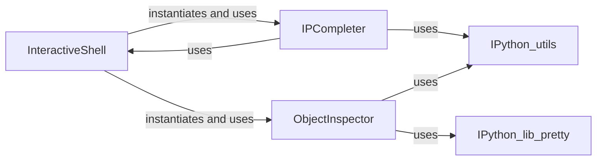

## Component Details

The 'Interactive Features (Completion & Inspection)' subsystem in IPython enhances the user experience by providing intelligent code completion and detailed introspection capabilities. The core `InteractiveShell` orchestrates these features, delegating completion tasks to `IPCompleter` and object information retrieval to `ObjectInspector`. This allows users to receive real-time suggestions as they type and query comprehensive details about Python objects, functions, and modules within the interactive environment.

### InteractiveShell
The central orchestrator of the IPython interactive environment. It manages the execution of user code, initializes and coordinates core features like code completion and object introspection, and maintains the session's state and namespaces.

**Related Classes/Methods**:

- <a href="https://github.com/ipython/ipython/blob/master/IPython/core/interactiveshell.py#L1867-L1876" target="_blank" rel="noopener noreferrer">`IPython.core.interactiveshell.InteractiveShell:object_inspect` (1867:1876)</a>
- <a href="https://github.com/ipython/ipython/blob/master/IPython/core/interactiveshell.py#L1833-L1865" target="_blank" rel="noopener noreferrer">`IPython.core.interactiveshell.InteractiveShell:_inspect` (1833:1865)</a>
- <a href="https://github.com/ipython/ipython/blob/master/IPython/core/interactiveshell.py#L1882-L1906" target="_blank" rel="noopener noreferrer">`IPython.core.interactiveshell.InteractiveShell:object_inspect_mime` (1882:1906)</a>
- <a href="https://github.com/ipython/ipython/blob/master/IPython/core/interactiveshell.py#L2266-L2299" target="_blank" rel="noopener noreferrer">`IPython.core.interactiveshell.InteractiveShell:init_completer` (2266:2299)</a>
- <a href="https://github.com/ipython/ipython/blob/master/IPython/core/interactiveshell.py#L2302-L2343" target="_blank" rel="noopener noreferrer">`IPython.core.interactiveshell.InteractiveShell:complete` (2302:2343)</a>
- <a href="https://github.com/ipython/ipython/blob/master/IPython/core/interactiveshell.py#L1829-L1831" target="_blank" rel="noopener noreferrer">`IPython.core.interactiveshell.InteractiveShell._object_find` (1829:1831)</a>

### IPCompleter
Responsible for generating intelligent code completion suggestions. It employs various matching algorithms for Python code, magic commands, file paths, and specialized completions like Unicode and LaTeX symbols, optionally leveraging the Jedi library for static analysis.

**Related Classes/Methods**:

- <a href="https://github.com/ipython/ipython/blob/master/IPython/core/completer.py#L3300-L3356" target="_blank" rel="noopener noreferrer">`IPython.core.completer.IPCompleter:complete` (3300:3356)</a>
- <a href="https://github.com/ipython/ipython/blob/master/IPython/core/completer.py#L2104-L2113" target="_blank" rel="noopener noreferrer">`IPython.core.completer.IPCompleter:all_completions` (2104:2113)</a>
- <a href="https://github.com/ipython/ipython/blob/master/IPython/core/completer.py#L3391-L3553" target="_blank" rel="noopener noreferrer">`IPython.core.completer.IPCompleter._complete` (3391:3553)</a>
- `IPython.core.completer._arrange_and_extract` (full file reference)
- <a href="https://github.com/ipython/ipython/blob/master/IPython/core/completer.py#L310-L335" target="_blank" rel="noopener noreferrer">`IPython.core.completer.provisionalcompleter` (310:335)</a>
- <a href="https://github.com/ipython/ipython/blob/master/IPython/core/completer.py#L782-L783" target="_blank" rel="noopener noreferrer">`IPython.core.completer._get_matcher_id` (782:783)</a>
- <a href="https://github.com/ipython/ipython/blob/master/IPython/utils/path.py#L69-L74" target="_blank" rel="noopener noreferrer">`IPython.utils.path.compress_user` (69:74)</a>
- <a href="https://github.com/ipython/ipython/blob/master/IPython/utils/dir2.py#L11-L19" target="_blank" rel="noopener noreferrer">`IPython.utils.dir2.safe_hasattr` (11:19)</a>
- <a href="https://github.com/ipython/ipython/blob/master/IPython/utils/strdispatch.py#L11-L68" target="_blank" rel="noopener noreferrer">`IPython.utils.strdispatch.StrDispatch` (11:68)</a>

### ObjectInspector
Provides detailed introspection capabilities for Python objects, functions, and modules. It extracts and formats information such as docstrings, source code, call signatures, and class hierarchies, presenting it in a structured and readable manner.

**Related Classes/Methods**:

- <a href="https://github.com/ipython/ipython/blob/master/IPython/core/oinspect.py#L855-L1090" target="_blank" rel="noopener noreferrer">`IPython.core.oinspect.Inspector:info` (855:1090)</a>
- <a href="https://github.com/ipython/ipython/blob/master/IPython/core/oinspect.py#L749-L812" target="_blank" rel="noopener noreferrer">`IPython.core.oinspect.Inspector:_get_info` (749:812)</a>
- <a href="https://github.com/ipython/ipython/blob/master/IPython/core/oinspect.py#L1093-L1107" target="_blank" rel="noopener noreferrer">`IPython.core.oinspect.Inspector:_source_contains_docstring` (1093:1107)</a>
- <a href="https://github.com/ipython/ipython/blob/master/IPython/core/oinspect.py#L420-L430" target="_blank" rel="noopener noreferrer">`IPython.core.oinspect.Inspector:_getdef` (420:430)</a>
- <a href="https://github.com/ipython/ipython/blob/master/IPython/core/oinspect.py#L670-L746" target="_blank" rel="noopener noreferrer">`IPython.core.oinspect.Inspector._make_info_unformatted` (670:746)</a>
- <a href="https://github.com/ipython/ipython/blob/master/IPython/core/oinspect.py#L614-L650" target="_blank" rel="noopener noreferrer">`IPython.core.oinspect.Inspector.format_mime` (614:650)</a>
- <a href="https://github.com/ipython/ipython/blob/master/IPython/core/oinspect.py#L211-L229" target="_blank" rel="noopener noreferrer">`IPython.core.oinspect.getdoc` (211:229)</a>
- <a href="https://github.com/ipython/ipython/blob/master/IPython/core/oinspect.py#L232-L291" target="_blank" rel="noopener noreferrer">`IPython.core.oinspect.getsource` (232:291)</a>
- <a href="https://github.com/ipython/ipython/blob/master/IPython/core/oinspect.py#L166-L184" target="_blank" rel="noopener noreferrer">`IPython.core.oinspect.object_info` (166:184)</a>
- <a href="https://github.com/ipython/ipython/blob/master/IPython/core/oinspect.py#L317-L349" target="_blank" rel="noopener noreferrer">`IPython.core.oinspect.find_file` (317:349)</a>
- <a href="https://github.com/ipython/ipython/blob/master/IPython/core/oinspect.py#L294-L297" target="_blank" rel="noopener noreferrer">`IPython.core.oinspect.is_simple_callable` (294:297)</a>
- <a href="https://github.com/ipython/ipython/blob/master/IPython/core/oinspect.py#L155-L162" target="_blank" rel="noopener noreferrer">`IPython.core.oinspect.InspectorHookData` (155:162)</a>
- <a href="https://github.com/ipython/ipython/blob/master/IPython/utils/path.py#L69-L74" target="_blank" rel="noopener noreferrer">`IPython.utils.path.compress_user` (69:74)</a>
- <a href="https://github.com/ipython/ipython/blob/master/IPython/utils/dir2.py#L11-L19" target="_blank" rel="noopener noreferrer">`IPython.utils.dir2.safe_hasattr` (11:19)</a>
- <a href="https://github.com/ipython/ipython/blob/master/IPython/utils/strdispatch.py#L11-L68" target="_blank" rel="noopener noreferrer">`IPython.utils.strdispatch.StrDispatch` (11:68)</a>
- <a href="https://github.com/ipython/ipython/blob/master/IPython/lib/pretty.py#L186-L311" target="_blank" rel="noopener noreferrer">`IPython.lib.pretty.PrettyPrinter` (186:311)</a>

### [FAQ](https://github.com/CodeBoarding/GeneratedOnBoardings/tree/main?tab=readme-ov-file#faq)