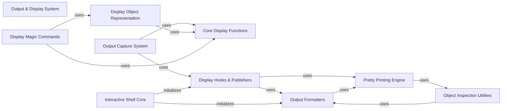

## Component Details

The Output & Display System in IPython is responsible for how all forms of output and information are presented to the user. This includes rich media formatting (HTML, SVG, images), integrating with display hooks to intercept and process results, and providing advanced pretty-printing capabilities for Python objects.

### Output & Display System
Responsible for how all forms of output and information are presented to the user. This includes rich media formatting (HTML, SVG, images), integrating with display hooks to intercept and process results, and providing advanced pretty-printing capabilities for Python objects.

**Related Classes/Methods**:

- <a href="https://github.com/ipython/ipython/blob/master/IPython/core/display_functions.py#L85-L287" target="_blank" rel="noopener noreferrer">`IPython.core.display_functions:display` (85:287)</a>
- <a href="https://github.com/ipython/ipython/blob/master/IPython/core/display.py#L450-L451" target="_blank" rel="noopener noreferrer">`IPython.core.display.HTML:_repr_html_` (450:451)</a>
- <a href="https://github.com/ipython/ipython/blob/master/IPython/core/displayhook.py#L269-L285" target="_blank" rel="noopener noreferrer">`IPython.core.displayhook.DisplayHook:__call__` (269:285)</a>
- <a href="https://github.com/ipython/ipython/blob/master/IPython/lib/pretty.py#L145-L153" target="_blank" rel="noopener noreferrer">`IPython.lib.pretty:pretty` (145:153)</a>
- <a href="https://github.com/ipython/ipython/blob/master/IPython/core/formatters.py#L115-L116" target="_blank" rel="noopener noreferrer">`IPython.core.formatters.DisplayFormatter:_default_formatter` (115:116)</a>

### Output Capture System
This component is responsible for capturing and managing standard output, standard error, and rich display data generated during IPython execution. It provides mechanisms to temporarily redirect output streams and collect display messages for later retrieval or presentation.

**Related Classes/Methods**:

- <a href="https://github.com/ipython/ipython/blob/master/IPython/utils/capture.py#L16-L59" target="_blank" rel="noopener noreferrer">`IPython.utils.capture.RichOutput` (16:59)</a>
- <a href="https://github.com/ipython/ipython/blob/master/IPython/utils/capture.py#L23-L26" target="_blank" rel="noopener noreferrer">`IPython.utils.capture.RichOutput:display` (23:26)</a>
- <a href="https://github.com/ipython/ipython/blob/master/IPython/utils/capture.py#L28-L35" target="_blank" rel="noopener noreferrer">`IPython.utils.capture.RichOutput:_repr_mime_` (28:35)</a>
- <a href="https://github.com/ipython/ipython/blob/master/IPython/utils/capture.py#L40-L41" target="_blank" rel="noopener noreferrer">`IPython.utils.capture.RichOutput:_repr_html_` (40:41)</a>
- <a href="https://github.com/ipython/ipython/blob/master/IPython/utils/capture.py#L43-L44" target="_blank" rel="noopener noreferrer">`IPython.utils.capture.RichOutput:_repr_latex_` (43:44)</a>
- <a href="https://github.com/ipython/ipython/blob/master/IPython/utils/capture.py#L46-L47" target="_blank" rel="noopener noreferrer">`IPython.utils.capture.RichOutput:_repr_json_` (46:47)</a>
- <a href="https://github.com/ipython/ipython/blob/master/IPython/utils/capture.py#L49-L50" target="_blank" rel="noopener noreferrer">`IPython.utils.capture.RichOutput:_repr_javascript_` (49:50)</a>
- <a href="https://github.com/ipython/ipython/blob/master/IPython/utils/capture.py#L52-L53" target="_blank" rel="noopener noreferrer">`IPython.utils.capture.RichOutput:_repr_png_` (52:53)</a>
- <a href="https://github.com/ipython/ipython/blob/master/IPython/utils/capture.py#L55-L56" target="_blank" rel="noopener noreferrer">`IPython.utils.capture.RichOutput:_repr_jpeg_` (55:56)</a>
- <a href="https://github.com/ipython/ipython/blob/master/IPython/utils/capture.py#L58-L59" target="_blank" rel="noopener noreferrer">`IPython.utils.capture.RichOutput:_repr_svg_` (58:59)</a>
- <a href="https://github.com/ipython/ipython/blob/master/IPython/utils/capture.py#L62-L121" target="_blank" rel="noopener noreferrer">`IPython.utils.capture.CapturedIO` (62:121)</a>
- <a href="https://github.com/ipython/ipython/blob/master/IPython/utils/capture.py#L112-L119" target="_blank" rel="noopener noreferrer">`IPython.utils.capture.CapturedIO:show` (112:119)</a>
- <a href="https://github.com/ipython/ipython/blob/master/IPython/utils/capture.py#L124-L170" target="_blank" rel="noopener noreferrer">`IPython.utils.capture.capture_output` (124:170)</a>
- <a href="https://github.com/ipython/ipython/blob/master/IPython/utils/capture.py#L136-L163" target="_blank" rel="noopener noreferrer">`IPython.utils.capture.capture_output:__enter__` (136:163)</a>

### Core Display Functions
This component provides the fundamental API for displaying various types of data within the IPython environment. It includes functions for publishing display data, updating existing displays, and managing display handles for interactive output.

**Related Classes/Methods**:

- <a href="https://github.com/ipython/ipython/blob/master/IPython/core/display_functions.py#L85-L287" target="_blank" rel="noopener noreferrer">`IPython.core.display_functions.display` (85:287)</a>
- <a href="https://github.com/ipython/ipython/blob/master/IPython/core/display_functions.py#L37-L77" target="_blank" rel="noopener noreferrer">`IPython.core.display_functions.publish_display_data` (37:77)</a>
- <a href="https://github.com/ipython/ipython/blob/master/IPython/core/display_functions.py#L291-L306" target="_blank" rel="noopener noreferrer">`IPython.core.display_functions.update_display` (291:306)</a>
- <a href="https://github.com/ipython/ipython/blob/master/IPython/core/display_functions.py#L309-L354" target="_blank" rel="noopener noreferrer">`IPython.core.display_functions.DisplayHandle` (309:354)</a>
- <a href="https://github.com/ipython/ipython/blob/master/IPython/core/display_functions.py#L332-L342" target="_blank" rel="noopener noreferrer">`IPython.core.display_functions.DisplayHandle:display` (332:342)</a>
- <a href="https://github.com/ipython/ipython/blob/master/IPython/core/display_functions.py#L344-L354" target="_blank" rel="noopener noreferrer">`IPython.core.display_functions.DisplayHandle:update` (344:354)</a>
- <a href="https://github.com/ipython/ipython/blob/master/IPython/core/display_functions.py#L19-L29" target="_blank" rel="noopener noreferrer">`IPython.core.display_functions._merge` (19:29)</a>
- <a href="https://github.com/ipython/ipython/blob/master/IPython/core/display_functions.py#L324-L327" target="_blank" rel="noopener noreferrer">`IPython.core.display_functions.DisplayHandle:__init__` (324:327)</a>

### Display Object Representation
This component defines a set of classes that encapsulate different types of displayable content, such as HTML, Markdown, images, JSON, and audio. These objects provide methods for their rich representation, allowing IPython to render them appropriately in various frontends.

**Related Classes/Methods**:

- <a href="https://github.com/ipython/ipython/blob/master/IPython/core/display.py#L290-L404" target="_blank" rel="noopener noreferrer">`IPython.core.display.DisplayObject` (290:404)</a>
- <a href="https://github.com/ipython/ipython/blob/master/IPython/core/display.py#L297-L344" target="_blank" rel="noopener noreferrer">`IPython.core.display.DisplayObject:__init__` (297:344)</a>
- <a href="https://github.com/ipython/ipython/blob/master/IPython/core/display.py#L431-L459" target="_blank" rel="noopener noreferrer">`IPython.core.display.HTML` (431:459)</a>
- <a href="https://github.com/ipython/ipython/blob/master/IPython/core/display.py#L433-L448" target="_blank" rel="noopener noreferrer">`IPython.core.display.HTML:__init__` (433:448)</a>
- <a href="https://github.com/ipython/ipython/blob/master/IPython/core/display.py#L450-L451" target="_blank" rel="noopener noreferrer">`IPython.core.display.HTML:_repr_html_` (450:451)</a>
- <a href="https://github.com/ipython/ipython/blob/master/IPython/core/display.py#L453-L459" target="_blank" rel="noopener noreferrer">`IPython.core.display.HTML:__html__` (453:459)</a>
- <a href="https://github.com/ipython/ipython/blob/master/IPython/core/display.py#L462-L465" target="_blank" rel="noopener noreferrer">`IPython.core.display.Markdown` (462:465)</a>
- <a href="https://github.com/ipython/ipython/blob/master/IPython/core/display.py#L464-L465" target="_blank" rel="noopener noreferrer">`IPython.core.display.Markdown:_repr_markdown_` (464:465)</a>
- <a href="https://github.com/ipython/ipython/blob/master/IPython/core/display.py#L478-L481" target="_blank" rel="noopener noreferrer">`IPython.core.display.Latex` (478:481)</a>
- <a href="https://github.com/ipython/ipython/blob/master/IPython/core/display.py#L480-L481" target="_blank" rel="noopener noreferrer">`IPython.core.display.Latex:_repr_latex_` (480:481)</a>
- <a href="https://github.com/ipython/ipython/blob/master/IPython/core/display.py#L484-L522" target="_blank" rel="noopener noreferrer">`IPython.core.display.SVG` (484:522)</a>
- <a href="https://github.com/ipython/ipython/blob/master/IPython/core/display.py#L521-L522" target="_blank" rel="noopener noreferrer">`IPython.core.display.SVG:_repr_svg_` (521:522)</a>
- <a href="https://github.com/ipython/ipython/blob/master/IPython/core/display.py#L524-L580" target="_blank" rel="noopener noreferrer">`IPython.core.display.ProgressBar` (524:580)</a>
- <a href="https://github.com/ipython/ipython/blob/master/IPython/core/display.py#L554-L555" target="_blank" rel="noopener noreferrer">`IPython.core.display.ProgressBar:display` (554:555)</a>
- <a href="https://github.com/ipython/ipython/blob/master/IPython/core/display.py#L557-L558" target="_blank" rel="noopener noreferrer">`IPython.core.display.ProgressBar:update` (557:558)</a>
- <a href="https://github.com/ipython/ipython/blob/master/IPython/core/display.py#L561-L562" target="_blank" rel="noopener noreferrer">`IPython.core.display.ProgressBar:progress` (561:562)</a>
- <a href="https://github.com/ipython/ipython/blob/master/IPython/core/display.py#L569-L572" target="_blank" rel="noopener noreferrer">`IPython.core.display.ProgressBar:__iter__` (569:572)</a>
- <a href="https://github.com/ipython/ipython/blob/master/IPython/core/display.py#L574-L580" target="_blank" rel="noopener noreferrer">`IPython.core.display.ProgressBar:__next__` (574:580)</a>
- <a href="https://github.com/ipython/ipython/blob/master/IPython/core/display.py#L582-L644" target="_blank" rel="noopener noreferrer">`IPython.core.display.JSON` (582:644)</a>
- <a href="https://github.com/ipython/ipython/blob/master/IPython/core/display.py#L591-L619" target="_blank" rel="noopener noreferrer">`IPython.core.display.JSON:__init__` (591:619)</a>
- <a href="https://github.com/ipython/ipython/blob/master/IPython/core/display.py#L643-L644" target="_blank" rel="noopener noreferrer">`IPython.core.display.JSON:_repr_json_` (643:644)</a>
- <a href="https://github.com/ipython/ipython/blob/master/IPython/core/display.py#L666-L733" target="_blank" rel="noopener noreferrer">`IPython.core.display.GeoJSON` (666:733)</a>
- <a href="https://github.com/ipython/ipython/blob/master/IPython/core/display.py#L674-L722" target="_blank" rel="noopener noreferrer">`IPython.core.display.GeoJSON:__init__` (674:722)</a>
- <a href="https://github.com/ipython/ipython/blob/master/IPython/core/display.py#L725-L733" target="_blank" rel="noopener noreferrer">`IPython.core.display.GeoJSON:_ipython_display_` (725:733)</a>
- <a href="https://github.com/ipython/ipython/blob/master/IPython/core/display.py#L735-L791" target="_blank" rel="noopener noreferrer">`IPython.core.display.Javascript` (735:791)</a>
- <a href="https://github.com/ipython/ipython/blob/master/IPython/core/display.py#L737-L781" target="_blank" rel="noopener noreferrer">`IPython.core.display.Javascript:__init__` (737:781)</a>
- <a href="https://github.com/ipython/ipython/blob/master/IPython/core/display.py#L854-L1135" target="_blank" rel="noopener noreferrer">`IPython.core.display.Image` (854:1135)</a>
- <a href="https://github.com/ipython/ipython/blob/master/IPython/core/display.py#L869-L1038" target="_blank" rel="noopener noreferrer">`IPython.core.display.Image:__init__` (869:1038)</a>
- <a href="https://github.com/ipython/ipython/blob/master/IPython/core/display.py#L1041-L1055" target="_blank" rel="noopener noreferrer">`IPython.core.display.Image:_retina_shape` (1041:1055)</a>
- <a href="https://github.com/ipython/ipython/blob/master/IPython/core/display.py#L1057-L1062" target="_blank" rel="noopener noreferrer">`IPython.core.display.Image:reload` (1057:1062)</a>
- <a href="https://github.com/ipython/ipython/blob/master/IPython/core/display.py#L1083-L1095" target="_blank" rel="noopener noreferrer">`IPython.core.display.Image:_repr_mimebundle_` (1083:1095)</a>
- <a href="https://github.com/ipython/ipython/blob/master/IPython/core/display.py#L1120-L1122" target="_blank" rel="noopener noreferrer">`IPython.core.display.Image:_repr_png_` (1120:1122)</a>
- <a href="https://github.com/ipython/ipython/blob/master/IPython/core/display.py#L1124-L1126" target="_blank" rel="noopener noreferrer">`IPython.core.display.Image:_repr_jpeg_` (1124:1126)</a>
- <a href="https://github.com/ipython/ipython/blob/master/IPython/core/display.py#L1064-L1081" target="_blank" rel="noopener noreferrer">`IPython.core.display.Image:_repr_html_` (1064:1081)</a>
- <a href="https://github.com/ipython/ipython/blob/master/IPython/core/display.py#L1138-L1266" target="_blank" rel="noopener noreferrer">`IPython.core.display.Video` (1138:1266)</a>
- <a href="https://github.com/ipython/ipython/blob/master/IPython/lib/display.py#L17-L257" target="_blank" rel="noopener noreferrer">`IPython.lib.display.Audio` (17:257)</a>
- <a href="https://github.com/ipython/ipython/blob/master/IPython/lib/display.py#L226-L234" target="_blank" rel="noopener noreferrer">`IPython.lib.display.Audio:_repr_html_` (226:234)</a>
- <a href="https://github.com/ipython/ipython/blob/master/IPython/lib/display.py#L371-L435" target="_blank" rel="noopener noreferrer">`IPython.lib.display.FileLink` (371:435)</a>
- <a href="https://github.com/ipython/ipython/blob/master/IPython/lib/display.py#L421-L430" target="_blank" rel="noopener noreferrer">`IPython.lib.display.FileLink:_repr_html_` (421:430)</a>
- <a href="https://github.com/ipython/ipython/blob/master/IPython/lib/display.py#L631-L677" target="_blank" rel="noopener noreferrer">`IPython.lib.display.Code` (631:677)</a>
- <a href="https://github.com/ipython/ipython/blob/master/IPython/lib/display.py#L667-L672" target="_blank" rel="noopener noreferrer">`IPython.lib.display.Code:_repr_html_` (667:672)</a>
- <a href="https://github.com/ipython/ipython/blob/master/IPython/lib/display.py#L674-L677" target="_blank" rel="noopener noreferrer">`IPython.lib.display.Code:_repr_latex_` (674:677)</a>
- <a href="https://github.com/ipython/ipython/blob/master/IPython/core/display.py#L64-L85" target="_blank" rel="noopener noreferrer">`IPython.core.display._display_mimetype` (64:85)</a>
- <a href="https://github.com/ipython/ipython/blob/master/IPython/core/display.py#L92-L106" target="_blank" rel="noopener noreferrer">`IPython.core.display:display_pretty` (92:106)</a>
- <a href="https://github.com/ipython/ipython/blob/master/IPython/core/display.py#L109-L126" target="_blank" rel="noopener noreferrer">`IPython.core.display:display_html` (109:126)</a>
- <a href="https://github.com/ipython/ipython/blob/master/IPython/core/display.py#L129-L144" target="_blank" rel="noopener noreferrer">`IPython.core.display:display_markdown` (129:144)</a>
- <a href="https://github.com/ipython/ipython/blob/master/IPython/core/display.py#L147-L161" target="_blank" rel="noopener noreferrer">`IPython.core.display:display_svg` (147:161)</a>
- <a href="https://github.com/ipython/ipython/blob/master/IPython/core/display.py#L164-L178" target="_blank" rel="noopener noreferrer">`IPython.core.display:display_png` (164:178)</a>
- <a href="https://github.com/ipython/ipython/blob/master/IPython/core/display.py#L181-L195" target="_blank" rel="noopener noreferrer">`IPython.core.display:display_jpeg` (181:195)</a>
- <a href="https://github.com/ipython/ipython/blob/master/IPython/core/display.py#L198-L212" target="_blank" rel="noopener noreferrer">`IPython.core.display:display_webp` (198:212)</a>
- <a href="https://github.com/ipython/ipython/blob/master/IPython/core/display.py#L215-L229" target="_blank" rel="noopener noreferrer">`IPython.core.display:display_latex` (215:229)</a>
- <a href="https://github.com/ipython/ipython/blob/master/IPython/core/display.py#L232-L248" target="_blank" rel="noopener noreferrer">`IPython.core.display:display_json` (232:248)</a>
- <a href="https://github.com/ipython/ipython/blob/master/IPython/core/display.py#L251-L265" target="_blank" rel="noopener noreferrer">`IPython.core.display:display_javascript` (251:265)</a>
- <a href="https://github.com/ipython/ipython/blob/master/IPython/core/display.py#L268-L282" target="_blank" rel="noopener noreferrer">`IPython.core.display:display_pdf` (268:282)</a>

### Display Hooks & Publishers
This component manages the lifecycle of display data within the IPython kernel. It includes hooks for processing output before it's displayed and publishers for sending display messages to the frontend, as well as mechanisms for capturing these messages.

**Related Classes/Methods**:

- <a href="https://github.com/ipython/ipython/blob/master/IPython/core/displayhook.py#L25-L332" target="_blank" rel="noopener noreferrer">`IPython.core.displayhook.DisplayHook` (25:332)</a>
- <a href="https://github.com/ipython/ipython/blob/master/IPython/core/displayhook.py#L87-L97" target="_blank" rel="noopener noreferrer">`IPython.core.displayhook.DisplayHook:quiet` (87:97)</a>
- <a href="https://github.com/ipython/ipython/blob/master/IPython/core/displayhook.py#L210-L244" target="_blank" rel="noopener noreferrer">`IPython.core.displayhook.DisplayHook:update_user_ns` (210:244)</a>
- <a href="https://github.com/ipython/ipython/blob/master/IPython/core/displayhook.py#L250-L261" target="_blank" rel="noopener noreferrer">`IPython.core.displayhook.DisplayHook:log_output` (250:261)</a>
- <a href="https://github.com/ipython/ipython/blob/master/IPython/core/displayhook.py#L269-L285" target="_blank" rel="noopener noreferrer">`IPython.core.displayhook.DisplayHook:__call__` (269:285)</a>
- <a href="https://github.com/ipython/ipython/blob/master/IPython/core/displaypub.py#L36-L159" target="_blank" rel="noopener noreferrer">`IPython.core.displaypub.DisplayPublisher` (36:159)</a>
- <a href="https://github.com/ipython/ipython/blob/master/IPython/core/displaypub.py#L66-L148" target="_blank" rel="noopener noreferrer">`IPython.core.displaypub.DisplayPublisher:publish` (66:148)</a>
- <a href="https://github.com/ipython/ipython/blob/master/IPython/core/displaypub.py#L162-L183" target="_blank" rel="noopener noreferrer">`IPython.core.displaypub.CapturingDisplayPublisher` (162:183)</a>
- <a href="https://github.com/ipython/ipython/blob/master/IPython/core/displaypub.py#L179-L183" target="_blank" rel="noopener noreferrer">`IPython.core.displaypub.CapturingDisplayPublisher:clear_output` (179:183)</a>
- <a href="https://github.com/ipython/ipython/blob/master/IPython/core/display_trap.py#L32-L73" target="_blank" rel="noopener noreferrer">`IPython.core.display_trap.DisplayTrap` (32:73)</a>
- <a href="https://github.com/ipython/ipython/blob/master/IPython/core/display_trap.py#L48-L52" target="_blank" rel="noopener noreferrer">`IPython.core.display_trap.DisplayTrap:__enter__` (48:52)</a>
- <a href="https://github.com/ipython/ipython/blob/master/IPython/core/display_trap.py#L54-L59" target="_blank" rel="noopener noreferrer">`IPython.core.display_trap.DisplayTrap:__exit__` (54:59)</a>
- <a href="https://github.com/ipython/ipython/blob/master/IPython/terminal/prompts.py#L131-L140" target="_blank" rel="noopener noreferrer">`IPython.terminal.prompts.RichPromptDisplayHook:write_format_data` (131:140)</a>

### Pretty Printing Engine
This component provides a sophisticated system for generating human-readable, formatted string representations of Python objects. It handles complex data structures and allows for custom pretty-printing rules.

**Related Classes/Methods**:

- <a href="https://github.com/ipython/ipython/blob/master/IPython/lib/pretty.py#L145-L153" target="_blank" rel="noopener noreferrer">`IPython.lib.pretty:pretty` (145:153)</a>
- <a href="https://github.com/ipython/ipython/blob/master/IPython/lib/pretty.py#L156-L164" target="_blank" rel="noopener noreferrer">`IPython.lib.pretty:pprint` (156:164)</a>
- <a href="https://github.com/ipython/ipython/blob/master/IPython/lib/pretty.py#L186-L311" target="_blank" rel="noopener noreferrer">`IPython.lib.pretty.PrettyPrinter` (186:311)</a>
- <a href="https://github.com/ipython/ipython/blob/master/IPython/lib/pretty.py#L194-L206" target="_blank" rel="noopener noreferrer">`IPython.lib.pretty.PrettyPrinter:__init__` (194:206)</a>
- <a href="https://github.com/ipython/ipython/blob/master/IPython/lib/pretty.py#L218-L223" target="_blank" rel="noopener noreferrer">`IPython.lib.pretty.PrettyPrinter:_break_outer_groups` (218:223)</a>
- <a href="https://github.com/ipython/ipython/blob/master/IPython/lib/pretty.py#L225-L238" target="_blank" rel="noopener noreferrer">`IPython.lib.pretty.PrettyPrinter:text` (225:238)</a>
- <a href="https://github.com/ipython/ipython/blob/master/IPython/lib/pretty.py#L240-L257" target="_blank" rel="noopener noreferrer">`IPython.lib.pretty.PrettyPrinter:breakable` (240:257)</a>
- <a href="https://github.com/ipython/ipython/blob/master/IPython/lib/pretty.py#L259-L270" target="_blank" rel="noopener noreferrer">`IPython.lib.pretty.PrettyPrinter:break_` (259:270)</a>
- <a href="https://github.com/ipython/ipython/blob/master/IPython/lib/pretty.py#L273-L285" target="_blank" rel="noopener noreferrer">`IPython.lib.pretty.PrettyPrinter:begin_group` (273:285)</a>
- <a href="https://github.com/ipython/ipython/blob/master/IPython/lib/pretty.py#L287-L295" target="_blank" rel="noopener noreferrer">`IPython.lib.pretty.PrettyPrinter:_enumerate` (287:295)</a>
- <a href="https://github.com/ipython/ipython/blob/master/IPython/lib/pretty.py#L297-L304" target="_blank" rel="noopener noreferrer">`IPython.lib.pretty.PrettyPrinter:end_group` (297:304)</a>
- <a href="https://github.com/ipython/ipython/blob/master/IPython/lib/pretty.py#L333-L434" target="_blank" rel="noopener noreferrer">`IPython.lib.pretty.RepresentationPrinter` (333:434)</a>
- <a href="https://github.com/ipython/ipython/blob/master/IPython/lib/pretty.py#L348-L363" target="_blank" rel="noopener noreferrer">`IPython.lib.pretty.RepresentationPrinter:__init__` (348:363)</a>
- <a href="https://github.com/ipython/ipython/blob/master/IPython/lib/pretty.py#L365-L416" target="_blank" rel="noopener noreferrer">`IPython.lib.pretty.RepresentationPrinter:pretty` (365:416)</a>
- <a href="https://github.com/ipython/ipython/blob/master/IPython/lib/pretty.py#L418-L434" target="_blank" rel="noopener noreferrer">`IPython.lib.pretty.RepresentationPrinter:_in_deferred_types` (418:434)</a>
- <a href="https://github.com/ipython/ipython/blob/master/IPython/lib/pretty.py#L489-L517" target="_blank" rel="noopener noreferrer">`IPython.lib.pretty.GroupQueue` (489:517)</a>
- <a href="https://github.com/ipython/ipython/blob/master/IPython/lib/pretty.py#L491-L494" target="_blank" rel="noopener noreferrer">`IPython.lib.pretty.GroupQueue:__init__` (491:494)</a>
- <a href="https://github.com/ipython/ipython/blob/master/IPython/lib/pretty.py#L533-L570" target="_blank" rel="noopener noreferrer">`IPython.lib.pretty.CallExpression` (533:570)</a>
- <a href="https://github.com/ipython/ipython/blob/master/IPython/lib/pretty.py#L544-L547" target="_blank" rel="noopener noreferrer">`IPython.lib.pretty.CallExpression:factory` (544:547)</a>
- <a href="https://github.com/ipython/ipython/blob/master/IPython/lib/pretty.py#L549-L570" target="_blank" rel="noopener noreferrer">`IPython.lib.pretty.CallExpression:_repr_pretty_` (549:570)</a>
- <a href="https://github.com/ipython/ipython/blob/master/IPython/lib/pretty.py#L589-L624" target="_blank" rel="noopener noreferrer">`IPython.lib.pretty._default_pprint` (589:624)</a>
- <a href="https://github.com/ipython/ipython/blob/master/IPython/lib/pretty.py#L649-L673" target="_blank" rel="noopener noreferrer">`IPython.lib.pretty:_set_pprinter_factory` (649:673)</a>
- <a href="https://github.com/ipython/ipython/blob/master/IPython/lib/pretty.py#L735-L741" target="_blank" rel="noopener noreferrer">`IPython.lib.pretty:_re_pattern_pprint` (735:741)</a>
- <a href="https://github.com/ipython/ipython/blob/master/IPython/lib/pretty.py#L744-L750" target="_blank" rel="noopener noreferrer">`IPython.lib.pretty:_types_simplenamespace_pprint` (744:750)</a>
- <a href="https://github.com/ipython/ipython/blob/master/IPython/lib/pretty.py#L753-L780" target="_blank" rel="noopener noreferrer">`IPython.lib.pretty:_type_pprint` (753:780)</a>
- <a href="https://github.com/ipython/ipython/blob/master/IPython/lib/pretty.py#L795-L805" target="_blank" rel="noopener noreferrer">`IPython.lib.pretty:_function_pprint` (795:805)</a>
- <a href="https://github.com/ipython/ipython/blob/master/IPython/lib/pretty.py#L808-L814" target="_blank" rel="noopener noreferrer">`IPython.lib.pretty:_exception_pprint` (808:814)</a>
- <a href="https://github.com/ipython/ipython/blob/master/IPython/lib/pretty.py#L891-L896" target="_blank" rel="noopener noreferrer">`IPython.lib.pretty:_defaultdict_pprint` (891:896)</a>
- <a href="https://github.com/ipython/ipython/blob/master/IPython/lib/pretty.py#L898-L905" target="_blank" rel="noopener noreferrer">`IPython.lib.pretty:_ordereddict_pprint` (898:905)</a>
- <a href="https://github.com/ipython/ipython/blob/master/IPython/lib/pretty.py#L907-L914" target="_blank" rel="noopener noreferrer">`IPython.lib.pretty:_deque_pprint` (907:914)</a>
- <a href="https://github.com/ipython/ipython/blob/master/IPython/lib/pretty.py#L916-L923" target="_blank" rel="noopener noreferrer">`IPython.lib.pretty:_counter_pprint` (916:923)</a>
- <a href="https://github.com/ipython/ipython/blob/master/IPython/lib/pretty.py#L926-L931" target="_blank" rel="noopener noreferrer">`IPython.lib.pretty:_userlist_pprint` (926:931)</a>

### Output Formatters
This component is responsible for converting Python objects into various MIME types suitable for display in different IPython frontends. It provides a flexible system for registering and applying formatting rules based on object types.

**Related Classes/Methods**:

- <a href="https://github.com/ipython/ipython/blob/master/IPython/core/formatters.py#L90-L256" target="_blank" rel="noopener noreferrer">`IPython.core.formatters.DisplayFormatter` (90:256)</a>
- <a href="https://github.com/ipython/ipython/blob/master/IPython/core/formatters.py#L115-L116" target="_blank" rel="noopener noreferrer">`IPython.core.formatters.DisplayFormatter:_default_formatter` (115:116)</a>
- <a href="https://github.com/ipython/ipython/blob/master/IPython/core/formatters.py#L121-L122" target="_blank" rel="noopener noreferrer">`IPython.core.formatters.DisplayFormatter:_default_mime_formatter` (121:122)</a>
- <a href="https://github.com/ipython/ipython/blob/master/IPython/core/formatters.py#L129-L147" target="_blank" rel="noopener noreferrer">`IPython.core.formatters.DisplayFormatter:_formatters_default` (129:147)</a>
- <a href="https://github.com/ipython/ipython/blob/master/IPython/core/formatters.py#L279-L294" target="_blank" rel="noopener noreferrer">`IPython.core.formatters:catch_format_error` (279:294)</a>
- <a href="https://github.com/ipython/ipython/blob/master/IPython/core/formatters.py#L348-L628" target="_blank" rel="noopener noreferrer">`IPython.core.formatters.BaseFormatter` (348:628)</a>
- <a href="https://github.com/ipython/ipython/blob/master/IPython/core/formatters.py#L393-L409" target="_blank" rel="noopener noreferrer">`IPython.core.formatters.BaseFormatter:__call__` (393:409)</a>
- <a href="https://github.com/ipython/ipython/blob/master/IPython/core/formatters.py#L411-L418" target="_blank" rel="noopener noreferrer">`IPython.core.formatters.BaseFormatter:__contains__` (411:418)</a>
- <a href="https://github.com/ipython/ipython/blob/master/IPython/core/formatters.py#L420-L433" target="_blank" rel="noopener noreferrer">`IPython.core.formatters.BaseFormatter:_check_return` (420:433)</a>
- <a href="https://github.com/ipython/ipython/blob/master/IPython/core/formatters.py#L435-L456" target="_blank" rel="noopener noreferrer">`IPython.core.formatters.BaseFormatter:lookup` (435:456)</a>
- <a href="https://github.com/ipython/ipython/blob/master/IPython/core/formatters.py#L458-L490" target="_blank" rel="noopener noreferrer">`IPython.core.formatters.BaseFormatter:lookup_by_type` (458:490)</a>
- <a href="https://github.com/ipython/ipython/blob/master/IPython/core/formatters.py#L492-L530" target="_blank" rel="noopener noreferrer">`IPython.core.formatters.BaseFormatter:for_type` (492:530)</a>
- <a href="https://github.com/ipython/ipython/blob/master/IPython/core/formatters.py#L532-L571" target="_blank" rel="noopener noreferrer">`IPython.core.formatters.BaseFormatter:for_type_by_name` (532:571)</a>
- <a href="https://github.com/ipython/ipython/blob/master/IPython/core/formatters.py#L573-L612" target="_blank" rel="noopener noreferrer">`IPython.core.formatters.BaseFormatter:pop` (573:612)</a>
- <a href="https://github.com/ipython/ipython/blob/master/IPython/core/formatters.py#L631-L772" target="_blank" rel="noopener noreferrer">`IPython.core.formatters.PlainTextFormatter` (631:772)</a>
- <a href="https://github.com/ipython/ipython/blob/master/IPython/core/formatters.py#L758-L772" target="_blank" rel="noopener noreferrer">`IPython.core.formatters.PlainTextFormatter:__call__` (758:772)</a>
- <a href="https://github.com/ipython/ipython/blob/master/IPython/core/formatters.py#L876-L911" target="_blank" rel="noopener noreferrer">`IPython.core.formatters.JSONFormatter` (876:911)</a>
- <a href="https://github.com/ipython/ipython/blob/master/IPython/core/formatters.py#L892-L911" target="_blank" rel="noopener noreferrer">`IPython.core.formatters.JSONFormatter:_check_return` (892:911)</a>
- <a href="https://github.com/ipython/ipython/blob/master/IPython/core/formatters.py#L947-L985" target="_blank" rel="noopener noreferrer">`IPython.core.formatters.IPythonDisplayFormatter` (947:985)</a>
- <a href="https://github.com/ipython/ipython/blob/master/IPython/core/formatters.py#L970-L985" target="_blank" rel="noopener noreferrer">`IPython.core.formatters.IPythonDisplayFormatter:__call__` (970:985)</a>
- <a href="https://github.com/ipython/ipython/blob/master/IPython/core/formatters.py#L988-L1039" target="_blank" rel="noopener noreferrer">`IPython.core.formatters.MimeBundleFormatter` (988:1039)</a>
- <a href="https://github.com/ipython/ipython/blob/master/IPython/core/formatters.py#L1006-L1013" target="_blank" rel="noopener noreferrer">`IPython.core.formatters.MimeBundleFormatter:_check_return` (1006:1013)</a>
- <a href="https://github.com/ipython/ipython/blob/master/IPython/core/formatters.py#L1016-L1039" target="_blank" rel="noopener noreferrer">`IPython.core.formatters.MimeBundleFormatter:__call__` (1016:1039)</a>

### Interactive Shell Core
This is the central component of the IPython interactive shell, responsible for initializing and managing key display-related functionalities, including display formatters and display hooks, which are crucial for how output is processed and presented to the user.

**Related Classes/Methods**:

- <a href="https://github.com/ipython/ipython/blob/master/IPython/core/interactiveshell.py#L330-L4075" target="_blank" rel="noopener noreferrer">`IPython.core.interactiveshell.InteractiveShell` (330:4075)</a>
- <a href="https://github.com/ipython/ipython/blob/master/IPython/core/interactiveshell.py#L852-L854" target="_blank" rel="noopener noreferrer">`IPython.core.interactiveshell.InteractiveShell:init_display_formatter` (852:854)</a>
- <a href="https://github.com/ipython/ipython/blob/master/IPython/core/interactiveshell.py#L867-L877" target="_blank" rel="noopener noreferrer">`IPython.core.interactiveshell.InteractiveShell:init_displayhook` (867:877)</a>
- <a href="https://github.com/ipython/ipython/blob/master/IPython/core/interactiveshell.py#L2804-L2816" target="_blank" rel="noopener noreferrer">`IPython.core.interactiveshell.InteractiveShell:_format_user_obj` (2804:2816)</a>

### Object Inspection Utilities
This component provides tools for introspecting Python objects, such as retrieving source code and generating detailed information about them. It plays a role in how IPython presents information about objects to the user.

**Related Classes/Methods**:

- <a href="https://github.com/ipython/ipython/blob/master/IPython/core/oinspect.py#L232-L291" target="_blank" rel="noopener noreferrer">`IPython.core.oinspect:getsource` (232:291)</a>
- <a href="https://github.com/ipython/ipython/blob/master/IPython/core/oinspect.py#L387-L1173" target="_blank" rel="noopener noreferrer">`IPython.core.oinspect.Inspector` (387:1173)</a>
- <a href="https://github.com/ipython/ipython/blob/master/IPython/core/oinspect.py#L417-L418" target="_blank" rel="noopener noreferrer">`IPython.core.oinspect.Inspector:format` (417:418)</a>
- <a href="https://github.com/ipython/ipython/blob/master/IPython/core/oinspect.py#L652-L668" target="_blank" rel="noopener noreferrer">`IPython.core.oinspect.Inspector:_append_info_field` (652:668)</a>
- <a href="https://github.com/ipython/ipython/blob/master/IPython/core/oinspect.py#L670-L746" target="_blank" rel="noopener noreferrer">`IPython.core.oinspect.Inspector:_make_info_unformatted` (670:746)</a>
- <a href="https://github.com/ipython/ipython/blob/master/IPython/core/oinspect.py#L749-L812" target="_blank" rel="noopener noreferrer">`IPython.core.oinspect.Inspector:_get_info` (749:812)</a>

### Display Magic Commands
This component extends IPython's functionality by providing special 'magic' commands that allow users to directly display various types of content, such as JavaScript, LaTeX, SVG, HTML, and Markdown, within the interactive environment.

**Related Classes/Methods**:

- <a href="https://github.com/ipython/ipython/blob/master/IPython/core/magics/display.py#L27-L93" target="_blank" rel="noopener noreferrer">`IPython.core.magics.display.DisplayMagics` (27:93)</a>
- <a href="https://github.com/ipython/ipython/blob/master/IPython/core/magics/display.py#L35-L45" target="_blank" rel="noopener noreferrer">`IPython.core.magics.display.DisplayMagics:js` (35:45)</a>
- <a href="https://github.com/ipython/ipython/blob/master/IPython/core/magics/display.py#L48-L56" target="_blank" rel="noopener noreferrer">`IPython.core.magics.display.DisplayMagics:javascript` (48:56)</a>
- <a href="https://github.com/ipython/ipython/blob/master/IPython/core/magics/display.py#L60-L67" target="_blank" rel="noopener noreferrer">`IPython.core.magics.display.DisplayMagics:latex` (60:67)</a>
- <a href="https://github.com/ipython/ipython/blob/master/IPython/core/magics/display.py#L70-L72" target="_blank" rel="noopener noreferrer">`IPython.core.magics.display.DisplayMagics:svg` (70:72)</a>
- <a href="https://github.com/ipython/ipython/blob/master/IPython/core/magics/display.py#L81-L88" target="_blank" rel="noopener noreferrer">`IPython.core.magics.display.DisplayMagics:html` (81:88)</a>
- <a href="https://github.com/ipython/ipython/blob/master/IPython/core/magics/display.py#L91-L93" target="_blank" rel="noopener noreferrer">`IPython.core.magics.display.DisplayMagics:markdown` (91:93)</a>
- <a href="https://github.com/ipython/ipython/blob/master/IPython/core/magics/basic.py#L40-L41" target="_blank" rel="noopener noreferrer">`IPython.core.magics.basic.MagicsDisplay:_repr_pretty_` (40:41)</a>

### [FAQ](https://github.com/CodeBoarding/GeneratedOnBoardings/tree/main?tab=readme-ov-file#faq)