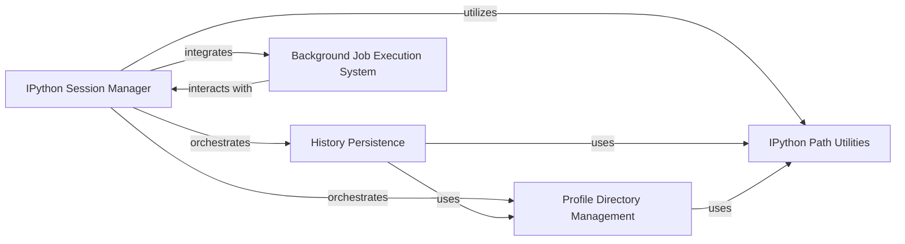

## Component Details

This graph illustrates the core components responsible for managing the persistent state and operational environment of an IPython session. The `IPython Session Manager` serves as the central orchestrator, initializing and coordinating various sub-components. It sets up the history management system for storing command inputs and outputs, configures user profiles and their associated directories, and integrates a system for executing tasks in the background. These components collectively ensure that the IPython session maintains its state, adheres to user configurations, and can handle long-running operations without blocking the interactive prompt.

### IPython Session Manager
The central orchestrator responsible for initializing and managing the persistent state and operational environment of an IPython session. It coordinates history, profile, and background job management.

**Related Classes/Methods**:

- <a href="https://github.com/ipython/ipython/blob/master/IPython/core/interactiveshell.py#L330-L4075" target="_blank" rel="noopener noreferrer">`IPython.core.interactiveshell.InteractiveShell` (330:4075)</a>
- <a href="https://github.com/ipython/ipython/blob/master/IPython/core/interactiveshell.py#L1912-L1915" target="_blank" rel="noopener noreferrer">`IPython.core.interactiveshell.InteractiveShell:init_history` (1912:1915)</a>
- <a href="https://github.com/ipython/ipython/blob/master/IPython/core/interactiveshell.py#L713-L719" target="_blank" rel="noopener noreferrer">`IPython.core.interactiveshell.InteractiveShell:init_profile_dir` (713:719)</a>
- <a href="https://github.com/ipython/ipython/blob/master/IPython/core/interactiveshell.py#L3861-L3884" target="_blank" rel="noopener noreferrer">`IPython.core.interactiveshell.InteractiveShell:mktempfile` (3861:3884)</a>
- <a href="https://github.com/ipython/ipython/blob/master/IPython/core/interactiveshell.py#L4035-L4067" target="_blank" rel="noopener noreferrer">`IPython.core.interactiveshell.InteractiveShell:atexit_operations` (4035:4067)</a>

### History Persistence
Manages the persistent storage and retrieval of user command history and outputs, utilizing an SQLite database and a background saving thread to ensure data integrity and responsiveness.

**Related Classes/Methods**:

- <a href="https://github.com/ipython/ipython/blob/master/IPython/core/history.py#L596-L1058" target="_blank" rel="noopener noreferrer">`IPython.core.history.HistoryManager` (596:1058)</a>
- <a href="https://github.com/ipython/ipython/blob/master/IPython/core/history.py#L670-L705" target="_blank" rel="noopener noreferrer">`IPython.core.history.HistoryManager:__init__` (670:705)</a>
- <a href="https://github.com/ipython/ipython/blob/master/IPython/core/history.py#L940-L986" target="_blank" rel="noopener noreferrer">`IPython.core.history.HistoryManager:store_inputs` (940:986)</a>
- <a href="https://github.com/ipython/ipython/blob/master/IPython/core/history.py#L988-L1006" target="_blank" rel="noopener noreferrer">`IPython.core.history.HistoryManager:store_output` (988:1006)</a>
- <a href="https://github.com/ipython/ipython/blob/master/IPython/core/history.py#L720-L732" target="_blank" rel="noopener noreferrer">`IPython.core.history.HistoryManager:new_session` (720:732)</a>
- <a href="https://github.com/ipython/ipython/blob/master/IPython/core/history.py#L734-L747" target="_blank" rel="noopener noreferrer">`IPython.core.history.HistoryManager:end_session` (734:747)</a>
- <a href="https://github.com/ipython/ipython/blob/master/IPython/core/history.py#L1076-L1148" target="_blank" rel="noopener noreferrer">`IPython.core.history.HistorySavingThread` (1076:1148)</a>
- <a href="https://github.com/ipython/ipython/blob/master/IPython/core/history.py#L589-L593" target="_blank" rel="noopener noreferrer">`IPython.core.history.HistoryOutput` (589:593)</a>

### Profile Directory Management
Responsible for locating, creating, and managing user profile directories and their subdirectories (e.g., security, log, startup), which store IPython's configuration and session-specific files.

**Related Classes/Methods**:

- <a href="https://github.com/ipython/ipython/blob/master/IPython/core/profiledir.py#L31-L244" target="_blank" rel="noopener noreferrer">`IPython.core.profiledir.ProfileDir` (31:244)</a>
- <a href="https://github.com/ipython/ipython/blob/master/IPython/core/profiledir.py#L174-L183" target="_blank" rel="noopener noreferrer">`IPython.core.profiledir.ProfileDir:create_profile_dir` (174:183)</a>
- <a href="https://github.com/ipython/ipython/blob/master/IPython/core/profiledir.py#L186-L200" target="_blank" rel="noopener noreferrer">`IPython.core.profiledir.ProfileDir:create_profile_dir_by_name` (186:200)</a>
- <a href="https://github.com/ipython/ipython/blob/master/IPython/core/profiledir.py#L203-L228" target="_blank" rel="noopener noreferrer">`IPython.core.profiledir.ProfileDir:find_profile_dir_by_name` (203:228)</a>
- <a href="https://github.com/ipython/ipython/blob/master/IPython/core/profiledir.py#L74-L119" target="_blank" rel="noopener noreferrer">`IPython.core.profiledir.ProfileDir:_mkdir` (74:119)</a>

### IPython Path Utilities
Provides a set of utility functions for resolving and managing file paths within the IPython environment, including locating IPython directories, user home directories, and searching for files.

**Related Classes/Methods**:

- <a href="https://github.com/ipython/ipython/blob/master/IPython/paths.py#L19-L72" target="_blank" rel="noopener noreferrer">`IPython.paths.get_ipython_dir` (19:72)</a>
- <a href="https://github.com/ipython/ipython/blob/master/IPython/paths.py#L111-L122" target="_blank" rel="noopener noreferrer">`IPython.paths.locate_profile` (111:122)</a>
- <a href="https://github.com/ipython/ipython/blob/master/IPython/utils/path.py#L339-L354" target="_blank" rel="noopener noreferrer">`IPython.utils.path.ensure_dir_exists` (339:354)</a>
- <a href="https://github.com/ipython/ipython/blob/master/IPython/utils/path.py#L156-L197" target="_blank" rel="noopener noreferrer">`IPython.utils.path.get_home_dir` (156:197)</a>
- <a href="https://github.com/ipython/ipython/blob/master/IPython/utils/path.py#L93-L149" target="_blank" rel="noopener noreferrer">`IPython.utils.path.filefind` (93:149)</a>
- <a href="https://github.com/ipython/ipython/blob/master/IPython/utils/path.py#L76-L90" target="_blank" rel="noopener noreferrer">`IPython.utils.path.get_py_filename` (76:90)</a>

### Background Job Execution System
Enables and manages the execution of tasks in separate threads, preventing the main interactive shell from blocking during long-running operations.

**Related Classes/Methods**:

- <a href="https://github.com/ipython/ipython/blob/master/IPython/lib/backgroundjobs.py#L41-L354" target="_blank" rel="noopener noreferrer">`IPython.lib.backgroundjobs.BackgroundJobManager` (41:354)</a>
- <a href="https://github.com/ipython/ipython/blob/master/IPython/lib/backgroundjobs.py#L106-L197" target="_blank" rel="noopener noreferrer">`IPython.lib.backgroundjobs.BackgroundJobManager:new` (106:197)</a>
- <a href="https://github.com/ipython/ipython/blob/master/IPython/lib/backgroundjobs.py#L203-L209" target="_blank" rel="noopener noreferrer">`IPython.lib.backgroundjobs.BackgroundJobManager:__call__` (203:209)</a>
- <a href="https://github.com/ipython/ipython/blob/master/IPython/lib/backgroundjobs.py#L357-L442" target="_blank" rel="noopener noreferrer">`IPython.lib.backgroundjobs.BackgroundJobBase` (357:442)</a>
- <a href="https://github.com/ipython/ipython/blob/master/IPython/lib/backgroundjobs.py#L445-L465" target="_blank" rel="noopener noreferrer">`IPython.lib.backgroundjobs.BackgroundJobExpr` (445:465)</a>
- <a href="https://github.com/ipython/ipython/blob/master/IPython/lib/backgroundjobs.py#L468-L491" target="_blank" rel="noopener noreferrer">`IPython.lib.backgroundjobs.BackgroundJobFunc` (468:491)</a>

### [FAQ](https://github.com/CodeBoarding/GeneratedOnBoardings/tree/main?tab=readme-ov-file#faq)