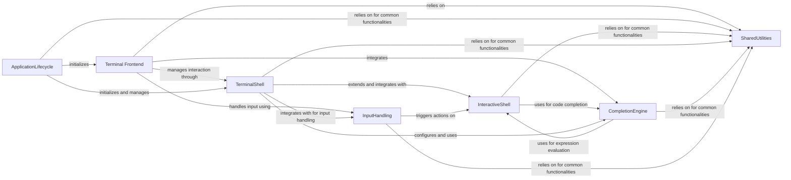

## Component Details

This graph provides an overview of the core components within the IPython terminal application, focusing on how the user interface, interactive shell, input handling, and completion functionalities interact. The `ApplicationLifecycle` component initiates and manages the `Terminal Frontend` and `TerminalShell`. The `Terminal Frontend` is responsible for user interaction, delegating prompt management to `TerminalShell`, input processing to `InputHandling`, and auto-completion to `CompletionEngine`. The `TerminalShell` extends `InteractiveShell` to provide terminal-specific features. All components rely on `SharedUtilities` for common functionalities.

### Terminal Frontend
Specifically manages the user interface and interaction aspects for the IPython terminal application. This includes generating and managing interactive prompts, processing raw user input from the terminal, and handling keyboard shortcuts and auto-suggestions for an optimized terminal experience.

**Related Classes/Methods**:

- <a href="https://github.com/ipython/ipython/blob/master/IPython/terminal/ipapp.py#L275-L292" target="_blank" rel="noopener noreferrer">`IPython.terminal.ipapp.TerminalIPythonApp:initialize` (275:292)</a>
- <a href="https://github.com/ipython/ipython/blob/master/IPython/terminal/interactiveshell.py#L991-L1005" target="_blank" rel="noopener noreferrer">`IPython.terminal.interactiveshell.TerminalInteractiveShell:interact` (991:1005)</a>
- <a href="https://github.com/ipython/ipython/blob/master/IPython/terminal/prompts.py#L33-L45" target="_blank" rel="noopener noreferrer">`IPython.terminal.prompts.Prompts:in_prompt_tokens` (33:45)</a>
- `IPython.terminal.shortcuts:create_ipython_shortcuts` (full file reference)

### InteractiveShell
This component forms the core of the IPython interactive environment. It manages the execution of user code, maintains session history, handles display output, and provides the framework for magic commands and object introspection. It also includes mechanisms for safe code evaluation and traceback handling.

**Related Classes/Methods**:

- <a href="https://github.com/ipython/ipython/blob/master/IPython/core/interactiveshell.py#L330-L4075" target="_blank" rel="noopener noreferrer">`IPython.core.interactiveshell.InteractiveShell` (330:4075)</a>
- <a href="https://github.com/ipython/ipython/blob/master/IPython/core/displayhook.py#L25-L332" target="_blank" rel="noopener noreferrer">`IPython.core.displayhook.DisplayHook` (25:332)</a>
- <a href="https://github.com/ipython/ipython/blob/master/IPython/core/history.py#L199-L585" target="_blank" rel="noopener noreferrer">`IPython.core.history.HistoryAccessor` (199:585)</a>
- <a href="https://github.com/ipython/ipython/blob/master/IPython/core/history.py#L596-L1058" target="_blank" rel="noopener noreferrer">`IPython.core.history.HistoryManager` (596:1058)</a>
- <a href="https://github.com/ipython/ipython/blob/master/IPython/core/history.py#L1076-L1148" target="_blank" rel="noopener noreferrer">`IPython.core.history.HistorySavingThread` (1076:1148)</a>
- <a href="https://github.com/ipython/ipython/blob/master/IPython/core/history.py#L589-L593" target="_blank" rel="noopener noreferrer">`IPython.core.history.HistoryOutput` (589:593)</a>
- <a href="https://github.com/ipython/ipython/blob/master/IPython/core/history.py#L74-L89" target="_blank" rel="noopener noreferrer">`IPython.core.history.DummyDB` (74:89)</a>
- <a href="https://github.com/ipython/ipython/blob/master/IPython/core/history.py#L1164-L1211" target="_blank" rel="noopener noreferrer">`IPython.core.history.extract_hist_ranges` (1164:1211)</a>
- <a href="https://github.com/ipython/ipython/blob/master/IPython/core/history.py#L1066-L1073" target="_blank" rel="noopener noreferrer">`IPython.core.history.hold` (1066:1073)</a>
- <a href="https://github.com/ipython/ipython/blob/master/IPython/core/magic.py#L309-L522" target="_blank" rel="noopener noreferrer">`IPython.core.magic.MagicsManager` (309:522)</a>
- <a href="https://github.com/ipython/ipython/blob/master/IPython/core/magic.py#L527-L718" target="_blank" rel="noopener noreferrer">`IPython.core.magic.Magics` (527:718)</a>
- <a href="https://github.com/ipython/ipython/blob/master/IPython/core/magic.py#L721-L760" target="_blank" rel="noopener noreferrer">`IPython.core.magic.MagicAlias` (721:760)</a>
- <a href="https://github.com/ipython/ipython/blob/master/IPython/core/magic.py#L133-L141" target="_blank" rel="noopener noreferrer">`IPython.core.magic.validate_type` (133:141)</a>
- <a href="https://github.com/ipython/ipython/blob/master/IPython/core/magic.py#L113-L130" target="_blank" rel="noopener noreferrer">`IPython.core.magic.record_magic` (113:130)</a>
- <a href="https://github.com/ipython/ipython/blob/master/IPython/core/magic_arguments.py#L225-L242" target="_blank" rel="noopener noreferrer">`IPython.core.magic_arguments.magic_arguments` (225:242)</a>
- <a href="https://github.com/ipython/ipython/blob/master/IPython/core/magic_arguments.py#L269-L274" target="_blank" rel="noopener noreferrer">`IPython.core.magic_arguments.argument` (269:274)</a>
- <a href="https://github.com/ipython/ipython/blob/master/IPython/core/magic_arguments.py#L193-L196" target="_blank" rel="noopener noreferrer">`IPython.core.magic_arguments.parse_argstring` (193:196)</a>
- <a href="https://github.com/ipython/ipython/blob/master/IPython/core/magics/history.py#L38-L338" target="_blank" rel="noopener noreferrer">`IPython.core.magics.history.HistoryMagics` (38:338)</a>
- `IPython.core.magics.UserMagics` (full file reference)
- <a href="https://github.com/ipython/ipython/blob/master/IPython/core/guarded_eval.py#L86-L119" target="_blank" rel="noopener noreferrer">`IPython.core.guarded_eval.EvaluationPolicy` (86:119)</a>
- <a href="https://github.com/ipython/ipython/blob/master/IPython/core/guarded_eval.py#L190-L311" target="_blank" rel="noopener noreferrer">`IPython.core.guarded_eval.SelectivePolicy` (190:311)</a>
- <a href="https://github.com/ipython/ipython/blob/master/IPython/core/guarded_eval.py#L355-L388" target="_blank" rel="noopener noreferrer">`IPython.core.guarded_eval.guarded_eval` (355:388)</a>
- <a href="https://github.com/ipython/ipython/blob/master/IPython/core/guarded_eval.py#L478-L646" target="_blank" rel="noopener noreferrer">`IPython.core.guarded_eval.eval_node` (478:646)</a>
- <a href="https://github.com/ipython/ipython/blob/master/IPython/core/guarded_eval.py#L649-L663" target="_blank" rel="noopener noreferrer">`IPython.core.guarded_eval._eval_return_type` (649:663)</a>
- <a href="https://github.com/ipython/ipython/blob/master/IPython/core/guarded_eval.py#L666-L723" target="_blank" rel="noopener noreferrer">`IPython.core.guarded_eval._resolve_annotation` (666:723)</a>
- <a href="https://github.com/ipython/ipython/blob/master/IPython/core/guarded_eval.py#L726-L742" target="_blank" rel="noopener noreferrer">`IPython.core.guarded_eval._eval_node_name` (726:742)</a>
- <a href="https://github.com/ipython/ipython/blob/master/IPython/core/guarded_eval.py#L745-L752" target="_blank" rel="noopener noreferrer">`IPython.core.guarded_eval._eval_or_create_duck` (745:752)</a>
- <a href="https://github.com/ipython/ipython/blob/master/IPython/core/guarded_eval.py#L755-L767" target="_blank" rel="noopener noreferrer">`IPython.core.guarded_eval._create_duck_for_heap_type` (755:767)</a>
- <a href="https://github.com/ipython/ipython/blob/master/IPython/core/guarded_eval.py#L349-L352" target="_blank" rel="noopener noreferrer">`IPython.core.guarded_eval.GuardRejection` (349:352)</a>
- <a href="https://github.com/ipython/ipython/blob/master/IPython/core/guarded_eval.py#L427-L428" target="_blank" rel="noopener noreferrer">`IPython.core.guarded_eval.ImpersonatingDuck` (427:428)</a>
- <a href="https://github.com/ipython/ipython/blob/master/IPython/core/guarded_eval.py#L63-L81" target="_blank" rel="noopener noreferrer">`IPython.core.guarded_eval._unbind_method` (63:81)</a>
- <a href="https://github.com/ipython/ipython/blob/master/IPython/core/guarded_eval.py#L135-L159" target="_blank" rel="noopener noreferrer">`IPython.core.guarded_eval._has_original_dunder_external` (135:159)</a>
- <a href="https://github.com/ipython/ipython/blob/master/IPython/core/guarded_eval.py#L162-L185" target="_blank" rel="noopener noreferrer">`IPython.core.guarded_eval._has_original_dunder` (162:185)</a>
- <a href="https://github.com/ipython/ipython/blob/master/IPython/core/guarded_eval.py#L122-L132" target="_blank" rel="noopener noreferrer">`IPython.core.guarded_eval._get_external` (122:132)</a>
- <a href="https://github.com/ipython/ipython/blob/master/IPython/core/guarded_eval.py#L467-L475" target="_blank" rel="noopener noreferrer">`IPython.core.guarded_eval.get_policy` (467:475)</a>
- <a href="https://github.com/ipython/ipython/blob/master/IPython/core/shellapp.py#L146-L496" target="_blank" rel="noopener noreferrer">`IPython.core.shellapp.InteractiveShellApp` (146:496)</a>
- <a href="https://github.com/ipython/ipython/blob/master/IPython/core/shellapp.py#L381-L409" target="_blank" rel="noopener noreferrer">`IPython.core.shellapp.InteractiveShellApp._exec_file` (381:409)</a>
- <a href="https://github.com/ipython/ipython/blob/master/IPython/core/shellapp.py#L411-L439" target="_blank" rel="noopener noreferrer">`IPython.core.shellapp.InteractiveShellApp._run_startup_files` (411:439)</a>
- <a href="https://github.com/ipython/ipython/blob/master/IPython/core/shellapp.py#L441-L452" target="_blank" rel="noopener noreferrer">`IPython.core.shellapp.InteractiveShellApp._run_exec_files` (441:452)</a>
- <a href="https://github.com/ipython/ipython/blob/master/IPython/core/shellapp.py#L454-L483" target="_blank" rel="noopener noreferrer">`IPython.core.shellapp.InteractiveShellApp._run_cmd_line_code` (454:483)</a>
- <a href="https://github.com/ipython/ipython/blob/master/IPython/core/splitinput.py#L54-L79" target="_blank" rel="noopener noreferrer">`IPython.core.splitinput.split_user_input` (54:79)</a>
- <a href="https://github.com/ipython/ipython/blob/master/IPython/core/splitinput.py#L82-L145" target="_blank" rel="noopener noreferrer">`IPython.core.splitinput.LineInfo` (82:145)</a>
- <a href="https://github.com/ipython/ipython/blob/master/IPython/core/debugger.py#L200-L1200" target="_blank" rel="noopener noreferrer">`IPython.core.debugger.Pdb` (200:1200)</a>
- <a href="https://github.com/ipython/ipython/blob/master/IPython/core/ultratb.py#L990-L1118" target="_blank" rel="noopener noreferrer">`IPython.core.ultratb.FormattedTB` (990:1118)</a>
- <a href="https://github.com/ipython/ipython/blob/master/IPython/core/ultratb.py#L1204-L1252" target="_blank" rel="noopener noreferrer">`IPython.core.ultratb.SyntaxTB` (1204:1252)</a>
- <a href="https://github.com/ipython/ipython/blob/master/IPython/core/ultratb.py#L1122-L1184" target="_blank" rel="noopener noreferrer">`IPython.core.ultratb.AutoFormattedTB` (1122:1184)</a>
- <a href="https://github.com/ipython/ipython/blob/master/IPython/core/ultratb.py#L115-L433" target="_blank" rel="noopener noreferrer">`IPython.core.ultratb.ListTB` (115:433)</a>
- <a href="https://github.com/ipython/ipython/blob/master/IPython/core/ultratb.py#L441-L986" target="_blank" rel="noopener noreferrer">`IPython.core.ultratb.VerboseTB` (441:986)</a>
- <a href="https://github.com/ipython/ipython/blob/master/IPython/core/async_helpers.py#L21-L47" target="_blank" rel="noopener noreferrer">`IPython.core.async_helpers.get_asyncio_loop` (21:47)</a>
- <a href="https://github.com/ipython/ipython/blob/master/IPython/core/async_helpers.py#L138-L155" target="_blank" rel="noopener noreferrer">`IPython.core.async_helpers._should_be_async` (138:155)</a>
- <a href="https://github.com/ipython/ipython/blob/master/IPython/core/error.py#L41-L46" target="_blank" rel="noopener noreferrer">`IPython.core.error.UsageError` (41:46)</a>
- <a href="https://github.com/ipython/ipython/blob/master/IPython/core/oinspect.py#L67-L90" target="_blank" rel="noopener noreferrer">`IPython.core.oinspect.OInfo` (67:90)</a>
- <a href="https://github.com/ipython/ipython/blob/master/IPython/core/oinspect.py#L166-L184" target="_blank" rel="noopener noreferrer">`IPython.core.oinspect.object_info` (166:184)</a>
- <a href="https://github.com/ipython/ipython/blob/master/IPython/core/oinspect.py#L211-L229" target="_blank" rel="noopener noreferrer">`IPython.core.oinspect.getdoc` (211:229)</a>
- <a href="https://github.com/ipython/ipython/blob/master/IPython/core/pylabtools.py#L456-L479" target="_blank" rel="noopener noreferrer">`IPython.core.pylabtools._matplotlib_manages_backends` (456:479)</a>
- <a href="https://github.com/ipython/ipython/blob/master/IPython/core/pylabtools.py#L321-L391" target="_blank" rel="noopener noreferrer">`IPython.core.pylabtools.find_gui_and_backend` (321:391)</a>
- <a href="https://github.com/ipython/ipython/blob/master/IPython/core/pylabtools.py#L394-L415" target="_blank" rel="noopener noreferrer">`IPython.core.pylabtools.activate_matplotlib` (394:415)</a>
- <a href="https://github.com/ipython/ipython/blob/master/IPython/core/pylabtools.py#L201-L248" target="_blank" rel="noopener noreferrer">`IPython.core.pylabtools.mpl_runner` (201:248)</a>
- <a href="https://github.com/ipython/ipython/blob/master/IPython/core/pylabtools.py#L418-L448" target="_blank" rel="noopener noreferrer">`IPython.core.pylabtools.import_pylab` (418:448)</a>
- <a href="https://github.com/ipython/ipython/blob/master/IPython/core/autocall.py#L51-L57" target="_blank" rel="noopener noreferrer">`IPython.core.autocall.ExitAutocall` (51:57)</a>
- <a href="https://github.com/ipython/ipython/blob/master/IPython/core/builtin_trap.py#L27-L93" target="_blank" rel="noopener noreferrer">`IPython.core.builtin_trap.BuiltinTrap` (27:93)</a>
- <a href="https://github.com/ipython/ipython/blob/master/IPython/core/formatters.py#L90-L256" target="_blank" rel="noopener noreferrer">`IPython.core.formatters.DisplayFormatter` (90:256)</a>
- <a href="https://github.com/ipython/ipython/blob/master/IPython/core/display_trap.py#L32-L73" target="_blank" rel="noopener noreferrer">`IPython.core.display_trap.DisplayTrap` (32:73)</a>
- <a href="https://github.com/ipython/ipython/blob/master/IPython/core/events.py#L17-L90" target="_blank" rel="noopener noreferrer">`IPython.core.events.EventManager` (17:90)</a>
- <a href="https://github.com/ipython/ipython/blob/master/IPython/core/events.py#L74-L90" target="_blank" rel="noopener noreferrer">`IPython.core.events.EventManager.trigger` (74:90)</a>
- <a href="https://github.com/ipython/ipython/blob/master/IPython/core/events.py#L44-L65" target="_blank" rel="noopener noreferrer">`IPython.core.events.EventManager.register` (44:65)</a>
- <a href="https://github.com/ipython/ipython/blob/master/IPython/core/hooks.py#L86-L129" target="_blank" rel="noopener noreferrer">`IPython.core.hooks.CommandChainDispatcher` (86:129)</a>
- <a href="https://github.com/ipython/ipython/blob/master/IPython/core/page.py#L47-L52" target="_blank" rel="noopener noreferrer">`IPython.core.page.as_hook` (47:52)</a>
- <a href="https://github.com/ipython/ipython/blob/master/IPython/core/page.py#L242-L265" target="_blank" rel="noopener noreferrer">`IPython.core.page.page` (242:265)</a>
- <a href="https://github.com/ipython/ipython/blob/master/IPython/core/logger.py#L30-L231" target="_blank" rel="noopener noreferrer">`IPython.core.logger.Logger` (30:231)</a>
- <a href="https://github.com/ipython/ipython/blob/master/IPython/core/alias.py#L196-L268" target="_blank" rel="noopener noreferrer">`IPython.core.alias.AliasManager` (196:268)</a>
- <a href="https://github.com/ipython/ipython/blob/master/IPython/core/extensions.py#L24-L135" target="_blank" rel="noopener noreferrer">`IPython.core.extensions.ExtensionManager` (24:135)</a>
- <a href="https://github.com/ipython/ipython/blob/master/IPython/core/payload.py#L28-L54" target="_blank" rel="noopener noreferrer">`IPython.core.payload.PayloadManager` (28:54)</a>
- <a href="https://github.com/ipython/ipython/blob/master/IPython/core/prefilter.py#L78-L329" target="_blank" rel="noopener noreferrer">`IPython.core.prefilter.PrefilterManager` (78:329)</a>
- <a href="https://github.com/ipython/ipython/blob/master/IPython/core/interactiveshell.py#L214-L244" target="_blank" rel="noopener noreferrer">`IPython.core.interactiveshell.make_main_module_type.IPythonMainModule` (214:244)</a>
- <a href="https://github.com/ipython/ipython/blob/master/IPython/core/interactiveshell.py#L212-L246" target="_blank" rel="noopener noreferrer">`IPython.core.interactiveshell.make_main_module_type` (212:246)</a>
- <a href="https://github.com/ipython/ipython/blob/master/IPython/core/interactiveshell.py#L156-L165" target="_blank" rel="noopener noreferrer">`IPython.core.interactiveshell.is_integer_string` (156:165)</a>
- <a href="https://github.com/ipython/ipython/blob/master/IPython/core/interactiveshell.py#L249-L283" target="_blank" rel="noopener noreferrer">`IPython.core.interactiveshell.ExecutionInfo` (249:283)</a>
- <a href="https://github.com/ipython/ipython/blob/master/IPython/core/interactiveshell.py#L286-L315" target="_blank" rel="noopener noreferrer">`IPython.core.interactiveshell.ExecutionResult` (286:315)</a>
- <a href="https://github.com/ipython/ipython/blob/master/IPython/core/interactiveshell.py#L169-L182" target="_blank" rel="noopener noreferrer">`IPython.core.interactiveshell.softspace` (169:182)</a>
- <a href="https://github.com/ipython/ipython/blob/master/IPython/core/macro.py#L16-L53" target="_blank" rel="noopener noreferrer">`IPython.core.macro.Macro` (16:53)</a>
- <a href="https://github.com/ipython/ipython/blob/master/IPython/external/pickleshare.py#L73-L282" target="_blank" rel="noopener noreferrer">`IPython.external.pickleshare.PickleShareDB` (73:282)</a>

### TerminalShell
This component provides the terminal-specific implementation of the IPython interactive shell. It manages the visual aspects of the prompt, integrates with a terminal-based debugger, allows embedding of interactive sessions, and offers specialized magic commands for terminal operations. It also includes utilities for interacting with the prompt toolkit library.

**Related Classes/Methods**:

- <a href="https://github.com/ipython/ipython/blob/master/IPython/terminal/interactiveshell.py#L203-L1115" target="_blank" rel="noopener noreferrer">`IPython.terminal.interactiveshell.TerminalInteractiveShell` (203:1115)</a>
- <a href="https://github.com/ipython/ipython/blob/master/IPython/terminal/interactiveshell.py#L166-L201" target="_blank" rel="noopener noreferrer">`IPython.terminal.interactiveshell.PtkHistoryAdapter` (166:201)</a>
- <a href="https://github.com/ipython/ipython/blob/master/IPython/terminal/prompts.py#L13-L92" target="_blank" rel="noopener noreferrer">`IPython.terminal.prompts.Prompts` (13:92)</a>
- <a href="https://github.com/ipython/ipython/blob/master/IPython/terminal/prompts.py#L94-L107" target="_blank" rel="noopener noreferrer">`IPython.terminal.prompts.ClassicPrompts` (94:107)</a>
- <a href="https://github.com/ipython/ipython/blob/master/IPython/terminal/prompts.py#L109-L140" target="_blank" rel="noopener noreferrer">`IPython.terminal.prompts.RichPromptDisplayHook` (109:140)</a>
- <a href="https://github.com/ipython/ipython/blob/master/IPython/terminal/debugger.py#L25-L160" target="_blank" rel="noopener noreferrer">`IPython.terminal.debugger.TerminalPdb` (25:160)</a>
- <a href="https://github.com/ipython/ipython/blob/master/IPython/terminal/debugger.py#L163-L169" target="_blank" rel="noopener noreferrer">`IPython.terminal.debugger.set_trace` (163:169)</a>
- <a href="https://github.com/ipython/ipython/blob/master/IPython/terminal/embed.py#L119-L354" target="_blank" rel="noopener noreferrer">`IPython.terminal.embed.InteractiveShellEmbed` (119:354)</a>
- <a href="https://github.com/ipython/ipython/blob/master/IPython/terminal/embed.py#L32-L107" target="_blank" rel="noopener noreferrer">`IPython.terminal.embed.EmbeddedMagics` (32:107)</a>
- <a href="https://github.com/ipython/ipython/blob/master/IPython/terminal/embed.py#L24-L24" target="_blank" rel="noopener noreferrer">`IPython.terminal.embed.KillEmbedded` (24:24)</a>
- <a href="https://github.com/ipython/ipython/blob/master/IPython/terminal/embed.py#L357-L436" target="_blank" rel="noopener noreferrer">`IPython.terminal.embed.embed` (357:436)</a>
- <a href="https://github.com/ipython/ipython/blob/master/IPython/terminal/magics.py#L40-L214" target="_blank" rel="noopener noreferrer">`IPython.terminal.magics.TerminalMagics` (40:214)</a>
- <a href="https://github.com/ipython/ipython/blob/master/IPython/terminal/magics.py#L18-L36" target="_blank" rel="noopener noreferrer">`IPython.terminal.magics.get_pasted_lines` (18:36)</a>
- <a href="https://github.com/ipython/ipython/blob/master/IPython/terminal/ptutils.py#L84-L87" target="_blank" rel="noopener noreferrer">`IPython.terminal.ptutils._elide` (84:87)</a>
- <a href="https://github.com/ipython/ipython/blob/master/IPython/terminal/ptutils.py#L69-L81" target="_blank" rel="noopener noreferrer">`IPython.terminal.ptutils._elide_typed` (69:81)</a>
- <a href="https://github.com/ipython/ipython/blob/master/IPython/terminal/ptutils.py#L31-L66" target="_blank" rel="noopener noreferrer">`IPython.terminal.ptutils._elide_point` (31:66)</a>
- <a href="https://github.com/ipython/ipython/blob/master/IPython/terminal/ptutils.py#L91-L95" target="_blank" rel="noopener noreferrer">`IPython.terminal.ptutils._adjust_completion_text_based_on_context` (91:95)</a>
- <a href="https://github.com/ipython/ipython/blob/master/IPython/terminal/ptutils.py#L197-L230" target="_blank" rel="noopener noreferrer">`IPython.terminal.ptutils.IPythonPTLexer` (197:230)</a>

### CompletionEngine
This component is dedicated to providing comprehensive auto-completion functionalities within IPython. It handles various completion types, including Python code, file paths, and magic commands, and integrates with external completion sources like Jedi. It also manages the display and sorting of completion results.

**Related Classes/Methods**:

- <a href="https://github.com/ipython/ipython/blob/master/IPython/core/completer.py#L1870-L3661" target="_blank" rel="noopener noreferrer">`IPython.core.completer.IPCompleter` (1870:3661)</a>
- <a href="https://github.com/ipython/ipython/blob/master/IPython/core/completer.py#L957-L1332" target="_blank" rel="noopener noreferrer">`IPython.core.completer.Completer` (957:1332)</a>
- <a href="https://github.com/ipython/ipython/blob/master/IPython/core/completer.py#L905-L953" target="_blank" rel="noopener noreferrer">`IPython.core.completer.CompletionSplitter` (905:953)</a>
- <a href="https://github.com/ipython/ipython/blob/master/IPython/core/completer.py#L616-L651" target="_blank" rel="noopener noreferrer">`IPython.core.completer.CompletionContext` (616:651)</a>
- <a href="https://github.com/ipython/ipython/blob/master/IPython/core/completer.py#L477-L548" target="_blank" rel="noopener noreferrer">`IPython.core.completer.Completion` (477:548)</a>
- <a href="https://github.com/ipython/ipython/blob/master/IPython/core/completer.py#L551-L572" target="_blank" rel="noopener noreferrer">`IPython.core.completer.SimpleCompletion` (551:572)</a>
- <a href="https://github.com/ipython/ipython/blob/master/IPython/core/completer.py#L594-L601" target="_blank" rel="noopener noreferrer">`IPython.core.completer.SimpleMatcherResult` (594:601)</a>
- <a href="https://github.com/ipython/ipython/blob/master/IPython/core/completer.py#L451-L471" target="_blank" rel="noopener noreferrer">`IPython.core.completer._FakeJediCompletion` (451:471)</a>
- <a href="https://github.com/ipython/ipython/blob/master/IPython/core/completer.py#L697-L699" target="_blank" rel="noopener noreferrer">`IPython.core.completer._is_matcher_v1` (697:699)</a>
- <a href="https://github.com/ipython/ipython/blob/master/IPython/core/completer.py#L702-L704" target="_blank" rel="noopener noreferrer">`IPython.core.completer._is_matcher_v2` (702:704)</a>
- <a href="https://github.com/ipython/ipython/blob/master/IPython/core/completer.py#L786-L787" target="_blank" rel="noopener noreferrer">`IPython.core.completer._get_matcher_api_version` (786:787)</a>
- <a href="https://github.com/ipython/ipython/blob/master/IPython/core/completer.py#L782-L783" target="_blank" rel="noopener noreferrer">`IPython.core.completer._get_matcher_id` (782:783)</a>
- <a href="https://github.com/ipython/ipython/blob/master/IPython/core/completer.py#L707-L709" target="_blank" rel="noopener noreferrer">`IPython.core.completer._is_sizable` (707:709)</a>
- <a href="https://github.com/ipython/ipython/blob/master/IPython/core/completer.py#L712-L714" target="_blank" rel="noopener noreferrer">`IPython.core.completer._is_iterator` (712:714)</a>
- <a href="https://github.com/ipython/ipython/blob/master/IPython/core/completer.py#L1359-L1369" target="_blank" rel="noopener noreferrer">`IPython.core.completer._parse_tokens` (1359:1369)</a>
- `IPython.core.completer._strip_code_before_operator` (full file reference)
- `IPython.core.completer._evaluate_expr` (full file reference)
- `IPython.core.completer._trim_expr` (full file reference)
- <a href="https://github.com/ipython/ipython/blob/master/IPython/core/completer.py#L1372-L1404" target="_blank" rel="noopener noreferrer">`IPython.core.completer._match_number_in_dict_key_prefix` (1372:1404)</a>
- <a href="https://github.com/ipython/ipython/blob/master/IPython/core/completer.py#L1761-L1788" target="_blank" rel="noopener noreferrer">`IPython.core.completer._make_signature` (1761:1788)</a>
- <a href="https://github.com/ipython/ipython/blob/master/IPython/core/completer.py#L1739-L1759" target="_blank" rel="noopener noreferrer">`IPython.core.completer._formatparamchildren` (1739:1759)</a>
- <a href="https://github.com/ipython/ipython/blob/master/IPython/core/completer.py#L1843-L1851" target="_blank" rel="noopener noreferrer">`IPython.core.completer._convert_matcher_v1_result_to_v2_no_no` (1843:1851)</a>
- <a href="https://github.com/ipython/ipython/blob/master/IPython/core/completer.py#L1854-L1867" target="_blank" rel="noopener noreferrer">`IPython.core.completer._convert_matcher_v1_result_to_v2` (1854:1867)</a>
- `IPython.core.completer._determine_completion_context` (full file reference)
- `IPython.core.completer._is_in_string_or_comment` (full file reference)
- `IPython.core.completer._default_arguments` (full file reference)
- `IPython.core.completer._default_arguments_from_docstring` (full file reference)
- `IPython.core.completer._get_keys` (full file reference)
- <a href="https://github.com/ipython/ipython/blob/master/IPython/core/completer.py#L1638-L1645" target="_blank" rel="noopener noreferrer">`IPython.core.completer._safe_isinstance` (1638:1645)</a>
- `IPython.core.completer._deduplicate` (full file reference)
- `IPython.core.completer._sort` (full file reference)
- `IPython.core.completer._completions` (full file reference)
- `IPython.core.completer._complete` (full file reference)
- `IPython.core.completer._arrange_and_extract` (full file reference)
- <a href="https://github.com/ipython/ipython/blob/master/IPython/core/completer.py#L3664-L3672" target="_blank" rel="noopener noreferrer">`IPython.core.completer._unicode_name_compute` (3664:3672)</a>
- <a href="https://github.com/ipython/ipython/blob/master/IPython/core/completer.py#L717-L735" target="_blank" rel="noopener noreferrer">`IPython.core.completer.has_any_completions` (717:735)</a>
- <a href="https://github.com/ipython/ipython/blob/master/IPython/core/completer.py#L838-L894" target="_blank" rel="noopener noreferrer">`IPython.core.completer.rectify_completions` (838:894)</a>
- <a href="https://github.com/ipython/ipython/blob/master/IPython/core/completer.py#L1414-L1572" target="_blank" rel="noopener noreferrer">`IPython.core.completer.match_dict_keys` (1414:1572)</a>
- <a href="https://github.com/ipython/ipython/blob/master/IPython/core/completer.py#L1649-L1657" target="_blank" rel="noopener noreferrer">`IPython.core.completer.back_unicode_name_matcher` (1649:1657)</a>
- <a href="https://github.com/ipython/ipython/blob/master/IPython/core/completer.py#L1703-L1737" target="_blank" rel="noopener noreferrer">`IPython.core.completer.back_latex_name_matcher` (1703:1737)</a>
- `IPython.core.completer.file_matcher` (full file reference)
- `IPython.core.completer.magic_matcher` (full file reference)
- `IPython.core.completer.magic_config_matcher` (full file reference)
- `IPython.core.completer.magic_color_matcher` (full file reference)
- `IPython.core.completer.python_matcher` (full file reference)
- `IPython.core.completer.python_matches` (full file reference)
- `IPython.core.completer.python_func_kw_matcher` (full file reference)
- `IPython.core.completer.python_func_kw_matches` (full file reference)
- `IPython.core.completer.dict_key_matcher` (full file reference)
- `IPython.core.completer.dict_key_matches` (full file reference)
- `IPython.core.completer.unicode_name_matcher` (full file reference)
- `IPython.core.completer.latex_name_matcher` (full file reference)
- `IPython.core.completer.custom_completer_matcher` (full file reference)
- `IPython.core.completer.fwd_unicode_matcher` (full file reference)
- `IPython.core.completer.unicode_names` (full file reference)
- <a href="https://github.com/ipython/ipython/blob/master/IPython/core/completerlib.py#L108-L152" target="_blank" rel="noopener noreferrer">`IPython.core.completerlib.get_root_modules` (108:152)</a>
- <a href="https://github.com/ipython/ipython/blob/master/IPython/core/completerlib.py#L178-L208" target="_blank" rel="noopener noreferrer">`IPython.core.completerlib.try_import` (178:208)</a>
- <a href="https://github.com/ipython/ipython/blob/master/IPython/core/completerlib.py#L215-L236" target="_blank" rel="noopener noreferrer">`IPython.core.completerlib.quick_completer` (215:236)</a>
- <a href="https://github.com/ipython/ipython/blob/master/IPython/core/completerlib.py#L238-L267" target="_blank" rel="noopener noreferrer">`IPython.core.completerlib.module_completion` (238:267)</a>
- <a href="https://github.com/ipython/ipython/blob/master/IPython/core/completerlib.py#L275-L284" target="_blank" rel="noopener noreferrer">`IPython.core.completerlib.module_completer` (275:284)</a>
- <a href="https://github.com/ipython/ipython/blob/master/IPython/core/completerlib.py#L289-L323" target="_blank" rel="noopener noreferrer">`IPython.core.completerlib.magic_run_completer` (289:323)</a>
- <a href="https://github.com/ipython/ipython/blob/master/IPython/core/completerlib.py#L326-L378" target="_blank" rel="noopener noreferrer">`IPython.core.completerlib.cd_completer` (326:378)</a>
- <a href="https://github.com/ipython/ipython/blob/master/IPython/core/completerlib.py#L155-L164" target="_blank" rel="noopener noreferrer">`IPython.core.completerlib.is_importable` (155:164)</a>
- <a href="https://github.com/ipython/ipython/blob/master/IPython/core/completerlib.py#L166-L175" target="_blank" rel="noopener noreferrer">`IPython.core.completerlib.is_possible_submodule` (166:175)</a>
- <a href="https://github.com/ipython/ipython/blob/master/IPython/core/completerlib.py#L68-L105" target="_blank" rel="noopener noreferrer">`IPython.core.completerlib.module_list` (68:105)</a>
- <a href="https://github.com/ipython/ipython/blob/master/IPython/terminal/ptutils.py#L98-L194" target="_blank" rel="noopener noreferrer">`IPython.terminal.ptutils.IPythonPTCompleter` (98:194)</a>

### InputHandling
This component is responsible for managing user input within the terminal. It provides mechanisms for defining and processing keyboard shortcuts, generating intelligent auto-suggestions based on history or language models, and integrating with various platform-specific input hooks for different GUI toolkits.

**Related Classes/Methods**:

- <a href="https://github.com/ipython/ipython/blob/master/IPython/terminal/shortcuts/auto_suggest.py#L32-L156" target="_blank" rel="noopener noreferrer">`IPython.terminal.shortcuts.auto_suggest.AppendAutoSuggestionInAnyLine` (32:156)</a>
- <a href="https://github.com/ipython/ipython/blob/master/IPython/terminal/shortcuts/auto_suggest.py#L159-L437" target="_blank" rel="noopener noreferrer">`IPython.terminal.shortcuts.auto_suggest.NavigableAutoSuggestFromHistory` (159:437)</a>
- <a href="https://github.com/ipython/ipython/blob/master/IPython/terminal/shortcuts/auto_suggest.py#L440-L459" target="_blank" rel="noopener noreferrer">`IPython.terminal.shortcuts.auto_suggest.llm_autosuggestion` (440:459)</a>
- <a href="https://github.com/ipython/ipython/blob/master/IPython/terminal/shortcuts/auto_suggest.py#L521-L524" target="_blank" rel="noopener noreferrer">`IPython.terminal.shortcuts.auto_suggest.accept_and_move_cursor_left` (521:524)</a>
- <a href="https://github.com/ipython/ipython/blob/master/IPython/terminal/shortcuts/auto_suggest.py#L533-L536" target="_blank" rel="noopener noreferrer">`IPython.terminal.shortcuts.auto_suggest.backspace_and_resume_hint` (533:536)</a>
- <a href="https://github.com/ipython/ipython/blob/master/IPython/terminal/shortcuts/auto_suggest.py#L539-L544" target="_blank" rel="noopener noreferrer">`IPython.terminal.shortcuts.auto_suggest.resume_hinting` (539:544)</a>
- <a href="https://github.com/ipython/ipython/blob/master/IPython/terminal/shortcuts/auto_suggest.py#L547-L552" target="_blank" rel="noopener noreferrer">`IPython.terminal.shortcuts.auto_suggest.up_and_update_hint` (547:552)</a>
- <a href="https://github.com/ipython/ipython/blob/master/IPython/terminal/shortcuts/auto_suggest.py#L555-L560" target="_blank" rel="noopener noreferrer">`IPython.terminal.shortcuts.auto_suggest.down_and_update_hint` (555:560)</a>
- <a href="https://github.com/ipython/ipython/blob/master/IPython/terminal/shortcuts/auto_suggest.py#L563-L602" target="_blank" rel="noopener noreferrer">`IPython.terminal.shortcuts.auto_suggest.accept_token` (563:602)</a>
- <a href="https://github.com/ipython/ipython/blob/master/IPython/terminal/shortcuts/auto_suggest.py#L608-L629" target="_blank" rel="noopener noreferrer">`IPython.terminal.shortcuts.auto_suggest._swap_autosuggestion` (608:629)</a>
- <a href="https://github.com/ipython/ipython/blob/master/IPython/terminal/shortcuts/auto_suggest.py#L632-L642" target="_blank" rel="noopener noreferrer">`IPython.terminal.shortcuts.auto_suggest.swap_autosuggestion_up` (632:642)</a>
- <a href="https://github.com/ipython/ipython/blob/master/IPython/terminal/shortcuts/auto_suggest.py#L645-L657" target="_blank" rel="noopener noreferrer">`IPython.terminal.shortcuts.auto_suggest.swap_autosuggestion_down` (645:657)</a>
- <a href="https://github.com/ipython/ipython/blob/master/IPython/terminal/shortcuts/auto_suggest.py#L28-L29" target="_blank" rel="noopener noreferrer">`IPython.terminal.shortcuts.auto_suggest._get_query` (28:29)</a>
- <a href="https://github.com/ipython/ipython/blob/master/IPython/terminal/shortcuts/auto_suggest.py#L527-L530" target="_blank" rel="noopener noreferrer">`IPython.terminal.shortcuts.auto_suggest._update_hint` (527:530)</a>
- `IPython.terminal.shortcuts.Binding` (full file reference)
- `IPython.terminal.shortcuts.RuntimeBinding` (full file reference)
- `IPython.terminal.shortcuts.create_ipython_shortcuts` (full file reference)
- `IPython.terminal.shortcuts.create_identifier` (full file reference)
- `IPython.terminal.shortcuts.add_binding` (full file reference)
- `IPython.terminal.shortcuts.reformat_and_execute` (full file reference)
- `IPython.terminal.shortcuts.handle_return_or_newline_or_execute` (full file reference)
- `IPython.terminal.shortcuts.newline_or_execute_outer` (full file reference)
- `IPython.terminal.shortcuts.newline_autoindent` (full file reference)
- `IPython.terminal.shortcuts.reformat_text_before_cursor` (full file reference)
- <a href="https://github.com/ipython/ipython/blob/master/IPython/terminal/shortcuts/filters.py#L71-L73" target="_blank" rel="noopener noreferrer">`IPython.terminal.shortcuts.filters.ebivim` (71:73)</a>
- <a href="https://github.com/ipython/ipython/blob/master/IPython/terminal/shortcuts/filters.py#L82-L84" target="_blank" rel="noopener noreferrer">`IPython.terminal.shortcuts.filters.auto_match` (82:84)</a>
- <a href="https://github.com/ipython/ipython/blob/master/IPython/terminal/shortcuts/filters.py#L163-L165" target="_blank" rel="noopener noreferrer">`IPython.terminal.shortcuts.filters.navigable_suggestions` (163:165)</a>
- <a href="https://github.com/ipython/ipython/blob/master/IPython/terminal/shortcuts/filters.py#L169-L171" target="_blank" rel="noopener noreferrer">`IPython.terminal.shortcuts.filters.readline_like_completions` (169:171)</a>
- <a href="https://github.com/ipython/ipython/blob/master/IPython/terminal/shortcuts/filters.py#L286-L314" target="_blank" rel="noopener noreferrer">`IPython.terminal.shortcuts.filters.eval_node` (286:314)</a>
- <a href="https://github.com/ipython/ipython/blob/master/IPython/terminal/shortcuts/filters.py#L317-L319" target="_blank" rel="noopener noreferrer">`IPython.terminal.shortcuts.filters.filter_from_string` (317:319)</a>
- <a href="https://github.com/ipython/ipython/blob/master/IPython/terminal/shortcuts/filters.py#L179-L204" target="_blank" rel="noopener noreferrer">`IPython.terminal.shortcuts.filters.PassThrough` (179:204)</a>
- <a href="https://github.com/ipython/ipython/blob/master/IPython/terminal/pt_inputhooks/pyglet.py#L25-L67" target="_blank" rel="noopener noreferrer">`IPython.terminal.pt_inputhooks.pyglet.inputhook` (25:67)</a>
- `IPython.terminal.pt_inputhooks.pyglet.flip` (full file reference)
- <a href="https://github.com/ipython/ipython/blob/master/IPython/terminal/pt_inputhooks/gtk4.py#L25-L27" target="_blank" rel="noopener noreferrer">`IPython.terminal.pt_inputhooks.gtk4.inputhook` (25:27)</a>
- <a href="https://github.com/ipython/ipython/blob/master/IPython/terminal/pt_inputhooks/gtk4.py#L8-L22" target="_blank" rel="noopener noreferrer">`IPython.terminal.pt_inputhooks.gtk4._InputHook` (8:22)</a>
- <a href="https://github.com/ipython/ipython/blob/master/IPython/terminal/pt_inputhooks/wx.py#L60-L72" target="_blank" rel="noopener noreferrer">`IPython.terminal.pt_inputhooks.wx.EventLoopRunner` (60:72)</a>
- <a href="https://github.com/ipython/ipython/blob/master/IPython/terminal/pt_inputhooks/wx.py#L50-L57" target="_blank" rel="noopener noreferrer">`IPython.terminal.pt_inputhooks.wx.EventLoopTimer` (50:57)</a>
- <a href="https://github.com/ipython/ipython/blob/master/IPython/terminal/pt_inputhooks/wx.py#L76-L98" target="_blank" rel="noopener noreferrer">`IPython.terminal.pt_inputhooks.wx.inputhook_wx2` (76:98)</a>
- <a href="https://github.com/ipython/ipython/blob/master/IPython/terminal/pt_inputhooks/qt.py#L19-L22" target="_blank" rel="noopener noreferrer">`IPython.terminal.pt_inputhooks.qt._reclaim_excepthook` (19:22)</a>
- <a href="https://github.com/ipython/ipython/blob/master/IPython/terminal/pt_inputhooks/qt.py#L25-L90" target="_blank" rel="noopener noreferrer">`IPython.terminal.pt_inputhooks.qt.inputhook` (25:90)</a>
- <a href="https://github.com/ipython/ipython/blob/master/IPython/terminal/pt_inputhooks/qt.py#L14-L16" target="_blank" rel="noopener noreferrer">`IPython.terminal.pt_inputhooks.qt._exec` (14:16)</a>
- <a href="https://github.com/ipython/ipython/blob/master/IPython/terminal/pt_inputhooks/osx.py#L29-L31" target="_blank" rel="noopener noreferrer">`IPython.terminal.pt_inputhooks.osx.n` (29:31)</a>
- <a href="https://github.com/ipython/ipython/blob/master/IPython/terminal/pt_inputhooks/osx.py#L33-L35" target="_blank" rel="noopener noreferrer">`IPython.terminal.pt_inputhooks.osx.C` (33:35)</a>
- <a href="https://github.com/ipython/ipython/blob/master/IPython/terminal/pt_inputhooks/osx.py#L23-L27" target="_blank" rel="noopener noreferrer">`IPython.terminal.pt_inputhooks.osx._utf8` (23:27)</a>
- <a href="https://github.com/ipython/ipython/blob/master/IPython/terminal/pt_inputhooks/osx.py#L78-L81" target="_blank" rel="noopener noreferrer">`IPython.terminal.pt_inputhooks.osx._NSApp` (78:81)</a>
- <a href="https://github.com/ipython/ipython/blob/master/IPython/terminal/pt_inputhooks/osx.py#L84-L116" target="_blank" rel="noopener noreferrer">`IPython.terminal.pt_inputhooks.osx._wake` (84:116)</a>
- <a href="https://github.com/ipython/ipython/blob/master/IPython/terminal/pt_inputhooks/osx.py#L119-L126" target="_blank" rel="noopener noreferrer">`IPython.terminal.pt_inputhooks.osx._input_callback` (119:126)</a>
- <a href="https://github.com/ipython/ipython/blob/master/IPython/terminal/pt_inputhooks/osx.py#L142-L147" target="_blank" rel="noopener noreferrer">`IPython.terminal.pt_inputhooks.osx.inputhook` (142:147)</a>
- <a href="https://github.com/ipython/ipython/blob/master/IPython/terminal/pt_inputhooks/osx.py#L132-L139" target="_blank" rel="noopener noreferrer">`IPython.terminal.pt_inputhooks.osx._stop_on_read` (132:139)</a>
- `IPython.terminal.pt_inputhooks.set_qt_api` (full file reference)
- `IPython.terminal.pt_inputhooks.get_inputhook_name_and_func` (full file reference)
- `IPython.terminal.pt_inputhooks.UnknownBackend` (full file reference)
- <a href="https://github.com/ipython/ipython/blob/master/IPython/terminal/pt_inputhooks/tk.py#L48-L93" target="_blank" rel="noopener noreferrer">`IPython.terminal.pt_inputhooks.tk.inputhook` (48:93)</a>
- <a href="https://github.com/ipython/ipython/blob/master/IPython/external/qt_loaders.py#L417-L421" target="_blank" rel="noopener noreferrer">`IPython.external.qt_loaders.enum_factory._enum` (417:421)</a>
- <a href="https://github.com/ipython/ipython/blob/master/IPython/external/qt_loaders.py#L91-L117" target="_blank" rel="noopener noreferrer">`IPython.external.qt_loaders.loaded_api` (91:117)</a>

### ApplicationLifecycle
This component manages the entire lifecycle of the IPython application, from initial setup and configuration loading to profile management and robust crash handling. It ensures the application starts correctly, loads necessary settings, and gracefully handles unexpected errors.

**Related Classes/Methods**:

- <a href="https://github.com/ipython/ipython/blob/master/IPython/core/application.py#L125-L492" target="_blank" rel="noopener noreferrer">`IPython.core.application.BaseIPythonApplication` (125:492)</a>
- <a href="https://github.com/ipython/ipython/blob/master/IPython/core/application.py#L111-L123" target="_blank" rel="noopener noreferrer">`IPython.core.application.ProfileAwareConfigLoader` (111:123)</a>
- <a href="https://github.com/ipython/ipython/blob/master/IPython/terminal/ipapp.py#L187-L330" target="_blank" rel="noopener noreferrer">`IPython.terminal.ipapp.TerminalIPythonApp` (187:330)</a>
- <a href="https://github.com/ipython/ipython/blob/master/IPython/terminal/ipapp.py#L63-L91" target="_blank" rel="noopener noreferrer">`IPython.terminal.ipapp.IPAppCrashHandler` (63:91)</a>
- <a href="https://github.com/ipython/ipython/blob/master/IPython/terminal/ipapp.py#L332-L344" target="_blank" rel="noopener noreferrer">`IPython.terminal.ipapp.load_default_config` (332:344)</a>
- <a href="https://github.com/ipython/ipython/blob/master/IPython/core/crashhandler.py#L89-L227" target="_blank" rel="noopener noreferrer">`IPython.core.crashhandler.CrashHandler` (89:227)</a>
- <a href="https://github.com/ipython/ipython/blob/master/IPython/core/crashhandler.py#L230-L243" target="_blank" rel="noopener noreferrer">`IPython.core.crashhandler.crash_handler_lite` (230:243)</a>
- <a href="https://github.com/ipython/ipython/blob/master/IPython/core/profiledir.py#L31-L244" target="_blank" rel="noopener noreferrer">`IPython.core.profiledir.ProfileDir` (31:244)</a>

### SharedUtilities
This component provides a collection of fundamental utility functions and classes that are widely used across various parts of the IPython codebase. These utilities cover common tasks such as terminal manipulation, cross-Python version compatibility, tokenization, input/output operations, and file system path management.

**Related Classes/Methods**:

- <a href="https://github.com/ipython/ipython/blob/master/IPython/utils/terminal.py#L110-L114" target="_blank" rel="noopener noreferrer">`IPython.utils.terminal.set_term_title` (110:114)</a>
- <a href="https://github.com/ipython/ipython/blob/master/IPython/utils/terminal.py#L117-L121" target="_blank" rel="noopener noreferrer">`IPython.utils.terminal.restore_term_title` (117:121)</a>
- <a href="https://github.com/ipython/ipython/blob/master/IPython/utils/terminal.py#L124-L125" target="_blank" rel="noopener noreferrer">`IPython.utils.terminal.get_terminal_size` (124:125)</a>
- <a href="https://github.com/ipython/ipython/blob/master/IPython/utils/terminal.py#L56-L58" target="_blank" rel="noopener noreferrer">`IPython.utils.terminal._set_term_title` (56:58)</a>
- <a href="https://github.com/ipython/ipython/blob/master/IPython/utils/terminal.py#L61-L62" target="_blank" rel="noopener noreferrer">`IPython.utils.terminal._restore_term_title` (61:62)</a>
- <a href="https://github.com/ipython/ipython/blob/master/IPython/utils/py3compat.py#L48-L49" target="_blank" rel="noopener noreferrer">`IPython.utils.py3compat.input` (48:49)</a>
- <a href="https://github.com/ipython/ipython/blob/master/IPython/utils/py3compat.py#L23-L26" target="_blank" rel="noopener noreferrer">`IPython.utils.py3compat.cast_unicode` (23:26)</a>
- <a href="https://github.com/ipython/ipython/blob/master/IPython/utils/py3compat.py#L13-L15" target="_blank" rel="noopener noreferrer">`IPython.utils.py3compat.decode` (13:15)</a>
- <a href="https://github.com/ipython/ipython/blob/master/IPython/utils/py3compat.py#L52-L56" target="_blank" rel="noopener noreferrer">`IPython.utils.py3compat.execfile` (52:56)</a>
- <a href="https://github.com/ipython/ipython/blob/master/IPython/utils/py3compat.py#L29-L43" target="_blank" rel="noopener noreferrer">`IPython.utils.py3compat.safe_unicode` (29:43)</a>
- <a href="https://github.com/ipython/ipython/blob/master/IPython/utils/tokenutil.py#L23-L29" target="_blank" rel="noopener noreferrer">`IPython.utils.tokenutil.generate_tokens` (23:29)</a>
- <a href="https://github.com/ipython/ipython/blob/master/IPython/utils/tokenutil.py#L32-L60" target="_blank" rel="noopener noreferrer">`IPython.utils.tokenutil.generate_tokens_catch_errors` (32:60)</a>
- <a href="https://github.com/ipython/ipython/blob/master/IPython/utils/io.py#L82-L113" target="_blank" rel="noopener noreferrer">`IPython.utils.io.ask_yes_no` (82:113)</a>
- `IPython.utils.path.get_ipython_dir` (full file reference)
- <a href="https://github.com/ipython/ipython/blob/master/IPython/utils/path.py#L339-L354" target="_blank" rel="noopener noreferrer">`IPython.utils.path.ensure_dir_exists` (339:354)</a>
- <a href="https://github.com/ipython/ipython/blob/master/IPython/utils/path.py#L93-L149" target="_blank" rel="noopener noreferrer">`IPython.utils.path.filefind` (93:149)</a>
- <a href="https://github.com/ipython/ipython/blob/master/IPython/utils/path.py#L156-L197" target="_blank" rel="noopener noreferrer">`IPython.utils.path.get_home_dir` (156:197)</a>
- <a href="https://github.com/ipython/ipython/blob/master/IPython/utils/path.py#L199-L215" target="_blank" rel="noopener noreferrer">`IPython.utils.path.get_xdg_dir` (199:215)</a>
- <a href="https://github.com/ipython/ipython/blob/master/IPython/utils/path.py#L218-L234" target="_blank" rel="noopener noreferrer">`IPython.utils.path.get_xdg_cache_dir` (218:234)</a>
- <a href="https://github.com/ipython/ipython/blob/master/IPython/utils/path.py#L69-L74" target="_blank" rel="noopener noreferrer">`IPython.utils.path.compress_user` (69:74)</a>
- <a href="https://github.com/ipython/ipython/blob/master/IPython/utils/path.py#L76-L90" target="_blank" rel="noopener noreferrer">`IPython.utils.path.get_py_filename` (76:90)</a>
- `IPython.utils.path.locate_profile` (full file reference)
- <a href="https://github.com/ipython/ipython/blob/master/IPython/utils/path.py#L237-L257" target="_blank" rel="noopener noreferrer">`IPython.utils.path.expand_path` (237:257)</a>
- <a href="https://github.com/ipython/ipython/blob/master/IPython/utils/path.py#L24-L26" target="_blank" rel="noopener noreferrer">`IPython.utils.path._writable_dir` (24:26)</a>
- <a href="https://github.com/ipython/ipython/blob/master/IPython/utils/path.py#L152-L153" target="_blank" rel="noopener noreferrer">`IPython.utils.path.HomeDirError` (152:153)</a>
- <a href="https://github.com/ipython/ipython/blob/master/IPython/utils/text.py#L105-L261" target="_blank" rel="noopener noreferrer">`IPython.utils.text.SList` (105:261)</a>
- <a href="https://github.com/ipython/ipython/blob/master/IPython/utils/text.py#L40-L90" target="_blank" rel="noopener noreferrer">`IPython.utils.text.LSString` (40:90)</a>
- <a href="https://github.com/ipython/ipython/blob/master/IPython/utils/text.py#L385-L432" target="_blank" rel="noopener noreferrer">`IPython.utils.text.strip_email_quotes` (385:432)</a>
- <a href="https://github.com/ipython/ipython/blob/master/IPython/utils/text.py#L525-L570" target="_blank" rel="noopener noreferrer">`IPython.utils.text.DollarFormatter` (525:570)</a>
- <a href="https://github.com/ipython/ipython/blob/master/IPython/utils/text.py#L490-L522" target="_blank" rel="noopener noreferrer">`IPython.utils.text.FullEvalFormatter.vformat` (490:522)</a>
- <a href="https://github.com/ipython/ipython/blob/master/IPython/utils/process.py#L55-L71" target="_blank" rel="noopener noreferrer">`IPython.utils.process.abbrev_cwd` (55:71)</a>
- `IPython.utils._process_win32.arg_split` (full file reference)
- <a href="https://github.com/ipython/ipython/blob/master/IPython/utils/_process_win32.py#L116-L141" target="_blank" rel="noopener noreferrer">`IPython.utils._process_win32.system` (116:141)</a>
- <a href="https://github.com/ipython/ipython/blob/master/IPython/utils/_process_win32.py#L25-L65" target="_blank" rel="noopener noreferrer">`IPython.utils._process_win32.AvoidUNCPath` (25:65)</a>
- <a href="https://github.com/ipython/ipython/blob/master/IPython/utils/_process_win32.py#L144-L166" target="_blank" rel="noopener noreferrer">`IPython.utils._process_win32.getoutput` (144:166)</a>
- <a href="https://github.com/ipython/ipython/blob/master/IPython/utils/contexts.py#L10-L60" target="_blank" rel="noopener noreferrer">`IPython.utils.contexts.preserve_keys` (10:60)</a>
- <a href="https://github.com/ipython/ipython/blob/master/IPython/utils/encoding.py#L22-L33" target="_blank" rel="noopener noreferrer">`IPython.utils.encoding.get_stream_enc` (22:33)</a>
- <a href="https://github.com/ipython/ipython/blob/master/IPython/utils/ipstruct.py#L28-L378" target="_blank" rel="noopener noreferrer">`IPython.utils.ipstruct.Struct` (28:378)</a>
- <a href="https://github.com/ipython/ipython/blob/master/IPython/utils/strdispatch.py#L11-L68" target="_blank" rel="noopener noreferrer">`IPython.utils.strdispatch.StrDispatch` (11:68)</a>
- <a href="https://github.com/ipython/ipython/blob/master/IPython/utils/openpy.py#L82-L104" target="_blank" rel="noopener noreferrer">`IPython.utils.openpy.read_py_url` (82:104)</a>
- <a href="https://github.com/ipython/ipython/blob/master/IPython/utils/openpy.py#L60-L80" target="_blank" rel="noopener noreferrer">`IPython.utils.openpy.read_py_file` (60:80)</a>
- <a href="https://github.com/ipython/ipython/blob/master/IPython/utils/dir2.py#L22-L50" target="_blank" rel="noopener noreferrer">`IPython.utils.dir2.dir2` (22:50)</a>
- <a href="https://github.com/ipython/ipython/blob/master/IPython/utils/dir2.py#L53-L83" target="_blank" rel="noopener noreferrer">`IPython.utils.dir2.get_real_method` (53:83)</a>
- <a href="https://github.com/ipython/ipython/blob/master/IPython/core/getipython.py#L16-L23" target="_blank" rel="noopener noreferrer">`IPython.core.getipython.get_ipython` (16:23)</a>
- <a href="https://github.com/ipython/ipython/blob/master/IPython/paths.py#L19-L72" target="_blank" rel="noopener noreferrer">`IPython.paths.get_ipython_dir` (19:72)</a>
- <a href="https://github.com/ipython/ipython/blob/master/IPython/paths.py#L89-L93" target="_blank" rel="noopener noreferrer">`IPython.paths.get_ipython_package_dir` (89:93)</a>
- <a href="https://github.com/ipython/ipython/blob/master/IPython/paths.py#L111-L122" target="_blank" rel="noopener noreferrer">`IPython.paths.locate_profile` (111:122)</a>

### [FAQ](https://github.com/CodeBoarding/GeneratedOnBoardings/tree/main?tab=readme-ov-file#faq)