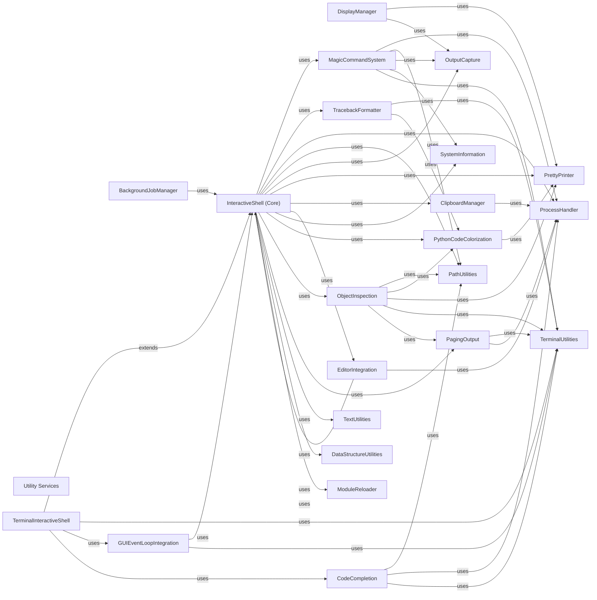

## Component Details

The Utility Services component in IPython provides a foundational set of general-purpose helper functions and classes. These utilities are broadly used across various IPython components to handle common tasks such as text processing, operating system interactions, data structure management, I/O operations, deep module reloading, and clipboard integration. The main flow involves other components calling these utility functions as needed to perform their specific tasks, ensuring a modular and efficient design by centralizing common functionalities.

### Utility Services
A collection of foundational, general-purpose helper functions and classes that are utilized across various components of IPython. This includes utilities for text processing, interacting with the operating system and processes, managing data structures and I/O operations, deep reloading of modules, and clipboard integration.

**Related Classes/Methods**:

- <a href="https://github.com/ipython/ipython/blob/master/IPython/utils/text.py#L154-L192" target="_blank" rel="noopener noreferrer">`ipython.IPython.utils.text.SList:grep` (154:192)</a>
- `ipython.IPython.utils.process:getoutput` (full file reference)
- <a href="https://github.com/ipython/ipython/blob/master/IPython/utils/ipstruct.py#L226-L236" target="_blank" rel="noopener noreferrer">`ipython.IPython.utils.ipstruct.Struct:copy` (226:236)</a>
- <a href="https://github.com/ipython/ipython/blob/master/IPython/utils/sysinfo.py#L97-L100" target="_blank" rel="noopener noreferrer">`ipython.IPython.utils.sysinfo:get_sys_info` (97:100)</a>
- <a href="https://github.com/ipython/ipython/blob/master/IPython/lib/deepreload.py#L285-L310" target="_blank" rel="noopener noreferrer">`ipython.IPython.lib.deepreload:reload` (285:310)</a>
- <a href="https://github.com/ipython/ipython/blob/master/IPython/lib/clipboard.py#L39-L48" target="_blank" rel="noopener noreferrer">`ipython.IPython.lib.clipboard:osx_clipboard_get` (39:48)</a>

### InteractiveShell (Core)
The central component of IPython, managing the interactive Python session, execution of code, and interaction with various IPython features like magics, hooks, and display. It handles initialization, syntax highlighting, hook management, and execution of user input.

**Related Classes/Methods**:

- <a href="https://github.com/ipython/ipython/blob/master/IPython/core/interactiveshell.py#L330-L4075" target="_blank" rel="noopener noreferrer">`ipython.IPython.core.interactiveshell.InteractiveShell` (330:4075)</a>
- <a href="https://github.com/ipython/ipython/blob/master/IPython/core/interactiveshell.py#L721-L747" target="_blank" rel="noopener noreferrer">`ipython.IPython.core.interactiveshell.InteractiveShell:init_instance_attrs` (721:747)</a>
- <a href="https://github.com/ipython/ipython/blob/master/IPython/core/interactiveshell.py#L779-L803" target="_blank" rel="noopener noreferrer">`ipython.IPython.core.interactiveshell.InteractiveShell:init_syntax_highlighting` (779:803)</a>
- <a href="https://github.com/ipython/ipython/blob/master/IPython/core/interactiveshell.py#L809-L813" target="_blank" rel="noopener noreferrer">`ipython.IPython.core.interactiveshell.InteractiveShell:init_pushd_popd_magic` (809:813)</a>
- <a href="https://github.com/ipython/ipython/blob/master/IPython/core/interactiveshell.py#L1018-L1032" target="_blank" rel="noopener noreferrer">`ipython.IPython.core.interactiveshell.InteractiveShell:init_hooks` (1018:1032)</a>
- <a href="https://github.com/ipython/ipython/blob/master/IPython/core/interactiveshell.py#L1034-L1073" target="_blank" rel="noopener noreferrer">`ipython.IPython.core.interactiveshell.InteractiveShell:set_hook` (1034:1073)</a>
- <a href="https://github.com/ipython/ipython/blob/master/IPython/core/interactiveshell.py#L2696-L2723" target="_blank" rel="noopener noreferrer">`ipython.IPython.core.interactiveshell.InteractiveShell:getoutput` (2696:2723)</a>
- <a href="https://github.com/ipython/ipython/blob/master/IPython/core/interactiveshell.py#L2606-L2627" target="_blank" rel="noopener noreferrer">`ipython.IPython.core.interactiveshell.InteractiveShell:system_piped` (2606:2627)</a>
- <a href="https://github.com/ipython/ipython/blob/master/IPython/core/interactiveshell.py#L2629-L2691" target="_blank" rel="noopener noreferrer">`ipython.IPython.core.interactiveshell.InteractiveShell:system_raw` (2629:2691)</a>
- <a href="https://github.com/ipython/ipython/blob/master/IPython/core/interactiveshell.py#L3832-L3859" target="_blank" rel="noopener noreferrer">`ipython.IPython.core.interactiveshell.InteractiveShell:var_expand` (3832:3859)</a>
- <a href="https://github.com/ipython/ipython/blob/master/IPython/core/interactiveshell.py#L3886-L3889" target="_blank" rel="noopener noreferrer">`ipython.IPython.core.interactiveshell.InteractiveShell:ask_yes_no` (3886:3889)</a>
- <a href="https://github.com/ipython/ipython/blob/master/IPython/core/interactiveshell.py#L3891-L3893" target="_blank" rel="noopener noreferrer">`ipython.IPython.core.interactiveshell.InteractiveShell:show_usage` (3891:3893)</a>
- <a href="https://github.com/ipython/ipython/blob/master/IPython/core/interactiveshell.py#L2862-L2928" target="_blank" rel="noopener noreferrer">`ipython.IPython.core.interactiveshell.InteractiveShell:safe_execfile` (2862:2928)</a>

### TerminalInteractiveShell
Extends the core InteractiveShell for terminal-specific interactions, including managing the terminal title and enabling integration with various GUI event loops.

**Related Classes/Methods**:

- <a href="https://github.com/ipython/ipython/blob/master/IPython/terminal/interactiveshell.py#L203-L1115" target="_blank" rel="noopener noreferrer">`ipython.IPython.terminal.interactiveshell.TerminalInteractiveShell` (203:1115)</a>
- <a href="https://github.com/ipython/ipython/blob/master/IPython/terminal/interactiveshell.py#L754-L760" target="_blank" rel="noopener noreferrer">`ipython.IPython.terminal.interactiveshell.TerminalInteractiveShell:init_term_title` (754:760)</a>
- <a href="https://github.com/ipython/ipython/blob/master/IPython/terminal/interactiveshell.py#L762-L764" target="_blank" rel="noopener noreferrer">`ipython.IPython.terminal.interactiveshell.TerminalInteractiveShell:restore_term_title` (762:764)</a>
- <a href="https://github.com/ipython/ipython/blob/master/IPython/terminal/interactiveshell.py#L1046-L1087" target="_blank" rel="noopener noreferrer">`ipython.IPython.terminal.interactiveshell.TerminalInteractiveShell:enable_gui` (1046:1087)</a>

### DisplayManager
Manages the display of rich output types such as audio, video, and code within the IPython environment, providing methods for their representation and rendering.

**Related Classes/Methods**:

- <a href="https://github.com/ipython/ipython/blob/master/IPython/lib/display.py#L17-L257" target="_blank" rel="noopener noreferrer">`ipython.IPython.lib.display.Audio` (17:257)</a>
- <a href="https://github.com/ipython/ipython/blob/master/IPython/lib/display.py#L112-L130" target="_blank" rel="noopener noreferrer">`ipython.IPython.lib.display.Audio:__init__` (112:130)</a>
- <a href="https://github.com/ipython/ipython/blob/master/IPython/lib/display.py#L132-L143" target="_blank" rel="noopener noreferrer">`ipython.IPython.lib.display.Audio:reload` (132:143)</a>
- <a href="https://github.com/ipython/ipython/blob/master/IPython/lib/display.py#L146-L166" target="_blank" rel="noopener noreferrer">`ipython.IPython.lib.display.Audio:_make_wav` (146:166)</a>
- <a href="https://github.com/ipython/ipython/blob/master/IPython/lib/display.py#L169-L188" target="_blank" rel="noopener noreferrer">`ipython.IPython.lib.display.Audio:_validate_and_normalize_with_numpy` (169:188)</a>
- <a href="https://github.com/ipython/ipython/blob/master/IPython/lib/display.py#L191-L208" target="_blank" rel="noopener noreferrer">`ipython.IPython.lib.display.Audio:_validate_and_normalize_without_numpy` (191:208)</a>
- <a href="https://github.com/ipython/ipython/blob/master/IPython/lib/display.py#L226-L234" target="_blank" rel="noopener noreferrer">`ipython.IPython.lib.display.Audio:_repr_html_` (226:234)</a>
- <a href="https://github.com/ipython/ipython/blob/master/IPython/lib/display.py#L329-L335" target="_blank" rel="noopener noreferrer">`ipython.IPython.lib.display.YouTubeVideo:__init__` (329:335)</a>
- <a href="https://github.com/ipython/ipython/blob/master/IPython/lib/display.py#L351-L353" target="_blank" rel="noopener noreferrer">`ipython.IPython.lib.display.VimeoVideo:__init__` (351:353)</a>
- <a href="https://github.com/ipython/ipython/blob/master/IPython/lib/display.py#L367-L369" target="_blank" rel="noopener noreferrer">`ipython.IPython.lib.display.ScribdDocument:__init__` (367:369)</a>
- <a href="https://github.com/ipython/ipython/blob/master/IPython/lib/display.py#L421-L430" target="_blank" rel="noopener noreferrer">`ipython.IPython.lib.display.FileLink:_repr_html_` (421:430)</a>
- <a href="https://github.com/ipython/ipython/blob/master/IPython/lib/display.py#L450-L513" target="_blank" rel="noopener noreferrer">`ipython.IPython.lib.display.FileLinks:__init__` (450:513)</a>
- <a href="https://github.com/ipython/ipython/blob/master/IPython/lib/display.py#L569-L592" target="_blank" rel="noopener noreferrer">`ipython.IPython.lib.display.FileLinks:_get_notebook_display_formatter` (569:592)</a>
- <a href="https://github.com/ipython/ipython/blob/master/IPython/lib/display.py#L594-L604" target="_blank" rel="noopener noreferrer">`ipython.IPython.lib.display.FileLinks:_get_terminal_display_formatter` (594:604)</a>
- <a href="https://github.com/ipython/ipython/blob/master/IPython/lib/display.py#L606-L615" target="_blank" rel="noopener noreferrer">`ipython.IPython.lib.display.FileLinks:_format_path` (606:615)</a>
- <a href="https://github.com/ipython/ipython/blob/master/IPython/lib/display.py#L617-L628" target="_blank" rel="noopener noreferrer">`ipython.IPython.lib.display.FileLinks:__repr__` (617:628)</a>
- <a href="https://github.com/ipython/ipython/blob/master/IPython/lib/display.py#L649-L651" target="_blank" rel="noopener noreferrer">`ipython.IPython.lib.display.Code:__init__` (649:651)</a>
- <a href="https://github.com/ipython/ipython/blob/master/IPython/lib/display.py#L667-L672" target="_blank" rel="noopener noreferrer">`ipython.IPython.lib.display.Code:_repr_html_` (667:672)</a>
- <a href="https://github.com/ipython/ipython/blob/master/IPython/lib/display.py#L674-L677" target="_blank" rel="noopener noreferrer">`ipython.IPython.lib.display.Code:_repr_latex_` (674:677)</a>

### PrettyPrinter
Provides a sophisticated mechanism for pretty-printing Python objects, ensuring their output is formatted for readability, especially for complex data structures.

**Related Classes/Methods**:

- <a href="https://github.com/ipython/ipython/blob/master/IPython/lib/pretty.py#L145-L153" target="_blank" rel="noopener noreferrer">`ipython.IPython.lib.pretty:pretty` (145:153)</a>
- <a href="https://github.com/ipython/ipython/blob/master/IPython/lib/pretty.py#L156-L164" target="_blank" rel="noopener noreferrer">`ipython.IPython.lib.pretty:pprint` (156:164)</a>
- <a href="https://github.com/ipython/ipython/blob/master/IPython/lib/pretty.py#L186-L311" target="_blank" rel="noopener noreferrer">`ipython.IPython.lib.pretty.PrettyPrinter` (186:311)</a>
- <a href="https://github.com/ipython/ipython/blob/master/IPython/lib/pretty.py#L194-L206" target="_blank" rel="noopener noreferrer">`ipython.IPython.lib.pretty.PrettyPrinter:__init__` (194:206)</a>
- <a href="https://github.com/ipython/ipython/blob/master/IPython/lib/pretty.py#L218-L223" target="_blank" rel="noopener noreferrer">`ipython.IPython.lib.pretty.PrettyPrinter:_break_outer_groups` (218:223)</a>
- <a href="https://github.com/ipython/ipython/blob/master/IPython/lib/pretty.py#L225-L238" target="_blank" rel="noopener noreferrer">`ipython.IPython.lib.pretty.PrettyPrinter:text` (225:238)</a>
- <a href="https://github.com/ipython/ipython/blob/master/IPython/lib/pretty.py#L240-L257" target="_blank" rel="noopener noreferrer">`ipython.IPython.lib.pretty.PrettyPrinter:breakable` (240:257)</a>
- <a href="https://github.com/ipython/ipython/blob/master/IPython/lib/pretty.py#L259-L270" target="_blank" rel="noopener noreferrer">`ipython.IPython.lib.pretty.PrettyPrinter:break_` (259:270)</a>
- <a href="https://github.com/ipython/ipython/blob/master/IPython/lib/pretty.py#L273-L285" target="_blank" rel="noopener noreferrer">`ipython.IPython.lib.pretty.PrettyPrinter:begin_group` (273:285)</a>
- <a href="https://github.com/ipython/ipython/blob/master/IPython/lib/pretty.py#L287-L295" target="_blank" rel="noopener noreferrer">`ipython.IPython.lib.pretty.PrettyPrinter:_enumerate` (287:295)</a>
- <a href="https://github.com/ipython/ipython/blob/master/IPython/lib/pretty.py#L297-L304" target="_blank" rel="noopener noreferrer">`ipython.IPython.lib.pretty.PrettyPrinter:end_group` (297:304)</a>
- <a href="https://github.com/ipython/ipython/blob/master/IPython/lib/pretty.py#L333-L434" target="_blank" rel="noopener noreferrer">`ipython.IPython.lib.pretty.RepresentationPrinter` (333:434)</a>
- <a href="https://github.com/ipython/ipython/blob/master/IPython/lib/pretty.py#L348-L363" target="_blank" rel="noopener noreferrer">`ipython.IPython.lib.pretty.RepresentationPrinter:__init__` (348:363)</a>
- <a href="https://github.com/ipython/ipython/blob/master/IPython/lib/pretty.py#L365-L416" target="_blank" rel="noopener noreferrer">`ipython.IPython.lib.pretty.RepresentationPrinter:pretty` (365:416)</a>
- <a href="https://github.com/ipython/ipython/blob/master/IPython/lib/pretty.py#L418-L434" target="_blank" rel="noopener noreferrer">`ipython.IPython.lib.pretty.RepresentationPrinter:_in_deferred_types` (418:434)</a>
- <a href="https://github.com/ipython/ipython/blob/master/IPython/lib/pretty.py#L491-L494" target="_blank" rel="noopener noreferrer">`ipython.IPython.lib.pretty.GroupQueue:__init__` (491:494)</a>
- <a href="https://github.com/ipython/ipython/blob/master/IPython/lib/pretty.py#L544-L547" target="_blank" rel="noopener noreferrer">`ipython.IPython.lib.pretty.CallExpression:factory` (544:547)</a>
- <a href="https://github.com/ipython/ipython/blob/master/IPython/lib/pretty.py#L549-L570" target="_blank" rel="noopener noreferrer">`ipython.IPython.lib.pretty.CallExpression:_repr_pretty_` (549:570)</a>
- <a href="https://github.com/ipython/ipython/blob/master/IPython/lib/pretty.py#L589-L624" target="_blank" rel="noopener noreferrer">`ipython.IPython.lib.pretty:_default_pprint` (589:624)</a>
- <a href="https://github.com/ipython/ipython/blob/master/IPython/lib/pretty.py#L649-L673" target="_blank" rel="noopener noreferrer">`ipython.IPython.lib.pretty:_set_pprinter_factory` (649:673)</a>
- <a href="https://github.com/ipython/ipython/blob/master/IPython/lib/pretty.py#L735-L741" target="_blank" rel="noopener noreferrer">`ipython.IPython.lib.pretty:_re_pattern_pprint` (735:741)</a>
- <a href="https://github.com/ipython/ipython/blob/master/IPython/lib/pretty.py#L744-L750" target="_blank" rel="noopener noreferrer">`ipython.IPython.lib.pretty:_types_simplenamespace_pprint` (744:750)</a>
- <a href="https://github.com/ipython/ipython/blob/master/IPython/lib/pretty.py#L753-L780" target="_blank" rel="noopener noreferrer">`ipython.IPython.lib.pretty:_type_pprint` (753:780)</a>
- <a href="https://github.com/ipython/ipython/blob/master/IPython/lib/pretty.py#L795-L805" target="_blank" rel="noopener noreferrer">`ipython.IPython.lib.pretty:_function_pprint` (795:805)</a>
- <a href="https://github.com/ipython/ipython/blob/master/IPython/lib/pretty.py#L808-L814" target="_blank" rel="noopener noreferrer">`ipython.IPython.lib.pretty:_exception_pprint` (808:814)</a>
- <a href="https://github.com/ipython/ipython/blob/master/IPython/lib/pretty.py#L891-L896" target="_blank" rel="noopener noreferrer">`ipython.IPython.lib.pretty:_defaultdict_pprint` (891:896)</a>
- <a href="https://github.com/ipython/ipython/blob/master/IPython/lib/pretty.py#L898-L905" target="_blank" rel="noopener noreferrer">`ipython.IPython.lib.pretty:_ordereddict_pprint` (898:905)</a>
- <a href="https://github.com/ipython/ipython/blob/master/IPython/lib/pretty.py#L907-L914" target="_blank" rel="noopener noreferrer">`ipython.IPython.lib.pretty:_deque_pprint` (907:914)</a>
- <a href="https://github.com/ipython/ipython/blob/master/IPython/lib/pretty.py#L916-L923" target="_blank" rel="noopener noreferrer">`ipython.IPython.lib.pretty:_counter_pprint` (916:923)</a>
- <a href="https://github.com/ipython/ipython/blob/master/IPython/lib/pretty.py#L926-L931" target="_blank" rel="noopener noreferrer">`ipython.IPython.lib.pretty:_userlist_pprint` (926:931)</a>

### OutputCapture
Provides utilities for capturing standard output, standard error, and rich display data generated during code execution, allowing for programmatic access and manipulation of the captured content.

**Related Classes/Methods**:

- <a href="https://github.com/ipython/ipython/blob/master/IPython/utils/capture.py#L16-L59" target="_blank" rel="noopener noreferrer">`ipython.IPython.utils.capture.RichOutput` (16:59)</a>
- <a href="https://github.com/ipython/ipython/blob/master/IPython/utils/capture.py#L23-L26" target="_blank" rel="noopener noreferrer">`ipython.IPython.utils.capture.RichOutput:display` (23:26)</a>
- <a href="https://github.com/ipython/ipython/blob/master/IPython/utils/capture.py#L40-L41" target="_blank" rel="noopener noreferrer">`ipython.IPython.utils.capture.RichOutput:_repr_html_` (40:41)</a>
- <a href="https://github.com/ipython/ipython/blob/master/IPython/utils/capture.py#L43-L44" target="_blank" rel="noopener noreferrer">`ipython.IPython.utils.capture.RichOutput:_repr_latex_` (43:44)</a>
- <a href="https://github.com/ipython/ipython/blob/master/IPython/utils/capture.py#L46-L47" target="_blank" rel="noopener noreferrer">`ipython.IPython.utils.capture.RichOutput:_repr_json_` (46:47)</a>
- <a href="https://github.com/ipython/ipython/blob/master/IPython/utils/capture.py#L49-L50" target="_blank" rel="noopener noreferrer">`ipython.IPython.utils.capture.RichOutput:_repr_javascript_` (49:50)</a>
- <a href="https://github.com/ipython/ipython/blob/master/IPython/utils/capture.py#L52-L53" target="_blank" rel="noopener noreferrer">`ipython.IPython.utils.capture.RichOutput:_repr_png_` (52:53)</a>
- <a href="https://github.com/ipython/ipython/blob/master/IPython/utils/capture.py#L55-L56" target="_blank" rel="noopener noreferrer">`ipython.IPython.utils.capture.RichOutput:_repr_jpeg_` (55:56)</a>
- <a href="https://github.com/ipython/ipython/blob/master/IPython/utils/capture.py#L58-L59" target="_blank" rel="noopener noreferrer">`ipython.IPython.utils.capture.RichOutput:_repr_svg_` (58:59)</a>
- <a href="https://github.com/ipython/ipython/blob/master/IPython/utils/capture.py#L62-L121" target="_blank" rel="noopener noreferrer">`ipython.IPython.utils.capture.CapturedIO` (62:121)</a>
- <a href="https://github.com/ipython/ipython/blob/master/IPython/utils/capture.py#L100-L110" target="_blank" rel="noopener noreferrer">`ipython.IPython.utils.capture.CapturedIO:outputs` (100:110)</a>
- <a href="https://github.com/ipython/ipython/blob/master/IPython/utils/capture.py#L112-L119" target="_blank" rel="noopener noreferrer">`ipython.IPython.utils.capture.CapturedIO:show` (112:119)</a>
- <a href="https://github.com/ipython/ipython/blob/master/IPython/utils/capture.py#L136-L163" target="_blank" rel="noopener noreferrer">`ipython.IPython.utils.capture.capture_output:__enter__` (136:163)</a>

### ProcessHandler
Encapsulates the logic for executing external system commands and managing their input, output, and error streams, with specific implementations for different operating systems.

**Related Classes/Methods**:

- <a href="https://github.com/ipython/ipython/blob/master/IPython/utils/_process_win32.py#L68-L113" target="_blank" rel="noopener noreferrer">`ipython.IPython.utils._process_win32:_system_body` (68:113)</a>
- <a href="https://github.com/ipython/ipython/blob/master/IPython/utils/_process_win32.py#L116-L141" target="_blank" rel="noopener noreferrer">`ipython.IPython.utils._process_win32:system` (116:141)</a>
- <a href="https://github.com/ipython/ipython/blob/master/IPython/utils/_process_win32.py#L144-L166" target="_blank" rel="noopener noreferrer">`ipython.IPython.utils._process_win32:getoutput` (144:166)</a>
- <a href="https://github.com/ipython/ipython/blob/master/IPython/utils/_process_win32_controller.py#L230-L324" target="_blank" rel="noopener noreferrer">`ipython.IPython.utils._process_win32_controller.Win32ShellCommandController:__enter__` (230:324)</a>
- <a href="https://github.com/ipython/ipython/blob/master/IPython/utils/_process_win32_controller.py#L393-L442" target="_blank" rel="noopener noreferrer">`ipython.IPython.utils._process_win32_controller.Win32ShellCommandController:run` (393:442)</a>
- <a href="https://github.com/ipython/ipython/blob/master/IPython/utils/_process_win32_controller.py#L502-L524" target="_blank" rel="noopener noreferrer">`ipython.IPython.utils._process_win32_controller.Win32ShellCommandController:_run_stdio` (502:524)</a>
- <a href="https://github.com/ipython/ipython/blob/master/IPython/utils/_process_win32_controller.py#L547-L567" target="_blank" rel="noopener noreferrer">`ipython.IPython.utils._process_win32_controller:system` (547:567)</a>
- <a href="https://github.com/ipython/ipython/blob/master/IPython/utils/process.py#L30-L52" target="_blank" rel="noopener noreferrer">`ipython.IPython.utils.process:find_cmd` (30:52)</a>
- <a href="https://github.com/ipython/ipython/blob/master/IPython/utils/_process_common.py#L120-L140" target="_blank" rel="noopener noreferrer">`ipython.IPython.utils._process_common:getoutput` (120:140)</a>
- <a href="https://github.com/ipython/ipython/blob/master/IPython/utils/_process_common.py#L143-L158" target="_blank" rel="noopener noreferrer">`ipython.IPython.utils._process_common:getoutputerror` (143:158)</a>
- <a href="https://github.com/ipython/ipython/blob/master/IPython/utils/_process_common.py#L160-L182" target="_blank" rel="noopener noreferrer">`ipython.IPython.utils._process_common:get_output_error_code` (160:182)</a>

### MagicCommandSystem
Provides the foundational framework for IPython's "magic" commands, which are special commands that extend the capabilities of the interactive shell beyond standard Python syntax, handling parsing, execution, and argument management.

**Related Classes/Methods**:

- <a href="https://github.com/ipython/ipython/blob/master/IPython/core/magic.py#L622-L711" target="_blank" rel="noopener noreferrer">`ipython.IPython.core.magic.Magics:parse_options` (622:711)</a>
- <a href="https://github.com/ipython/ipython/blob/master/IPython/core/magic.py#L208-L259" target="_blank" rel="noopener noreferrer">`ipython.IPython.core.magic:_function_magic_marker` (208:259)</a>
- <a href="https://github.com/ipython/ipython/blob/master/IPython/core/magic_arguments.py#L101-L102" target="_blank" rel="noopener noreferrer">`ipython.IPython.core.magic_arguments.MagicHelpFormatter:_fill_text` (101:102)</a>
- <a href="https://github.com/ipython/ipython/blob/master/IPython/core/magic_arguments.py#L164-L168" target="_blank" rel="noopener noreferrer">`ipython.IPython.core.magic_arguments.MagicArgumentParser:parse_argstring` (164:168)</a>
- <a href="https://github.com/ipython/ipython/blob/master/IPython/terminal/magics.py#L44-L58" target="_blank" rel="noopener noreferrer">`ipython.IPython.terminal.magics.TerminalMagics:store_or_execute` (44:58)</a>
- <a href="https://github.com/ipython/ipython/blob/master/IPython/terminal/magics.py#L60-L64" target="_blank" rel="noopener noreferrer">`ipython.IPython.terminal.magics.TerminalMagics:preclean_input` (60:64)</a>
- <a href="https://github.com/ipython/ipython/blob/master/IPython/core/magics/code.py#L318-L405" target="_blank" rel="noopener noreferrer">`ipython.IPython.core.magics.code.CodeMagics:load` (318:405)</a>
- <a href="https://github.com/ipython/ipython/blob/master/IPython/core/magics/osm.py#L299-L430" target="_blank" rel="noopener noreferrer">`ipython.IPython.core.magics.osm.OSMagics:cd` (299:430)</a>
- <a href="https://github.com/ipython/ipython/blob/master/IPython/core/magics/osm.py#L798-L821" target="_blank" rel="noopener noreferrer">`ipython.IPython.core.magics.osm.OSMagics:pycat` (798:821)</a>
- <a href="https://github.com/ipython/ipython/blob/master/IPython/core/magics/script.py#L175-L336" target="_blank" rel="noopener noreferrer">`ipython.IPython.core.magics.script.ScriptMagics:shebang` (175:336)</a>
- <a href="https://github.com/ipython/ipython/blob/master/IPython/core/magics/execution.py#L1011-L1047" target="_blank" rel="noopener noreferrer">`ipython.IPython.core.magics.execution.ExecutionMagics:_run_with_timing` (1011:1047)</a>
- <a href="https://github.com/ipython/ipython/blob/master/IPython/core/magics/execution.py#L1053-L1258" target="_blank" rel="noopener noreferrer">`ipython.IPython.core.magics.execution.ExecutionMagics:timeit` (1053:1258)</a>
- <a href="https://github.com/ipython/ipython/blob/master/IPython/core/magics/execution.py#L1265-L1419" target="_blank" rel="noopener noreferrer">`ipython.IPython.core.magics.execution.ExecutionMagics:time` (1265:1419)</a>
- <a href="https://github.com/ipython/ipython/blob/master/IPython/core/magics/execution.py#L1541-L1553" target="_blank" rel="noopener noreferrer">`ipython.IPython.core.magics.execution.ExecutionMagics:capture` (1541:1553)</a>

### CodeCompletion
Implements the logic for providing intelligent code completion suggestions to the user, analyzing the current input and offering relevant attributes, files, or other context-aware completions.

**Related Classes/Methods**:

- <a href="https://github.com/ipython/ipython/blob/master/IPython/core/completer.py#L1208-L1274" target="_blank" rel="noopener noreferrer">`ipython.IPython.core.completer.Completer:_attr_matches` (1208:1274)</a>
- <a href="https://github.com/ipython/ipython/blob/master/IPython/core/completer.py#L2123-L2225" target="_blank" rel="noopener noreferrer">`ipython.IPython.core.completer.IPCompleter:file_matcher` (2123:2225)</a>
- <a href="https://github.com/ipython/ipython/blob/master/IPython/core/completer.py#L2808-L2829" target="_blank" rel="noopener noreferrer">`ipython.IPython.core.completer.IPCompleter:_get_keys` (2808:2829)</a>
- <a href="https://github.com/ipython/ipython/blob/master/IPython/terminal/ptutils.py#L135-L194" target="_blank" rel="noopener noreferrer">`ipython.IPython.terminal.ptutils.IPythonPTCompleter:_get_completions` (135:194)</a>

### TracebackFormatter
Responsible for enhancing the display of Python tracebacks, providing more detailed and readable error messages, and supporting different formatting styles.

**Related Classes/Methods**:

- <a href="https://github.com/ipython/ipython/blob/master/IPython/core/doctb.py#L239-L251" target="_blank" rel="noopener noreferrer">`ipython.IPython.core.doctb.DocTB:prepare_header` (239:251)</a>
- <a href="https://github.com/ipython/ipython/blob/master/IPython/core/ultratb.py#L289-L399" target="_blank" rel="noopener noreferrer">`ipython.IPython.core.ultratb.ListTB:_format_exception_only` (289:399)</a>
- <a href="https://github.com/ipython/ipython/blob/master/IPython/core/ultratb.py#L428-L433" target="_blank" rel="noopener noreferrer">`ipython.IPython.core.ultratb.ListTB:_some_str` (428:433)</a>
- <a href="https://github.com/ipython/ipython/blob/master/IPython/core/ultratb.py#L518-L658" target="_blank" rel="noopener noreferrer">`ipython.IPython.core.ultratb.VerboseTB:format_record` (518:658)</a>
- <a href="https://github.com/ipython/ipython/blob/master/IPython/core/ultratb.py#L660-L694" target="_blank" rel="noopener noreferrer">`ipython.IPython.core.ultratb.VerboseTB:prepare_header` (660:694)</a>
- <a href="https://github.com/ipython/ipython/blob/master/IPython/core/ultratb.py#L696-L721" target="_blank" rel="noopener noreferrer">`ipython.IPython.core.ultratb.VerboseTB:format_exception` (696:721)</a>
- <a href="https://github.com/ipython/ipython/blob/master/IPython/core/ultratb.py#L852-L910" target="_blank" rel="noopener noreferrer">`ipython.IPython.core.ultratb.VerboseTB:structured_traceback` (852:910)</a>
- <a href="https://github.com/ipython/ipython/blob/master/IPython/core/ultratb.py#L1041-L1080" target="_blank" rel="noopener noreferrer">`ipython.IPython.core.ultratb.FormattedTB:structured_traceback` (1041:1080)</a>

### EditorIntegration
Provides a flexible system for integrating external text editors with IPython, allowing users to easily edit code or files using their preferred editor from within the interactive session.

**Related Classes/Methods**:

- <a href="https://github.com/ipython/ipython/blob/master/IPython/lib/editorhooks.py#L18-L61" target="_blank" rel="noopener noreferrer">`ipython.IPython.lib.editorhooks:install_editor` (18:61)</a>
- <a href="https://github.com/ipython/ipython/blob/master/IPython/lib/editorhooks.py#L66-L68" target="_blank" rel="noopener noreferrer">`ipython.IPython.lib.editorhooks:komodo` (66:68)</a>
- <a href="https://github.com/ipython/ipython/blob/master/IPython/lib/editorhooks.py#L71-L73" target="_blank" rel="noopener noreferrer">`ipython.IPython.lib.editorhooks:scite` (71:73)</a>
- <a href="https://github.com/ipython/ipython/blob/master/IPython/lib/editorhooks.py#L76-L78" target="_blank" rel="noopener noreferrer">`ipython.IPython.lib.editorhooks:notepadplusplus` (76:78)</a>
- <a href="https://github.com/ipython/ipython/blob/master/IPython/lib/editorhooks.py#L81-L83" target="_blank" rel="noopener noreferrer">`ipython.IPython.lib.editorhooks:jed` (81:83)</a>
- <a href="https://github.com/ipython/ipython/blob/master/IPython/lib/editorhooks.py#L86-L100" target="_blank" rel="noopener noreferrer">`ipython.IPython.lib.editorhooks:idle` (86:100)</a>
- <a href="https://github.com/ipython/ipython/blob/master/IPython/lib/editorhooks.py#L103-L106" target="_blank" rel="noopener noreferrer">`ipython.IPython.lib.editorhooks:mate` (103:106)</a>
- <a href="https://github.com/ipython/ipython/blob/master/IPython/lib/editorhooks.py#L114-L115" target="_blank" rel="noopener noreferrer">`ipython.IPython.lib.editorhooks:emacs` (114:115)</a>
- <a href="https://github.com/ipython/ipython/blob/master/IPython/lib/editorhooks.py#L118-L119" target="_blank" rel="noopener noreferrer">`ipython.IPython.lib.editorhooks:gnuclient` (118:119)</a>
- <a href="https://github.com/ipython/ipython/blob/master/IPython/lib/editorhooks.py#L122-L123" target="_blank" rel="noopener noreferrer">`ipython.IPython.lib.editorhooks:crimson_editor` (122:123)</a>
- <a href="https://github.com/ipython/ipython/blob/master/IPython/lib/editorhooks.py#L126-L127" target="_blank" rel="noopener noreferrer">`ipython.IPython.lib.editorhooks:kate` (126:127)</a>

### BackgroundJobManager
Manages the lifecycle and status of asynchronous background tasks, allowing IPython to execute long-running operations without blocking the main interactive loop.

**Related Classes/Methods**:

- <a href="https://github.com/ipython/ipython/blob/master/IPython/lib/backgroundjobs.py#L92-L94" target="_blank" rel="noopener noreferrer">`ipython.IPython.lib.backgroundjobs.BackgroundJobManager:running` (92:94)</a>
- <a href="https://github.com/ipython/ipython/blob/master/IPython/lib/backgroundjobs.py#L97-L99" target="_blank" rel="noopener noreferrer">`ipython.IPython.lib.backgroundjobs.BackgroundJobManager:dead` (97:99)</a>
- <a href="https://github.com/ipython/ipython/blob/master/IPython/lib/backgroundjobs.py#L102-L104" target="_blank" rel="noopener noreferrer">`ipython.IPython.lib.backgroundjobs.BackgroundJobManager:completed` (102:104)</a>
- <a href="https://github.com/ipython/ipython/blob/master/IPython/lib/backgroundjobs.py#L106-L197" target="_blank" rel="noopener noreferrer">`ipython.IPython.lib.backgroundjobs.BackgroundJobManager:new` (106:197)</a>
- <a href="https://github.com/ipython/ipython/blob/master/IPython/lib/backgroundjobs.py#L203-L209" target="_blank" rel="noopener noreferrer">`ipython.IPython.lib.backgroundjobs.BackgroundJobManager:__call__` (203:209)</a>
- <a href="https://github.com/ipython/ipython/blob/master/IPython/lib/backgroundjobs.py#L268-L282" target="_blank" rel="noopener noreferrer">`ipython.IPython.lib.backgroundjobs.BackgroundJobManager:_status_new` (268:282)</a>
- <a href="https://github.com/ipython/ipython/blob/master/IPython/lib/backgroundjobs.py#L284-L293" target="_blank" rel="noopener noreferrer">`ipython.IPython.lib.backgroundjobs.BackgroundJobManager:status` (284:293)</a>
- <a href="https://github.com/ipython/ipython/blob/master/IPython/lib/backgroundjobs.py#L312-L330" target="_blank" rel="noopener noreferrer">`ipython.IPython.lib.backgroundjobs.BackgroundJobManager:flush` (312:330)</a>
- <a href="https://github.com/ipython/ipython/blob/master/IPython/lib/backgroundjobs.py#L346-L354" target="_blank" rel="noopener noreferrer">`ipython.IPython.lib.backgroundjobs.BackgroundJobManager:traceback` (346:354)</a>
- <a href="https://github.com/ipython/ipython/blob/master/IPython/lib/backgroundjobs.py#L388-L417" target="_blank" rel="noopener noreferrer">`ipython.IPython.lib.backgroundjobs.BackgroundJobBase:_init` (388:417)</a>
- <a href="https://github.com/ipython/ipython/blob/master/IPython/lib/backgroundjobs.py#L428-L442" target="_blank" rel="noopener noreferrer">`ipython.IPython.lib.backgroundjobs.BackgroundJobBase:run` (428:442)</a>
- <a href="https://github.com/ipython/ipython/blob/master/IPython/lib/backgroundjobs.py#L448-L462" target="_blank" rel="noopener noreferrer">`ipython.IPython.lib.backgroundjobs.BackgroundJobExpr:__init__` (448:462)</a>
- <a href="https://github.com/ipython/ipython/blob/master/IPython/lib/backgroundjobs.py#L471-L488" target="_blank" rel="noopener noreferrer">`ipython.IPython.lib.backgroundjobs.BackgroundJobFunc:__init__` (471:488)</a>

### GUIEventLoopIntegration
Provides a set of input hooks and utilities to integrate IPython's interactive loop with the event loops of various graphical user interface toolkits (e.g., Qt, GTK, Tkinter, WxPython), enabling seamless interaction between IPython and GUI applications.

**Related Classes/Methods**:

- <a href="https://github.com/ipython/ipython/blob/master/IPython/lib/guisupport.py#L79-L95" target="_blank" rel="noopener noreferrer">`ipython.IPython.lib.guisupport:is_event_loop_running_wx` (79:95)</a>
- <a href="https://github.com/ipython/ipython/blob/master/IPython/lib/guisupport.py#L97-L106" target="_blank" rel="noopener noreferrer">`ipython.IPython.lib.guisupport:start_event_loop_wx` (97:106)</a>
- <a href="https://github.com/ipython/ipython/blob/master/IPython/lib/guisupport.py#L122-L136" target="_blank" rel="noopener noreferrer">`ipython.IPython.lib.guisupport:is_event_loop_running_qt4` (122:136)</a>
- <a href="https://github.com/ipython/ipython/blob/master/IPython/lib/guisupport.py#L138-L147" target="_blank" rel="noopener noreferrer">`ipython.IPython.lib.guisupport:start_event_loop_qt4` (138:147)</a>
- <a href="https://github.com/ipython/ipython/blob/master/IPython/terminal/pt_inputhooks/pyglet.py#L25-L67" target="_blank" rel="noopener noreferrer">`ipython.IPython.terminal.pt_inputhooks.pyglet:inputhook` (25:67)</a>
- <a href="https://github.com/ipython/ipython/blob/master/IPython/terminal/pt_inputhooks/gtk4.py#L25-L27" target="_blank" rel="noopener noreferrer">`ipython.IPython.terminal.pt_inputhooks.gtk4:inputhook` (25:27)</a>
- <a href="https://github.com/ipython/ipython/blob/master/IPython/terminal/pt_inputhooks/wx.py#L62-L67" target="_blank" rel="noopener noreferrer">`ipython.IPython.terminal.pt_inputhooks.wx.EventLoopRunner:Run` (62:67)</a>
- <a href="https://github.com/ipython/ipython/blob/master/IPython/terminal/pt_inputhooks/wx.py#L76-L98" target="_blank" rel="noopener noreferrer">`ipython.IPython.terminal.pt_inputhooks.wx:inputhook_wx2` (76:98)</a>
- <a href="https://github.com/ipython/ipython/blob/master/IPython/terminal/pt_inputhooks/qt.py#L19-L22" target="_blank" rel="noopener noreferrer">`ipython.IPython.terminal.pt_inputhooks.qt:_reclaim_excepthook` (19:22)</a>
- <a href="https://github.com/ipython/ipython/blob/master/IPython/terminal/pt_inputhooks/qt.py#L25-L90" target="_blank" rel="noopener noreferrer">`ipython.IPython.terminal.pt_inputhooks.qt:inputhook` (25:90)</a>
- <a href="https://github.com/ipython/ipython/blob/master/IPython/terminal/pt_inputhooks/osx.py#L29-L31" target="_blank" rel="noopener noreferrer">`ipython.IPython.terminal.pt_inputhooks.osx:n` (29:31)</a>
- <a href="https://github.com/ipython/ipython/blob/master/IPython/terminal/pt_inputhooks/osx.py#L33-L35" target="_blank" rel="noopener noreferrer">`ipython.IPython.terminal.pt_inputhooks.osx:C` (33:35)</a>
- <a href="https://github.com/ipython/ipython/blob/master/IPython/terminal/pt_inputhooks/osx.py#L78-L81" target="_blank" rel="noopener noreferrer">`ipython.IPython.terminal.pt_inputhooks.osx:_NSApp` (78:81)</a>
- <a href="https://github.com/ipython/ipython/blob/master/IPython/terminal/pt_inputhooks/osx.py#L84-L116" target="_blank" rel="noopener noreferrer">`ipython.IPython.terminal.pt_inputhooks.osx:_wake` (84:116)</a>
- <a href="https://github.com/ipython/ipython/blob/master/IPython/terminal/pt_inputhooks/osx.py#L119-L126" target="_blank" rel="noopener noreferrer">`ipython.IPython.terminal.pt_inputhooks.osx:_input_callback` (119:126)</a>
- <a href="https://github.com/ipython/ipython/blob/master/IPython/terminal/pt_inputhooks/osx.py#L142-L147" target="_blank" rel="noopener noreferrer">`ipython.IPython.terminal.pt_inputhooks.osx:inputhook` (142:147)</a>
- `ipython.IPython.terminal.pt_inputhooks:set_qt_api` (full file reference)
- `ipython.IPython.terminal.pt_inputhooks:get_inputhook_name_and_func` (full file reference)
- <a href="https://github.com/ipython/ipython/blob/master/IPython/terminal/pt_inputhooks/tk.py#L48-L93" target="_blank" rel="noopener noreferrer">`ipython.IPython.terminal.pt_inputhooks.tk:inputhook` (48:93)</a>

### PathUtilities
Provides a set of utility functions for common file and directory path manipulations, including expanding user paths, finding files, and handling glob patterns.

**Related Classes/Methods**:

- <a href="https://github.com/ipython/ipython/blob/master/IPython/utils/path.py#L60-L66" target="_blank" rel="noopener noreferrer">`ipython.IPython.utils.path:get_long_path_name` (60:66)</a>
- <a href="https://github.com/ipython/ipython/blob/master/IPython/utils/path.py#L93-L149" target="_blank" rel="noopener noreferrer">`ipython.IPython.utils.path:filefind` (93:149)</a>
- <a href="https://github.com/ipython/ipython/blob/master/IPython/utils/path.py#L156-L197" target="_blank" rel="noopener noreferrer">`ipython.IPython.utils.path:get_home_dir` (156:197)</a>
- <a href="https://github.com/ipython/ipython/blob/master/IPython/utils/path.py#L199-L215" target="_blank" rel="noopener noreferrer">`ipython.IPython.utils.path:get_xdg_dir` (199:215)</a>
- <a href="https://github.com/ipython/ipython/blob/master/IPython/utils/path.py#L218-L234" target="_blank" rel="noopener noreferrer">`ipython.IPython.utils.path:get_xdg_cache_dir` (218:234)</a>
- <a href="https://github.com/ipython/ipython/blob/master/IPython/utils/path.py#L269-L282" target="_blank" rel="noopener noreferrer">`ipython.IPython.utils.path:shellglob` (269:282)</a>
- <a href="https://github.com/ipython/ipython/blob/master/IPython/utils/path.py#L303-L337" target="_blank" rel="noopener noreferrer">`ipython.IPython.utils.path:link_or_copy` (303:337)</a>

### TerminalUtilities
Offers a collection of functions for interacting with the terminal environment, such as setting and restoring the terminal window title and determining the terminal's dimensions.

**Related Classes/Methods**:

- <a href="https://github.com/ipython/ipython/blob/master/IPython/utils/terminal.py#L110-L114" target="_blank" rel="noopener noreferrer">`ipython.IPython.utils.terminal:set_term_title` (110:114)</a>
- <a href="https://github.com/ipython/ipython/blob/master/IPython/utils/terminal.py#L117-L121" target="_blank" rel="noopener noreferrer">`ipython.IPython.utils.terminal:restore_term_title` (117:121)</a>
- <a href="https://github.com/ipython/ipython/blob/master/IPython/terminal/prompts.py#L47-L48" target="_blank" rel="noopener noreferrer">`ipython.IPython.terminal.prompts.Prompts:_width` (47:48)</a>
- <a href="https://github.com/ipython/ipython/blob/master/IPython/terminal/prompts.py#L50-L79" target="_blank" rel="noopener noreferrer">`ipython.IPython.terminal.prompts.Prompts:continuation_prompt_tokens` (50:79)</a>
- <a href="https://github.com/ipython/ipython/blob/master/IPython/terminal/prompts.py#L81-L85" target="_blank" rel="noopener noreferrer">`ipython.IPython.terminal.prompts.Prompts:rewrite_prompt_tokens` (81:85)</a>
- <a href="https://github.com/ipython/ipython/blob/master/IPython/terminal/prompts.py#L95-L98" target="_blank" rel="noopener noreferrer">`ipython.IPython.terminal.prompts.ClassicPrompts:in_prompt_tokens` (95:98)</a>
- <a href="https://github.com/ipython/ipython/blob/master/IPython/terminal/prompts.py#L100-L101" target="_blank" rel="noopener noreferrer">`ipython.IPython.terminal.prompts.ClassicPrompts:continuation_prompt_tokens` (100:101)</a>
- <a href="https://github.com/ipython/ipython/blob/master/IPython/terminal/prompts.py#L103-L104" target="_blank" rel="noopener noreferrer">`ipython.IPython.terminal.prompts.ClassicPrompts:rewrite_prompt_tokens` (103:104)</a>

### SystemInformation
Gathers and provides detailed information about the Python environment, installed packages, and the operating system, useful for debugging and reporting.

**Related Classes/Methods**:

- <a href="https://github.com/ipython/ipython/blob/master/IPython/utils/sysinfo.py#L70-L95" target="_blank" rel="noopener noreferrer">`ipython.IPython.utils.sysinfo:pkg_info` (70:95)</a>
- <a href="https://github.com/ipython/ipython/blob/master/IPython/utils/sysinfo.py#L97-L100" target="_blank" rel="noopener noreferrer">`ipython.IPython.utils.sysinfo:get_sys_info` (97:100)</a>
- <a href="https://github.com/ipython/ipython/blob/master/IPython/utils/sysinfo.py#L102-L120" target="_blank" rel="noopener noreferrer">`ipython.IPython.utils.sysinfo:sys_info` (102:120)</a>

### ClipboardManager
Provides a unified interface for accessing and manipulating the system clipboard across different operating systems, supporting retrieval of text content.

**Related Classes/Methods**:

- <a href="https://github.com/ipython/ipython/blob/master/IPython/lib/clipboard.py#L15-L36" target="_blank" rel="noopener noreferrer">`ipython.IPython.lib.clipboard:win32_clipboard_get` (15:36)</a>
- <a href="https://github.com/ipython/ipython/blob/master/IPython/lib/clipboard.py#L39-L48" target="_blank" rel="noopener noreferrer">`ipython.IPython.lib.clipboard:osx_clipboard_get` (39:48)</a>
- <a href="https://github.com/ipython/ipython/blob/master/IPython/lib/clipboard.py#L51-L72" target="_blank" rel="noopener noreferrer">`ipython.IPython.lib.clipboard:tkinter_clipboard_get` (51:72)</a>
- <a href="https://github.com/ipython/ipython/blob/master/IPython/lib/clipboard.py#L75-L102" target="_blank" rel="noopener noreferrer">`ipython.IPython.lib.clipboard:wayland_clipboard_get` (75:102)</a>
- <a href="https://github.com/ipython/ipython/blob/master/IPython/core/hooks.py#L139-L158" target="_blank" rel="noopener noreferrer">`ipython.IPython.core.hooks:clipboard_get` (139:158)</a>

### PythonCodeColorization
Handles the syntax highlighting and colorization of Python code, often used for displaying code snippets in a more readable format within the IPython environment.

**Related Classes/Methods**:

- <a href="https://github.com/ipython/ipython/blob/master/IPython/utils/PyColorize.py#L45-L50" target="_blank" rel="noopener noreferrer">`ipython.IPython.utils.PyColorize.Theme:__init__` (45:50)</a>
- <a href="https://github.com/ipython/ipython/blob/master/IPython/utils/PyColorize.py#L396-L397" target="_blank" rel="noopener noreferrer">`ipython.IPython.utils.PyColorize.Parser:format` (396:397)</a>
- <a href="https://github.com/ipython/ipython/blob/master/IPython/utils/PyColorize.py#L399-L486" target="_blank" rel="noopener noreferrer">`ipython.IPython.utils.PyColorize.Parser:format2` (399:486)</a>
- <a href="https://github.com/ipython/ipython/blob/master/IPython/utils/PyColorize.py#L488-L518" target="_blank" rel="noopener noreferrer">`ipython.IPython.utils.PyColorize.Parser:_inner_call_` (488:518)</a>
- <a href="https://github.com/ipython/ipython/blob/master/IPython/utils/PyColorize.py#L520-L522" target="_blank" rel="noopener noreferrer">`ipython.IPython.utils.PyColorize.Parser:__call__` (520:522)</a>

### ObjectInspection
Provides tools for inspecting Python objects, including retrieving documentation, source code, and file locations, and searching namespaces.

**Related Classes/Methods**:

- <a href="https://github.com/ipython/ipython/blob/master/IPython/core/oinspect.py#L232-L291" target="_blank" rel="noopener noreferrer">`ipython.IPython.core.oinspect:getsource` (232:291)</a>
- <a href="https://github.com/ipython/ipython/blob/master/IPython/core/oinspect.py#L299-L315" target="_blank" rel="noopener noreferrer">`ipython.IPython.core.oinspect:_get_wrapped` (299:315)</a>
- <a href="https://github.com/ipython/ipython/blob/master/IPython/core/oinspect.py#L484-L538" target="_blank" rel="noopener noreferrer">`ipython.IPython.core.oinspect.Inspector:pdoc` (484:538)</a>
- <a href="https://github.com/ipython/ipython/blob/master/IPython/core/oinspect.py#L540-L553" target="_blank" rel="noopener noreferrer">`ipython.IPython.core.oinspect.Inspector:psource` (540:553)</a>
- <a href="https://github.com/ipython/ipython/blob/master/IPython/core/oinspect.py#L555-L577" target="_blank" rel="noopener noreferrer">`ipython.IPython.core.oinspect.Inspector:pfile` (555:577)</a>
- <a href="https://github.com/ipython/ipython/blob/master/IPython/core/oinspect.py#L1109-L1173" target="_blank" rel="noopener noreferrer">`ipython.IPython.core.oinspect.Inspector:psearch` (1109:1173)</a>

### PagingOutput
Manages the display of large amounts of text output in a paginated manner, allowing users to view content screen by screen, often integrating with external pager programs.

**Related Classes/Methods**:

- <a href="https://github.com/ipython/ipython/blob/master/IPython/core/page.py#L57-L79" target="_blank" rel="noopener noreferrer">`ipython.IPython.core.page:page_dumb` (57:79)</a>
- <a href="https://github.com/ipython/ipython/blob/master/IPython/core/page.py#L128-L239" target="_blank" rel="noopener noreferrer">`ipython.IPython.core.page:pager_page` (128:239)</a>
- <a href="https://github.com/ipython/ipython/blob/master/IPython/core/page.py#L268-L285" target="_blank" rel="noopener noreferrer">`ipython.IPython.core.page:page_file` (268:285)</a>

### TextUtilities
Provides utility functions for text manipulation, formatting, and searching within IPython.

**Related Classes/Methods**:

- <a href="https://github.com/ipython/ipython/blob/master/IPython/utils/text.py#L154-L192" target="_blank" rel="noopener noreferrer">`ipython.IPython.utils.text.SList:grep` (154:192)</a>

### DataStructureUtilities
Offers helper classes and functions for managing and manipulating common data structures used across IPython.

**Related Classes/Methods**:

- <a href="https://github.com/ipython/ipython/blob/master/IPython/utils/ipstruct.py#L226-L236" target="_blank" rel="noopener noreferrer">`ipython.IPython.utils.ipstruct.Struct:copy` (226:236)</a>

### ModuleReloader
Handles the deep reloading of Python modules in IPython, allowing changes to be applied without restarting the interpreter.

**Related Classes/Methods**:

- <a href="https://github.com/ipython/ipython/blob/master/IPython/lib/deepreload.py#L285-L310" target="_blank" rel="noopener noreferrer">`ipython.IPython.lib.deepreload:reload` (285:310)</a>

### [FAQ](https://github.com/CodeBoarding/GeneratedOnBoardings/tree/main?tab=readme-ov-file#faq)