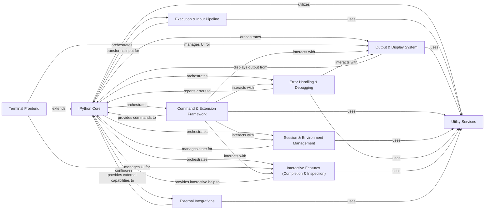

## Component Details

The IPython architecture is centered around the `IPython Core`, which acts as the primary orchestrator for all interactive functionalities. User input flows through the `Execution & Input Pipeline`, where it is transformed, parsed for magic commands, and executed. The results are then handled by the `Output & Display System` for presentation. Session-specific data, history, and profiles are managed by the `Session & Environment Management` component. `Error Handling & Debugging` ensures robust error reporting and debugging capabilities. `Interactive Features (Completion & Inspection)` enhance the user experience with intelligent suggestions and object introspection. For terminal-specific interactions, the `Terminal Frontend` provides the user interface. Various `External Integrations` allow IPython to connect with GUI toolkits, plotting libraries, and other development tools. Finally, `Utility Services` provide a collection of general-purpose helper functions used across the entire system.

### IPython Core
The foundational and central component of IPython, responsible for initializing the interactive environment, managing the overall application lifecycle, and orchestrating the interactions between all other major systems. It handles the core execution loop, user namespaces, and built-in function management.

**Related Classes/Methods**:

- <a href="https://github.com/ipython/ipython/blob/master/IPython/core/interactiveshell.py#L594-L667" target="_blank" rel="noopener noreferrer">`ipython.IPython.core.interactiveshell.InteractiveShell:__init__` (594:667)</a>
- <a href="https://github.com/ipython/ipython/blob/master/IPython/core/interactiveshell.py#L3061-L3107" target="_blank" rel="noopener noreferrer">`ipython.IPython.core.interactiveshell.InteractiveShell:run_cell` (3061:3107)</a>
- <a href="https://github.com/ipython/ipython/blob/master/IPython/core/interactiveshell.py#L4069-L4070" target="_blank" rel="noopener noreferrer">`ipython.IPython.core.interactiveshell.InteractiveShell:cleanup` (4069:4070)</a>
- <a href="https://github.com/ipython/ipython/blob/master/IPython/core/application.py#L478-L492" target="_blank" rel="noopener noreferrer">`ipython.IPython.core.application.BaseIPythonApplication:initialize` (478:492)</a>

### Execution & Input Pipeline
Manages the entire process of handling user input, from raw text to executable code. This includes parsing, applying various transformations (e.g., magic command parsing, AST manipulation), compiling, and executing the code. It also incorporates mechanisms for safe evaluation and asynchronous execution.

**Related Classes/Methods**:

- <a href="https://github.com/ipython/ipython/blob/master/IPython/core/inputtransformer2.py#L635-L644" target="_blank" rel="noopener noreferrer">`ipython.IPython.core.inputtransformer2.TransformerManager:transform_cell` (635:644)</a>
- <a href="https://github.com/ipython/ipython/blob/master/IPython/core/interactiveshell.py#L3479-L3511" target="_blank" rel="noopener noreferrer">`ipython.IPython.core.interactiveshell.InteractiveShell:transform_ast` (3479:3511)</a>
- <a href="https://github.com/ipython/ipython/blob/master/IPython/core/interactiveshell.py#L3513-L3634" target="_blank" rel="noopener noreferrer">`ipython.IPython.core.interactiveshell.InteractiveShell:run_ast_nodes` (3513:3634)</a>
- <a href="https://github.com/ipython/ipython/blob/master/IPython/core/interactiveshell.py#L3636-L3697" target="_blank" rel="noopener noreferrer">`ipython.IPython.core.interactiveshell.InteractiveShell:run_code` (3636:3697)</a>
- <a href="https://github.com/ipython/ipython/blob/master/IPython/core/guarded_eval.py#L355-L388" target="_blank" rel="noopener noreferrer">`ipython.IPython.core.guarded_eval:guarded_eval` (355:388)</a>
- <a href="https://github.com/ipython/ipython/blob/master/IPython/core/builtin_trap.py#L46-L51" target="_blank" rel="noopener noreferrer">`ipython.IPython.core.builtin_trap.BuiltinTrap:__enter__` (46:51)</a>
- <a href="https://github.com/ipython/ipython/blob/master/IPython/core/async_helpers.py#L138-L155" target="_blank" rel="noopener noreferrer">`ipython.IPython.core.async_helpers._should_be_async` (138:155)</a>

### Output & Display System
Responsible for how all forms of output and information are presented to the user. This includes rich media formatting (HTML, SVG, images), integrating with display hooks to intercept and process results, and providing advanced pretty-printing capabilities for Python objects.

**Related Classes/Methods**:

- <a href="https://github.com/ipython/ipython/blob/master/IPython/core/display_functions.py#L85-L287" target="_blank" rel="noopener noreferrer">`ipython.IPython.core.display_functions:display` (85:287)</a>
- <a href="https://github.com/ipython/ipython/blob/master/IPython/core/display.py#L450-L451" target="_blank" rel="noopener noreferrer">`ipython.IPython.core.display.HTML:_repr_html_` (450:451)</a>
- <a href="https://github.com/ipython/ipython/blob/master/IPython/core/displayhook.py#L269-L285" target="_blank" rel="noopener noreferrer">`ipython.IPython.core.displayhook.DisplayHook:__call__` (269:285)</a>
- <a href="https://github.com/ipython/ipython/blob/master/IPython/lib/pretty.py#L145-L153" target="_blank" rel="noopener noreferrer">`ipython.IPython.lib.pretty:pretty` (145:153)</a>
- <a href="https://github.com/ipython/ipython/blob/master/IPython/core/formatters.py#L115-L116" target="_blank" rel="noopener noreferrer">`ipython.IPython.core.formatters.DisplayFormatter:_default_formatter` (115:116)</a>

### Command & Extension Framework
Provides the extensible architecture for IPython's functionality beyond standard Python. This includes defining, registering, parsing, and executing special 'magic' commands, managing user-defined command aliases, and handling the dynamic loading, unloading, and reloading of IPython extensions.

**Related Classes/Methods**:

- <a href="https://github.com/ipython/ipython/blob/master/IPython/core/magic.py#L464-L494" target="_blank" rel="noopener noreferrer">`ipython.IPython.core.magic.MagicsManager:register_function` (464:494)</a>
- <a href="https://github.com/ipython/ipython/blob/master/IPython/core/interactiveshell.py#L2444-L2497" target="_blank" rel="noopener noreferrer">`ipython.IPython.core.interactiveshell.InteractiveShell:run_line_magic` (2444:2497)</a>
- <a href="https://github.com/ipython/ipython/blob/master/IPython/core/interactiveshell.py#L2509-L2558" target="_blank" rel="noopener noreferrer">`ipython.IPython.core.interactiveshell.InteractiveShell:run_cell_magic` (2509:2558)</a>
- <a href="https://github.com/ipython/ipython/blob/master/IPython/core/alias.py#L233-L241" target="_blank" rel="noopener noreferrer">`ipython.IPython.core.alias.AliasManager:define_alias` (233:241)</a>
- <a href="https://github.com/ipython/ipython/blob/master/IPython/core/extensions.py#L54-L67" target="_blank" rel="noopener noreferrer">`ipython.IPython.core.extensions.ExtensionManager:load_extension` (54:67)</a>
- <a href="https://github.com/ipython/ipython/blob/master/IPython/core/magic_arguments.py#L171-L190" target="_blank" rel="noopener noreferrer">`ipython.IPython.core.magic_arguments:construct_parser` (171:190)</a>
- <a href="https://github.com/ipython/ipython/blob/master/IPython/extensions/autoreload.py#L585-L688" target="_blank" rel="noopener noreferrer">`ipython.IPython.extensions.autoreload.AutoreloadMagics:autoreload` (585:688)</a>
- <a href="https://github.com/ipython/ipython/blob/master/IPython/extensions/storemagic.py#L80-L230" target="_blank" rel="noopener noreferrer">`ipython.IPython.extensions.storemagic.StoreMagics:store` (80:230)</a>

### Session & Environment Management
Manages the persistent state and configuration of an IPython session. This encompasses storing and retrieving command history, managing user profiles and their associated configuration directories, handling temporary files, and providing mechanisms for background job execution.

**Related Classes/Methods**:

- <a href="https://github.com/ipython/ipython/blob/master/IPython/core/history.py#L670-L705" target="_blank" rel="noopener noreferrer">`ipython.IPython.core.history.HistoryManager:__init__` (670:705)</a>
- <a href="https://github.com/ipython/ipython/blob/master/IPython/core/history.py#L940-L986" target="_blank" rel="noopener noreferrer">`ipython.IPython.core.history.HistoryManager:store_inputs` (940:986)</a>
- <a href="https://github.com/ipython/ipython/blob/master/IPython/core/profiledir.py#L174-L183" target="_blank" rel="noopener noreferrer">`ipython.IPython.core.profiledir.ProfileDir:create_profile_dir` (174:183)</a>
- <a href="https://github.com/ipython/ipython/blob/master/IPython/paths.py#L19-L72" target="_blank" rel="noopener noreferrer">`ipython.IPython.paths:get_ipython_dir` (19:72)</a>
- <a href="https://github.com/ipython/ipython/blob/master/IPython/utils/path.py#L93-L149" target="_blank" rel="noopener noreferrer">`ipython.IPython.utils.path:filefind` (93:149)</a>
- <a href="https://github.com/ipython/ipython/blob/master/IPython/lib/backgroundjobs.py#L203-L209" target="_blank" rel="noopener noreferrer">`ipython.IPython.lib.backgroundjobs.BackgroundJobManager:__call__` (203:209)</a>
- <a href="https://github.com/ipython/ipython/blob/master/IPython/core/shellapp.py#L342-L360" target="_blank" rel="noopener noreferrer">`ipython.IPython.core.shellapp.InteractiveShellApp:init_code` (342:360)</a>

### Error Handling & Debugging
Offers comprehensive capabilities for managing and presenting exceptions and facilitating debugging. It includes various traceback formatting styles for clear error reporting, integration with the Pdb debugger for interactive problem-solving, and a crash reporting mechanism.

**Related Classes/Methods**:

- <a href="https://github.com/ipython/ipython/blob/master/IPython/core/interactiveshell.py#L2125-L2199" target="_blank" rel="noopener noreferrer">`ipython.IPython.core.interactiveshell.InteractiveShell:showtraceback` (2125:2199)</a>
- <a href="https://github.com/ipython/ipython/blob/master/IPython/core/ultratb.py#L1136-L1164" target="_blank" rel="noopener noreferrer">`ipython.IPython.core.ultratb.AutoFormattedTB:__call__` (1136:1164)</a>
- <a href="https://github.com/ipython/ipython/blob/master/IPython/terminal/debugger.py#L28-L32" target="_blank" rel="noopener noreferrer">`ipython.IPython.terminal.debugger.TerminalPdb:__init__` (28:32)</a>
- <a href="https://github.com/ipython/ipython/blob/master/IPython/core/crashhandler.py#L208-L227" target="_blank" rel="noopener noreferrer">`ipython.IPython.core.crashhandler.CrashHandler:make_report` (208:227)</a>

### Interactive Features (Completion & Inspection)
Enhances the interactive user experience by providing intelligent code completion suggestions as the user types and detailed introspection capabilities for Python objects, functions, and modules, allowing users to query information about their code.

**Related Classes/Methods**:

- <a href="https://github.com/ipython/ipython/blob/master/IPython/core/completer.py#L3300-L3356" target="_blank" rel="noopener noreferrer">`ipython.IPython.core.completer.IPCompleter:complete` (3300:3356)</a>
- <a href="https://github.com/ipython/ipython/blob/master/IPython/core/oinspect.py#L855-L1090" target="_blank" rel="noopener noreferrer">`ipython.IPython.core.oinspect.Inspector:info` (855:1090)</a>
- <a href="https://github.com/ipython/ipython/blob/master/IPython/core/interactiveshell.py#L1867-L1876" target="_blank" rel="noopener noreferrer">`ipython.IPython.core.interactiveshell.InteractiveShell:object_inspect` (1867:1876)</a>

### Terminal Frontend
Specifically manages the user interface and interaction aspects for the IPython terminal application. This includes generating and managing interactive prompts, processing raw user input from the terminal, and handling keyboard shortcuts and auto-suggestions for an optimized terminal experience.

**Related Classes/Methods**:

- <a href="https://github.com/ipython/ipython/blob/master/IPython/terminal/ipapp.py#L275-L292" target="_blank" rel="noopener noreferrer">`ipython.IPython.terminal.ipapp.TerminalIPythonApp:initialize` (275:292)</a>
- <a href="https://github.com/ipython/ipython/blob/master/IPython/terminal/interactiveshell.py#L991-L1005" target="_blank" rel="noopener noreferrer">`ipython.IPython.terminal.interactiveshell.TerminalInteractiveShell:interact` (991:1005)</a>
- <a href="https://github.com/ipython/ipython/blob/master/IPython/terminal/prompts.py#L33-L45" target="_blank" rel="noopener noreferrer">`ipython.IPython.terminal.prompts.Prompts:in_prompt_tokens` (33:45)</a>
- `ipython.IPython.terminal.shortcuts:create_ipython_shortcuts` (full file reference)

### External Integrations
Provides the necessary support for IPython to seamlessly integrate with various external libraries, GUI toolkits, and development tools. This includes enabling GUI event loops, configuring plotting libraries like Matplotlib (Pylab), allowing interaction with external text editors, and providing Sphinx extensions for documentation.

**Related Classes/Methods**:

- <a href="https://github.com/ipython/ipython/blob/master/IPython/lib/guisupport.py#L138-L147" target="_blank" rel="noopener noreferrer">`ipython.IPython.lib.guisupport:start_event_loop_qt4` (138:147)</a>
- <a href="https://github.com/ipython/ipython/blob/master/IPython/core/pylabtools.py#L394-L415" target="_blank" rel="noopener noreferrer">`ipython.IPython.core.pylabtools:activate_matplotlib` (394:415)</a>
- <a href="https://github.com/ipython/ipython/blob/master/IPython/lib/editorhooks.py#L18-L61" target="_blank" rel="noopener noreferrer">`ipython.IPython.lib.editorhooks:install_editor` (18:61)</a>
- <a href="https://github.com/ipython/ipython/blob/master/IPython/sphinxext/ipython_directive.py#L1003-L1070" target="_blank" rel="noopener noreferrer">`ipython.IPython.sphinxext.ipython_directive.IPythonDirective:run` (1003:1070)</a>
- <a href="https://github.com/ipython/ipython/blob/master/IPython/lib/latextools.py#L60-L108" target="_blank" rel="noopener noreferrer">`ipython.IPython.lib.latextools:latex_to_png` (60:108)</a>
- <a href="https://github.com/ipython/ipython/blob/master/IPython/lib/demo.py#L206-L287" target="_blank" rel="noopener noreferrer">`ipython.IPython.lib.demo.Demo:__init__` (206:287)</a>

### Utility Services
A collection of foundational, general-purpose helper functions and classes that are utilized across various components of IPython. This includes utilities for text processing, interacting with the operating system and processes, managing data structures and I/O operations, deep reloading of modules, and clipboard integration.

**Related Classes/Methods**:

- <a href="https://github.com/ipython/ipython/blob/master/IPython/utils/text.py#L154-L192" target="_blank" rel="noopener noreferrer">`ipython.IPython.utils.text.SList:grep` (154:192)</a>
- `ipython.IPython.utils.process:getoutput` (full file reference)
- <a href="https://github.com/ipython/ipython/blob/master/IPython/utils/ipstruct.py#L226-L236" target="_blank" rel="noopener noreferrer">`ipython.IPython.utils.ipstruct.Struct:copy` (226:236)</a>
- <a href="https://github.com/ipython/ipython/blob/master/IPython/utils/sysinfo.py#L97-L100" target="_blank" rel="noopener noreferrer">`ipython.IPython.utils.sysinfo:get_sys_info` (97:100)</a>
- <a href="https://github.com/ipython/ipython/blob/master/IPython/lib/deepreload.py#L285-L310" target="_blank" rel="noopener noreferrer">`ipython.IPython.lib.deepreload:reload` (285:310)</a>
- <a href="https://github.com/ipython/ipython/blob/master/IPython/lib/clipboard.py#L39-L48" target="_blank" rel="noopener noreferrer">`ipython.IPython.lib.clipboard:osx_clipboard_get` (39:48)</a>

### [FAQ](https://github.com/CodeBoarding/GeneratedOnBoardings/tree/main?tab=readme-ov-file#faq)