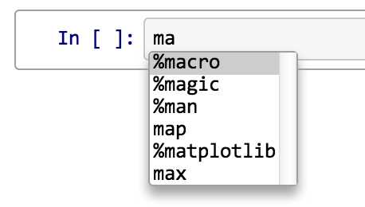
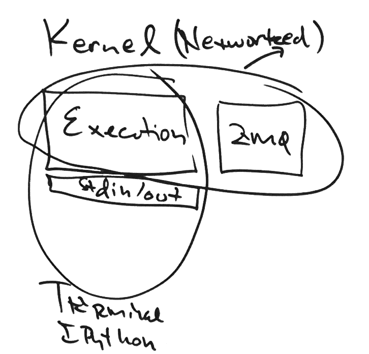

.. _how_ipython_works:

=================
How IPython works
=================

The goal of this document is to give you intuition behind what IPython is, so that you can dive deeply into the internals through the other developer documents.

At it's core, IPython is a thing that executes code. It is a beefy Read-Eval-Print-Loop (REPL). When you type something into the IPython terminal or notebook, that thing that you typed is a "message" that is *read*, *evaluated* by the kernel, then *printed* somehow.

While a REPL is usually associated with typing in a command and then pressing enter, the read-eval-print-loop is [called] whenever the user makes any input that requires IPython to return something, such as when the user presses `<TAB>` to see the auto-complete options for a function. We'll use the example of pressing TAB after typing `ma` in the IPython console. From using IPython, we know that the result in the terminal is,

.. code

	In [1]: ma<TAB>
	%macro       %magic       %man         %matplotlib  map          max 

And in the browser,

How does this work? What does IPython do to make sure the user gets all available options? Let's find out!

(For simplicity, we'll assume that this is the first command entered into the IPython prompt and there are no external modules loaded.)

Read
====

Reading is accomplished via messages sent from either the terminal, Qt console, or notebook. This message passing is accomplished by either just ZeroMQ, or ZMQ and HTTP. By pressing `<TAB>`, we'll send our current namespace, which is the Python built-in functions and IPython magics loaded at startup, and the contents of our cell so far, `ma`. But *how* this is sent depends on what IPython client the user is using.

First, a note about Terminal IPython versus Kernel IPython.

Terminal IPython vs Kernel IPython
----------------------------------
Terminal IPython is an "Execution" (e.g. a Python interpreter) tied to standard in/standard out, then this is a souped-up terminal with all the niceties of the interactive side of IPython, such as tab-completion and introspection.

[Question: looking back at the figure Fernando drew, it's unclear how the raw IPython terminal sends messages. Are they just all in pure Python?]

In the IPython terminal, the cell contents and namespace (the "message") are sent to the execution engine, in this case the Python interpreter, directly. And

[What is "T" in the figure, of arrows pointing out of the Kernel? "T" is connected via ZMQ but "Qt" is not. Why?]

[In this other case that is unclear to me....] the "message" is sent from the [???] to the execution engine via `pyzmq`. However, web browsers don't understand ZMQ. Web browsers understand HTTP. And that's what we'll use for the IPython notebook.

IPython Notebook
----------------

In the IPython notebook, first the message is sent from the browser via HTTP (accomplished with the Python package `websockets`) to the local server. This server is run by the `Tornado` package. Then, `pyzmq` is capable of interpreting HTTP messages and transforming them into ZeroMQ, which is then sent to the Python Kernel.

Kernel
------

The "Kernel" is simply the link between "Execution" (which could be any [interpreter], such as Python) and "ZMQ."

Eval(uate)
==========

Evaluation is [accomplished in tandem by the Interactive side of the IPython console] and the programming language of choice (e.g., Python).

To return the 

Print
=====

After evaluating your message, now IPython needs to return the result to you somehow. Depending on what your message was, you will get a different output. 

Loop
====
Do it all over again!

Parallel
========

nbconvert
=========

Converting IPython notebooks to other formats is accomplished via the ``nbconvert`` program. 

Github Repositories
===================

Official
--------

- ipython_github_
- nbviewer_

Unofficial
----------
- nbdiff_: Tool for comparing and merging IPython notebooks
- vim_ipython_: Send command to IPython directly from vim
- singlecell_: Simple webapps backed by an IPython Kernel
- 

.. include:: ../links.txt
.. _nbviewer: http://github.com/ipython/nbviewer
.. _nbdiff: http://github.com/tarmstrong/nbdiff
.. _vim_ipython: http://github.com/ivanov/vim-ipython
.. _singlecell: http://github.com/minrk/singlecell
.. _Tornado: http://www.tornadoweb.org/en/stable/
.. _websockets: http://pypi.python.org/pypi/websockets