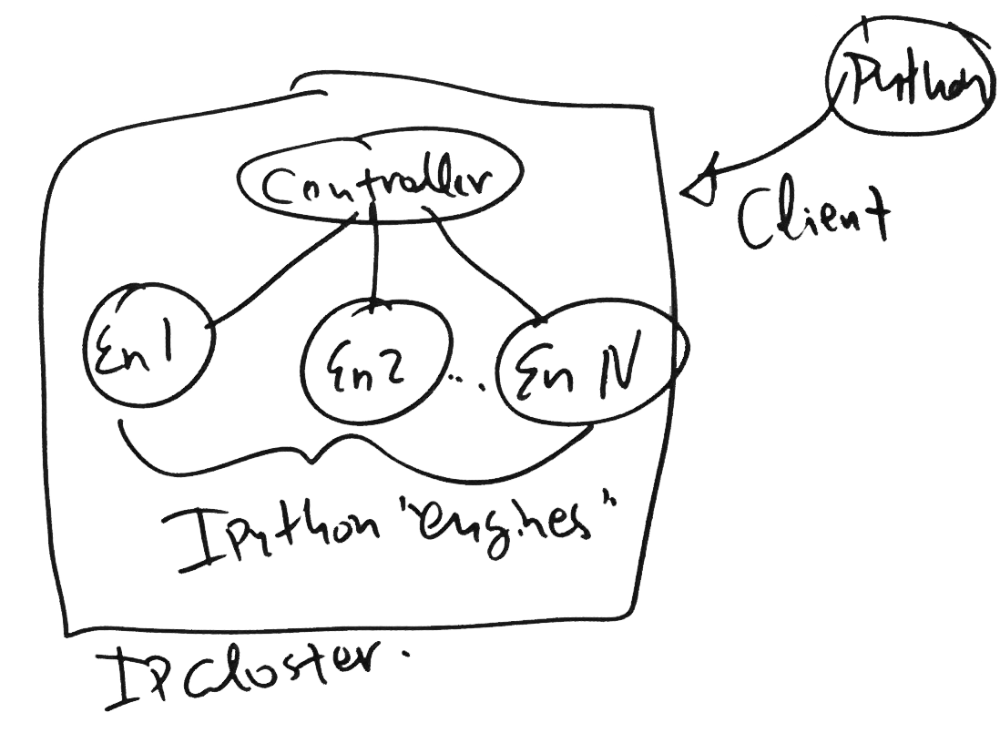
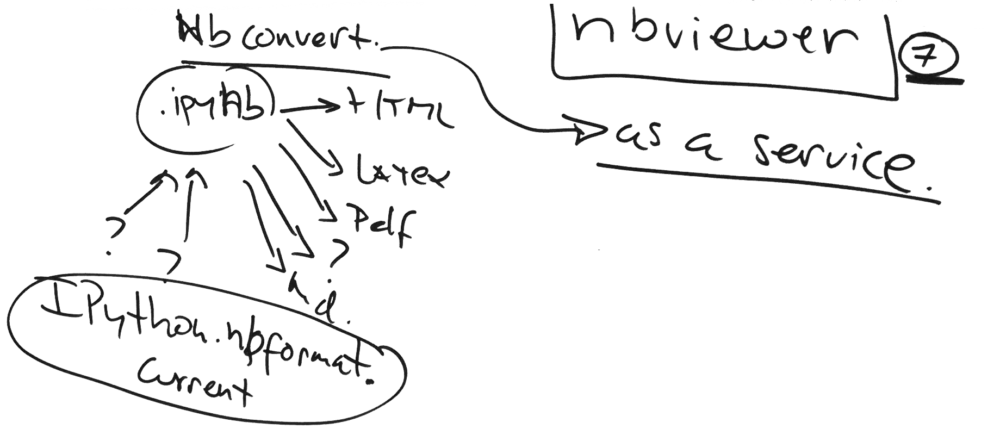

.. _how_ipython_works:

========================
What is Project Jupyter?
========================

The goal of this document is to give you intuition behind what Jupyter
is and a feel for its history so that you can dive deeply into the
internals through the other developer documents.

From Humble Beginnings to World Domination
==========================================

Origins: the IPython REPL
-------------------------

In the beginning was the IPython REPL: an interactive application for
executing Python code. Like most revolutions, IPython world domination
had humble beginnings: it begin as a simple quest for a better
interactive Python interpreter, one that would take advantage of
Python's dynamic features and excellent documentation mechanisms. The
goal of the folks who created IPython was to create an extended
interpreter for interactive computing that would support live
exploration through object introspection, live help, shell-like system
command execution, and persistent history.

At it's core, IPython is a thing that executes code, a beefy
**Read-Eval-Print-Loop** (**REPL**). When you type something into the
IPython terminal, that thing that you typed is a "message" that is
*read*, *evaluated* by the kernel, then *printed* somehow.

::

    +-----------------------------+
    | IPython app                 |
    |                             |
    | console <-----> interpreter |
    |           msg               |
    +-----------------------------+

While a REPL is usually associated with typing in a command and then
pressing enter, the read-eval-print-loop is [called] whenever the user
makes any input that requires IPython to return something, such as when
the user presses `<TAB>` to see the auto-complete options for a
function. We'll use the example of pressing TAB after typing `ma` in the
IPython console. From using IPython, we know that the result in the
terminal is,

.. code-block:: python

    In [1]: ma<TAB>
    %macro       %magic       %man         %matplotlib  map          max

How does a REPL work? Python's dynamic nature and native introspection
capabilities provide an incredible support infrastructure for building
interactive computing tools like IPython provides. Here is an example of
a naïve Python expression REPL:

.. FIXME: link this

.. code-block:: python

    # Naïve Python expression REPL: repeat forever…
    while True:
        # read a message from the user
        message = input('>>> ')

        # evaluate the expression in the interpreter
        result = eval(message)

        # print out the result
        print(repr(result))

While this implementation is laughably naïve (and incredibly insecure,
incidentally), it nevertheless demonstrates the main features of a Python REPL:
a message is read from the user via the console, that message is evaluated by
the Python interpreter, and the result is printed back to the user.

IPython's classic interpreter is, roughly speaking, a set of sophisticated
extensions to these three basic concepts:

* *read*: as noted above, IPython's input handling is finer grained then
  merely calling `input()` allows, offering the ability to read and process
  messages per keystroke (rather than per line). It can also dynamically
  evaluate input from other sources, e.g. file evaluation using the `%run`
  line magic.

* *eval*: while our simple REPL merely called `eval()` on whatever
  message it received, IPython offers extended processing capabilities,
  including the ability to handle statements (not merely expressions), line
  navigation and history, the magic system, and direct execution of system
  commands.

* *print*: IPython's print facilities offer pretty printing of
  compatible data structures; many commands provide color output if
  supported by the environment.

The Road to Jupyter: Abstraction
--------------------------------

The next stage in the evolution of Jupyter originated with two distinct
needs: parallelization and alternate interfaces. Since IPython began in
the scientific community—where parallelization is a key ingredient to
high-performance data processing and analysis—there was naturally an
interest in bringing the advantages of interactive computing to the
traditionally batch-oriented world of high-performance computing.
Simultaneously, users began exploring the possibility of developing
alternative interfaces to the console-oriented IPython shell.

While it took time for these ideas to coalesce, eventually a clean
abstraction was developed that could satisfy both of these broad use
classes: IPython was split conceptually into distinct components
separated by a message bus:

::

    +---------+         +--------+
    | IPython |         | Kernel |
    | app     | <-----> |        |
    |         |   msg   |        |
    +---------+         +--------+

* an execution *kernel* provides the core IPython functionality, including
  command execution and processing

* the user interacts with an IPython *application* such as the terminal or Qt
  consoles

* coordination between these two systems relies on IPython's *messaging
  protocol*, the specification of the command format and transport

Notice the similarity to the prior REPL implementation: while this
refined architecture breaks the tight coupling between the I/O
components and the evaluation components, the core idea is the same:
read input from the user, evaluate commands, and display results. These
two approaches are preserved in modern IPython: the command `ipython`
brings up the traditional REPL while `ipython console` offers
essentially the same interface but connected via the message bus.

Notebook and the Jupyter Ecosystem
----------------------------------

Finding the right abstraction enabled the IPython ecosystem to flourish,
expanding in a multitude of directions as users brought new ideas and fresh
challenges. A major theme during this time was the addition of new interfaces:
with the console interface decoupled from the execution kernel, it suddenly
became easier to think about expanding the interface beyond a text terminal
window. The Qt console, for example, offers a graphical interactive computing
environment that can support the creation of charts and other graphics.

The most significant advance, however, was again motivated by a deeply practical
need born out of IPython's scientific roots: the need to record and share the
results of an interactive computation. Thus the IPython Notebook was born!

::

    +---------+         +--------+
    | IPython |         | Kernel |
    | app     | <-----> |        |
    |         |   msg   |        |
    +---------+         +--------+
         ^
         |
         | Recording
         | Format
         |
         v
    +---------+
    | File    |
    |         |
    |         |
    +---------+

The IPython Notebook is an interactive computing web application that allows
live exploratory coding to be interwoven with dynamic content created with
Markdown and LaTeX mathematics. The Notebook leverages IPython's message
protocol as a storage format. Not only can one easily create computation- and
content-rich documents from the comfort of the nearest web browser, the results
can be saved, version controlled, shared, and repeated with unprecedented ease.

As the Notebook solidified and gained traction within the community, inevitably
it began to spread outside the bounds of Python. The Notebook application and
the communication and file format are Python-agnostic, paving the way for the
creation of new execution kernels supporting languages like R, Julia, Ruby, and
Haskell. Project Jupyter exists to recognize and foster this diversity: by
separating Python-specific concepts and code from the language-agnostic
portions—again enabled by the clean abstraction of the messaging protocol and
file format—the Jupyter mission is to provide interactive computing tools for
whatever communities might wish for them, thereby beginning a new era of
literate computing, data-driven journalism, and reproducible research.

The Future is Now: Literate Computing
-------------------------------------

    (discuss growing trends in reproducible research, data-driven journalism,
    etc.)

You Are Here: Finding Your Way around Jupyter
=============================================

    (collected descriptions, references, and pointers to the various
    projects in the Jupyter ecosystem: language kernels, notebook,
    tools (nbconvert/nbviewer/nbdiff), IPython parallel, …)

Parallel
--------

nbconvert
---------

Converting IPython notebooks to other formats is accomplished via the ``nbconvert`` program.

The program `nbviewer` is `nbconvert`, as a service via the web.

Github Repositories
-------------------

- ipython_github_
- nbviewer_

- nbdiff_: Tool for comparing and merging IPython notebooks
- vim_ipython_: Send command to IPython directly from vim
- singlecell_: Simple webapps backed by an IPython Kernel
-

.. include:: ../links.txt
.. _nbviewer: http://github.com/ipython/nbviewer
.. _nbdiff: http://github.com/tarmstrong/nbdiff
.. _vim_ipython: http://github.com/ivanov/vim-ipython
.. _singlecell: http://github.com/minrk/singlecell
.. _Tornado: http://www.tornadoweb.org/en/stable/
.. _websockets: http://pypi.python.org/pypi/websockets