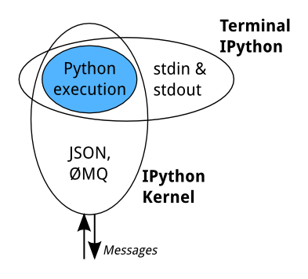
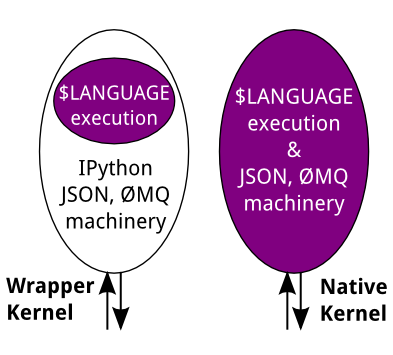
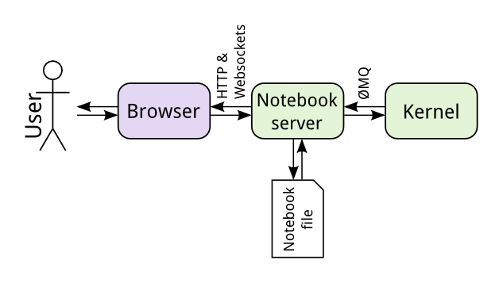
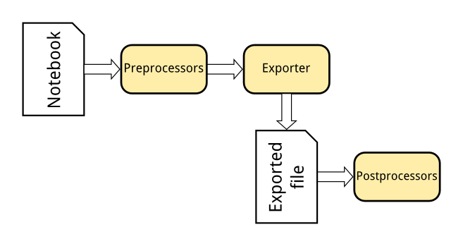

How IPython works
=================

Terminal IPython
----------------

When you type ``ipython``, you get the original IPython interface, running in
the terminal. It does something like this::

    while True:
        code = input(">>> ")
        exec(code)

Of course, it's much more complex, because it has to deal with multi-line
code, tab completion using :mod:`readline`, magic commands, and so on. But the
model is like that: prompt the user for some code, and when they've entered it,
exec it in the same process. This model is often called a REPL, or
Read-Eval-Print-Loop.

The IPython Kernel
------------------

All the other interfaces—the Notebook, the Qt console, ``ipython console`` in
the terminal, and third party interfaces—use the IPython Kernel. This is a
separate process which is responsible for running user code, and things like
computing possible completions. Frontends communicate with it using JSON
messages sent over `ZeroMQ <http://zeromq.org/>`_ sockets; the protocol they use is described in
:doc:`messaging`.

The core execution machinery for the kernel is shared with terminal IPython:



A kernel process can be connected to more than one frontend simultaneously. In
this case, the different frontends will have access to the same variables.

.. TODO: Diagram illustrating this?

This design was intended to allow easy development of different frontends based
on the same kernel, but it also made it possible to support new languages in the
same frontends, by developing kernels in those languages, and we are refining
IPython to make that more practical.

Today, there are two ways to develop a kernel for another language. Wrapper
kernels reuse the communications machinery from IPython, and implement only the
core execution part. Native kernels implement execution and communications in
the target language:



Wrapper kernels are easier to write quickly for languages that have good Python
wrappers, like `octave_kernel <https://pypi.python.org/pypi/octave_kernel>`_, or
languages where it's impractical to implement the communications machinery, like
`bash_kernel <https://pypi.python.org/pypi/bash_kernel>`_. Native kernels are
likely to be better maintained by the community using them, like
`IJulia <https://github.com/JuliaLang/IJulia.jl>`_ or `IHaskell <https://github.com/gibiansky/IHaskell>`_.

.. seealso::

   :doc:`kernels`
   
   :doc:`wrapperkernels`

Notebooks
---------

The Notebook frontend does something extra. In addition to running your code, it
stores code and output, together with markdown notes, in an editable document
called a notebook. When you save it, this is sent from your browser to the
notebook server, which saves it on disk as a JSON file with a ``.ipynb``
extension.



The notebook server, not the kernel, is responsible for saving and loading
notebooks, so you can edit notebooks even if you don't have the kernel for that
language—you just won't be able to run code. The kernel doesn't know anything
about the notebook document: it just gets sent cells of code to execute when the
user runs them.

Exporting to other formats
``````````````````````````

The Nbconvert tool in IPython converts notebook files to other formats, such as
HTML, LaTeX, or reStructuredText. This conversion goes through a series of steps:



1. Preprocessors modify the notebook in memory. E.g. ExecutePreprocessor runs
   the code in the notebook and updates the output.
2. An exporter converts the notebook to another file format. Most of the
   exporters use templates for this.
3. Postprocessors work on the file produced by exporting.

The `nbviewer <http://nbviewer.ipython.org/>`_ website uses nbconvert with the
HTML exporter. When you give it a URL, it fetches the notebook from that URL,
converts it to HTML, and serves that HTML to you.

IPython.parallel
----------------

IPython also includes a parallel computing framework, ``IPython.parallel``. This
allows you to control many individual engines, which are an extended version of
the IPython kernel described above. For more details, see :doc:`/parallel/index`.
