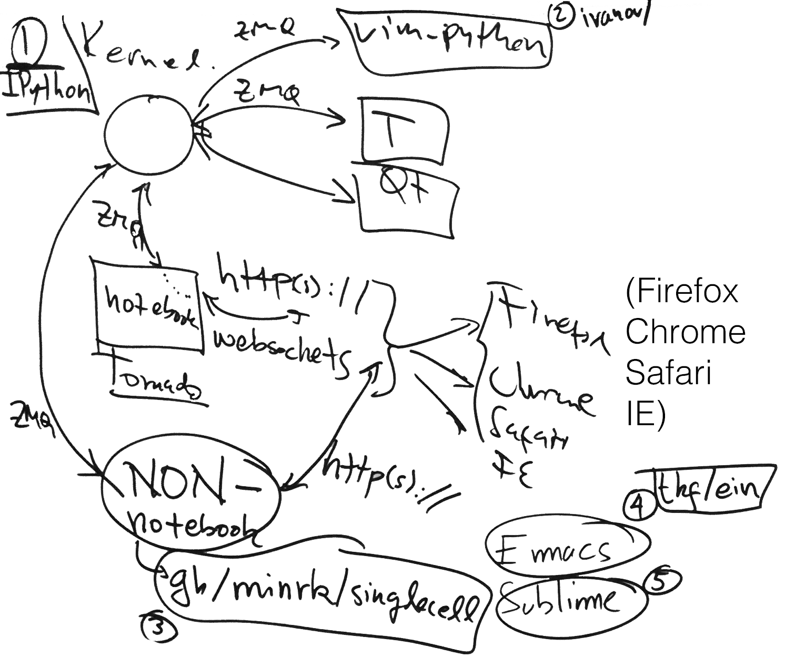

.. _how_ipython_works:

========================
What is Project Jupyter?
========================

The goal of this document is to give you intuition behind what Jupyter
is and a feel for its history so that you can dive deeply into the
internals through the other developer documents.

Origins: the IPython REPL
-------------------------

In the beginning was the IPython REPL: an interactive application for
executing Python code. Like most revolutions, IPython world domination
had humble beginnings: it begin as a simple quest for a better
interactive Python interpreter, one that would take advantage of
Python's dynamic features and excellent documentation mechanisms. The
goal of the folks who created IPython was to create an extended
interpreter for interactive computing that would support live
exploration through object introspection, live help, shell-like system
command execution, and persistent history.

At it's core, IPython is a thing that executes code, a beefy
**Read-Eval-Print-Loop** (**REPL**). When you type something into the
IPython terminal, that thing that you typed is a "message" that is
*read*, *evaluated* by the kernel, then *printed* somehow.

::

    +-----------------------------+
    | IPython app                 |
    |                             |
    | console <-----> interpreter |
    |           msg               |
    +-----------------------------+

While a REPL is usually associated with typing in a command and then
pressing enter, the read-eval-print-loop is [called] whenever the user
makes any input that requires IPython to return something, such as when
the user presses `<TAB>` to see the auto-complete options for a
function. We'll use the example of pressing TAB after typing `ma` in the
IPython console. From using IPython, we know that the result in the
terminal is,

.. code-block:: python

    In [1]: ma<TAB>
    %macro       %magic       %man         %matplotlib  map          max

How does a REPL work? Python's dynamic nature and native introspection
capabilities provide an incredible support infrastructure for building
interactive computing tools like IPython provides. Here is an example of
a naïve Python expression REPL:

.. FIXME: link this

.. code-block:: python

    # Naïve Python expression REPL: repeat forever…
    while True:
        # read a message from the user
        message = input('>>> ')

        # evaluate the expression in the interpreter
        result = eval(message)

        # print out the result
        print(repr(result))

While this implementation is laughably naïve (and incredibly insecure,
incidentally), it nevertheless demonstrates the main features of a Python REPL:
a message is read from the user via the console, that message is evaluated by
the Python interpreter, and the result is printed back to the user.

IPython's classic interpreter is, roughly speaking, a set of sophisticated
extensions to these three basic concepts:

* *read*: as noted above, IPython's input handling is finer grained then
  merely calling `input()` allows, offering the ability to read and process
  messages per keystroke (rather than per line). It can also dynamically
  evaluate input from other sources, e.g. file evaluation using the `%run`
  line magic.

* *eval*: while our simple REPL merely called `eval()` on whatever
  message it received, IPython offers extended processing capabilities,
  including the ability to handle statements (not merely expressions), line
  navigation and history, the magic system, and direct execution of system
  commands.

* *print*: IPython's print facilities offer pretty printing of
  compatible data structures; many commands provide color output if
  supported by the environment.

The Road to Jupyter: Abstraction
--------------------------------

The next stage in the evolution of Jupyter originated with two distinct
needs: parallelization and alternate interfaces. Since IPython began in
the scientific community—where parallelization is a key ingredient to
high-performance data processing and analysis—there was naturally an
interest in bringing the advantages of interactive computing to the
traditionally batch-oriented world of high-performance computing.
Simultaneously, users began exploring the possibility of developing
alternative interfaces to the console-oriented IPython shell.

While it took time for these ideas to coalesce, eventually a clean
abstraction was developed that could satisfy both of these broad use
classes: IPython was split conceptually into distinct components
separated by a message bus:

::

    +---------+         +--------+
    | IPython |         | Kernel |
    | app     | <-----> |        |
    |         |   msg   |        |
    +---------+         +--------+

* an execution *kernel* provides the core IPython functionality, including
  command execution and processing

* the user interacts with an IPython *application* such as the terminal or Qt
  consoles

* coordination between these two systems relies on IPython's *messaging
  protocol*, the specification of the command format and transport

Notice the similarity to the prior REPL implementation: while this
refined architecture breaks the tight coupling between the I/O
components and the evaluation components, the core idea is the same:
read input from the user, evaluate commands, and display results. These
two approaches are preserved in modern IPython: the command `ipython`
brings up the traditional REPL while `ipython console` offers
essentially the same interface but connected via the message bus.

Notebook and the Jupyter Ecosystem
----------------------------------

::

    +---------+         +--------+
    | IPython |         | Kernel |
    | app     | <-----> |        |
    |         |   msg   |        |
    +---------+         +--------+
         ^
         |
         | Recording
         | Format
         |
         v
    +---------+
    | File    |
    |         |
    |         |
    +---------+

The Future is Now: Literate Computing
-------------------------------------

How IPython works
=================

The goal of this document is to give you intuition behind what IPython is, so that you can dive deeply into the internals through the other developer documents. By the end, this diagram should make sense.

At it's core, IPython is a thing that executes code. It is a beefy **Read-Eval-Print-Loop** (**REPL**). When you type something into the IPython terminal or notebook, that thing that you typed is a "message" that is *read*, *evaluated* by the kernel, then *printed* somehow.

While a REPL is usually associated with typing in a command and then pressing enter, the read-eval-print-loop is [called] whenever the user makes any input that requires IPython to return something, such as when the user presses `<TAB>` to see the auto-complete options for a function. We'll use the example of pressing TAB after typing `ma` in the IPython console. From using IPython, we know that the result in the terminal is,

.. code-block:: python

	In [1]: ma<TAB>
	%macro       %magic       %man         %matplotlib  map          max

And in the browser,

.. image:: figs/ma_TAB_ipynb.png

How does this work? What does IPython do to make sure the user gets all available options? Let's find out!

(For simplicity, we'll assume that this is the first command entered into the IPython prompt and there are no external modules loaded.)

Read
====

Reading is accomplished via messages sent from either the terminal, Qt console, or notebook. This message passing is accomplished by either just ZeroMQ, or ZMQ and HTTP. By pressing `<TAB>`, we'll send our current namespace, which is the Python built-in functions and IPython magics loaded at startup, and the contents of our cell so far, `ma`. But *how* this is sent depends on what IPython client the user is using.

First, a note about Terminal IPython versus Kernel IPython.

Terminal IPython vs Kernel IPython
----------------------------------
Terminal IPython is an "Execution" (e.g. a Python interpreter) tied to standard in/standard out, then this is a souped-up terminal with all the niceties of the interactive side of IPython, such as tab-completion and introspection.

[Question: looking back at the figure Fernando drew, it's unclear how the raw IPython terminal sends messages. Are they just all in pure Python?]

.. image:: figs/ipython_networked_kernel_vs_terminal.png

In the IPython terminal, the cell contents and namespace (the "message") are sent to the execution engine, in this case the Python interpreter, directly. And

[What is "T" in the figure, of arrows pointing out of the Kernel? "T" is connected via ZMQ but "Qt" is not. Why?]

[In this other case that is unclear to me....] the "message" is sent from the [???] to the execution engine via `pyzmq`. However, web browsers don't understand ZMQ. Web browsers understand HTTP. And that's what we'll use for the IPython notebook.

IPython Notebook
----------------

In the IPython notebook, first the message is sent from the browser via HTTP (accomplished with the Python package `websockets`) to the local server. This server is run by the `Tornado` package. Then, `pyzmq` is capable of interpreting HTTP messages and transforming them into ZeroMQ, which is then sent to the Python Kernel.

Kernel
------

The "Kernel" is simply the link between "Execution" (which could be any [interpreter], such as Python) and "ZMQ."

Eval(uate)
==========

Evaluation is [accomplished in tandem by the Interactive side of the IPython console] and the programming language of choice (e.g., Python).

To return the

Print
=====

After evaluating your message, now IPython needs to return the result to you somehow. Depending on what your message was, you will get a different output.

Loop
====
Do it all over again!

Parallel
========

.. image:: figs/ipython_parallel_overview.png

nbconvert
=========

Converting IPython notebooks to other formats is accomplished via the ``nbconvert`` program.

The program `nbviewer` is `nbconvert`, as a service via the web.

.. image:: figs/nbconvert_overview.png

Github Repositories
===================

Official
--------

- ipython_github_
- nbviewer_

Unofficial
----------
- nbdiff_: Tool for comparing and merging IPython notebooks
- vim_ipython_: Send command to IPython directly from vim
- singlecell_: Simple webapps backed by an IPython Kernel
-

.. include:: ../links.txt
.. _nbviewer: http://github.com/ipython/nbviewer
.. _nbdiff: http://github.com/tarmstrong/nbdiff
.. _vim_ipython: http://github.com/ivanov/vim-ipython
.. _singlecell: http://github.com/minrk/singlecell
.. _Tornado: http://www.tornadoweb.org/en/stable/
.. _websockets: http://pypi.python.org/pypi/websockets