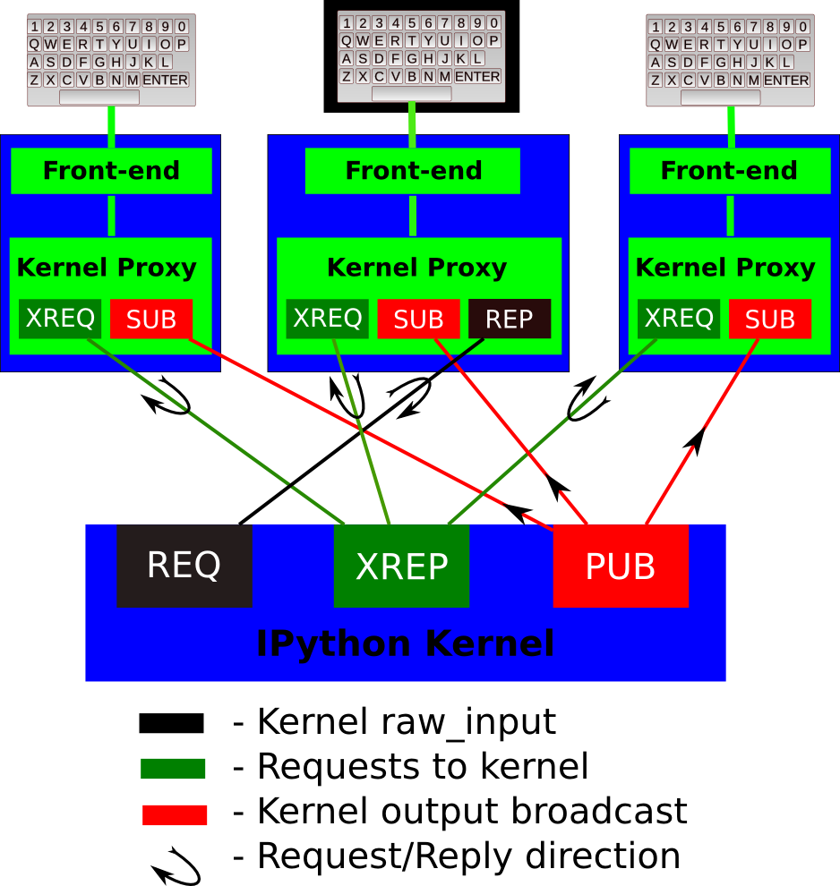

.. _messaging:

======================
 Messaging in IPython
======================

Versioning
==========

The IPython message specification is versioned independently of IPython.
The current version of the specification is 4.1.

Introduction
============

This document explains the basic communications design and messaging
specification for how the various IPython objects interact over a network
transport.  The current implementation uses the ZeroMQ_ library for messaging
within and between hosts.

.. Note::

   This document should be considered the authoritative description of the
   IPython messaging protocol, and all developers are strongly encouraged to
   keep it updated as the implementation evolves, so that we have a single
   common reference for all protocol details.
   
The basic design is explained in the following diagram:

A single kernel can be simultaneously connected to one or more frontends.  The
kernel has three sockets that serve the following functions:

1. stdin: this ROUTER socket is connected to all frontends, and it allows
   the kernel to request input from the active frontend when :func:`raw_input` is called.
   The frontend that executed the code has a DEALER socket that acts as a 'virtual keyboard'
   for the kernel while this communication is happening (illustrated in the
   figure by the black outline around the central keyboard).  In practice,
   frontends may display such kernel requests using a special input widget or
   otherwise indicating that the user is to type input for the kernel instead
   of normal commands in the frontend.

2. Shell: this single ROUTER socket allows multiple incoming connections from
   frontends, and this is the socket where requests for code execution, object
   information, prompts, etc. are made to the kernel by any frontend.  The
   communication on this socket is a sequence of request/reply actions from
   each frontend and the kernel.

3. IOPub: this socket is the 'broadcast channel' where the kernel publishes all
   side effects (stdout, stderr, etc.) as well as the requests coming from any
   client over the shell socket and its own requests on the stdin socket.  There
   are a number of actions in Python which generate side effects: :func:`print`
   writes to ``sys.stdout``, errors generate tracebacks, etc.  Additionally, in
   a multi-client scenario, we want all frontends to be able to know what each
   other has sent to the kernel (this can be useful in collaborative scenarios,
   for example).  This socket allows both side effects and the information
   about communications taking place with one client over the shell channel
   to be made available to all clients in a uniform manner.

   All messages are tagged with enough information (details below) for clients
   to know which messages come from their own interaction with the kernel and
   which ones are from other clients, so they can display each type
   appropriately.

The actual format of the messages allowed on each of these channels is
specified below.  Messages are dicts of dicts with string keys and values that
are reasonably representable in JSON.  Our current implementation uses JSON
explicitly as its message format, but this shouldn't be considered a permanent
feature.  As we've discovered that JSON has non-trivial performance issues due
to excessive copying, we may in the future move to a pure pickle-based raw
message format.  However, it should be possible to easily convert from the raw
objects to JSON, since we may have non-python clients (e.g. a web frontend).
As long as it's easy to make a JSON version of the objects that is a faithful
representation of all the data, we can communicate with such clients.

.. Note::

   Not all of these have yet been fully fleshed out, but the key ones are, see
   kernel and frontend files for actual implementation details.

General Message Format
======================

A message is defined by the following four-dictionary structure::

    {
      # The message header contains a pair of unique identifiers for the
      # originating session and the actual message id, in addition to the
      # username for the process that generated the message.  This is useful in
      # collaborative settings where multiple users may be interacting with the
      # same kernel simultaneously, so that frontends can label the various
      # messages in a meaningful way.
      'header' : {
                    'msg_id' : uuid,
                    'username' : str,
                    'session' : uuid,
                    # All recognized message type strings are listed below.
                    'msg_type' : str,
         },

      # In a chain of messages, the header from the parent is copied so that
      # clients can track where messages come from.
      'parent_header' : dict,
      
      # Any metadata associated with the message.
      'metadata' : dict,
      
      # The actual content of the message must be a dict, whose structure
      # depends on the message type.
      'content' : dict,
    }

The Wire Protocol
=================

This message format exists at a high level,
but does not describe the actual *implementation* at the wire level in zeromq.
The canonical implementation of the message spec is our :class:`~IPython.kernel.zmq.session.Session` class.

.. note::

    This section should only be relevant to non-Python consumers of the protocol.
    Python consumers should simply import and use IPython's own implementation of the wire protocol
    in the :class:`IPython.kernel.zmq.session.Session` object.

Every message is serialized to a sequence of at least six blobs of bytes:

.. sourcecode:: python

    [
      b'u-u-i-d',         # zmq identity(ies)
      b'<IDS|MSG>',       # delimiter
      b'baddad42',        # HMAC signature
      b'{header}',        # serialized header dict
      b'{parent_header}', # serialized parent header dict
      b'{metadata}',      # serialized metadata dict
      b'{content},        # serialized content dict
      b'blob',            # extra raw data buffer(s)
      ...
    ]

The front of the message is the ZeroMQ routing prefix,
which can be zero or more socket identities.
This is every piece of the message prior to the delimiter key ``<IDS|MSG>``.
In the case of IOPub, there should be just one prefix component,
which is the topic for IOPub subscribers, e.g. ``pyout``, ``display_data``.

.. note::

    In most cases, the IOPub topics are irrelevant and completely ignored,
    because frontends just subscribe to all topics.
    The convention used in the IPython kernel is to use the msg_type as the topic,
    and possibly extra information about the message, e.g. ``pyout`` or ``stream.stdout``

After the delimiter is the `HMAC`_ signature of the message, used for authentication.
If authentication is disabled, this should be an empty string.
By default, the hashing function used for computing these signatures is sha256.

.. _HMAC: http://en.wikipedia.org/wiki/HMAC

.. note::

    To disable authentication and signature checking,
    set the `key` field of a connection file to an empty string.

The signature is the HMAC hex digest of the concatenation of:

- A shared key (typically the ``key`` field of a connection file)
- The serialized header dict
- The serialized parent header dict
- The serialized metadata dict
- The serialized content dict

In Python, this is implemented via:

.. sourcecode:: python

    # once:
    digester = HMAC(key, digestmod=hashlib.sha256)
    
    # for each message
    d = digester.copy()
    for serialized_dict in (header, parent, metadata, content):
        d.update(serialized_dict)
    signature = d.hexdigest()

After the signature is the actual message, always in four frames of bytes.
The four dictionaries that compose a message are serialized separately,
in the order of header, parent header, metadata, and content.
These can be serialized by any function that turns a dict into bytes.
The default and most common serialization is JSON, but msgpack and pickle
are common alternatives.

After the serialized dicts are zero to many raw data buffers,
which can be used by message types that support binary data (mainly apply and data_pub).

Python functional API
=====================

As messages are dicts, they map naturally to a ``func(**kw)`` call form.  We
should develop, at a few key points, functional forms of all the requests that
take arguments in this manner and automatically construct the necessary dict
for sending.

In addition, the Python implementation of the message specification extends
messages upon deserialization to the following form for convenience::

    {
      'header' : dict,
      # The msg's unique identifier and type are always stored in the header,
      # but the Python implementation copies them to the top level.
      'msg_id' : uuid,
      'msg_type' : str,
      'parent_header' : dict,
      'content' : dict,
      'metadata' : dict,
    }

All messages sent to or received by any IPython process should have this
extended structure.

Messages on the shell ROUTER/DEALER sockets
===========================================

.. _execute:

Execute
-------

This message type is used by frontends to ask the kernel to execute code on
behalf of the user, in a namespace reserved to the user's variables (and thus
separate from the kernel's own internal code and variables).

Message type: ``execute_request``::

    content = {
        # Source code to be executed by the kernel, one or more lines.
    'code' : str,

    # A boolean flag which, if True, signals the kernel to execute
    # this code as quietly as possible.  This means that the kernel
    # will compile the code with 'exec' instead of 'single' (so
    # sys.displayhook will not fire), forces store_history to be False, 
    # and will *not*:
    #   - broadcast exceptions on the PUB socket
    #   - do any logging
    #
    # The default is False.
    'silent' : bool,

    # A boolean flag which, if True, signals the kernel to populate history
    # The default is True if silent is False.  If silent is True, store_history
    # is forced to be False.
    'store_history' : bool,

    # A list of variable names from the user's namespace to be retrieved.
    # What returns is a rich representation of each variable (dict keyed by name).
    # See the display_data content for the structure of the representation data.
    'user_variables' : list,

    # Similarly, a dict mapping names to expressions to be evaluated in the
    # user's dict.
    'user_expressions' : dict,

    # Some frontends (e.g. the Notebook) do not support stdin requests. If
    # raw_input is called from code executed from such a frontend, a
    # StdinNotImplementedError will be raised.
    'allow_stdin' : True,

    }

The ``code`` field contains a single string (possibly multiline).  The kernel
is responsible for splitting this into one or more independent execution blocks
and deciding whether to compile these in 'single' or 'exec' mode (see below for
detailed execution semantics).

The ``user_`` fields deserve a detailed explanation.  In the past, IPython had
the notion of a prompt string that allowed arbitrary code to be evaluated, and
this was put to good use by many in creating prompts that displayed system
status, path information, and even more esoteric uses like remote instrument
status acquired over the network.  But now that IPython has a clean separation
between the kernel and the clients, the kernel has no prompt knowledge; prompts
are a frontend-side feature, and it should be even possible for different
frontends to display different prompts while interacting with the same kernel.

The kernel now provides the ability to retrieve data from the user's namespace
after the execution of the main ``code``, thanks to two fields in the
``execute_request`` message:

- ``user_variables``: If only variables from the user's namespace are needed, a
  list of variable names can be passed and a dict with these names as keys and
  their :func:`repr()` as values will be returned.

- ``user_expressions``: For more complex expressions that require function
  evaluations, a dict can be provided with string keys and arbitrary python
  expressions as values.  The return message will contain also a dict with the
  same keys and the :func:`repr()` of the evaluated expressions as value.

With this information, frontends can display any status information they wish
in the form that best suits each frontend (a status line, a popup, inline for a
terminal, etc).

.. Note::

   In order to obtain the current execution counter for the purposes of
   displaying input prompts, frontends simply make an execution request with an
   empty code string and ``silent=True``.

Execution semantics
~~~~~~~~~~~~~~~~~~~

When the silent flag is false, the execution of use code consists of the
following phases (in silent mode, only the ``code`` field is executed):

1. Run the ``pre_runcode_hook``.

2. Execute the ``code`` field, see below for details.

3. If #2 succeeds, compute ``user_variables`` and ``user_expressions`` are
   computed.  This ensures that any error in the latter don't harm the main
   code execution.

4. Call any method registered with :meth:`register_post_execute`.

.. warning::

   The API for running code before/after the main code block is likely to
   change soon.  Both the ``pre_runcode_hook`` and the
   :meth:`register_post_execute` are susceptible to modification, as we find a
   consistent model for both.

To understand how the ``code`` field is executed, one must know that Python
code can be compiled in one of three modes (controlled by the ``mode`` argument
to the :func:`compile` builtin):

*single*
  Valid for a single interactive statement (though the source can contain
  multiple lines, such as a for loop).  When compiled in this mode, the
  generated bytecode contains special instructions that trigger the calling of
  :func:`sys.displayhook` for any expression in the block that returns a value.
  This means that a single statement can actually produce multiple calls to
  :func:`sys.displayhook`, if for example it contains a loop where each
  iteration computes an unassigned expression would generate 10 calls::

      for i in range(10):
          i**2

*exec*
  An arbitrary amount of source code, this is how modules are compiled.
  :func:`sys.displayhook` is *never* implicitly called.

*eval*
  A single expression that returns a value.  :func:`sys.displayhook` is *never*
  implicitly called.

The ``code`` field is split into individual blocks each of which is valid for
execution in 'single' mode, and then:

- If there is only a single block: it is executed in 'single' mode.

- If there is more than one block:

  * if the last one is a single line long, run all but the last in 'exec' mode
    and the very last one in 'single' mode.  This makes it easy to type simple
    expressions at the end to see computed values.

  * if the last one is no more than two lines long, run all but the last in
    'exec' mode and the very last one in 'single' mode.  This makes it easy to
    type simple expressions at the end to see computed values.  - otherwise
    (last one is also multiline), run all in 'exec' mode

  * otherwise (last one is also multiline), run all in 'exec' mode as a single
    unit.

Any error in retrieving the ``user_variables`` or evaluating the
``user_expressions`` will result in a simple error message in the return fields
of the form::

   [ERROR] ExceptionType: Exception message

The user can simply send the same variable name or expression for evaluation to
see a regular traceback.

Errors in any registered post_execute functions are also reported similarly,
and the failing function is removed from the post_execution set so that it does
not continue triggering failures.

Upon completion of the execution request, the kernel *always* sends a reply,
with a status code indicating what happened and additional data depending on
the outcome.  See :ref:`below <execution_results>` for the possible return
codes and associated data.

.. _execution_counter:

Execution counter (old prompt number)
~~~~~~~~~~~~~~~~~~~~~~~~~~~~~~~~~~~~~

The kernel has a single, monotonically increasing counter of all execution
requests that are made with ``store_history=True``.  This counter is used to populate
the ``In[n]``, ``Out[n]`` and ``_n`` variables, so clients will likely want to
display it in some form to the user, which will typically (but not necessarily)
be done in the prompts.  The value of this counter will be returned as the
``execution_count`` field of all ``execute_reply`` and ``pyin`` messages.

.. _execution_results:

Execution results
~~~~~~~~~~~~~~~~~
    
Message type: ``execute_reply``::

    content = {
      # One of: 'ok' OR 'error' OR 'abort'
      'status' : str,

      # The global kernel counter that increases by one with each request that 
      # stores history.  This will typically be used by clients to display
      # prompt numbers to the user.  If the request did not store history, this will
      # be the current value of the counter in the kernel.
      'execution_count' : int,
    }

When status is 'ok', the following extra fields are present::

    {
      # 'payload' will be a list of payload dicts.
      # Each execution payload is a dict with string keys that may have been
      # produced by the code being executed.  It is retrieved by the kernel at
      # the end of the execution and sent back to the front end, which can take
      # action on it as needed.
      # The only requirement of each payload dict is that it have a 'source' key,
      # which is a string classifying the payload (e.g. 'pager').
      'payload' : list(dict),

      # Results for the user_variables and user_expressions.
      'user_variables' : dict,
      'user_expressions' : dict,
    }

.. admonition:: Execution payloads
    
   The notion of an 'execution payload' is different from a return value of a
   given set of code, which normally is just displayed on the pyout stream
   through the PUB socket.  The idea of a payload is to allow special types of
   code, typically magics, to populate a data container in the IPython kernel
   that will be shipped back to the caller via this channel.  The kernel
   has an API for this in the PayloadManager::

       ip.payload_manager.write_payload(payload_dict)

   which appends a dictionary to the list of payloads.
   
   The payload API is not yet stabilized,
   and should probably not be supported by non-Python kernels at this time.
   In such cases, the payload list should always be empty.

   
When status is 'error', the following extra fields are present::

    {
      'ename' : str,   # Exception name, as a string
      'evalue' : str,  # Exception value, as a string

      # The traceback will contain a list of frames, represented each as a
      # string.  For now we'll stick to the existing design of ultraTB, which
      # controls exception level of detail statefully.  But eventually we'll
      # want to grow into a model where more information is collected and
      # packed into the traceback object, with clients deciding how little or
      # how much of it to unpack.  But for now, let's start with a simple list
      # of strings, since that requires only minimal changes to ultratb as
      # written.
      'traceback' : list,
    }

When status is 'abort', there are for now no additional data fields.  This
happens when the kernel was interrupted by a signal.

Object information
------------------

One of IPython's most used capabilities is the introspection of Python objects
in the user's namespace, typically invoked via the ``?`` and ``??`` characters
(which in reality are shorthands for the ``%pinfo`` magic).  This is used often
enough that it warrants an explicit message type, especially because frontends
may want to get object information in response to user keystrokes (like Tab or
F1) besides from the user explicitly typing code like ``x??``.

Message type: ``object_info_request``::

    content = {
        # The (possibly dotted) name of the object to be searched in all
        # relevant namespaces
        'oname' : str,

        # The level of detail desired.  The default (0) is equivalent to typing
        # 'x?' at the prompt, 1 is equivalent to 'x??'.
        'detail_level' : int,
    }

The returned information will be a dictionary with keys very similar to the
field names that IPython prints at the terminal.
    
Message type: ``object_info_reply``::

    content = {
    # The name the object was requested under
    'oname' : str,
    
    # Boolean flag indicating whether the named object was found or not.  If
    # it's false, all other fields will be empty.
    'found' : bool,
    
    # Flags for magics and system aliases
    'ismagic' : bool,
    'isalias' : bool,

    # The name of the namespace where the object was found ('builtin',
    # 'magics', 'alias', 'interactive', etc.)
    'namespace' : str,

    # The type name will be type.__name__ for normal Python objects, but it
    # can also be a string like 'Magic function' or 'System alias'
    'type_name' : str,

    # The string form of the object, possibly truncated for length if 
    # detail_level is 0
    'string_form' : str,

    # For objects with a __class__ attribute this will be set
    'base_class' : str,

    # For objects with a __len__ attribute this will be set
    'length' : int,

    # If the object is a function, class or method whose file we can find,
    # we give its full path
    'file' : str,

    # For pure Python callable objects, we can reconstruct the object
    # definition line which provides its call signature.  For convenience this
    # is returned as a single 'definition' field, but below the raw parts that
    # compose it are also returned as the argspec field.
    'definition' : str,

    # The individual parts that together form the definition string.  Clients
    # with rich display capabilities may use this to provide a richer and more
    # precise representation of the definition line (e.g. by highlighting
    # arguments based on the user's cursor position).  For non-callable
    # objects, this field is empty.
    'argspec' : { # The names of all the arguments
                  args : list,
        # The name of the varargs (*args), if any
                      varargs : str,
        # The name of the varkw (**kw), if any
        varkw : str,
        # The values (as strings) of all default arguments.  Note
        # that these must be matched *in reverse* with the 'args'
        # list above, since the first positional args have no default
        # value at all.
        defaults : list,
    },

    # For instances, provide the constructor signature (the definition of
    # the __init__ method):
    'init_definition' : str,
    
    # Docstrings: for any object (function, method, module, package) with a
    # docstring, we show it.  But in addition, we may provide additional
    # docstrings.  For example, for instances we will show the constructor
    # and class docstrings as well, if available.
    'docstring' : str,

    # For instances, provide the constructor and class docstrings
    'init_docstring' : str,
    'class_docstring' : str,
    
    # If it's a callable object whose call method has a separate docstring and
    # definition line:
    'call_def' : str,
    'call_docstring' : str,
    
    # If detail_level was 1, we also try to find the source code that
    # defines the object, if possible.  The string 'None' will indicate
    # that no source was found.
    'source' : str,
    }

    
Complete
--------

Message type: ``complete_request``::

    content = {
        # The text to be completed, such as 'a.is'
        # this may be an empty string if the frontend does not do any lexing,
        # in which case the kernel must figure out the completion
        # based on 'line' and 'cursor_pos'.
        'text' : str,

        # The full line, such as 'print a.is'.  This allows completers to
        # make decisions that may require information about more than just the
        # current word.
        'line' : str,

        # The entire block of text where the line is.  This may be useful in the
        # case of multiline completions where more context may be needed.  Note: if
        # in practice this field proves unnecessary, remove it to lighten the
        # messages.
    
        'block' : str or null/None,

        # The position of the cursor where the user hit 'TAB' on the line.
        'cursor_pos' : int,
    }

Message type: ``complete_reply``::

    content = {
    # The list of all matches to the completion request, such as
    # ['a.isalnum', 'a.isalpha'] for the above example.
    'matches' : list,
    
    # the substring of the matched text
    # this is typically the common prefix of the matches,
    # and the text that is already in the block that would be replaced by the full completion.
    # This would be 'a.is' in the above example.
    'matched_text' : str,
    
    # status should be 'ok' unless an exception was raised during the request,
    # in which case it should be 'error', along with the usual error message content
    # in other messages.
    'status' : 'ok'
    }

    
History
-------

For clients to explicitly request history from a kernel.  The kernel has all
the actual execution history stored in a single location, so clients can
request it from the kernel when needed.

Message type: ``history_request``::

    content = {
    
      # If True, also return output history in the resulting dict.
      'output' : bool,

      # If True, return the raw input history, else the transformed input.
      'raw' : bool,

      # So far, this can be 'range', 'tail' or 'search'.
      'hist_access_type' : str,
      
      # If hist_access_type is 'range', get a range of input cells. session can
      # be a positive session number, or a negative number to count back from
      # the current session.
      'session' : int,
      # start and stop are line numbers within that session.
      'start' : int,
      'stop' : int,
      
      # If hist_access_type is 'tail' or 'search', get the last n cells.
      'n' : int,
      
      # If hist_access_type is 'search', get cells matching the specified glob
      # pattern (with * and ? as wildcards).
      'pattern' : str,

      # If hist_access_type is 'search' and unique is true, do not
      # include duplicated history.  Default is false.
      'unique' : bool,
      
    }

.. versionadded:: 4.0
   The key ``unique`` for ``history_request``.

Message type: ``history_reply``::

    content = {
      # A list of 3 tuples, either:
      # (session, line_number, input) or
      # (session, line_number, (input, output)),
      # depending on whether output was False or True, respectively.
      'history' : list,
    }

Connect
-------

When a client connects to the request/reply socket of the kernel, it can issue
a connect request to get basic information about the kernel, such as the ports
the other ZeroMQ sockets are listening on. This allows clients to only have
to know about a single port (the shell channel) to connect to a kernel.

Message type: ``connect_request``::

    content = {
    }

Message type: ``connect_reply``::

    content = {
        'shell_port' : int,   # The port the shell ROUTER socket is listening on.
        'iopub_port' : int,   # The port the PUB socket is listening on.
        'stdin_port' : int,   # The port the stdin ROUTER socket is listening on.
        'hb_port' : int,      # The port the heartbeat socket is listening on.
    }

Kernel info
-----------

If a client needs to know information about the kernel, it can
make a request of the kernel's information.
This message can be used to fetch core information of the
kernel, including language (e.g., Python), language version number and
IPython version number, and the IPython message spec version number.

Message type: ``kernel_info_request``::

    content = {
    }

Message type: ``kernel_info_reply``::

    content = {
        # Version of messaging protocol (mandatory).
        # The first integer indicates major version.  It is incremented when
        # there is any backward incompatible change.
        # The second integer indicates minor version.  It is incremented when
        # there is any backward compatible change.
        'protocol_version': [int, int],

        # IPython version number (optional).
        # Non-python kernel backend may not have this version number.
        # The last component is an extra field, which may be 'dev' or
        # 'rc1' in development version.  It is an empty string for
        # released version.
        'ipython_version': [int, int, int, str],

        # Language version number (mandatory).
        # It is Python version number (e.g., [2, 7, 3]) for the kernel
        # included in IPython.
        'language_version': [int, ...],

        # Programming language in which kernel is implemented (mandatory).
        # Kernel included in IPython returns 'python'.
        'language': str,
    }

Kernel shutdown
---------------

The clients can request the kernel to shut itself down; this is used in
multiple cases:

- when the user chooses to close the client application via a menu or window
  control.
- when the user types 'exit' or 'quit' (or their uppercase magic equivalents).
- when the user chooses a GUI method (like the 'Ctrl-C' shortcut in the
  IPythonQt client) to force a kernel restart to get a clean kernel without
  losing client-side state like history or inlined figures.

The client sends a shutdown request to the kernel, and once it receives the
reply message (which is otherwise empty), it can assume that the kernel has
completed shutdown safely.

Upon their own shutdown, client applications will typically execute a last
minute sanity check and forcefully terminate any kernel that is still alive, to
avoid leaving stray processes in the user's machine.

Message type: ``shutdown_request``::

    content = {
        'restart' : bool # whether the shutdown is final, or precedes a restart
    }

Message type: ``shutdown_reply``::

    content = {
        'restart' : bool # whether the shutdown is final, or precedes a restart
    }

.. Note::

   When the clients detect a dead kernel thanks to inactivity on the heartbeat
   socket, they simply send a forceful process termination signal, since a dead
   process is unlikely to respond in any useful way to messages.
    

Messages on the PUB/SUB socket
==============================

Streams (stdout,  stderr, etc)
------------------------------

Message type: ``stream``::

    content = {
        # The name of the stream is one of 'stdout', 'stderr'
        'name' : str,
    
        # The data is an arbitrary string to be written to that stream
        'data' : str,
    }

Display Data
------------

This type of message is used to bring back data that should be displayed (text,
html, svg, etc.) in the frontends. This data is published to all frontends.
Each message can have multiple representations of the data; it is up to the
frontend to decide which to use and how. A single message should contain all
possible representations of the same information. Each representation should
be a JSON'able data structure, and should be a valid MIME type.

Message type: ``display_data``::

    content = {

        # Who create the data
        'source' : str,

        # The data dict contains key/value pairs, where the keys are MIME
        # types and the values are the raw data of the representation in that
        # format.
        'data' : dict,

        # Any metadata that describes the data
        'metadata' : dict
    }

The ``metadata`` contains any metadata that describes the output.
Global keys are assumed to apply to the output as a whole.
The ``metadata`` dict can also contain mime-type keys, which will be sub-dictionaries,
which are interpreted as applying only to output of that type.
Third parties should put any data they write into a single dict
with a reasonably unique name to avoid conflicts.

The only metadata keys currently defined in IPython are the width and height
of images::

    'metadata' : {
      'image/png' : {
        'width': 640,
        'height': 480
      }
    }

Raw Data Publication
--------------------

``display_data`` lets you publish *representations* of data, such as images and html.
This ``data_pub`` message lets you publish *actual raw data*, sent via message buffers.

data_pub messages are constructed via the :func:`IPython.lib.datapub.publish_data` function:

.. sourcecode:: python

    from IPython.kernel.zmq.datapub import publish_data
    ns = dict(x=my_array)
    publish_data(ns)

Message type: ``data_pub``::

    content = {
        # the keys of the data dict, after it has been unserialized
        keys = ['a', 'b']
    }
    # the namespace dict will be serialized in the message buffers,
    # which will have a length of at least one
    buffers = ['pdict', ...]

The interpretation of a sequence of data_pub messages for a given parent request should be
to update a single namespace with subsequent results.

.. note::

    No frontends directly handle data_pub messages at this time.
    It is currently only used by the client/engines in :mod:`IPython.parallel`,
    where engines may publish *data* to the Client,
    of which the Client can then publish *representations* via ``display_data``
    to various frontends.

Python inputs
-------------

To let all frontends know what code is being executed at any given time, these
messages contain a re-broadcast of the ``code`` portion of an
:ref:`execute_request <execute>`, along with the :ref:`execution_count
<execution_counter>`.

Message type: ``pyin``::

    content = {
        'code' : str,  # Source code to be executed, one or more lines

        # The counter for this execution is also provided so that clients can
        # display it, since IPython automatically creates variables called _iN
        # (for input prompt In[N]).
        'execution_count' : int
    }

Python outputs
--------------

When Python produces output from code that has been compiled in with the
'single' flag to :func:`compile`, any expression that produces a value (such as
``1+1``) is passed to ``sys.displayhook``, which is a callable that can do with
this value whatever it wants.  The default behavior of ``sys.displayhook`` in
the Python interactive prompt is to print to ``sys.stdout`` the :func:`repr` of
the value as long as it is not ``None`` (which isn't printed at all).  In our
case, the kernel instantiates as ``sys.displayhook`` an object which has
similar behavior, but which instead of printing to stdout, broadcasts these
values as ``pyout`` messages for clients to display appropriately.

IPython's displayhook can handle multiple simultaneous formats depending on its
configuration. The default pretty-printed repr text is always given with the
``data`` entry in this message. Any other formats are provided in the
``extra_formats`` list. Frontends are free to display any or all of these
according to its capabilities. ``extra_formats`` list contains 3-tuples of an ID
string, a type string, and the data. The ID is unique to the formatter
implementation that created the data. Frontends will typically ignore the ID
unless if it has requested a particular formatter. The type string tells the
frontend how to interpret the data. It is often, but not always a MIME type.
Frontends should ignore types that it does not understand. The data itself is
any JSON object and depends on the format. It is often, but not always a string.

Message type: ``pyout``::

    content = {

        # The counter for this execution is also provided so that clients can
        # display it, since IPython automatically creates variables called _N
        # (for prompt N).
        'execution_count' : int,
        
        # data and metadata are identical to a display_data message.
        # the object being displayed is that passed to the display hook,
        # i.e. the *result* of the execution.
        'data' : dict,
        'metadata' : dict,
    }
    
Python errors
-------------

When an error occurs during code execution

Message type: ``pyerr``::

    content = {
       # Similar content to the execute_reply messages for the 'error' case,
       # except the 'status' field is omitted.
    }

Kernel status
-------------

This message type is used by frontends to monitor the status of the kernel.

Message type: ``status``::

    content = {
        # When the kernel starts to execute code, it will enter the 'busy'
        # state and when it finishes, it will enter the 'idle' state.
        # The kernel will publish state 'starting' exactly once at process startup.
        execution_state : ('busy', 'idle', 'starting')
    }

Clear output
------------

This message type is used to clear the output that is visible on the frontend.

Message type: ``clear_output``::

    content = {

        # Wait to clear the output until new output is available.  Clears the
        # existing output immediately before the new output is displayed.  
        # Useful for creating simple animations with minimal flickering.
        'wait' : bool,
    }

.. versionchanged:: 4.1

    'stdout', 'stderr', and 'display' boolean keys for selective clearing are removed,
    and 'wait' is added.
    The selective clearing keys are ignored in v4 and the default behavior remains the same,
    so v4 clear_output messages will be safely handled by a v4.1 frontend.

Messages on the stdin ROUTER/DEALER sockets
===========================================

This is a socket where the request/reply pattern goes in the opposite direction:
from the kernel to a *single* frontend, and its purpose is to allow
``raw_input`` and similar operations that read from ``sys.stdin`` on the kernel
to be fulfilled by the client. The request should be made to the frontend that
made the execution request that prompted ``raw_input`` to be called. For now we
will keep these messages as simple as possible, since they only mean to convey
the ``raw_input(prompt)`` call.

Message type: ``input_request``::

    content = { 'prompt' : str }

Message type: ``input_reply``::

    content = { 'value' : str }
    
.. note::

    The stdin socket of the client is required to have the same zmq IDENTITY
    as the client's shell socket.
    Because of this, the ``input_request`` must be sent with the same IDENTITY
    routing prefix as the ``execute_reply`` in order for the frontend to receive
    the message.

.. note::

   We do not explicitly try to forward the raw ``sys.stdin`` object, because in
   practice the kernel should behave like an interactive program.  When a
   program is opened on the console, the keyboard effectively takes over the
   ``stdin`` file descriptor, and it can't be used for raw reading anymore.
   Since the IPython kernel effectively behaves like a console program (albeit
   one whose "keyboard" is actually living in a separate process and
   transported over the zmq connection), raw ``stdin`` isn't expected to be
   available.

   
Heartbeat for kernels
=====================

Initially we had considered using messages like those above over ZMQ for a
kernel 'heartbeat' (a way to detect quickly and reliably whether a kernel is
alive at all, even if it may be busy executing user code).  But this has the
problem that if the kernel is locked inside extension code, it wouldn't execute
the python heartbeat code.  But it turns out that we can implement a basic
heartbeat with pure ZMQ, without using any Python messaging at all.

The monitor sends out a single zmq message (right now, it is a str of the
monitor's lifetime in seconds), and gets the same message right back, prefixed
with the zmq identity of the DEALER socket in the heartbeat process. This can be
a uuid, or even a full message, but there doesn't seem to be a need for packing
up a message when the sender and receiver are the exact same Python object.

The model is this::

    monitor.send(str(self.lifetime)) # '1.2345678910'

and the monitor receives some number of messages of the form::

    ['uuid-abcd-dead-beef', '1.2345678910']

where the first part is the zmq.IDENTITY of the heart's DEALER on the engine, and
the rest is the message sent by the monitor.  No Python code ever has any
access to the message between the monitor's send, and the monitor's recv.

Custom Messages
===============

.. versionadded:: 4.1

IPython 2.0 (msgspec v4.1) adds a messaging system for developers to add their own objects with Frontend
and Kernel-side components, and allow them to communicate with each other.
To do this, IPython adds a notion of a ``Comm``, which exists on both sides,
and can communicate in either direction.

These messages are fully symmetrical - both the Kernel and the Frontend can send each message,
and no messages expect a reply.
The Kernel listens for these messages on the Shell channel,
and the Frontend listens for them on the IOPub channel.

Opening a Comm
--------------

Opening a Comm produces a ``comm_open`` message, to be sent to the other side::

    {
      'comm_id' : 'u-u-i-d',
      'target_name' : 'my_comm',
      'data' : {}
    }

Every Comm has an ID and a target name.
The code handling the message on the receiving side is responsible for maintaining a mapping
of target_name keys to constructors.
After a ``comm_open`` message has been sent,
there should be a corresponding Comm instance on both sides.
The ``data`` key is always a dict and can be any extra JSON information used in initialization of the comm.

If the ``target_name`` key is not found on the receiving side,
then it should immediately reply with a ``comm_close`` message to avoid an inconsistent state.

Comm Messages
-------------

Comm messages are one-way communications to update comm state,
used for synchronizing widget state, or simply requesting actions of a comm's counterpart.

Essentially, each comm pair defines their own message specification implemented inside the ``data`` dict.

There are no expected replies (of course, one side can send another ``comm_msg`` in reply).

Message type: ``comm_msg``::

    {
      'comm_id' : 'u-u-i-d',
      'data' : {}
    }

Tearing Down Comms
------------------

Since comms live on both sides, when a comm is destroyed the other side must be notified.
This is done with a ``comm_close`` message.

Message type: ``comm_close``::

    {
      'comm_id' : 'u-u-i-d',
      'data' : {}
    }

Output Side Effects
-------------------

Since comm messages can execute arbitrary user code,
handlers should set the parent header and publish status busy / idle,
just like an execute request.

ToDo
====

Missing things include:

* Important: finish thinking through the payload concept and API.

* Important: ensure that we have a good solution for magics like %edit.  It's
  likely that with the payload concept we can build a full solution, but not
  100% clear yet.

.. include:: ../links.txt
