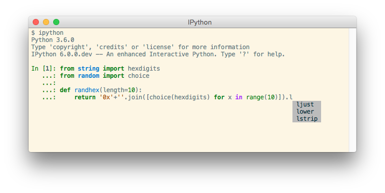

.. _introduction:

=====================
IPython Documentation
=====================

.. only:: html

   :Release: |release|
   :Date: |today|

Welcome to the official IPython documentation.

IPython provides a rich toolkit to help you make the most of using Python
interactively.  Its main components are:

* A powerful interactive Python shell.

* A `Jupyter <https://jupyter.org/>`_ kernel to work with Python code in Jupyter
  notebooks and other interactive frontends.

The enhanced interactive Python shells and kernel have the following main
features:

* Comprehensive object introspection.

* Input history, persistent across sessions.

* Caching of output results during a session with automatically generated
  references.

* Extensible tab completion, with support by default for completion of python
  variables and keywords, filenames and function keywords.

* Extensible system of 'magic' commands for controlling the environment and
  performing many tasks related to IPython or the operating system.

* A rich configuration system with easy switching between different setups
  (simpler than changing ``$PYTHONSTARTUP`` environment variables every time).

* Session logging and reloading.

* Extensible syntax processing for special purpose situations.

* Access to the system shell with user-extensible alias system.

* Easily embeddable in other Python programs and GUIs.

* Integrated access to the pdb debugger and the Python profiler.

The Command line interface inherits the above functionality and adds 
 
* real multi-line editing thanks to `prompt_toolkit <https://python-prompt-toolkit.readthedocs.io/en/stable/>`_.
 
* syntax highlighting as you type.

* integration with command line editor for a better workflow.

The kernel also has its share of features. When used with a compatible frontend,
it allows:

* the object to create a rich display of Html, Images, Latex, Sound and
  Video.

* interactive widgets with the use of the `ipywidgets <https://ipywidgets.readthedocs.io/en/stable/>`_ package.

This documentation will walk you through most of the features of the IPython
command line and kernel, as well as describe the internal mechanisms in order
to improve your Python workflow.

You can find the table of content for this documentation in the left
sidebar, allowing you to come back to previous sections or skip ahead, if needed. 

The latest development version is always available from IPython's `GitHub
repository <http://github.com/ipython/ipython>`_.

.. toctree::
   :maxdepth: 1
   :hidden:

   self
   overview
   whatsnew/index
   install/index
   interactive/index
   config/index
   development/index
   coredev/index
   api/index
   sphinxext
   about/index

.. seealso::

   `Jupyter documentation <https://jupyter.readthedocs.io/en/latest/>`__
     The Jupyter documentation provides information about the Notebook code and other Jupyter sub-projects.
   `ipyparallel documentation <https://ipyparallel.readthedocs.io/en/latest/>`__
     Formerly ``IPython.parallel``.

.. only:: html

   * :ref:`genindex`
   * :ref:`modindex`
   * :ref:`search`

