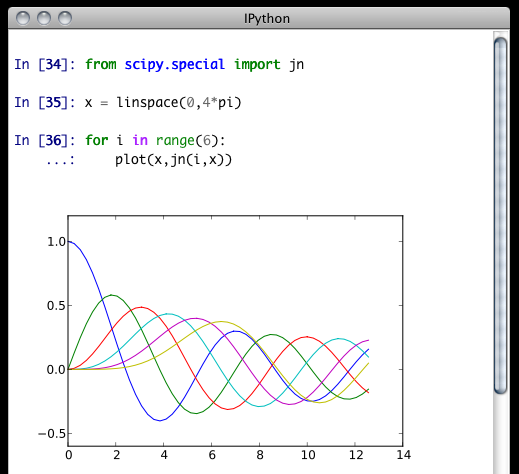

.. _qtconsole:

=========================
A Qt Console for IPython
=========================

We now have a version of IPython, using the new two-process :ref:`ZeroMQ Kernel
<ipythonzmq>`, running in a PyQt_ GUI.  This is a very lightweight widget that
largely feels like a terminal, but provides a number of enhancements only
possible in a GUI, such as inline figures, proper multiline editing with syntax
highlighting, graphical calltips, and much more.

.. figure:: ../../_images/qtconsole.png
    :width: 400px
    :alt: IPython Qt console with embedded plots
    :align: center
    :target: ../_images/qtconsole.png

    The Qt console for IPython, using inline matplotlib plots.

To get acquainted with the Qt console, type `%guiref` to see a quick
introduction of its main features.

The Qt frontend has hand-coded emacs-style bindings for text navigation. This
is not yet configurable.

.. tip::

   Since the Qt console tries hard to behave like a terminal, by default it
   immediately executes single lines of input that are complete.  If you want
   to force multiline input, hit :kbd:`Ctrl-Enter` at the end of the first line
   instead of :kbd:`Enter`, and it will open a new line for input.  At any
   point in a multiline block, you can force its execution (without having to
   go to the bottom) with :kbd:`Shift-Enter`.

``%load``
=========

The new ``%load`` magic (previously ``%loadpy``) takes any script, and pastes
its contents as your next input, so you can edit it before executing. The
script may be on your machine, but you can also specify an history range, or a
url, and it will download the script from the web. This is particularly useful
for playing with examples from documentation, such as matplotlib.

.. sourcecode:: ipython

    In [6]: %load http://matplotlib.sourceforge.net/plot_directive/mpl_examples/mplot3d/contour3d_demo.py

    In [7]: from mpl_toolkits.mplot3d import axes3d
       ...: import matplotlib.pyplot as plt
       ...: 
       ...: fig = plt.figure()
       ...: ax = fig.add_subplot(111, projection='3d')
       ...: X, Y, Z = axes3d.get_test_data(0.05)
       ...: cset = ax.contour(X, Y, Z)
       ...: ax.clabel(cset, fontsize=9, inline=1)
       ...: 
       ...: plt.show()

Pylab
=====

One of the most exciting features of the new console is embedded matplotlib
figures. You can use any standard matplotlib GUI backend
to draw the figures, and since there is now a two-process model, there is no
longer a conflict between user input and the drawing eventloop.

.. display:

:func:`display`
***************

An additional function, :func:`display`, will be added to the global namespace
if you specify the ``--pylab`` option at the command line. The IPython display
system provides a mechanism for specifying PNG or SVG (and more)
representations of objects for GUI frontends. By default, IPython registers
convenient PNG and SVG renderers for matplotlib figures, so you can embed them
in your document by calling :func:`display` on one or more of them. This is
especially useful for saving_ your work.

.. sourcecode:: ipython

    In [5]: plot(range(5)) # plots in the matplotlib window
    
    In [6]: display(gcf()) # embeds the current figure in the qtconsole
    
    In [7]: display(*getfigs()) # embeds all active figures in the qtconsole

If you have a reference to a matplotlib figure object, you can always display
that specific figure:

.. sourcecode:: ipython

   In [1]: f = figure()

   In [2]: plot(rand(100))
   Out[2]: [<matplotlib.lines.Line2D at 0x7fc6ac03dd90>]

   In [3]: display(f)

   # Plot is shown here

   In [4]: title('A title')
   Out[4]: <matplotlib.text.Text at 0x7fc6ac023450>

   In [5]: display(f)

   # Updated plot with title is shown here.

.. _inline:

``--pylab=inline``
******************

If you want to have all of your figures embedded in your session, instead of
calling :func:`display`, you can specify ``--pylab=inline`` when you start the
console, and each time you make a plot, it will show up in your document, as if
you had called :func:`display(fig)`.

The inline backend can use either SVG or PNG figures (PNG being the default).
To switch between them, set the ``InlineBackend.figure_format`` configurable
in a config file, or via the ``%config`` magic:

.. sourcecode:: ipython

    In [10]: %config InlineBackend.figure_format = 'svg'

.. note::

    Changing the inline figure format also affects calls to :func:`display` above,
    even if you are not using the inline backend for all figures.

By default, IPython closes all figures at the completion of each execution. This means you
don't have to manually close figures, which is less convenient when figures aren't attached
to windows with an obvious close button.  It also means that the first matplotlib call in
each cell will always create a new figure:

.. sourcecode:: ipython

    In [11]: plot(range(100))
    <single-line plot>
    
    In [12]: plot([1,3,2])
    <another single-line plot>

However, it does prevent the list of active figures surviving from one input cell to the
next, so if you want to continue working with a figure, you must hold on to a reference to
it:

.. sourcecode:: ipython

    In [11]: fig = gcf()
       ....: fig.plot(rand(100))
    <plot>
    In [12]: fig.title('Random Title')
    <redraw plot with title>

This behavior is controlled by the :attr:`InlineBackend.close_figures` configurable, and
if you set it to False, via %config or config file, then IPython will *not* close figures,
and tools like :func:`gcf`, :func:`gca`, :func:`getfigs` will behave the same as they
do with other backends.  You will, however, have to manually close figures:

.. sourcecode:: ipython

    # close all active figures:
    In [13]: [ fig.close() for fig in getfigs() ]

.. _saving:

Saving and Printing
===================

IPythonQt has the ability to save your current session, as either HTML or
XHTML. If you have been using :func:`display` or inline_ pylab, your figures
will be PNG in HTML, or inlined as SVG in XHTML. PNG images have the option to
be either in an external folder, as in many browsers' "Webpage, Complete"
option, or inlined as well, for a larger, but more portable file.

.. note::

    Export to SVG+XHTML requires that you are using SVG figures, which is *not*
    the default.  To switch the inline figure format to use SVG during an active
    session, do:
    
    .. sourcecode:: ipython
    
        In [10]: %config InlineBackend.figure_format = 'svg'
    
    Or, you can add the same line (c.Inline... instead of %config Inline...) to
    your config files.
    
    This will only affect figures plotted after making this call

The widget also exposes the ability to print directly, via the default print
shortcut or context menu.

.. Note:: 

    Saving is only available to richtext Qt widgets, which are used by default,
    but if you pass the ``--plain`` flag, saving will not be available to you.

See these examples of :download:`png/html<figs/jn.html>` and
:download:`svg/xhtml <figs/jn.xhtml>` output. Note that syntax highlighting
does not survive export. This is a known issue, and is being investigated.

Colors and Highlighting
=======================

Terminal IPython has always had some coloring, but never syntax
highlighting. There are a few simple color choices, specified by the ``colors``
flag or ``%colors`` magic:

* LightBG for light backgrounds
* Linux for dark backgrounds
* NoColor for a simple colorless terminal

The Qt widget has full support for the ``colors`` flag used in the terminal shell.

The Qt widget, however, has full syntax highlighting as you type, handled by
the `pygments`_ library. The ``style`` argument exposes access to any style by
name that can be found by pygments, and there are several already
installed. The ``colors`` argument, if unspecified, will be guessed based on
the chosen style. Similarly, there are default styles associated with each
``colors`` option.

Screenshot of ``ipython qtconsole --colors=linux``, which uses the 'monokai'
theme by default:

.. image:: figs/colors_dark.png
    :width: 627px
    
.. Note::

    Calling ``ipython qtconsole -h`` will show all the style names that
    pygments can find on your system.

You can also pass the filename of a custom CSS stylesheet, if you want to do
your own coloring, via the ``stylesheet`` argument.  The default LightBG
stylesheet:

.. sourcecode:: css

    QPlainTextEdit, QTextEdit { background-color: white;
            color: black ;
            selection-background-color: #ccc}
    .error { color: red; }
    .in-prompt { color: navy; }
    .in-prompt-number { font-weight: bold; }
    .out-prompt { color: darkred; }
    .out-prompt-number { font-weight: bold; }
    /* .inverted is used to highlight selected completion */
    .inverted { background-color: black ; color: white; }

Fonts
=====

The QtConsole has configurable via the ConsoleWidget. To change these, set the
``font_family`` or ``font_size`` traits of the ConsoleWidget. For instance, to
use 9pt Anonymous Pro::

    $> ipython qtconsole --ConsoleWidget.font_family="Anonymous Pro" --ConsoleWidget.font_size=9

Process Management
==================

With the two-process ZMQ model, the frontend does not block input during
execution. This means that actions can be taken by the frontend while the
Kernel is executing, or even after it crashes. The most basic such command is
via 'Ctrl-.', which restarts the kernel.  This can be done in the middle of a
blocking execution. The frontend can also know, via a heartbeat mechanism, that
the kernel has died. This means that the frontend can safely restart the
kernel.

.. _multiple_consoles:

Multiple Consoles
*****************

Since the Kernel listens on the network, multiple frontends can connect to it.
These do not have to all be qt frontends - any IPython frontend can connect and
run code.  When you start ipython qtconsole, there will be an output line,
like::

    [IPKernelApp] To connect another client to this kernel, use:
    [IPKernelApp] --existing kernel-12345.json

Other frontends can connect to your kernel, and share in the execution. This is
great for collaboration.  The ``--existing`` flag means connect to a kernel
that already exists.  Starting other consoles
with that flag will not try to start their own kernel, but rather connect to
yours.  :file:`kernel-12345.json` is a small JSON file with the ip, port, and
authentication information necessary to connect to your kernel. By default, this file
will be in your default profile's security directory.  If it is somewhere else,
the output line will print the full path of the connection file, rather than
just its filename.

If you need to find the connection info to send, and don't know where your connection file
lives, there are a couple of ways to get it. If you are already running an IPython console
connected to the kernel, you can use the ``%connect_info`` magic to display the information
necessary to connect another frontend to the kernel.

.. sourcecode:: ipython

    In [2]: %connect_info
    {
      "stdin_port":50255,
      "ip":"127.0.0.1",
      "hb_port":50256,
      "key":"70be6f0f-1564-4218-8cda-31be40a4d6aa",
      "shell_port":50253,
      "iopub_port":50254
    }

    Paste the above JSON into a file, and connect with:
        $> ipython <app> --existing <file>
    or, if you are local, you can connect with just:
        $> ipython <app> --existing kernel-12345.json
    or even just:
        $> ipython <app> --existing
    if this is the most recent IPython session you have started.

Otherwise, you can find a connection file by name (and optionally profile) with
:func:`IPython.lib.kernel.find_connection_file`:

.. sourcecode:: bash

    $> python -c "from IPython.lib.kernel import find_connection_file;\
    print find_connection_file('kernel-12345.json')"
    /home/you/.ipython/profile_default/security/kernel-12345.json

And if you are using a particular IPython profile:

.. sourcecode:: bash

    $> python -c "from IPython.lib.kernel import find_connection_file;\
    print find_connection_file('kernel-12345.json', profile='foo')"
    /home/you/.ipython/profile_foo/security/kernel-12345.json

You can even launch a standalone kernel, and connect and disconnect Qt Consoles
from various machines.  This lets you keep the same running IPython session
on your work machine (with matplotlib plots and everything), logging in from home,
cafés, etc.::

    $> ipython kernel
    [IPKernelApp] To connect another client to this kernel, use:
    [IPKernelApp] --existing kernel-12345.json

This is actually exactly the same as the subprocess launched by the qtconsole, so
all the information about connecting to a standalone kernel is identical to that
of connecting to the kernel attached to a running console.

.. _kernel_security:

Security
--------

.. warning::

    Since the ZMQ code currently has no encryption, listening on an
    external-facing IP is dangerous.  You are giving any computer that can see
    you on the network the ability to connect to your kernel, and view your traffic.
    Read the rest of this section before listening on external ports
    or running an IPython kernel on a shared machine.

By default (for security reasons), the kernel only listens on localhost, so you
can only connect multiple frontends to the kernel from your local machine. You
can specify to listen on an external interface by specifying the ``ip``
argument::

    $> ipython qtconsole --ip=192.168.1.123

If you specify the ip as 0.0.0.0 or '*', that means all interfaces, so any
computer that can see yours on the network can connect to the kernel.

Messages are not encrypted, so users with access to the ports your kernel is using will be
able to see any output of the kernel. They will **NOT** be able to issue shell commands as
you due to message signatures, which are enabled by default as of IPython 0.12.

.. warning::

    If you disable message signatures, then any user with access to the ports your
    kernel is listening on can issue arbitrary code as you. **DO NOT** disable message
    signatures unless you have a lot of trust in your environment.

The one security feature IPython does provide is protection from unauthorized execution.
IPython's messaging system will sign messages with HMAC digests using a shared-key. The key
is never sent over the network, it is only used to generate a unique hash for each message,
based on its content. When IPython receives a message, it will check that the digest
matches, and discard the message. You can use any file that only you have access to to
generate this key, but the default is just to generate a new UUID. You can generate a random
private key with::

    # generate 1024b of random data, and store in a file only you can read:
    # (assumes IPYTHONDIR is defined, otherwise use your IPython directory)
    $> python -c "import os; print os.urandom(128).encode('base64')" > $IPYTHONDIR/sessionkey
    $> chmod 600 $IPYTHONDIR/sessionkey

The *contents* of this file will be stored in the JSON connection file, so that file
contains everything you need to connect to and use a kernel.

To use this generated key, simply specify the ``Session.keyfile`` configurable
in :file:`ipython_config.py` or at the command-line, as in::

    # instruct IPython to sign messages with that key, instead of a new UUID
    $> ipython qtconsole --Session.keyfile=$IPYTHONDIR/sessionkey

.. _ssh_tunnels:

SSH Tunnels
-----------

Sometimes you want to connect to machines across the internet, or just across
a LAN that either doesn't permit open ports or you don't trust the other
machines on the network.  To do this, you can use SSH tunnels.  SSH tunnels
are a way to securely forward ports on your local machine to ports on another
machine, to which you have SSH access.

In simple cases, IPython's tools can forward ports over ssh by simply adding the
``--ssh=remote`` argument to the usual ``--existing...`` set of flags for connecting
to a running kernel, after copying the JSON connection file (or its contents) to
the second computer.

.. warning::

    Using SSH tunnels does *not* increase localhost security.  In fact, when
    tunneling from one machine to another *both* machines have open
    ports on localhost available for connections to the kernel.

There are two primary models for using SSH tunnels with IPython.  The first
is to have the Kernel listen only on localhost, and connect to it from
another machine on the same LAN.

First, let's start a kernel on machine **worker**, listening only
on loopback::

    user@worker $> ipython kernel
    [IPKernelApp] To connect another client to this kernel, use:
    [IPKernelApp] --existing kernel-12345.json

In this case, the IP that you would connect
to would still be 127.0.0.1, but you want to specify the additional ``--ssh`` argument
with the hostname of the kernel (in this example, it's 'worker')::

    user@client $> ipython qtconsole  --ssh=worker --existing /path/to/kernel-12345.json

Which will write a new connection file with the forwarded ports, so you can reuse them::

    [IPythonQtConsoleApp] To connect another client via this tunnel, use:
    [IPythonQtConsoleApp] --existing kernel-12345-ssh.json

Note again that this opens ports on the *client* machine that point to your kernel.

.. note::

    the ssh argument is simply passed to openssh, so it can be fully specified ``user@host:port``
    but it will also respect your aliases, etc. in :file:`.ssh/config` if you have any.

The second pattern is for connecting to a machine behind a firewall across the internet
(or otherwise wide network). This time, we have a machine **login** that you have ssh access
to, which can see **kernel**, but **client** is on another network. The important difference
now is that **client** can see **login**, but *not* **worker**. So we need to forward ports from
client to worker *via* login. This means that the kernel must be started listening
on external interfaces, so that its ports are visible to `login`::

    user@worker $> ipython kernel --ip=0.0.0.0
    [IPKernelApp] To connect another client to this kernel, use:
    [IPKernelApp] --existing kernel-12345.json

Which we can connect to from the client with::

    user@client $> ipython qtconsole --ssh=login --ip=192.168.1.123 --existing /path/to/kernel-12345.json

.. note::

    The IP here is the address of worker as seen from *login*, and need only be specified if
    the kernel used the ambiguous 0.0.0.0 (all interfaces) address. If it had used
    192.168.1.123 to start with, it would not be needed.

Manual SSH tunnels
------------------

It's possible that IPython's ssh helper functions won't work for you, for various
reasons.  You can still connect to remote machines, as long as you set up the tunnels
yourself.  The basic format of forwarding a local port to a remote one is::

    [client] $> ssh <server> <localport>:<remoteip>:<remoteport> -f -N

This will forward local connections to **localport** on client to **remoteip:remoteport**
*via* **server**. Note that remoteip is interpreted relative to *server*, not the client.
So if you have direct ssh access to the machine to which you want to forward connections,
then the server *is* the remote machine, and remoteip should be server's IP as seen from the
server itself, i.e. 127.0.0.1.  Thus, to forward local port 12345 to remote port 54321 on
a machine you can see, do::

    [client] $> ssh machine 12345:127.0.0.1:54321 -f -N

But if your target is actually on a LAN at 192.168.1.123, behind another machine called **login**,
then you would do::

    [client] $> ssh login 12345:192.168.1.16:54321 -f -N

The ``-f -N`` on the end are flags that tell ssh to run in the background,
and don't actually run any commands beyond creating the tunnel.

.. seealso::

    A short discussion of ssh tunnels: http://www.revsys.com/writings/quicktips/ssh-tunnel.html

Stopping Kernels and Consoles
*****************************

Since there can be many consoles per kernel, the shutdown mechanism and dialog
are probably more complicated than you are used to. Since you don't always want
to shutdown a kernel when you close a window, you are given the option to just
close the console window or also close the Kernel and *all other windows*. Note
that this only refers to all other *local* windows, as remote Consoles are not
allowed to shutdown the kernel, and shutdowns do not close Remote consoles (to
allow for saving, etc.).

Rules:

    * Restarting the kernel automatically clears all *local* Consoles, and prompts remote
      Consoles about the reset.
    * Shutdown closes all *local* Consoles, and notifies remotes that
      the Kernel has been shutdown.
    * Remote Consoles may not restart or shutdown the kernel.

Qt and the QtConsole
====================

An important part of working with the QtConsole when you are writing your own
Qt code is to remember that user code (in the kernel) is *not* in the same
process as the frontend.  This means that there is not necessarily any Qt code
running in the kernel, and under most normal circumstances there isn't. If,
however, you specify ``--pylab=qt`` at the command-line, then there *will* be a
:class:`QCoreApplication` instance running in the kernel process along with
user-code. To get a reference to this application, do:

.. sourcecode:: python

    from PyQt4 import QtCore
    app = QtCore.QCoreApplication.instance()
    # app will be None if there is no such instance

A common problem listed in the PyQt4 Gotchas_ is the fact that Python's garbage
collection will destroy Qt objects (Windows, etc.) once there is no longer a
Python reference to them, so you have to hold on to them.  For instance, in:

.. sourcecode:: python

    def make_window():
        win = QtGui.QMainWindow()
    
    def make_and_return_window():
        win = QtGui.QMainWindow()
        return win

:func:`make_window` will never draw a window, because garbage collection will
destroy it before it is drawn, whereas :func:`make_and_return_window` lets the
caller decide when the window object should be destroyed.  If, as a developer,
you know that you always want your objects to last as long as the process, you
can attach them to the QApplication instance itself:

.. sourcecode:: python
    
    # do this just once:
    app = QtCore.QCoreApplication.instance()
    app.references = set()
    # then when you create Windows, add them to the set
    def make_window():
        win = QtGui.QMainWindow()
        app.references.add(win)

Now the QApplication itself holds a reference to ``win``, so it will never be
garbage collected until the application itself is destroyed.

.. _Gotchas: http://www.riverbankcomputing.co.uk/static/Docs/PyQt4/html/gotchas.html#garbage-collection

Regressions
===========

There are some features, where the qt console lags behind the Terminal
frontend:

* !cmd input: Due to our use of pexpect, we cannot pass input to subprocesses
  launched using the '!' escape, so you should never call a command that
  requires interactive input.  For such cases, use the terminal IPython.  This
  will not be fixed, as abandoning pexpect would significantly degrade the
  console experience.

.. _PyQt: http://www.riverbankcomputing.co.uk/software/pyqt/download
.. _pygments: http://pygments.org/
