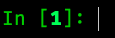
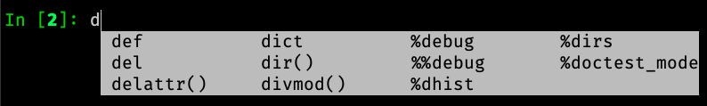

=====================
 Development version
=====================

This document describes in-flight development work.

.. warning::

    Please do not edit this file by hand (doing so will likely cause merge
    conflicts for other Pull Requests). Instead, create a new file in the
    `docs/source/whatsnew/pr` folder

Released .... ...., 2019

Need to be updated:

.. toctree::
   :maxdepth: 2
   :glob:

   pr/*

IPython 8.0 is bringing a number of new features and improvements to both the
user of the terminal and of the kernel via Jupyter. The removal of compatibility
with older version of Python is also the opportunity to do a couple of
performance improvement in particular with respect to startup time.

The main change in IPython 8.0 is the integration of the ``stack_data`` package;
which provide smarter information in traceback; in particular it will highlight
the AST node where an error occurs which can help to quickly narrow down errors.

For example in the following snippet::

    def foo(i):
        x = [[[0]]]
        return x[0][i][0]

    def bar():
        return foo(0) + foo(
            1
        ) + foo(2)

Calling ``bar()`` would raise an ``IndexError`` on the return line of ``foo``,
IPython 8.0 is capable of telling you, where the index error occurs::

    return x[0][i][0]
                ^

To prepare for Python 3.10 we have also started working on removing reliance and
any dependency that is not Python 3.10 compatible; that include migrating our
test suite to Pytest, and starting to remove nose.

We are also removing support for Python 3.6 allowing internal code to use more
efficient ``pathlib``, and make better use of type annotations.

The completer has also seen significant updates and make use of newer Jedi API
offering faster and more reliable tab completion.

For the terminal users this also enable the auto-suggestion feature, described
below, which show "ghost text" ahead of your cursor you can accept without
having to press the tab key or ask the completer to suggest completions.

Autosuggestion is a very useful feature available in `fish <https://fishshell.com/>`__, `zsh <https://en.wikipedia.org/wiki/Z_shell>`__, and `prompt-toolkit <https://python-prompt-toolkit.readthedocs.io/en/master/pages/asking_for_input.html#auto-suggestion>`__.

`Ptpython <https://github.com/prompt-toolkit/ptpython#ptpython>`__ allows users to enable this feature in
`ptpython/config.py <https://github.com/prompt-toolkit/ptpython/blob/master/examples/ptpython_config/config.py#L90>`__.

This feature allows users to accept autosuggestions with ctrl e, ctrl f,
or right arrow as described below.

1. Start ipython

2. Run ``print("hello")``

.. image:: ../_images/auto_suggest_print_hello_suggest.png

3. Press p to see the autosuggestion

.. image:: ../_images/auto_suggest_print_hello_suggest.png

4. Press ctrl f, or ctrl e, or right arrow to accept the suggestion

.. image:: ../_images/auto_suggest_print_hello.png

You can also complete word by word:

1. Run ``def say_hello(): print("hello")``

.. image:: ../_images/auto_suggest_second_prompt.png

2. Press d to see the autosuggestion

.. image:: ../_images/audo_suggest_d_phantom.png

3. Press alt f to accept the first word of the suggestion

.. image:: ../_images/auto_suggest_def_phantom.png

Importantly, this feature does not interfere with tab completion:

1. After running ``def say_hello(): print("hello")``, press d

.. image:: ../_images/audo_suggest_d_phantom.png

2. Press Tab to start tab completion

3A. Press Tab again to select the first option

.. image:: ../_images/auto_suggest_def_completions.png

3B. Press alt f to accept to accept the first word of the suggestion

.. image:: ../_images/auto_suggest_def_phantom.png

3C. Press ctrl f or ctrl e to accept the entire suggestion

.. image:: ../_images/auto_suggest_match_parens.png

To install a version of ipython with autosuggestions enabled, run:

``pip install git+https://github.com/mskar/ipython@auto_suggest``

Currently, autosuggestions are only shown in the emacs or vi insert editing modes:

- The ctrl e, ctrl f, and alt f shortcuts work by default in emacs mode.
- To use these shortcuts in vi insert mode, you will have to create `custom keybindings in your config.py <https://github.com/mskar/setup/commit/2892fcee46f9f80ef7788f0749edc99daccc52f4/>`__.

Show pinfo information in ipdb using "?" and "??"
-------------------------------------------------

In IPDB, it is now possible to show the information about an object using "?"
and "??", in much the same way it can be done when using the IPython prompt::

    ipdb> partial?
    Init signature: partial(self, /, *args, **kwargs)
    Docstring:
    partial(func, *args, **keywords) - new function with partial application
    of the given arguments and keywords.
    File:           ~/.pyenv/versions/3.8.6/lib/python3.8/functools.py
    Type:           type
    Subclasses:

Previously, "pinfo" or "pinfo2" command had to be used for this purpose.

Autoreload 3 feature
====================

Example: When an IPython session is ran with the 'autoreload' extension loaded,
you will now have the option '3' to select which means the following:

    1. replicate all functionality from option 2
    2. autoload all new funcs/classes/enums/globals from the module when they're added
    3. autoload all newly imported funcs/classes/enums/globals from external modules

Try ``%autoreload 3`` in an IPython session after running ``%load_ext autoreload``

For more information please see unit test -
    extensions/tests/test_autoreload.py : 'test_autoload_newly_added_objects'

=======

.. DO NOT EDIT THIS LINE BEFORE RELEASE. FEATURE INSERTION POINT.

As a reminder, IPython master has diverged from the 7.x branch, thus master may
have more feature and API changes.

Backwards incompatible changes
------------------------------

.. DO NOT EDIT THIS LINE BEFORE RELEASE. INCOMPAT INSERTION POINT.
