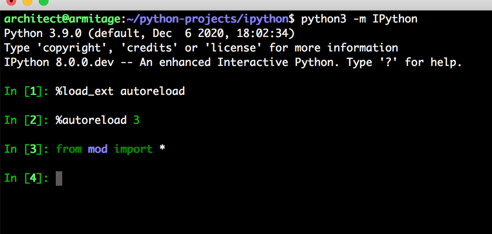
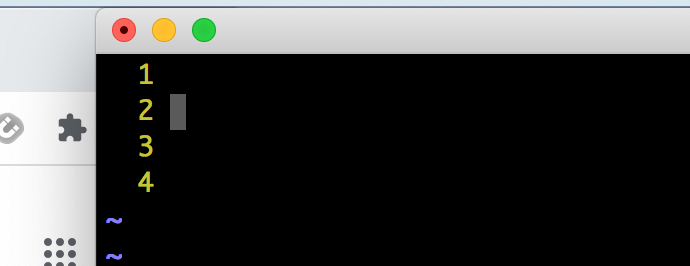
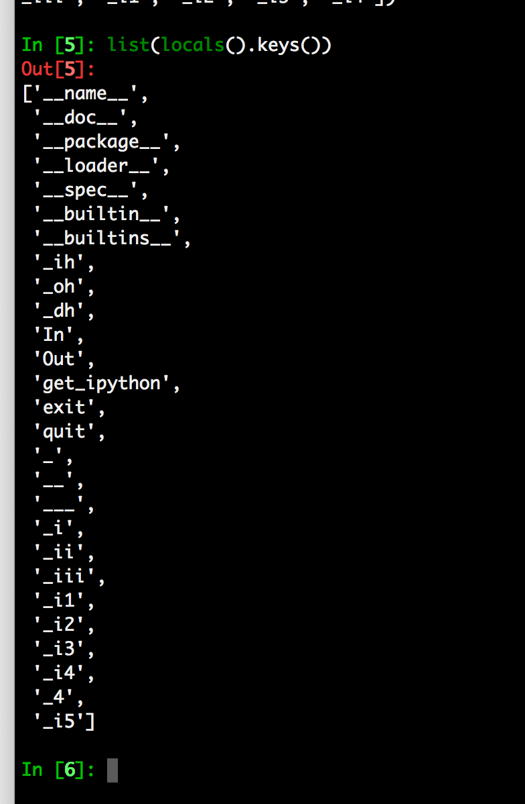
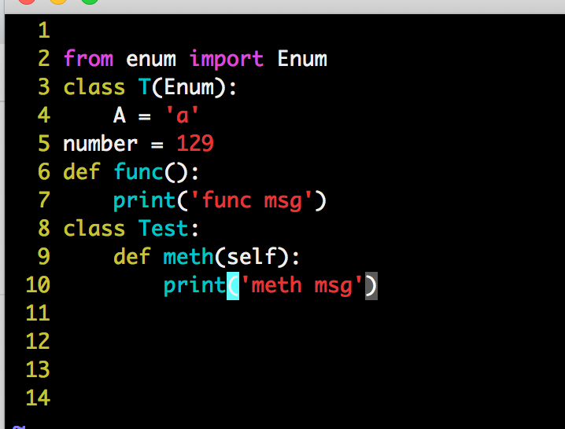
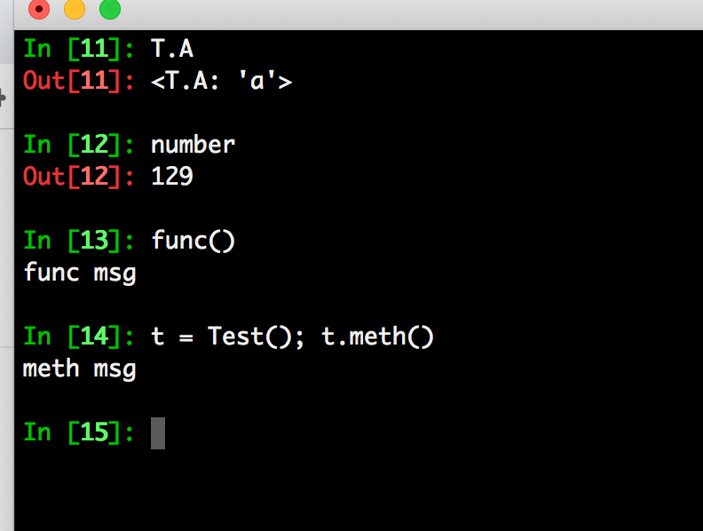
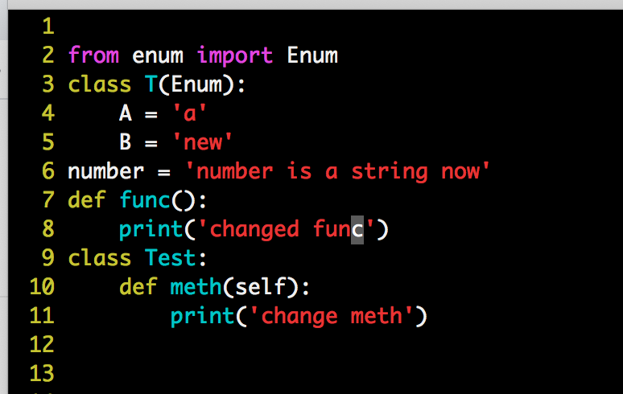
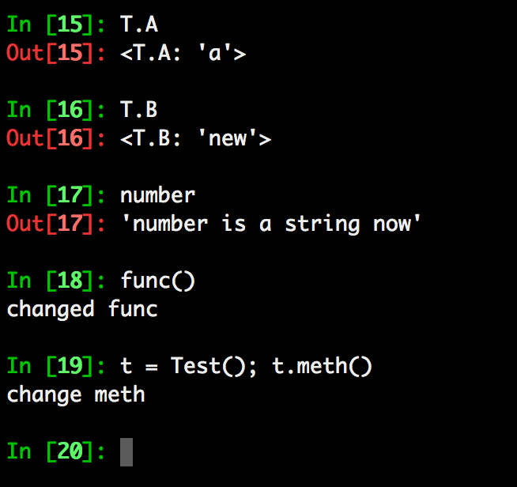

=====================
 Development version
=====================

This document describes in-flight development work.

.. warning::

    Please do not edit this file by hand (doing so will likely cause merge
    conflicts for other Pull Requests). Instead, create a new file in the
    `docs/source/whatsnew/pr` folder

Released .... ...., 2019

Need to be updated:

.. toctree::
   :maxdepth: 2
   :glob:

   pr/*

Autosuggestion is a very useful feature available in `fish <https://fishshell.com/>`__, `zsh <https://en.wikipedia.org/wiki/Z_shell>`__, and `prompt-toolkit <https://python-prompt-toolkit.readthedocs.io/en/master/pages/asking_for_input.html#auto-suggestion>`__.

`Ptpython <https://github.com/prompt-toolkit/ptpython#ptpython>`__ allows users to enable this feature in
`ptpython/config.py <https://github.com/prompt-toolkit/ptpython/blob/master/examples/ptpython_config/config.py#L90>`__.

This feature allows users to accept autosuggestions with ctrl e, ctrl f,
or right arrow as described below.

1. Start ipython

.. image:: ../_images/auto_suggest_prompt_no_text.png

2. Run ``print("hello")``

.. image:: ../_images/auto_suggest_print_hello_suggest.png

3. Press p to see the autosuggestion

.. image:: ../_images/auto_suggest_print_hello_suggest.png

4. Press ctrl f, or ctrl e, or right arrow to accept the suggestion

.. image:: ../_images/auto_suggest_print_hello.png

You can also complete word by word:

1. Run ``def say_hello(): print("hello")``

.. image:: ../_images/auto_suggest_second_prompt.png

2. Press d to see the autosuggestion

.. image:: ../_images/audo_suggest_d_phantom.png

3. Press alt f to accept the first word of the suggestion

.. image:: ../_images/auto_suggest_def_phantom.png

Importantly, this feature does not interfere with tab completion:

1. After running ``def say_hello(): print("hello")``, press d

.. image:: ../_images/audo_suggest_d_phantom.png

2. Press Tab to start tab completion

.. image:: ../_images/auto_suggest_d_completions.png

3A. Press Tab again to select the first option

.. image:: ../_images/auto_suggest_def_completions.png

3B. Press alt f to accept to accept the first word of the suggestion

.. image:: ../_images/auto_suggest_def_phantom.png

3C. Press ctrl f or ctrl e to accept the entire suggestion

.. image:: ../_images/auto_suggest_match_parens.png

To install a version of ipython with autosuggestions enabled, run:

``pip install git+https://github.com/mskar/ipython@auto_suggest``

Currently, autosuggestions are only shown in the emacs or vi insert editing modes:

- The ctrl e, ctrl f, and alt f shortcuts work by default in emacs mode.
- To use these shortcuts in vi insert mode, you will have to create `custom keybindings in your config.py <https://github.com/mskar/setup/commit/2892fcee46f9f80ef7788f0749edc99daccc52f4/>`__.

Autoreload 3 feature
====================

Example: When an IPython session is ran with the 'autoreload' extension loaded,
you will now have the option '3' to select which means the following:

    * replicate all functionality from option 2
    * autoload all new funcs/classes/enums/globals from the module when they're added
    * autoload all newly imported funcs/classes/enums/globals from external modules

Try ``%autoreload 3`` in an IPython session after running ``%load_ext autoreload``

Example usage:

1. Load autoreload extension with the new option 3

2. Current contents of 'mod.py'

3. Current 'locals()' dict

4. Update contents of 'mod.py' with the following code

5. Back in our IPython session we automatically have everything loaded after requesting 'T.A'

6. Change the contents of any of the loaded objects

7. All the objects are updated as expected (keeping ithe functionality for '%autoreload 2')

Please see the unit-test (extensions/tests/test_autoreload.py t6) to see a similar scenario.

.. DO NOT EDIT THIS LINE BEFORE RELEASE. FEATURE INSERTION POINT.

As a reminder, IPython master has diverged from the 7.x branch, thus master may
have more feature and API changes.

Backwards incompatible changes
------------------------------

.. DO NOT EDIT THIS LINE BEFORE RELEASE. INCOMPAT INSERTION POINT.