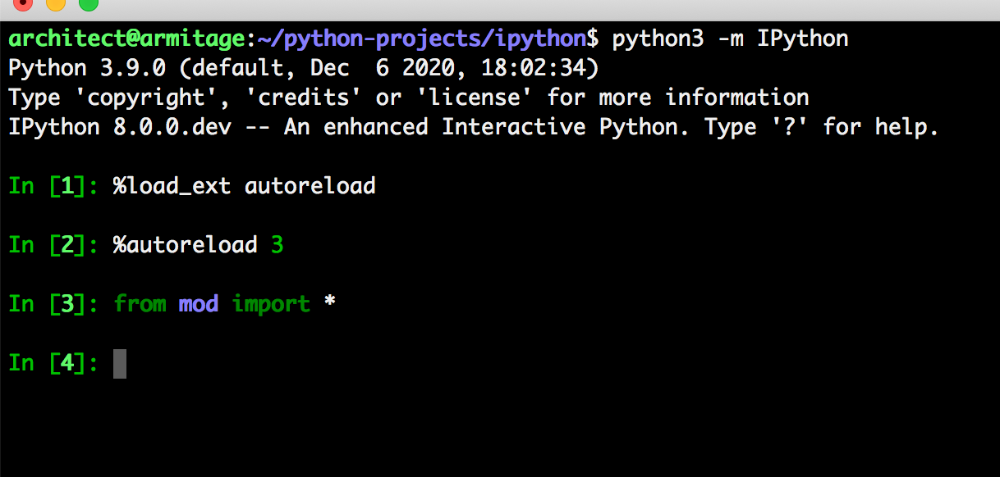
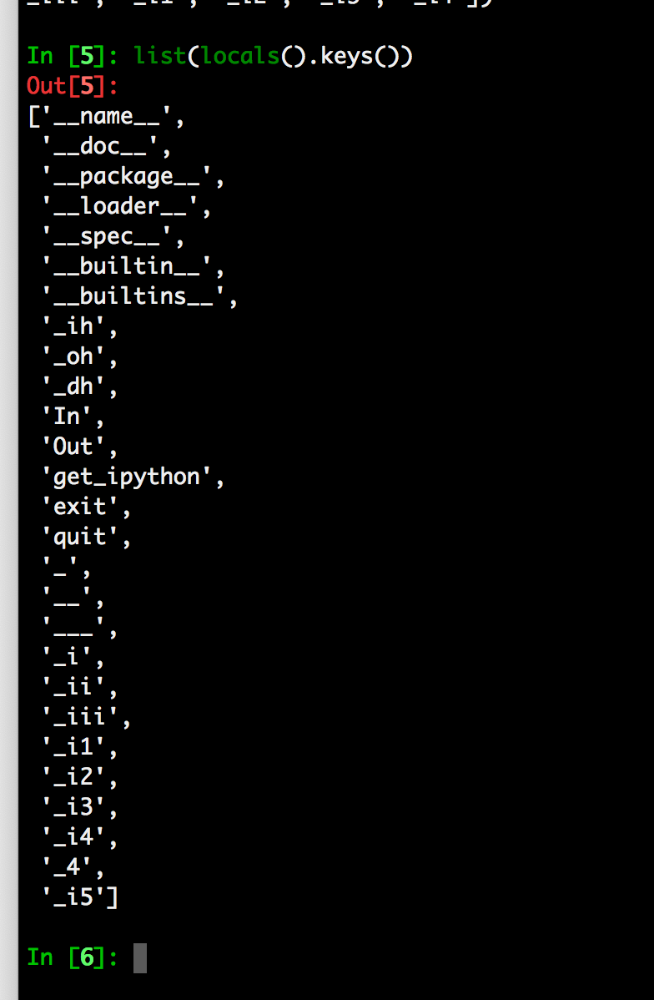

Autoreload 3 feature
====================

Example: When an IPython session is ran with the 'autoreload' extension loaded,
you will now have the option '3' to select which means the following:

    * replicate all functionality from option 2
    * autoload all new funcs/classes/enums/globals from the module when they're added
    * autoload all newly imported funcs/classes/enums/globals from external modules

Try ``%autoreload 3`` in an IPython session after running ``%load_ext autoreload``

Example usage:

1. Load autoreload extension with the new option 3

2. Current contents of 'mod.py'

.. image:: ../../_images/feature-add-autoreload-all/image2.png

3. Current 'locals()' dict 

4. Update contents of 'mod.py' with the following code 

.. image:: ../../_images/feature-add-autoreload-all/image4.png

5. Back in our IPython session we automatically have everything loaded after requesting 'T.A'

.. image:: ../../_images/feature-add-autoreload-all/image5.png

6. Change the contents of any of the loaded objects

.. image:: ../../_images/feature-add-autoreload-all/image6.png

7. All the objects are updated as expected (keeping ithe functionality for '%autoreload 2')

.. image:: ../../_images/feature-add-autoreload-all/image7.png

Please see the unit-test (extensions/tests/test_autoreload.py t6) to see a similar scenario.
