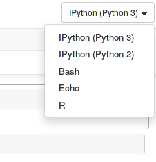

============
 3.x Series
============

IPython 3.1
===========

Released April 3, 2015

The first 3.x bugfix release, with 33 contributors and 344 commits.
This primarily includes bugfixes to notebook layout and focus problems.


Highlights:

- Various focus jumping and scrolling fixes in the notebook.
- Various message ordering and widget fixes in the notebook.
- Images in markdown and output are confined to the notebook width.
  An `.unconfined` CSS class is added to disable this behavior per-image.
  The resize handle on output images is removed.
- Improved ordering of tooltip content for Python functions, putting the signature at the top.
- Fix UnicodeErrors when displaying some objects with unicode reprs on Python 2.
- Set the kernel's working directory to the notebook directory when running ``nbconvert --execute``,
  so that behavior matches the live notebook.
- Allow setting custom SSL options for the tornado server with ``NotebookApp.ssl_options``,
  and protect against POODLE with default settings by disabling SSLv3.
- Fix memory leak in the IPython.parallel Controller on Python 3.


See :ref:`issues_list_3` for details.


Release 3.0
===========

Released February 27, 2015

This is a really big release. Over 150 contributors, and almost 6000 commits in a bit under a year.
Support for languages other than Python is greatly improved,
notebook UI has been significantly redesigned,
and a lot of improvement has happened in the experimental interactive widgets.
The message protocol and document format have both been updated,
while maintaining better compatibility with previous versions than prior updates.
The notebook webapp now enables editing of any text file, and even
a web-based terminal (on Unix platforms).

3.x will be the last monolithic release of IPython,
as the next release cycle will see the growing project split into its Python-specific and language-agnostic components.
Language-agnostic projects (notebook, qtconsole, etc.) will move under the umbrella of the new Project Jupyter name,
while Python-specific projects (interactive Python shell, Python kernel, IPython.parallel)
will remain under IPython, and be split into a few smaller packages.
To reflect this, IPython is in a bit of a transition state.
The logo on the notebook is now the Jupyter logo.
When installing kernels system-wide, they go in a `jupyter` directory.
We are going to do our best to ease this transition for users and developers.

Big changes are ahead.


Using different kernels
-----------------------



You can now choose a kernel for a notebook within the user interface, rather
than starting up a separate notebook server for each kernel you want to use. The
syntax highlighting adapts to match the language you're working in.

Information about the kernel is stored in the notebook file, so when you open a
notebook, it will automatically start the correct kernel.

It is also easier to use the Qt console and the terminal console with other
kernels, using the --kernel flag::

    ipython qtconsole --kernel bash
    ipython console --kernel bash

    # To list available kernels
    ipython kernelspec list

Kernel authors should see :ref:`kernelspecs` for how to register their kernels
with IPython so that these mechanisms work.

Typing unicode identifiers
--------------------------

.. image:: /_images/unicode_completion.png

Complex expressions can be much cleaner when written with a wider choice of
characters. Python 3 allows unicode identifiers, and IPython 3 makes it easier
to type those, using a feature from Julia. Type a backslash followed by a LaTeX
style short name, such as ``\alpha``. Press tab, and it will turn into α.

Widget migration guide
----------------------
The widget framework has a lot of backwards incompatible changes.
For information about migrating widget notebooks and custom widgets to 3.0 refer
to the :doc:`widget migration guide<version3_widget_migration>`.

Other new features
------------------

* :class:`~.TextWidget` and :class:`~.TextareaWidget` objects now include a
  ``placeholder`` attribute, for displaying placeholder text before the
  user has typed anything.

* The :magic:`load` magic can now find the source for objects in the user namespace.
  To enable searching the namespace, use the ``-n`` option.

  .. sourcecode:: ipython

      In [1]: %load -n my_module.some_function

* :class:`~.DirectView` objects have a new :meth:`~.DirectView.use_cloudpickle`
  method, which works like ``view.use_dill()``, but causes the ``cloudpickle``
  module from PiCloud's `cloud`__ library to be used rather than dill or the
  builtin pickle module.

  __ https://pypi.python.org/pypi/cloud

* Added a .ipynb exporter to nbconvert.  It can be used by passing `--to notebook`
  as a commandline argument to nbconvert.

* New nbconvert preprocessor called :class:`~.ClearOutputPreprocessor`. This
  clears the output from IPython notebooks.

* New preprocessor for nbconvert that executes all the code cells in a notebook.
  To run a notebook and save its output in a new notebook::

      ipython nbconvert InputNotebook --ExecutePreprocessor.enabled=True --to notebook --output Executed

* Consecutive stream (stdout/stderr) output is merged into a single output
  in the notebook document.
  Previously, all output messages were preserved as separate output fields in the JSON.
  Now, the same merge is applied to the stored output as the displayed output,
  improving document load time for notebooks with many small outputs.

* ``NotebookApp.webapp_settings`` is deprecated and replaced with
  the more informatively named ``NotebookApp.tornado_settings``.

* Using :magic:`timeit` prints warnings if there is atleast a 4x difference in timings
  between the slowest and fastest runs, since this might meant that the multiple
  runs are not independent of one another.

* It's now possible to provide mechanisms to integrate IPython with other event
  loops, in addition to the ones we already support. This lets you run GUI code
  in IPython with an interactive prompt, and to embed the IPython
  kernel in GUI applications. See :doc:`/config/eventloops` for details. As part
  of this, the direct ``enable_*`` and ``disable_*`` functions for various GUIs
  in :mod:`IPython.lib.inputhook` have been deprecated in favour of
  :meth:`~.InputHookManager.enable_gui` and :meth:`~.InputHookManager.disable_gui`.

* A ``ScrollManager`` was added to the notebook.  The ``ScrollManager`` controls how the notebook document is scrolled using keyboard.  Users can inherit from the ``ScrollManager`` or ``TargetScrollManager`` to customize how their notebook scrolls.  The default ``ScrollManager`` is the ``SlideScrollManager``, which tries to scroll to the nearest slide or sub-slide cell.

* The function :func:`~IPython.html.widgets.interaction.interact_manual` has been
  added which behaves similarly to :func:`~IPython.html.widgets.interaction.interact`,
  but adds a button to explicitly run the interacted-with function, rather than
  doing it automatically for every change of the parameter widgets. This should
  be useful for long-running functions.

* The ``%cython`` magic is now part of the Cython module. Use `%load_ext Cython` with a version of Cython >= 0.21 to have access to the magic now.

* The Notebook application now offers integrated terminals on Unix platforms,
  intended for when it is used on a remote server. To enable these, install
  the ``terminado`` Python package.

* The Notebook application can now edit any plain text files, via a full-page CodeMirror instance.

* Setting the default highlighting language for nbconvert with the config option
  ``NbConvertBase.default_language`` is deprecated. Nbconvert now respects
  metadata stored in the :ref:`kernel spec <kernelspecs>`.

* IPython can now be configured systemwide, with files in :file:`/etc/ipython`
  or :file:`/usr/local/etc/ipython` on Unix systems,
  or :file:`\\ipython` on Windows.

* Added support for configurable user-supplied `Jinja
  <http://jinja.pocoo.org/>`_ HTML templates for the notebook.  Paths to
  directories containing template files can be specified via
  ``NotebookApp.extra_template_paths``.  User-supplied template directories
  searched first by the notebook, making it possible to replace existing
  templates with your own files.

  For example, to replace the notebook's built-in ``error.html`` with your own,
  create a directory like ``/home/my_templates`` and put your override template
  at ``/home/my_templates/error.html``.  To start the notebook with your custom
  error page enabled, you would run::

      ipython notebook '--extra_template_paths=["/home/my_templates/"]'

  It's also possible to override a template while also `inheriting
  <http://jinja.pocoo.org/docs/dev/templates/#template-inheritance>`_ from that
  template, by prepending ``templates/`` to the ```` target of
  your child template.  This is useful when you only want to override a
  specific block of a template.  For example, to add additional CSS to the
  built-in ``error.html``, you might create an override that looks like::

    

    
    {{super()}}
    <style type="text/css">
      /* My Awesome CSS */
    </style>
    

* Added a widget persistence API.  This allows you to persist your notebooks interactive widgets.
  Two levels of control are provided:
  1. Higher level- ``WidgetManager.set_state_callbacks`` allows you to register callbacks for loading and saving widget state.  The callbacks you register are automatically called when necessary.
  2. Lower level- the ``WidgetManager`` Javascript class now has ``get_state`` and ``set_state`` methods that allow you to get and set the state of the widget runtime.

  Example code for persisting your widget state to session data::

    %%javascript
    require(['widgets/js/manager'], function(manager) {
        manager.WidgetManager.set_state_callbacks(function() { // Load
            return JSON.parse(sessionStorage.widgets_state || '{}');
        }, function(state) { // Save
            sessionStorage.widgets_state = JSON.stringify(state);
        });
    });

* Enhanced support for :magic:`env` magic.  As before, :magic:`env` with no
  arguments displays all environment variables and values.  Additionally,
  :magic:`env` can be used to get or set individual environment variables. To
  display an individual value, use the `%env var` syntax. To set a value, use
  `env var val` or `env var=val`. Python value expansion using `$` works as usual.


Backwards incompatible changes
------------------------------

* The :ref:`message protocol <messaging>` has been updated from version 4 to version 5.
  Adapters are included, so IPython frontends can still talk to kernels that
  implement protocol version 4.

* The :ref:`notebook format <nbformat>` has been updated from version 3 to version 4.
  Read-only support for v4 notebooks has been backported to IPython 2.4.
  Notable changes:
  
  * heading cells are removed in favor or markdown headings
  * notebook outputs and output messages are more consistent with each other
  * use :func:`IPython.nbformat.read` and :func:`~IPython.nbformat.write`
    to read and write notebook files
    instead of the deprecated :mod:`IPython.nbformat.current` APIs.

  You can downgrade a notebook to v3 via ``nbconvert``::
  
      ipython nbconvert --to notebook --nbformat 3 <notebook>
  
  which will create :file:`notebook.v3.ipynb`, a copy of the notebook in v3 format.

* :func:`IPython.core.oinspect.getsource` call specification has changed:

  * `oname` keyword argument has been added for property source formatting
  * `is_binary` keyword argument has been dropped, passing ``True`` had
    previously short-circuited the function to return ``None`` unconditionally

* Removed the octavemagic extension: it is now available as ``oct2py.ipython``.

* Creating PDFs with LaTeX no longer uses a post processor.
  Use `nbconvert --to pdf` instead of `nbconvert --to latex --post pdf`.

* Used https://github.com/jdfreder/bootstrap2to3 to migrate the Notebook to Bootstrap 3.

  Additional changes:

  - Set `.tab-content .row` `0px;` left and right margin (bootstrap default is `-15px;`)
  - Removed `height: @btn_mini_height;` from `.list_header>div, .list_item>div` in `tree.less`
  - Set `#header` div `margin-bottom: 0px;`
  - Set `#menus` to `float: left;`
  - Set `#maintoolbar .navbar-text` to `float: none;`
  - Added no-padding convenience class.
  - Set border of #maintoolbar to 0px

* Accessing the `container` DOM object when displaying javascript has been
  deprecated in IPython 2.0 in favor of accessing `element`. Starting with
  IPython 3.0 trying to access `container` will raise an error in browser
  javascript console.

* ``IPython.utils.py3compat.open`` was removed: :func:`io.open` provides all
  the same functionality.

* The NotebookManager and ``/api/notebooks`` service has been replaced by
  a more generic ContentsManager and ``/api/contents`` service,
  which supports all kinds of files.
* The Dashboard now lists all files, not just notebooks and directories.
* The ``--script`` hook for saving notebooks to Python scripts is removed,
  use :samp:`ipython nbconvert --to python {notebook}` instead.

* The ``rmagic`` extension is deprecated, as it is now part of rpy2. See
  :mod:`rpy2.ipython.rmagic`.

* :meth:`~.KernelManager.start_kernel` and :meth:`~.KernelManager.format_kernel_cmd`
  no longer accept a ``executable`` parameter. Use the kernelspec machinery instead.

* The widget classes have been renamed from `*Widget` to `*`.  The old names are
  still functional, but are deprecated.  i.e. `IntSliderWidget` has been renamed
  to `IntSlider`.
* The ContainerWidget was renamed to Box and no longer defaults as a flexible
  box in the web browser.  A new FlexBox widget was added, which allows you to
  use the flexible box model.

* The notebook now uses a single websocket at `/kernels/<kernel-id>/channels` instead of separate
  `/kernels/<kernel-id>/{shell|iopub|stdin}` channels. Messages on each channel are identified by a
  `channel` key in the message dict, for both send and recv.


Content Security Policy
```````````````````````

The Content Security Policy is a web standard for adding a layer of security to
detect and mitigate certain classes of attacks, including Cross Site Scripting
(XSS) and data injection attacks. This was introduced into the notebook to
ensure that the IPython Notebook and its APIs (by default) can only be embedded
in an iframe on the same origin.

Override ``headers['Content-Security-Policy']`` within your notebook
configuration to extend for alternate domains and security settings.::

    c.NotebookApp.tornado_settings = {
        'headers': {
            'Content-Security-Policy': "frame-ancestors 'self'"
        }
    }

Example policies::

    Content-Security-Policy: default-src 'self' https://*.jupyter.org

Matches embeddings on any subdomain of jupyter.org, so long as they are served
over SSL.

There is a `report-uri <https://developer.mozilla.org/en-US/docs/Web/Security/CSP/CSP_policy_directives#report-uri>`_ endpoint available for logging CSP violations, located at
``/api/security/csp-report``. To use it, set ``report-uri`` as part of the CSP::

    c.NotebookApp.tornado_settings = {
        'headers': {
            'Content-Security-Policy': "frame-ancestors 'self'; report-uri /api/security/csp-report"
        }
    }

It simply provides the CSP report as a warning in IPython's logs. The default
CSP sets this report-uri relative to the ``base_url`` (not shown above).

For a more thorough and accurate guide on Content Security Policies, check out
`MDN's Using Content Security Policy <https://developer.mozilla.org/en-US/docs/Web/Security/CSP/Using_Content_Security_Policy>`_ for more examples.
