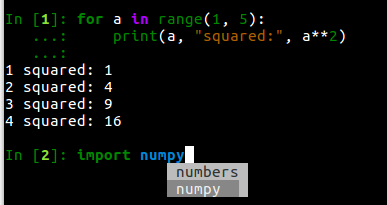

============
 5.x Series
============

.. _whatsnew580:

IPython 5.8.0
=============

* Update inspecting function/methods for future-proofing. :ghpull:`11139`

.. _whatsnew570:

IPython 5.7
===========

* Fix IPython trying to import non-existing matplotlib backends :ghpull:`11087`
* fix for display hook not publishing object metadata :ghpull:`11101`

.. _whatsnew560:

IPython 5.6
===========

* In Python 3.6 and above, dictionaries preserve the order items were added to
  them. On these versions, IPython will display dictionaries in their native
  order, rather than sorting by the keys (:ghpull:`10958`).
* :class:`~.IPython.display.ProgressBar` can now be used as an iterator
  (:ghpull:`10813`).
* The shell object gains a :meth:`~.InteractiveShell.check_complete` method,
  to allow a smoother transition to new input processing machinery planned for
  IPython 7 (:ghpull:`11044`).
* IPython should start faster, as it no longer looks for all available pygments
  styles on startup (:ghpull:`10859`).

You can see all the PR marked for the `5.6. milestone <https://github.com/ipython/ipython/pulls?utf8=%E2%9C%93&q=is%3Apr+milestone%3A5.6+is%3Aclosed+NOT+%22Backport+PR%22+>`_,
and all the `backport versions <https://github.com/ipython/ipython/pulls?utf8=%E2%9C%93&q=is%3Apr%20milestone%3A5.6%20is%3Aclosed%20%22Backport%20PR%22%20>`__.

.. _whatsnew550:

IPython 5.5
===========

System Wide config
------------------

- IPython now looks for config files in ``{sys.prefix}/etc/ipython``
  for environment-specific configuration.
- Startup files can be found in ``/etc/ipython/startup`` or ``{sys.prefix}/etc/ipython/startup``
  in addition to the profile directory, for system-wide or env-specific startup files.

See :ghpull:`10644`

ProgressBar
-----------

IPython now has built-in support for progressbars::

    In[1]: from IPython.display import ProgressBar
    ...  : pb = ProgressBar(100)
    ...  : pb

    In[2]: pb.progress = 50

    # progress bar in cell 1 updates.

See :ghpull:`10755`

Misc
----

 - Fix ``IPython.core.display:Pretty._repr_pretty_`` had the wrong signature.
   (:ghpull:`10625`)
 - :magic:`timeit` now give a correct ``SyntaxError`` if naked ``return`` used.
   (:ghpull:`10637`)
 - Prepare the ``:ipython:`` directive to be compatible with Sphinx 1.7.
   (:ghpull:`10668`)
 - Make IPython work with OpenSSL in FIPS mode; change hash algorithm of input
   from md5 to sha1. (:ghpull:`10696`)
 - Clear breakpoints before running any script with debugger. (:ghpull:`10699`)
 - Document that :magic:`profile` is deprecated, not to be confused with :magic:`prun`. (:ghpull:`10707`)
 - Limit default number of returned completions to 500. (:ghpull:`10743`)

You can see all the PR marked for the `5.5. milestone <https://github.com/ipython/ipython/pulls?q=is%3Apr%20milestone%3A5.5%20is%3Aclosed%20NOT%20%22Backport%20PR%22>`_,
and all the `backport versions <https://github.com/ipython/ipython/pulls?utf8=%E2%9C%93&q=is%3Apr%20milestone%3A5.5%20is%3Aclosed%20%22Backport%20PR%22%20>`_.

IPython 5.4.1
=============
Released a few hours after 5.4, fix a crash when
``backports.shutil-get-terminal-size`` is not installed. :ghissue:`10629`

.. _whatsnew540:

IPython 5.4
===========

IPython 5.4-LTS is the first release of IPython after the release of the 6.x
series which is Python 3 only. It backports most of the new exposed API
additions made in IPython 6.0 and 6.1 and avoid having to write conditional
logics depending of the version of IPython.

Please upgrade to pip 9 or greater before upgrading IPython. 
Failing to do so on Python 2 may lead to a broken IPython install.

Configurable TerminalInteractiveShell
-------------------------------------

Backported from the 6.x branch as an exceptional new feature. See
:ghpull:`10373` and :ghissue:`10364`

IPython gained a new ``c.TerminalIPythonApp.interactive_shell_class`` option
that allow to customize the class used to start the terminal frontend. This
should allow user to use custom interfaces, like reviving the former readline
interface which is now a separate package not maintained by the core team.

Define ``_repr_mimebundle_``
----------------------------

Object can now define `_repr_mimebundle_` in place of multiple `_repr_*_`
methods and return a full mimebundle. This greatly simplify many implementation
and allow to publish custom mimetypes (like geojson, plotly, dataframes....).
See the ``Custom Display Logic`` example notebook for more informations.

Execution Heuristics
--------------------

The heuristic for execution in the command line interface is now more biased
toward executing for single statement. While in IPython 4.x and before a single
line would be executed when enter is pressed, IPython 5.x would insert a new
line. For single line statement this is not true anymore and if a single line is
valid Python, IPython will execute it regardless of the cursor position. Use
:kbd:`Ctrl-O` to insert a new line. :ghpull:`10489`

Implement Display IDs
---------------------

Implement display id and ability to update a given display. This should greatly
simplify a lot of code by removing the need for widgets and allow other frontend
to implement things like progress-bars.  See :ghpull:`10048`

Display function
----------------

The :func:`display() <IPython.display.display>` function is now available by
default in an IPython session, meaning users can call it on any object to see
their rich representation. This should allow for better interactivity both at
the REPL and in notebook environment.

Scripts and library that rely on display and may be run outside of IPython still
need to import the display function using ``from IPython.display import
display``. See :ghpull:`10596`

Miscs
-----

* ``_mp_main_`` is not reloaded which fixes issues with multiprocessing.
  :ghpull:`10523`
* Use user colorscheme in Pdb as well :ghpull:`10479`
* Faster shutdown. :ghpull:`10408` 
* Fix a crash in reverse search. :ghpull:`10371`
* added ``Completer.backslash_combining_completions`` boolean option to
  deactivate backslash-tab completion that may conflict with windows path. 

IPython 5.3
===========

Released on February 24th, 2017. Remarkable changes and fixes:

* Fix a bug in ``set_next_input`` leading to a crash of terminal IPython.
  :ghpull:`10231`, :ghissue:`10296`, :ghissue:`10229`
* Always wait for editor inputhook for terminal IPython :ghpull:`10239`,
  :ghpull:`10240`
* Disable ``_ipython_display_`` in terminal :ghpull:`10249`, :ghpull:`10274`
* Update terminal colors to be more visible by default on windows
  :ghpull:`10260`, :ghpull:`10238`, :ghissue:`10281`
* Add Ctrl-Z shortcut (suspend) in terminal debugger :ghpull:`10254`,
  :ghissue:`10273`
* Indent on new line by looking at the text before the cursor :ghpull:`10264`,
  :ghpull:`10275`, :ghissue:`9283`
* Update QtEventloop integration to fix some matplotlib integration issues
  :ghpull:`10201`, :ghpull:`10311`, :ghissue:`10201`
* Respect completions display style in terminal debugger :ghpull:`10305`,
  :ghpull:`10313`
* Add a config option ``TerminalInteractiveShell.extra_open_editor_shortcuts``
  to enable extra shortcuts to open the input in an editor. These are :kbd:`v`
  in vi mode, and :kbd:`C-X C-E` in emacs mode (:ghpull:`10330`).
  The :kbd:`F2` shortcut is always enabled.

IPython 5.2.2
=============

* Fix error when starting with ``IPCompleter.limit_to__all__`` configured.

IPython 5.2.1
=============

* Fix tab completion in the debugger. :ghpull:`10223`

IPython 5.2
===========

Released on January 29th, 2017. Remarkable changes and fixes:

* restore IPython's debugger to raise on quit. :ghpull:`10009`
* The configuration value ``c.TerminalInteractiveShell.highlighting_style`` can
  now directly take a class argument for custom color style. :ghpull:`9848`
* Correctly handle matplotlib figures dpi :ghpull:`9868`
* Deprecate ``-e`` flag for the ``%notebook`` magic that had no effects.
  :ghpull:`9872`
* You can now press F2 while typing at a terminal prompt to edit the contents
  in your favourite terminal editor. Set the :envvar:`EDITOR` environment
  variable to pick which editor is used. :ghpull:`9929`
* sdists will now only be ``.tar.gz`` as per upstream PyPI requirements.
  :ghpull:`9925`
* :any:`IPython.core.debugger` have gained a ``set_trace()`` method for
  convenience. :ghpull:`9947`
* The 'smart command mode' added to the debugger in 5.0 was removed, as more
  people preferred the previous behaviour. Therefore, debugger commands such as
  ``c`` will act as debugger commands even when ``c`` is defined as a variable.
  :ghpull:`10050`
* Fixes OS X event loop issues at startup, :ghpull:`10150`
* Deprecate the ``%autoindent`` magic. :ghpull:`10176`
* Emit a :any:`DeprecationWarning` when setting the deprecated
  ``limit_to_all`` option of the completer. :ghpull:`10198`
* The :cellmagic:`capture` magic can now capture the result of a cell (from an
  expression on the last line), as well as printed and displayed output.
  :ghpull:`9851`.

Changes of behavior to :any:`InteractiveShellEmbed`.

:any:`InteractiveShellEmbed` interactive behavior have changed a bit in between
5.1 and 5.2. By default ``%kill_embedded`` magic will prevent further invocation
of the current ``call location`` instead of preventing further invocation of
the current instance creation location. For most use case this will not change
much for you, though previous behavior was confusing and less consistent with
previous IPython versions.

You can now deactivate instances by using ``%kill_embedded --instance`` flag,
(or ``-i`` in short). The ``%kill_embedded`` magic also gained a
``--yes``/``-y`` option which skip confirmation step, and  ``-x``/``--exit``
which also exit the current embedded call without asking for confirmation.

See :ghpull:`10207`.

IPython 5.1
===========

* Broken ``%timeit`` on Python2 due to the use of ``__qualname__``. :ghpull:`9804`
* Restore ``%gui qt`` to create and return a ``QApplication`` if necessary. :ghpull:`9789`
* Don't set terminal title by default. :ghpull:`9801`
* Preserve indentation when inserting newlines with ``Ctrl-O``. :ghpull:`9770`
* Restore completion in debugger. :ghpull:`9785`
* Deprecate ``IPython.core.debugger.Tracer()`` in favor of simpler, newer, APIs. :ghpull:`9731`
* Restore ``NoOpContext`` context manager removed by mistake, and add `DeprecationWarning`. :ghpull:`9765`
* Add option allowing ``Prompt_toolkit`` to use 24bits colors. :ghpull:`9736`
* Fix for closing interactive matplotlib windows on OS X. :ghpull:`9854`
* An embedded interactive shell instance can be used more than once. :ghpull:`9843`
* More robust check for whether IPython is in a terminal. :ghpull:`9833`
* Better pretty-printing of dicts on PyPy. :ghpull:`9827`
* Some coloured output now looks better on dark background command prompts in Windows.
  :ghpull:`9838`
* Improved tab completion of paths on Windows . :ghpull:`9826`
* Fix tkinter event loop integration on Python 2 with ``future`` installed. :ghpull:`9824`
* Restore ``Ctrl-\`` as a shortcut to quit IPython.
* Make ``get_ipython()`` accessible when modules are imported by startup files. :ghpull:`9818`
* Add support for running directories containing a ``__main__.py`` file with the
  ``ipython`` command. :ghpull:`9813`

True Color feature
------------------

``prompt_toolkit`` uses pygments styles for syntax highlighting. By default, the
colors specified in the style are approximated using a standard 256-color
palette. ``prompt_toolkit`` also supports 24bit, a.k.a. "true", a.k.a. 16-million
color escape sequences which enable compatible terminals to display the exact
colors specified instead of an approximation. This true_color option exposes
that capability in prompt_toolkit to the IPython shell.

Here is a good source for the current state of true color support in various
terminal emulators and software projects: https://gist.github.com/XVilka/8346728

IPython 5.0
===========

Released July 7, 2016

New terminal interface
----------------------

IPython 5 features a major upgrade to the terminal interface, bringing live
syntax highlighting as you type, proper multiline editing and multiline paste,
and tab completions that don't clutter up your history.

These features are provided by the Python library `prompt_toolkit
<https://python-prompt-toolkit.readthedocs.io/en/stable/>`__, which replaces
``readline`` throughout our terminal interface.

Relying on this pure-Python, cross platform module also makes it simpler to
install IPython. We have removed dependencies on ``pyreadline`` for Windows and
``gnureadline`` for Mac.

Backwards incompatible changes
------------------------------

- The ``%install_ext`` magic function, deprecated since 4.0, has now been deleted.
  You can distribute and install extensions as packages on PyPI.
- Callbacks registered while an event is being handled will now only be called
  for subsequent events; previously they could be called for the current event.
  Similarly, callbacks removed while handling an event *will* always get that
  event. See :ghissue:`9447` and :ghpull:`9453`.
- Integration with pydb has been removed since pydb development has been stopped
  since 2012, and pydb is not installable from PyPI.
- The ``autoedit_syntax`` option has apparently been broken for many years.
  It has been removed.

New terminal interface
~~~~~~~~~~~~~~~~~~~~~~

The overhaul of the terminal interface will probably cause a range of minor
issues for existing users.
This is inevitable for such a significant change, and we've done our best to
minimise these issues.
Some changes that we're aware of, with suggestions on how to handle them:

IPython no longer uses readline configuration (``~/.inputrc``). We hope that
the functionality you want (e.g. vi input mode) will be available by configuring
IPython directly (see :doc:`/config/options/terminal`).
If something's missing, please file an issue.

The ``PromptManager`` class has been removed, and the prompt machinery simplified.
See :ref:`custom_prompts` to customise prompts with the new machinery.

:mod:`IPython.core.debugger` now provides a plainer interface.
:mod:`IPython.terminal.debugger` contains the terminal debugger using
prompt_toolkit.

There are new options to configure the colours used in syntax highlighting.
We have tried to integrate them with our classic  ``--colors`` option and
``%colors`` magic, but there's a mismatch in possibilities, so some configurations
may produce unexpected results. See :ref:`termcolour` for more information.

The new interface is not compatible with Emacs 'inferior-shell' feature. To
continue using this, add the ``--simple-prompt`` flag to the command Emacs
runs. This flag disables most IPython features, relying on Emacs to provide
things like tab completion.

Provisional Changes
-------------------

Provisional changes are experimental functionality that may, or may not, make
it into a future version of IPython, and which API may change without warnings.
Activating these features and using these API are at your own risk, and may have
security implication for your system, especially if used with the Jupyter notebook,

When running via the Jupyter notebook interfaces, or other compatible client,
you can enable rich documentation experimental functionality:

When the ``docrepr`` package is installed setting the boolean flag
``InteractiveShell.sphinxify_docstring`` to ``True``, will process the various
object through sphinx before displaying them (see the ``docrepr`` package
documentation for more information.

You need to also enable the IPython pager display rich HTML representation
using the ``InteractiveShell.enable_html_pager`` boolean configuration option.
As usual you can set these configuration options globally in your configuration
files, alternatively you can turn them on dynamically using the following
snippet:

.. code-block:: python

    ip = get_ipython()
    ip.sphinxify_docstring = True
    ip.enable_html_pager = True

You can test the effect of various combinations of the above configuration in
the Jupyter notebook, with things example like :

.. code-block:: ipython

    import numpy as np
    np.histogram?

This is part of an effort to make Documentation in Python richer and provide in
the long term if possible dynamic examples that can contain math, images,
widgets... As stated above this is nightly experimental feature with a lot of
(fun) problem to solve. We would be happy to get your feedback and expertise on
it.

Deprecated Features
-------------------

Some deprecated features are listed in this section. Don't forget to enable
``DeprecationWarning`` as an error if you are using IPython in a Continuous
Integration setup or in your testing in general:

.. code-block:: python

    import warnings
    warnings.filterwarnings('error', '.*', DeprecationWarning, module='yourmodule.*')

- ``hooks.fix_error_editor`` seems unused and is pending deprecation.
- `IPython/core/excolors.py:ExceptionColors` is  deprecated.
- `IPython.core.InteractiveShell:write()` is deprecated; use `sys.stdout` instead.
- `IPython.core.InteractiveShell:write_err()` is deprecated; use `sys.stderr` instead.
- The `formatter` keyword argument to `Inspector.info` in `IPython.core.oinspec` has no effect.
- The `global_ns` keyword argument of IPython Embed was deprecated, and has no effect. Use `module` keyword argument instead.

Known Issues:
-------------

- ``<Esc>`` Key does not dismiss the completer and does not clear the current
  buffer. This is an on purpose modification due to current technical
  limitation. Cf :ghpull:`9572`. Escape the control character which is used
  for other shortcut, and there is no practical way to distinguish. Use Ctr-G
  or Ctrl-C as an alternative.

- Cannot use ``Shift-Enter`` and ``Ctrl-Enter`` to submit code in terminal. cf
  :ghissue:`9587` and :ghissue:`9401`. In terminal there is no practical way to
  distinguish these key sequences from a normal new line return.

- ``PageUp`` and ``pageDown`` do not move through completion menu.

- Color styles might not adapt to terminal emulator themes. This will need new
  version of Pygments to be released, and can be mitigated with custom themes.
