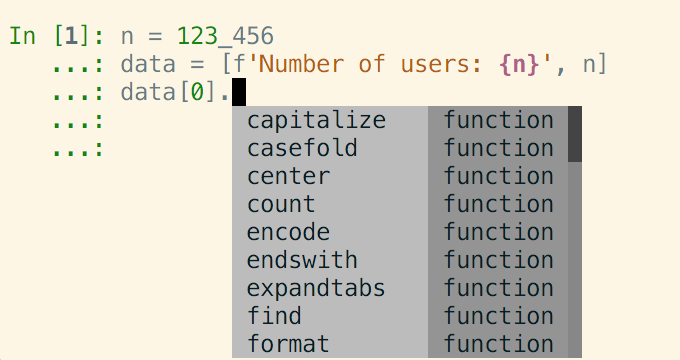

IPython 6.0
===========

Released .... ...., 2017

IPython 6 feature a major improvement in the completion machinery which is now
capable of completing non-executed code. It is also the first version of IPython
to stop compatibility with Python 2, which is still supported on the bugfix only
5.x branch. Read below to have a non-exhaustive list of new features.

Make sure you have pip > 9.0 before upgrading.
You should be able to update by using:

.. code::

    pip install ipython --upgrade

.. note::

    If your pip version is greater of equal to pip 9.0.1 you will automatically get
    the most recent version of IPython compatible with your system. THat is to day
    on Python 2 you will get the latest IPython 5.x bugfix, while in Python 3
    you will get the latest 6.x stable version.

New completion API and Interface
--------------------------------

The completer Completion API has seen an overhaul, and the new completer have
plenty of improvement both from the end users of terminal IPython or for
consumers of the API.

This new API is capable of pulling completions from :any:`jedi`, thus allowing
type inference on non-executed code. If :any:`jedi` is installed completion like
the following are now becoming possible without code evaluation:

    >>> data = ['Number of users', 123_456]
    ... data[0].<tab>

That is to say, IPython is now capable of inferring that `data[0]` is a string,
and will suggest completions like `.capitalize`. The completion power of IPython
will increase with new Jedi releases, and a number of bugs and more completions
are already available on development version of :any:`jedi` if you are curious.

With the help of prompt toolkit, types of completions can be shown in the
completer interface:

The appearance of the completer is controlled by the
``c.TerminalInteractiveShell.display_completions`` option that will show the
type differently depending on the value among ``'column'``, ``'multicolumn'``
and ``'readlinelike'``

The use of Jedi also full fill a number of request and fix a number of bugs
like case insensitive completion, completion after division operator: See
:ghpull:`10182`.

Extra patches and updates will be needed to the :mod:`ipykernel` package for
this feature to be available to other clients like jupyter Notebook, Lab,
Nteract, Hydrogen...

The use of Jedi can is barely noticeable on recent enough machines, but can be
feel on older ones,  in cases were Jedi behavior need to be adjusted, the amount
of time given to Jedi to compute type inference can be adjusted with
``c.IPCompleter.jedi_compute_type_timeout``, with object whose type were not
inferred will be shown as ``<unknown>``. Jedi can also be completely deactivated
by using the ``c.Completer.use_jedi=False`` option.

The old ``Completer.complete()`` API is waiting deprecation and should be
replaced replaced by ``Completer.completions()`` in a near future. Feedback on
the current state of the API and suggestions welcome.

Python 3 only codebase
----------------------

One of the large challenges in IPython 6.0 has been the adoption of a pure
Python 3 code base, which lead us to great length to upstream patches in pip,
pypi and warehouse to make sure Python 2 system still upgrade to the latest
compatible Python version compatible.

We remind our Python 2 users that IPython 5 is still compatible with Python 2.7,
still maintained and get regular releases. Using pip 9+, upgrading IPython will
automatically upgrade to the latest version compatible with your system.

.. warning::

  If you are on a system using an older verison of pip on Python 2, pip may
  still install IPython 6.0 on your system, and IPython will refuse to start.
  You can fix this by ugrading pip, and reinstalling ipython, or forcing pip to
  install an earlier version: ``pip install 'ipython<6'``

The ability to use only Python 3 on the code base of IPython has bring a number
of advantage. Most of the newly written code make use of `optional function type
anotation <https://www.python.org/dev/peps/pep-0484/>`_ leading to clearer code
and better documentation.

The total size of the repository has also for a first time between releases
(excluding the big split for 4.0) decreased by about 1500 lines, potentially
quite a bit more codewide as some documents like this one are append only and
are about 300 lines long.

The removal as of Python2/Python3 shim layer has made the code quite clearer and
more idiomatic in a number of location, and much friendlier to work with and
understand. We hope to further embrace Python 3 capability in the next release
cycle and introduce more of the Python 3 only idioms (yield from, kwarg only,
general unpacking) in the code base of IPython, and see if we can take advantage
of these as well to improve user experience with better error messages and
hints.

Configurable TerminalInteractiveShell, readline interface
---------------------------------------------------------

IPython gained a new ``c.TerminalIPythonApp.interactive_shell_class`` option
that allow to customize the class used to start the terminal frontend. This
should allow user to use custom interfaces, like reviving the former readline
interface which is now a separate package not actively maintained by the core
team. See the project to bring back the readline interface: `rlipython
<https://github.com/ipython/rlipython>`_.

This change will be backported to the IPython 5.x series.

Miscs improvements
------------------

- The :cellmagic:`capture` magic can now capture the result of a cell (from an
  expression on the last line), as well as printed and displayed output.
  :ghpull:`9851`.

- Pressing Ctrl-Z in the terminal debugger now suspends IPython, as it already
  does in the main terminal prompt.

- autoreload can now reload ``Enum``. See :ghissue:`10232` and :ghpull:`10316`

- IPython.display has gained a :any:`GeoJSON <IPython.display.GeoJSON>` object.
  :ghpull:`10288` and :ghpull:`10253`

.. DO NOT EDIT THIS LINE BEFORE RELEASE. FEATURE INSERTION POINT.

Functions Deprecated in 6.x Development cycle
~~~~~~~~~~~~~~~~~~~~~~~~~~~~~~~~~~~~~~~~~~~~~

- Loading extensions from ``ipython_extension_dir`` print a warning that this
  location is pending deprecation. This should only affect users still having
  extensions installed with ``%install_ext`` which has been deprecated since
  IPython 4.0, and removed in 5.0. Extensions still present in
  ``ipython_extension_dir`` may shadow more recently installed versions using
  pip. It is thus recommended to clean ``ipython_extension_dir`` of any
  extension now available as a package.

- ``IPython.utils.warn`` was deprecated in IPython 4.0, and has now been removed.
  instead of ``IPython.utils.warn`` inbuilt :any:`warnings` module is used.

- The function `IPython.core.oinspect.py:call_tip` is unused, was marked as
  Deprecated (raising a Deprecation Warning) and marked for later removal
  :ghpull:`10104`

Backwards incompatible changes
------------------------------

Functions Removed in 6.x Development cycle
~~~~~~~~~~~~~~~~~~~~~~~~~~~~~~~~~~~~~~~~~~

The following functions have been removed in the
development cycle marked for Milestone 6.0.

- ``IPython/utils/process.py`` - ``is_cmd_found``
- ``IPython/utils/process.py`` - ``pycmd2argv``

- The `--deep-reload` flag and the corresponding options to inject `dreload` or
  `reload` into the interactive namespace have been removed. You have to
  explicitly import `reload` from `IPython.lib.deepreload` to use it.

- the :magic:`profile` used to print current IPython profile in use, and which
  was deprecated in IPython 2.0 does now raise a `DeprecationWarning` error when
  used. It is often confused with the :magic:`prun` and the deprecation remove
  should free up the ``profile`` name in future versions.

.. DO NOT EDIT THIS LINE BEFORE RELEASE. INCOMPAT INSERTION POINT.
