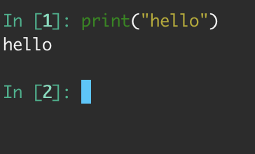
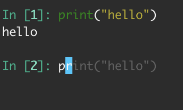
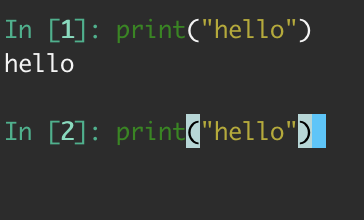
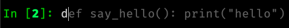
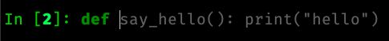
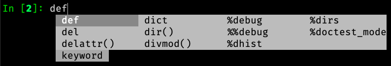
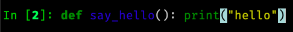
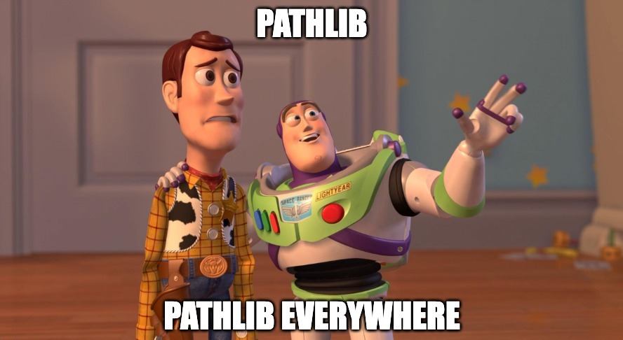

============
 8.x Series
============

.. _version 8.2.0:

IPython 8.2.0
-------------

IPython 8.2 mostly bring bugfixes to IPython.

 - Auto-suggestion can now be elected with the ``end`` key. :ghpull:`13566`
 - Some traceback issues with ``assert etb is not None`` have been fixed. :ghpull:`13588`
 - History is now pulled from the sqitel database and not from in-memory.
   In particular when using the ``%paste`` magic, the content of the pasted text will
   be part of the history and not the verbatim text ``%paste`` anymore. :ghpull:`13592`
 - Fix ``Ctrl-\\`` exit cleanup :ghpull:`13603`
 - Fixes to ``ultratb`` ipdb support when used outside of IPython. :ghpull:`13498`

I am still trying to fix and investigate :ghissue:`13598`, which seem to be
random, and would appreciate help if you find  reproducible minimal case. I've
tried to make various changes to the codebase to mitigate it, but a proper fix
will be difficult without understanding the cause.

All the issues on pull-requests for this release can be found in the `8.2
milestone. <https://github.com/ipython/ipython/milestone/100>`__ . And some
documentation only PR can be found as part of the `7.33 milestone
<https://github.com/ipython/ipython/milestone/101>`__ (currently not released).

Thanks to the `D. E. Shaw group <https://deshaw.com/>`__ for sponsoring
work on IPython and related libraries.

.. _version 8.1.1:
   
IPython 8.1.1
-------------

Fix an issue with virtualenv and Python 3.8 introduced in 8.1

Revert :ghpull:`13537` (fix an issue with symlinks in virtualenv) that raises an
error in Python 3.8, and fixed in a different way in :ghpull:`13559`.

.. _version 8.1:

IPython 8.1.0
-------------

IPython 8.1 is the first minor release after 8.0 and fixes a number of bugs and
Update a few behavior that were problematic with the 8.0 as with many new major
release.

Note that beyond the changes listed here, IPython 8.1.0 also contains all the
features listed in :ref:`version 7.32`.

 - Misc and multiple fixes around quotation auto-closing. It is now disabled by
   default. Run with ``TerminalInteractiveShell.auto_match=True`` to re-enabled
 - Require pygments>=2.4.0 :ghpull:`13459`, this was implicit in the code, but
   is now explicit in ``setup.cfg``/``setup.py``
 - Docs improvement of ``core.magic_arguments`` examples. :ghpull:`13433`
 - Multi-line edit executes too early with await. :ghpull:`13424`

 - ``black``  is back as an optional dependency, and autoformatting disabled by
   default until some fixes are implemented (black improperly reformat magics).
   :ghpull:`13471` Additionally the ability to use ``yapf`` as a code
   reformatter has been added :ghpull:`13528` . You can use
   ``TerminalInteractiveShell.autoformatter="black"``,
   ``TerminalInteractiveShell.autoformatter="yapf"`` to re-enable auto formating
   with black, or switch to yapf.

 - Fix and issue where ``display`` was not defined.

 - Auto suggestions are now configurable. Currently only
   ``AutoSuggestFromHistory`` (default) and ``None``. new provider contribution
   welcomed. :ghpull:`13475`

 - multiple packaging/testing improvement to simplify downstream packaging
   (xfail with reasons, try to not access network...).

 - Update deprecation. ``InteractiveShell.magic`` internal method has been
   deprecated for many years but did not emit a warning until now.

 - internal ``appended_to_syspath`` context manager has been deprecated.

 - fix an issue with symlinks in virtualenv :ghpull:`13537` (Reverted in 8.1.1)

 - Fix an issue with vim mode, where cursor would not be reset on exit :ghpull:`13472`

 - ipython directive now remove only known pseudo-decorators :ghpull:`13532`

 - ``IPython/lib/security`` which used to be used for jupyter notebook has been
   removed.

 - Fix an issue where ``async with`` would execute on new lines. :ghpull:`13436`

We want to remind users that IPython is part of the Jupyter organisations, and
thus governed by a Code of Conduct. Some of the behavior we have seen on GitHub is not acceptable.
Abuse and non-respectful comments on discussion will not be tolerated.

Many thanks to all the contributors to this release, many of the above fixed issue and
new features where done by first time contributors, showing there is still
plenty of easy contribution possible in IPython
. You can find all individual contributions
to this milestone `on github <https://github.com/ipython/ipython/milestone/91>`__.

Thanks as well to the `D. E. Shaw group <https://deshaw.com/>`__ for sponsoring
work on IPython and related libraries. In particular the Lazy autoloading of
magics that you will find described in the 7.32 release notes.

.. _version 8.0.1:

IPython 8.0.1 (CVE-2022-21699)
------------------------------

IPython 8.0.1, 7.31.1 and 5.11 are security releases that change some default
values in order to prevent potential Execution with Unnecessary Privileges.

Almost all version of IPython looks for configuration and profiles in current
working directory. Since IPython was developed before pip and environments
existed it was used a convenient way to load code/packages in a project
dependant way.

In 2022, it is not necessary anymore, and can lead to confusing behavior where
for example cloning a repository and starting IPython or loading a notebook from
any Jupyter-Compatible interface that has ipython set as a kernel can lead to
code execution.

I did not find any standard way for packaged to advertise CVEs they fix, I'm
thus trying to add a ``__patched_cves__`` attribute to the IPython module that
list the CVEs that should have been fixed. This attribute is informational only
as if a executable has a flaw, this value can always be changed by an attacker.

.. code::

    In [1]: import IPython

    In [2]: IPython.__patched_cves__
    Out[2]: {'CVE-2022-21699'}

    In [3]: 'CVE-2022-21699' in IPython.__patched_cves__
    Out[3]: True

Thus starting with this version:

 - The current working directory is not searched anymore for profiles or
   configurations files.
 - Added a ``__patched_cves__`` attribute (set of strings) to IPython module that contain
   the list of fixed CVE. This is informational only.

Further details can be read on the `GitHub Advisory <https://github.com/ipython/ipython/security/advisories/GHSA-pq7m-3gw7-gq5x>`__

.. _version 8.0:

IPython 8.0
-----------

IPython 8.0 is bringing a large number of new features and improvements to both the
user of the terminal and of the kernel via Jupyter. The removal of compatibility
with older version of Python is also the opportunity to do a couple of
performance improvements in particular with respect to startup time.
The 8.x branch started diverging from its predecessor around IPython 7.12
(January 2020).

This release contains 250+ pull requests, in addition to many of the features
and backports that have made it to the 7.x branch. Please see the 
`8.0 milestone <https://github.com/ipython/ipython/milestone/73?closed=1>`__ for the full list of pull requests.

Please feel free to send pull requests to updates those notes after release, 
I have likely forgotten a few things reviewing 250+ PRs.

Dependencies changes/downstream packaging
-----------------------------------------

Most of our building steps have been changed to be (mostly) declarative
and follow PEP 517. We are trying to completely remove ``setup.py`` (:ghpull:`13238`) and are
looking for help to do so.

 - minimum supported ``traitlets`` version is now 5+
 - we now require ``stack_data``
 - minimal Python is now 3.8
 - ``nose`` is not a testing requirement anymore
 - ``pytest`` replaces nose.
 - ``iptest``/``iptest3`` cli entrypoints do not exists anymore. 
 - minimum officially support ``numpy`` version has been bumped, but this should
   not have much effect on packaging.

Deprecation and removal
-----------------------

We removed almost all features, arguments, functions, and modules that were
marked as deprecated between IPython 1.0 and 5.0. As a reminder, 5.0 was released
in 2016, and 1.0 in 2013. Last release of the 5 branch was 5.10.0, in May 2020.
The few remaining deprecated features we left have better deprecation warnings
or have been turned into explicit errors for better error messages.

I will use this occasion to add the following requests to anyone emitting a
deprecation warning:

 - Please add at least ``stacklevel=2`` so that the warning is emitted into the
   caller context, and not the callee one.
 - Please add **since which version** something is deprecated.

As a side note, it is much easier to conditionally compare version
numbers rather than using ``try/except`` when functionality changes with a version. 

I won't list all the removed features here, but modules like ``IPython.kernel``,
which was just a shim module around ``ipykernel`` for the past 8 years, have been
removed, and so many other similar things that pre-date the name **Jupyter**
itself.

We no longer need to add ``IPython.extensions`` to the PYTHONPATH because that is being
handled by ``load_extension``.

We are also removing ``Cythonmagic``, ``sympyprinting`` and ``rmagic`` as they are now in
other packages and no longer need to be inside IPython.

Documentation
-------------

The majority of our docstrings have now been reformatted and automatically fixed by
the experimental `Vélin <https://pypi.org/project/velin/>`_ project to conform
to numpydoc.

Type annotations
----------------

While IPython itself is highly dynamic and can't be completely typed, many of
the functions now have type annotations, and part of the codebase is now checked
by mypy.

Featured changes
----------------

Here is a features list of changes in IPython 8.0. This is of course non-exhaustive. 
Please note as well that many features have been added in the 7.x branch as well
(and hence why you want to read the 7.x what's new notes), in particular
features contributed by QuantStack (with respect to debugger protocol and Xeus
Python), as well as many debugger features that I was pleased to implement as
part of my work at QuanSight and sponsored by DE Shaw.

Traceback improvements
~~~~~~~~~~~~~~~~~~~~~~

Previously, error tracebacks for errors happening in code cells were showing a
hash, the one used for compiling the Python AST::

    In [1]: def foo():
    ...:     return 3 / 0
    ...:

    In [2]: foo()
    ---------------------------------------------------------------------------
    ZeroDivisionError                         Traceback (most recent call last)
    <ipython-input-2-c19b6d9633cf> in <module>
    ----> 1 foo()

    <ipython-input-1-1595a74c32d5> in foo()
        1 def foo():
    ----> 2     return 3 / 0
        3

    ZeroDivisionError: division by zero

The error traceback is now correctly formatted, showing the cell number in which the error happened::

    In [1]: def foo():
    ...:     return 3 / 0
    ...:

    Input In [2]: foo()
    ---------------------------------------------------------------------------
    ZeroDivisionError                         Traceback (most recent call last)
    input In [2], in <module>
    ----> 1 foo()

    Input In [1], in foo()
        1 def foo():
    ----> 2     return 3 / 0

    ZeroDivisionError: division by zero

The ``stack_data`` package has been integrated, which provides smarter information in the traceback; 
in particular it will highlight the AST node where an error occurs which can help to quickly narrow down errors.

For example in the following snippet::

    def foo(i):
        x = [[[0]]]
        return x[0][i][0]

    def bar():
        return foo(0) + foo(
            1
        ) + foo(2)

calling ``bar()`` would raise an ``IndexError`` on the return line of ``foo``,
and IPython 8.0 is capable of telling you where the index error occurs::

    IndexError
    Input In [2], in <module>
    ----> 1 bar()
            ^^^^^

    Input In [1], in bar()
          6 def bar():
    ----> 7     return foo(0) + foo(
                                ^^^^
          8         1
             ^^^^^^^^
          9     ) + foo(2)
             ^^^^

    Input In [1], in foo(i)
          1 def foo(i):
          2     x = [[[0]]]
    ----> 3     return x[0][i][0]
                       ^^^^^^^

The corresponding locations marked here with ``^`` will show up highlighted in 
the terminal and notebooks.

Finally, a colon ``::`` and line number is appended after a filename in
traceback::

    ZeroDivisionError               Traceback (most recent call last)
    File ~/error.py:4, in <module>
          1 def f():
          2     1/0
    ----> 4 f()

    File ~/error.py:2, in f()
          1 def f():
    ----> 2     1/0

Many terminals and editors have integrations enabling you to directly jump to the
relevant file/line when this syntax is used, so this small addition may have a high
impact on productivity.

Autosuggestions
~~~~~~~~~~~~~~~

Autosuggestion is a very useful feature available in `fish <https://fishshell.com/>`__, `zsh <https://en.wikipedia.org/wiki/Z_shell>`__, and `prompt-toolkit <https://python-prompt-toolkit.readthedocs.io/en/master/pages/asking_for_input.html#auto-suggestion>`__.

`Ptpython <https://github.com/prompt-toolkit/ptpython#ptpython>`__ allows users to enable this feature in
`ptpython/config.py <https://github.com/prompt-toolkit/ptpython/blob/master/examples/ptpython_config/config.py#L90>`__.

This feature allows users to accept autosuggestions with ctrl e, ctrl f,
or right arrow as described below.

1. Start ipython

2. Run ``print("hello")``

3. start typing ``print`` again to see the autosuggestion

4. Press ``ctrl-f``, or ``ctrl-e``, or ``right-arrow`` to accept the suggestion

You can also complete word by word:

1. Run ``def say_hello(): print("hello")``

.. image:: ../_images/8.0/auto_suggest_second_prompt.png

2. Start typing  the first letter if ``def`` to see the autosuggestion

3. Press ``alt-f`` (or ``escape`` followed by ``f``), to accept the first word of the suggestion

Importantly, this feature does not interfere with tab completion:

1. After running ``def say_hello(): print("hello")``, press d

2. Press Tab to start tab completion

.. image:: ../_images/8.0/auto_suggest_d_completions.png

3A. Press Tab again to select the first option

3B. Press ``alt f`` (``escape``, ``f``) to accept to accept the first word of the suggestion

3C. Press ``ctrl-f`` or ``ctrl-e`` to accept the entire suggestion

Currently, autosuggestions are only shown in the emacs or vi insert editing modes:

- The ctrl e, ctrl f, and alt f shortcuts work by default in emacs mode.
- To use these shortcuts in vi insert mode, you will have to create `custom keybindings in your config.py <https://github.com/mskar/setup/commit/2892fcee46f9f80ef7788f0749edc99daccc52f4/>`__.

Show pinfo information in ipdb using "?" and "??"
~~~~~~~~~~~~~~~~~~~~~~~~~~~~~~~~~~~~~~~~~~~~~~~~~

In IPDB, it is now possible to show the information about an object using "?"
and "??", in much the same way that it can be done when using the IPython prompt::

    ipdb> partial?
    Init signature: partial(self, /, *args, **kwargs)
    Docstring:
    partial(func, *args, **keywords) - new function with partial application
    of the given arguments and keywords.
    File:           ~/.pyenv/versions/3.8.6/lib/python3.8/functools.py
    Type:           type
    Subclasses:

Previously, ``pinfo`` or ``pinfo2`` command had to be used for this purpose.

Autoreload 3 feature
~~~~~~~~~~~~~~~~~~~~

Example: When an IPython session is run with the 'autoreload' extension loaded,
you will now have the option '3' to select, which means the following:

    1. replicate all functionality from option 2
    2. autoload all new funcs/classes/enums/globals from the module when they are added
    3. autoload all newly imported funcs/classes/enums/globals from external modules

Try ``%autoreload 3`` in an IPython session after running ``%load_ext autoreload``.

For more information please see the following unit test : ``extensions/tests/test_autoreload.py:test_autoload_newly_added_objects``

Auto formatting with black in the CLI
~~~~~~~~~~~~~~~~~~~~~~~~~~~~~~~~~~~~~

This feature was present in 7.x, but disabled by default.

In 8.0, input was automatically reformatted with Black when black was installed.
This feature has been reverted for the time being.
You can re-enable it by setting ``TerminalInteractiveShell.autoformatter`` to ``"black"``

History Range Glob feature
~~~~~~~~~~~~~~~~~~~~~~~~~~

Previously, when using ``%history``, users could specify either
a range of sessions and lines, for example:

.. code-block:: python

   ~8/1-~6/5   # see history from the first line of 8 sessions ago,
               # to the fifth line of 6 sessions ago.``

Or users could specify a glob pattern:

.. code-block:: python

   -g <pattern>  # glob ALL history for the specified pattern.

However users could *not* specify both.

If a user *did* specify both a range and a glob pattern,
then the glob pattern would be used (globbing *all* history) *and the range would be ignored*.

With this enhancement, if a user specifies both a range and a glob pattern, then the glob pattern will be applied to the specified range of history.

Don't start a multi-line cell with sunken parenthesis
~~~~~~~~~~~~~~~~~~~~~~~~~~~~~~~~~~~~~~~~~~~~~~~~~~~~~

From now on, IPython will not ask for the next line of input when given a single
line with more closing than opening brackets. For example, this means that if
you (mis)type ``]]`` instead of ``[]``, a ``SyntaxError`` will show up, instead of
the ``...:`` prompt continuation.

IPython shell for ipdb interact
~~~~~~~~~~~~~~~~~~~~~~~~~~~~~~~

The ipdb ``interact`` starts an IPython shell instead of Python's built-in ``code.interact()``.

Automatic Vi prompt stripping
~~~~~~~~~~~~~~~~~~~~~~~~~~~~~

When pasting code into IPython, it will strip the leading prompt characters if
there are any. For example, you can paste the following code into the console -
it will still work, even though each line is prefixed with prompts (`In`,
`Out`)::

    In [1]: 2 * 2 == 4
    Out[1]: True

    In [2]: print("This still works as pasted")

Previously, this was not the case for the Vi-mode prompts::

    In [1]: [ins] In [13]: 2 * 2 == 4
       ...: Out[13]: True
       ...:
      File "<ipython-input-1-727bb88eaf33>", line 1
        [ins] In [13]: 2 * 2 == 4
              ^
    SyntaxError: invalid syntax

This is now fixed, and Vi prompt prefixes - ``[ins]`` and ``[nav]`` -  are
skipped just as the normal ``In`` would be.

IPython shell can be started in the Vi mode using ``ipython --TerminalInteractiveShell.editing_mode=vi``, 
You should be able to change mode dynamically with ``%config TerminalInteractiveShell.editing_mode='vi'``

Empty History Ranges
~~~~~~~~~~~~~~~~~~~~

A number of magics that take history ranges can now be used with an empty
range. These magics are:

 * ``%save``
 * ``%load``
 * ``%pastebin``
 * ``%pycat``

Using them this way will make them take the history of the current session up
to the point of the magic call (such that the magic itself will not be
included).

Therefore it is now possible to save the whole history to a file using
``%save <filename>``, load and edit it using ``%load`` (makes for a nice usage
when followed with :kbd:`F2`), send it to `dpaste.org <http://dpast.org>`_ using
``%pastebin``, or view the whole thing syntax-highlighted with a single
``%pycat``.

Windows timing implementation: Switch to process_time
~~~~~~~~~~~~~~~~~~~~~~~~~~~~~~~~~~~~~~~~~~~~~~~~~~~~~
Timing on Windows, for example with ``%%time``,  was changed from being based on ``time.perf_counter`` 
(which counted time even when the process was sleeping) to being based on ``time.process_time`` instead 
(which only counts CPU time). This brings it closer to the behavior on Linux. See :ghpull:`12984`.

Miscellaneous
~~~~~~~~~~~~~
 - Non-text formatters are not disabled in the terminal, which should simplify
   writing extensions displaying images or other mimetypes in supporting terminals.
   :ghpull:`12315`
 - It is now possible to automatically insert matching brackets in Terminal IPython using the
   ``TerminalInteractiveShell.auto_match=True`` option. :ghpull:`12586`
 - We are thinking of deprecating the current ``%%javascript`` magic in favor of a better replacement. See :ghpull:`13376`.
 - ``~`` is now expanded when part of a path in most magics :ghpull:`13385`
 - ``%/%%timeit`` magic now adds a comma every thousands to make reading a long number easier :ghpull:`13379`
 - ``"info"`` messages can now be customised to hide some fields :ghpull:`13343`
 - ``collections.UserList`` now pretty-prints :ghpull:`13320`
 - The debugger now has a persistent history, which should make it less
   annoying to retype commands :ghpull:`13246`
 - ``!pip`` ``!conda`` ``!cd`` or ``!ls`` are likely doing the wrong thing. We
   now warn users if they use one of those commands. :ghpull:`12954`
 - Make ``%precision`` work for ``numpy.float64`` type :ghpull:`12902`

Re-added support for XDG config directories
~~~~~~~~~~~~~~~~~~~~~~~~~~~~~~~~~~~~~~~~~~~

XDG support through the years comes and goes. There is a tension between having
an identical location for configuration in all platforms versus having simple instructions. 
After initial failures a couple of years ago, IPython was modified to automatically migrate XDG
config files back into ``~/.ipython``. That migration code has now been removed.
IPython now checks the XDG locations, so if you _manually_ move your config
files to your preferred location, IPython will not move them back.

Preparing for Python 3.10
-------------------------

To prepare for Python 3.10, we have started working on removing reliance and
any dependency that is not compatible with Python 3.10. This includes migrating our
test suite to pytest and starting to remove nose. This also means that the
``iptest`` command is now gone and all testing is via pytest.

This was in large part thanks to the NumFOCUS Small Developer grant, which enabled us to
allocate \$4000 to hire `Nikita Kniazev (@Kojoley) <https://github.com/Kojoley>`_,
who did a fantastic job at updating our code base, migrating to pytest, pushing
our coverage, and fixing a large number of bugs. I highly recommend contacting
them if you need help with C++ and Python projects.

You can find all relevant issues and PRs with the SDG 2021 tag `<https://github.com/ipython/ipython/issues?q=label%3A%22Numfocus+SDG+2021%22+>`__

Removing support for older Python versions
------------------------------------------

We are removing support for Python up through 3.7, allowing internal code to use the more
efficient ``pathlib`` and to make better use of type annotations. 

We had about 34 PRs only to update some logic to update some functions from managing strings to
using Pathlib.

The completer has also seen significant updates and now makes use of newer Jedi APIs,
offering faster and more reliable tab completion.

Misc Statistics
---------------

Here are some numbers::

    7.x: 296 files, 12561 blank lines, 20282 comments, 35142 line of code.
    8.0: 252 files, 12053 blank lines, 19232 comments, 34505 line of code.

    $ git diff --stat 7.x...master  | tail -1
    340 files changed, 13399 insertions(+), 12421 deletions(-)

We have commits from 162 authors, who contributed 1916 commits in 23 month, excluding merges (to not bias toward
maintainers pushing buttons).::

   $ git shortlog  -s --no-merges  7.x...master | sort -nr
   535	Matthias Bussonnier
    86	Nikita Kniazev
    69	Blazej Michalik
    49	Samuel Gaist
    27	Itamar Turner-Trauring
    18	Spas Kalaydzhisyki
    17	Thomas Kluyver
    17	Quentin Peter
    17	James Morris
    17	Artur Svistunov
    15	Bart Skowron
    14	Alex Hall
    13	rushabh-v
    13	Terry Davis
    13	Benjamin Ragan-Kelley
     8	martinRenou
     8	farisachugthai
     7	dswij
     7	Gal B
     7	Corentin Cadiou
     6	yuji96
     6	Martin Skarzynski
     6	Justin Palmer
     6	Daniel Goldfarb
     6	Ben Greiner
     5	Sammy Al Hashemi
     5	Paul Ivanov
     5	Inception95
     5	Eyenpi
     5	Douglas Blank
     5	Coco Mishra
     5	Bibo Hao
     5	André A. Gomes
     5	Ahmed Fasih
     4	takuya fujiwara
     4	palewire
     4	Thomas A Caswell
     4	Talley Lambert
     4	Scott Sanderson
     4	Ram Rachum
     4	Nick Muoh
     4	Nathan Goldbaum
     4	Mithil Poojary
     4	Michael T
     4	Jakub Klus
     4	Ian Castleden
     4	Eli Rykoff
     4	Ashwin Vishnu
     3	谭九鼎
     3	sleeping
     3	Sylvain Corlay
     3	Peter Corke
     3	Paul Bissex
     3	Matthew Feickert
     3	Fernando Perez
     3	Eric Wieser
     3	Daniel Mietchen
     3	Aditya Sathe
     3	007vedant
     2	rchiodo
     2	nicolaslazo
     2	luttik
     2	gorogoroumaru
     2	foobarbyte
     2	bar-hen
     2	Theo Ouzhinski
     2	Strawkage
     2	Samreen Zarroug
     2	Pete Blois
     2	Meysam Azad
     2	Matthieu Ancellin
     2	Mark Schmitz
     2	Maor Kleinberger
     2	MRCWirtz
     2	Lumir Balhar
     2	Julien Rabinow
     2	Juan Luis Cano Rodríguez
     2	Joyce Er
     2	Jakub
     2	Faris A Chugthai
     2	Ethan Madden
     2	Dimitri Papadopoulos
     2	Diego Fernandez
     2	Daniel Shimon
     2	Coco Bennett
     2	Carlos Cordoba
     2	Boyuan Liu
     2	BaoGiang HoangVu
     2	Augusto
     2	Arthur Svistunov
     2	Arthur Moreira
     2	Ali Nabipour
     2	Adam Hackbarth
     1	richard
     1	linar-jether
     1	lbennett
     1	juacrumar
     1	gpotter2
     1	digitalvirtuoso
     1	dalthviz
     1	Yonatan Goldschmidt
     1	Tomasz Kłoczko
     1	Tobias Bengfort
     1	Timur Kushukov
     1	Thomas
     1	Snir Broshi
     1	Shao Yang Hong
     1	Sanjana-03
     1	Romulo Filho
     1	Rodolfo Carvalho
     1	Richard Shadrach
     1	Reilly Tucker Siemens
     1	Rakessh Roshan
     1	Piers Titus van der Torren
     1	PhanatosZou
     1	Pavel Safronov
     1	Paulo S. Costa
     1	Paul McCarthy
     1	NotWearingPants
     1	Naelson Douglas
     1	Michael Tiemann
     1	Matt Wozniski
     1	Markus Wageringel
     1	Marcus Wirtz
     1	Marcio Mazza
     1	Lumír 'Frenzy' Balhar
     1	Lightyagami1
     1	Leon Anavi
     1	LeafyLi
     1	L0uisJ0shua
     1	Kyle Cutler
     1	Krzysztof Cybulski
     1	Kevin Kirsche
     1	KIU Shueng Chuan
     1	Jonathan Slenders
     1	Jay Qi
     1	Jake VanderPlas
     1	Iwan Briquemont
     1	Hussaina Begum Nandyala
     1	Gordon Ball
     1	Gabriel Simonetto
     1	Frank Tobia
     1	Erik
     1	Elliott Sales de Andrade
     1	Daniel Hahler
     1	Dan Green-Leipciger
     1	Dan Green
     1	Damian Yurzola
     1	Coon, Ethan T
     1	Carol Willing
     1	Brian Lee
     1	Brendan Gerrity
     1	Blake Griffin
     1	Bastian Ebeling
     1	Bartosz Telenczuk
     1	Ankitsingh6299
     1	Andrew Port
     1	Andrew J. Hesford
     1	Albert Zhang
     1	Adam Johnson

This does not, of course, represent non-code contributions, for which we are also grateful.

API Changes using Frappuccino
-----------------------------

This is an experimental exhaustive API difference using `Frappuccino <https://pypi.org/project/frappuccino/>`_

The following items are new in IPython 8.0 ::

    + IPython.core.async_helpers.get_asyncio_loop()
    + IPython.core.completer.Dict
    + IPython.core.completer.Pattern
    + IPython.core.completer.Sequence
    + IPython.core.completer.__skip_doctest__
    + IPython.core.debugger.Pdb.precmd(self, line)
    + IPython.core.debugger.__skip_doctest__
    + IPython.core.display.__getattr__(name)
    + IPython.core.display.warn
    + IPython.core.display_functions
    + IPython.core.display_functions.DisplayHandle
    + IPython.core.display_functions.DisplayHandle.display(self, obj, **kwargs)
    + IPython.core.display_functions.DisplayHandle.update(self, obj, **kwargs)
    + IPython.core.display_functions.__all__
    + IPython.core.display_functions.__builtins__
    + IPython.core.display_functions.__cached__
    + IPython.core.display_functions.__doc__
    + IPython.core.display_functions.__file__
    + IPython.core.display_functions.__loader__
    + IPython.core.display_functions.__name__
    + IPython.core.display_functions.__package__
    + IPython.core.display_functions.__spec__
    + IPython.core.display_functions.b2a_hex
    + IPython.core.display_functions.clear_output(wait=False)
    + IPython.core.display_functions.display(*objs, include='None', exclude='None', metadata='None', transient='None', display_id='None', raw=False, clear=False, **kwargs)
    + IPython.core.display_functions.publish_display_data(data, metadata='None', source='<deprecated>', *, transient='None', **kwargs)
    + IPython.core.display_functions.update_display(obj, *, display_id, **kwargs)
    + IPython.core.extensions.BUILTINS_EXTS
    + IPython.core.inputtransformer2.has_sunken_brackets(tokens)
    + IPython.core.interactiveshell.Callable
    + IPython.core.interactiveshell.__annotations__
    + IPython.core.ultratb.List
    + IPython.core.ultratb.Tuple
    + IPython.lib.pretty.CallExpression
    + IPython.lib.pretty.CallExpression.factory(name)
    + IPython.lib.pretty.RawStringLiteral
    + IPython.lib.pretty.RawText
    + IPython.terminal.debugger.TerminalPdb.do_interact(self, arg)
    + IPython.terminal.embed.Set

The following items have been removed (or moved to superclass)::

    - IPython.core.application.BaseIPythonApplication.initialize_subcommand
    - IPython.core.completer.Sentinel
    - IPython.core.completer.skip_doctest
    - IPython.core.debugger.Tracer
    - IPython.core.display.DisplayHandle
    - IPython.core.display.DisplayHandle.display
    - IPython.core.display.DisplayHandle.update
    - IPython.core.display.b2a_hex
    - IPython.core.display.clear_output
    - IPython.core.display.display
    - IPython.core.display.publish_display_data
    - IPython.core.display.update_display
    - IPython.core.excolors.Deprec
    - IPython.core.excolors.ExceptionColors
    - IPython.core.history.warn
    - IPython.core.hooks.late_startup_hook
    - IPython.core.hooks.pre_run_code_hook
    - IPython.core.hooks.shutdown_hook
    - IPython.core.interactiveshell.InteractiveShell.init_deprecation_warnings
    - IPython.core.interactiveshell.InteractiveShell.init_readline
    - IPython.core.interactiveshell.InteractiveShell.write
    - IPython.core.interactiveshell.InteractiveShell.write_err
    - IPython.core.interactiveshell.get_default_colors
    - IPython.core.interactiveshell.removed_co_newlocals
    - IPython.core.magics.execution.ExecutionMagics.profile_missing_notice
    - IPython.core.magics.script.PIPE
    - IPython.core.prefilter.PrefilterManager.init_transformers
    - IPython.core.release.classifiers
    - IPython.core.release.description
    - IPython.core.release.keywords
    - IPython.core.release.long_description
    - IPython.core.release.name
    - IPython.core.release.platforms
    - IPython.core.release.url
    - IPython.core.ultratb.VerboseTB.format_records
    - IPython.core.ultratb.find_recursion
    - IPython.core.ultratb.findsource
    - IPython.core.ultratb.fix_frame_records_filenames
    - IPython.core.ultratb.inspect_error
    - IPython.core.ultratb.is_recursion_error
    - IPython.core.ultratb.with_patch_inspect
    - IPython.external.__all__
    - IPython.external.__builtins__
    - IPython.external.__cached__
    - IPython.external.__doc__
    - IPython.external.__file__
    - IPython.external.__loader__
    - IPython.external.__name__
    - IPython.external.__package__
    - IPython.external.__path__
    - IPython.external.__spec__
    - IPython.kernel.KernelConnectionInfo
    - IPython.kernel.__builtins__
    - IPython.kernel.__cached__
    - IPython.kernel.__warningregistry__
    - IPython.kernel.pkg
    - IPython.kernel.protocol_version
    - IPython.kernel.protocol_version_info
    - IPython.kernel.src
    - IPython.kernel.version_info
    - IPython.kernel.warn
    - IPython.lib.backgroundjobs
    - IPython.lib.backgroundjobs.BackgroundJobBase
    - IPython.lib.backgroundjobs.BackgroundJobBase.run
    - IPython.lib.backgroundjobs.BackgroundJobBase.traceback
    - IPython.lib.backgroundjobs.BackgroundJobExpr
    - IPython.lib.backgroundjobs.BackgroundJobExpr.call
    - IPython.lib.backgroundjobs.BackgroundJobFunc
    - IPython.lib.backgroundjobs.BackgroundJobFunc.call
    - IPython.lib.backgroundjobs.BackgroundJobManager
    - IPython.lib.backgroundjobs.BackgroundJobManager.flush
    - IPython.lib.backgroundjobs.BackgroundJobManager.new
    - IPython.lib.backgroundjobs.BackgroundJobManager.remove
    - IPython.lib.backgroundjobs.BackgroundJobManager.result
    - IPython.lib.backgroundjobs.BackgroundJobManager.status
    - IPython.lib.backgroundjobs.BackgroundJobManager.traceback
    - IPython.lib.backgroundjobs.__builtins__
    - IPython.lib.backgroundjobs.__cached__
    - IPython.lib.backgroundjobs.__doc__
    - IPython.lib.backgroundjobs.__file__
    - IPython.lib.backgroundjobs.__loader__
    - IPython.lib.backgroundjobs.__name__
    - IPython.lib.backgroundjobs.__package__
    - IPython.lib.backgroundjobs.__spec__
    - IPython.lib.kernel.__builtins__
    - IPython.lib.kernel.__cached__
    - IPython.lib.kernel.__doc__
    - IPython.lib.kernel.__file__
    - IPython.lib.kernel.__loader__
    - IPython.lib.kernel.__name__
    - IPython.lib.kernel.__package__
    - IPython.lib.kernel.__spec__
    - IPython.lib.kernel.__warningregistry__
    - IPython.paths.fs_encoding
    - IPython.terminal.debugger.DEFAULT_BUFFER
    - IPython.terminal.debugger.cursor_in_leading_ws
    - IPython.terminal.debugger.emacs_insert_mode
    - IPython.terminal.debugger.has_selection
    - IPython.terminal.debugger.vi_insert_mode
    - IPython.terminal.interactiveshell.DISPLAY_BANNER_DEPRECATED
    - IPython.terminal.ipapp.TerminalIPythonApp.parse_command_line
    - IPython.testing.test
    - IPython.utils.contexts.NoOpContext
    - IPython.utils.io.IOStream
    - IPython.utils.io.IOStream.close
    - IPython.utils.io.IOStream.write
    - IPython.utils.io.IOStream.writelines
    - IPython.utils.io.__warningregistry__
    - IPython.utils.io.atomic_writing
    - IPython.utils.io.stderr
    - IPython.utils.io.stdin
    - IPython.utils.io.stdout
    - IPython.utils.io.unicode_std_stream
    - IPython.utils.path.get_ipython_cache_dir
    - IPython.utils.path.get_ipython_dir
    - IPython.utils.path.get_ipython_module_path
    - IPython.utils.path.get_ipython_package_dir
    - IPython.utils.path.locate_profile
    - IPython.utils.path.unquote_filename
    - IPython.utils.py3compat.PY2
    - IPython.utils.py3compat.PY3
    - IPython.utils.py3compat.buffer_to_bytes
    - IPython.utils.py3compat.builtin_mod_name
    - IPython.utils.py3compat.cast_bytes
    - IPython.utils.py3compat.getcwd
    - IPython.utils.py3compat.isidentifier
    - IPython.utils.py3compat.u_format

The following signatures differ between 7.x and 8.0::

    - IPython.core.completer.IPCompleter.unicode_name_matches(self, text)
    + IPython.core.completer.IPCompleter.unicode_name_matches(text)

    - IPython.core.completer.match_dict_keys(keys, prefix, delims)
    + IPython.core.completer.match_dict_keys(keys, prefix, delims, extra_prefix='None')

    - IPython.core.interactiveshell.InteractiveShell.object_inspect_mime(self, oname, detail_level=0)
    + IPython.core.interactiveshell.InteractiveShell.object_inspect_mime(self, oname, detail_level=0, omit_sections='()')

    - IPython.core.interactiveshell.InteractiveShell.set_hook(self, name, hook, priority=50, str_key='None', re_key='None', _warn_deprecated=True)
    + IPython.core.interactiveshell.InteractiveShell.set_hook(self, name, hook, priority=50, str_key='None', re_key='None')

    - IPython.core.oinspect.Inspector.info(self, obj, oname='', formatter='None', info='None', detail_level=0)
    + IPython.core.oinspect.Inspector.info(self, obj, oname='', info='None', detail_level=0)

    - IPython.core.oinspect.Inspector.pinfo(self, obj, oname='', formatter='None', info='None', detail_level=0, enable_html_pager=True)
    + IPython.core.oinspect.Inspector.pinfo(self, obj, oname='', formatter='None', info='None', detail_level=0, enable_html_pager=True, omit_sections='()')

    - IPython.core.profiledir.ProfileDir.copy_config_file(self, config_file, path='None', overwrite=False)
    + IPython.core.profiledir.ProfileDir.copy_config_file(self, config_file, path, overwrite=False)

    - IPython.core.ultratb.VerboseTB.format_record(self, frame, file, lnum, func, lines, index)
    + IPython.core.ultratb.VerboseTB.format_record(self, frame_info)

    - IPython.terminal.embed.InteractiveShellEmbed.mainloop(self, local_ns='None', module='None', stack_depth=0, display_banner='None', global_ns='None', compile_flags='None')
    + IPython.terminal.embed.InteractiveShellEmbed.mainloop(self, local_ns='None', module='None', stack_depth=0, compile_flags='None')

    - IPython.terminal.embed.embed(**kwargs)
    + IPython.terminal.embed.embed(*, header='', compile_flags='None', **kwargs)

    - IPython.terminal.interactiveshell.TerminalInteractiveShell.interact(self, display_banner='<object object at 0xffffff>')
    + IPython.terminal.interactiveshell.TerminalInteractiveShell.interact(self)

    - IPython.terminal.interactiveshell.TerminalInteractiveShell.mainloop(self, display_banner='<object object at 0xffffff>')
    + IPython.terminal.interactiveshell.TerminalInteractiveShell.mainloop(self)

    - IPython.utils.path.get_py_filename(name, force_win32='None')
    + IPython.utils.path.get_py_filename(name)

The following are new attributes (that might be inherited)::

    + IPython.core.completer.IPCompleter.unicode_names
    + IPython.core.debugger.InterruptiblePdb.precmd
    + IPython.core.debugger.Pdb.precmd
    + IPython.core.ultratb.AutoFormattedTB.has_colors
    + IPython.core.ultratb.ColorTB.has_colors
    + IPython.core.ultratb.FormattedTB.has_colors
    + IPython.core.ultratb.ListTB.has_colors
    + IPython.core.ultratb.SyntaxTB.has_colors
    + IPython.core.ultratb.TBTools.has_colors
    + IPython.core.ultratb.VerboseTB.has_colors
    + IPython.terminal.debugger.TerminalPdb.do_interact
    + IPython.terminal.debugger.TerminalPdb.precmd

The following attribute/methods have been removed::

    - IPython.core.application.BaseIPythonApplication.deprecated_subcommands
    - IPython.core.ultratb.AutoFormattedTB.format_records
    - IPython.core.ultratb.ColorTB.format_records
    - IPython.core.ultratb.FormattedTB.format_records
    - IPython.terminal.embed.InteractiveShellEmbed.init_deprecation_warnings
    - IPython.terminal.embed.InteractiveShellEmbed.init_readline
    - IPython.terminal.embed.InteractiveShellEmbed.write
    - IPython.terminal.embed.InteractiveShellEmbed.write_err
    - IPython.terminal.interactiveshell.TerminalInteractiveShell.init_deprecation_warnings
    - IPython.terminal.interactiveshell.TerminalInteractiveShell.init_readline
    - IPython.terminal.interactiveshell.TerminalInteractiveShell.write
    - IPython.terminal.interactiveshell.TerminalInteractiveShell.write_err
    - IPython.terminal.ipapp.LocateIPythonApp.deprecated_subcommands
    - IPython.terminal.ipapp.LocateIPythonApp.initialize_subcommand
    - IPython.terminal.ipapp.TerminalIPythonApp.deprecated_subcommands
    - IPython.terminal.ipapp.TerminalIPythonApp.initialize_subcommand
