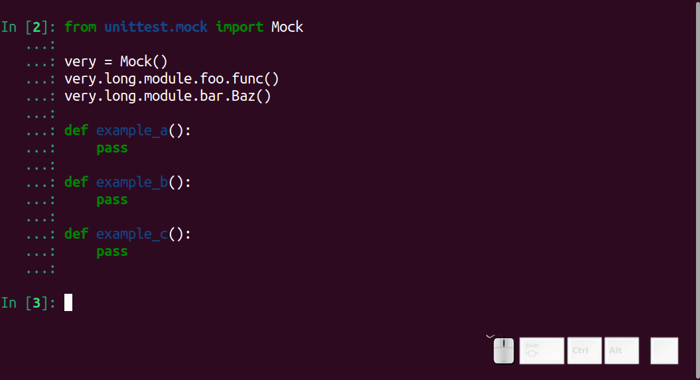

============
 8.x Series
============

.. _version 8.32:

IPython 8.32
============

Medium release of IPython for this end of January and this new year 2025.
This is now a different branch than the main branch, and will only accumulate
bugfixes and small improvements and requested backports, while 9.0 forges ahead.

We'll note 4 bugfixes and an and unstable preview feature.

- :ghpull:`14640` Fixes an error were a warning about virtualenvs was incorrectly triggered.

- :ghpull:`14684` Fixes an issue on Python 3.12+ with post mortem debugging.
- :ghpull:`14693` Fixes a bug where magics were ignoring SIGINT
- :ghpull:`14695` Fixes an issue where magics would not display all subprocess output.

As a preview feature, look into the ``examples`` folder on how to configure
autosuggestion using a large language model. This is not yet ready for
production use, has only partial documentation and can change without warning,
but should allow you to hook in a Jupyter-ai LLM provider to suggest code in the
CLI (currently only via a keyboard shortcut). See :ghpull:`14623` for more details
until further documentation is available in 9.0. 

As usual you can find the full list of PRs on GitHub under `the 8.32
<https://github.com/ipython/ipython/milestone/140?closed=1>`__ milestone.

For something completely different
----------------------------------

`Dora Rudolfine Richter <https://en.wikipedia.org/wiki/Dora_Richter>`__
1892–1966 was a German trans woman and the first known person to undergo
complete male-to-female gender-affirming surgery. After fleeing Nazi Germany,
she lived in Czechoslovakia where she obtained her full legal name change in
April 1934. She moved back to Germany in 1946 with the expulsion of Germans from
Czechoslovakia where she lived until her death at the age of 74 in April 1966.

Thanks
------

Thanks to everyone who helped with the 8.32 release and working toward 9.0.

Thanks as well to the `D. E. Shaw group <https://deshaw.com/>`__ for sponsoring
work on IPython and related libraries, in particular the work around LLM
integration.

.. _version 8.31:

IPython 8.31
============

Small release for this end of December; This release contains only two notable changes:

  - :ghpull:`14594` Fix completion in tuples, where the completion was
    suggesting tuples methods instead of methods and attributes of the current
    element.
  - :ghpull:`14598` Fix  pdb issue with Python 3.13.1, this fix is not perfect
    (see :ghissue:`14620`) but should be sufficient for now.

As usual you can find the full list of PRs on GitHub under `the 8.31
<https://github.com/ipython/ipython/milestone/138?closed=1>`__ milestone.

Road to 9.0
-----------

The current main branch is now on it's way to be 9.0; do not expect many new
features but a large codebase refactor, and cleanup with many deprecated code
removed, and more aggressive codestyle enforcement.

For something completely different
----------------------------------

`Emmy Noether <https://en.wikipedia.org/wiki/Emmy_Noether>`__ was a German
mathematician who made groundbreaking contributions to abstract algebra and
theoretical physics. Her work on Noether's theorem, which describes the
relationship between symmetries and conservation laws, has had a profound impact
on the development of modern physics. Noether's work was largely overlooked
during her lifetime, but her legacy as one of the most important mathematicians
of the 20th century has been recognized and celebrated in recent years.

Thanks
------

Thanks as well to the `D. E. Shaw group <https://deshaw.com/>`__ for sponsoring
work on IPython and related libraries.

.. _version 8.30:

IPython 8.30
============

Small release for this end of november;

 - :ghpull:`14579` improve the documentatation for custom IPython formatters, and how
   you can register formatters for custom mime types.
 - :ghpull:`14580` fix a bug in which commands that were not assigned a shortcut
   could not be assigned one.
 - :ghpull:`12690` fix a bug in which a single ``/`` on an empty line would not be
   an error. This is due to the ``autocall`` behavior that we are thinking of
   deprecating.

The rest of the PRs are mostly maintenance and documentation improvements.

As usual you can find the full list of PRs on GitHub under `the 8.30
<https://github.com/ipython/ipython/milestone/137?closed=1>`__ milestone.

For something completely different
----------------------------------

`Ada Lovelace <https://en.wikipedia.org/wiki/Ada_Lovelace>`__ is considered the
first computer programmer. In the 1840s, she wrote what is recognized as the
first algorithm intended to be processed by a machine - Charles Babbage's
proposed Analytical Engine. Her notes included what would today be called a
computer program, making her the first programmer in history. She also uniquely
understood that computers could go beyond mere calculation and could be used to
create music or art - a visionary insight that was far ahead of her time.
Despite living in an era when women had limited access to scientific education,
she made groundbreaking contributions that laid the foundation for modern
computing.

Thanks
------

Thanks as well to the `D. E. Shaw group <https://deshaw.com/>`__ for sponsoring
work on IPython and related libraries.

.. _version 8.29:

IPython 8.29
============

Medium release for this end of october;

 - Misc Python 3.13 compatibility :ghpull:`14536`, :ghpull:`14559`
 - Add a ``uv`` line magic :ghpull:`14537`
 - Add support for WEBP to ``IPython.display.Image``. :ghpull:`14526`
 - And many more bugfixes and quality of life improvements.

As usual you can find the full list of PRs on GitHub under `the 8.29
<https://github.com/ipython/ipython/milestone/136?closed=1>`__ milestone.

Preparing for 9.0
-----------------

IPython 3.13 was released earlier this month, and this means that according to
`Spec-0 <https://scientific-python.org/specs/spec-0000/>`__, support for 3.10
will end soon.

There have been many minor version of IPython 8.x, so it is likely that one of
the next version will simply bump to 9.0 and remove a lot of code mark as
deprecated, and documentation/examples not relevant for terminal IPython.

The frequency of release and my time reviewing will also likely decrease more
than it has already.

For something completely different
----------------------------------

`Rosalind Franklin <https://en.wikipedia.org/wiki/Rosalind_Franklin>`__ made
some of the biggest contribution to the discovery of the helix structure of DNA.
Unfortunately her work was `not recognized
<https://www.nature.com/scitable/topicpage/rosalind-franklin-a-crucial-contribution-6538012/>`__

Thanks
------

Thanks as well to the `D. E. Shaw group <https://deshaw.com/>`__ for sponsoring
work on IPython and related libraries.

.. _version 8.28:

IPython 8.28
============

Slight delay of this September release as I was busy at Pydata Paris last week.
Not many user visible changes for this release, a couple of bug fixes and
workaround:

 - :ghpull:`14480` AssertionError: assert _xterm_term_title_saved in WSL – It is
   unclear why the terminal title is not saved in WSL, if you've WSL experience
   we'd love your feedback and help to not just ignore an error
 - :ghpull:`14510` Fix use of pyside6 >= 6.7.0
 - :ghpull:`14518` Make values public (_tb_highlight & _tb_highlight_style)
 - :ghpull:`14515` Use environment variable to identify conda / mamba

As usual you can find the full list of PRs on GitHub under `the 8.28
<https://github.com/ipython/ipython/milestone/135?closed=1>`__ milestone.

For something completely different
----------------------------------

One of the first works of Science Fiction (`Frankenstein
<https://en.wikipedia.org/wiki/Frankenstein>`__), was written by `Mary Shelley
<https://en.wikipedia.org/wiki/Mary_Shelley>`__ when she was 18, before being
published in London on 1 January 1818 when she was 20. This is often overlooked,
and the role of founders of science fiction attribute to Edgar Allan Poe and
Jules Verne despite being published later.

Thanks
------

Thanks as well to the `D. E. Shaw group <https://deshaw.com/>`__ for sponsoring
work on IPython and related libraries.

.. _version 8.27:

IPython 8.27
============

New release of IPython after a month off (not enough changes). We can see a few
important changes for this release.

 - autocall was being  call getitem, :ghpull:`14486`
 - Only copy files in startup dir if we just created it. :ghpull:`14497`
 - Fix some tests on Python 3.13 RC1 :ghpull:`14504`; this one I guess make this
   the first IPython release officially compatible with Python 3.13; you will
   need the most recent ``executing`` and ``stack_data``, we won't pin to avoid
   forcing user of older Python version to upgrade.

As usual you can find the full list of PRs on GitHub under `the 8.27
<https://github.com/ipython/ipython/milestone/134?closed=1>`__ milestone.

Thanks
------

Many thanks to `@Kleirre <https://github.com/Kleirre>`__ our June intern for
doing her first contribution to open source, doing the releases notes and
release. I guess you didn't even notice it was not me who released :-). I wish
her all the best in her future endeavor and look forward for her work in
astrophysics.

Thanks as well to the `D. E. Shaw group <https://deshaw.com/>`__ for sponsoring
work on IPython and related libraries.

.. _version 8.26:

IPython 8.26
============

Hey, the release of IPython for this month is here! (I know you were waiting for it)

- :ghpull:`14453` bugfix for call to structured_traceback

- :ghpull:`14466` fixed honoring custom repr for NamedTuple if assigned by partialmethod

- :ghpull:`14451` Convert matplotlib gui name in enable_gui

As usual you can find the full list of PRs on GitHub under `the 8.26
<https://github.com/ipython/ipython/milestone/133?closed=1>`__ milestone.

Thanks
------

Thanks to the `D. E. Shaw group <https://deshaw.com/>`__ for sponsoring
work on IPython and related libraries.

.. _version 8.25:

IPython 8.25
============

Mostly internal changes for this end of may release of IPython.

We'll count about a dozen PRs for this moth, with small bugfixes related to
matplotlib fixes.

Of notable interest,

 - :ghpull:`14426` replaces the unicode micro symbol with greek letter mu,
   visually identical but should fix nfkc normalisations issues.

 - :ghpull:`14444` introduces ``intersphinx_registry``  as a new dependency
   which is recommended only to build documentation.

As usual you can find the full list of PRs on GitHub under `the 8.25
<https://github.com/ipython/ipython/milestone/132?closed=1>`__ milestone.

Thanks
------

Thanks to the `D. E. Shaw group <https://deshaw.com/>`__ for sponsoring
work on IPython and related libraries.

.. _version 8.24:

IPython 8.24
============

Back on regular release schedule, as usual month releases are relatively tiny.

The biggest change is the move of the matplotlib backend handling from IPython
to matplotlib. :ghpull:`14371` :ghpull:`14403`.

We will note:

 - pytest 8 compatibility :ghpull:`14413`
 - ``typing-extension`` now needs 4.6 or newer. It was already the case, but not
   explicated. :ghpull:`14380`
 - Attempt to speed running code under debugger in some cases. :ghpull:`14386`
   :ghpull:`14418`.
 - Multiple fixes to documentation for ipyparallel, simple_prompt and emacs
   :ghpull:`14384` :ghpull:`14404` :ghpull:`14407`
 - Maintenance and cleanup of debugger :ghpull:`14387` :ghpull:`14393`

As usual you can find the full list of PRs on GitHub under `the 8.24
<https://github.com/ipython/ipython/milestone/131?closed=1>`__ milestone.

Thanks
------

Thanks to the `D. E. Shaw group <https://deshaw.com/>`__ for sponsoring
work on IPython and related libraries.

.. _version 8.23:

IPython 8.23
============

Super tiny release of IPython on Sunday – a bit later than usual, which is also
`🏳️‍⚧️ International Transgender Day of Visibility🏳️‍⚧️
<https://en.wikipedia.org/wiki/International_Transgender_Day_of_Visibility>`_ –
so a though for you on this day, you matter and you are valid [1]_.

This is a minuscule release with only 5 Pull requests.

Main change is :ghpull:`14357` which improve inference from return type
annotations in completer and the introduction of the optional target
``ipython[matplotlib]`` to explicitly request the matplotlib optional
dependencies.

As usual you can find the full list of PRs on GitHub under `the 8.23
<https://github.com/ipython/ipython/milestone/130?closed=1>`__ milestone.

Thanks
------

Thanks to the `D. E. Shaw group <https://deshaw.com/>`__ for sponsoring
work on IPython and related libraries.

.. _version 8.22:

IPython 8.22, 8.22.1 and 8.22.2
===============================

Quick release of IPython for this short month of February, with quite a bit of
activity with more than 15 PRs.

I am not going to details all the changes, but among other we have :

 - More compatibility with emscripten :ghpull:`14316`, :ghpull:`14318`,
 - Test more downstream project to avoid breakage :ghpull:`14317`
 - Fix recently introduced bug with the ``store`` magic.
 - Fix issues with multiple call to ``matplotlib.pyplot.switch_backend``
 - Fix crashing IPython when some tracebacks encounter dynamically evaluated
   code.

IPython 8.22.1 increase the minimal traitlets version, and 8.22.2 fix a critical
bug on emscripten  preventing to use some magics like ``%matplotlib`` on
jupyter-light.

API changes
-----------

One of the largest change is the update the mimehooks and inspector API, see
:ghpull:`14342`. It should be backward compatible, but many hooks now receive a
single object with many fields allowing us flexibility to update the API later.

Packaging changes
-----------------

Thanks to `@mkoppe <https://github.com/mkoeppe>`__, we are slowly getting rid of
setup.py finally migrating to ``pyproject.toml``. There is still quite a bit of
work, and please open an issue if you encounter any problem.

Deprecation
-----------

A number of unused functions have been marked deprecated or pending deprecation.
Please let us know if you encounter any of those deprecation messages for us to
adjust the removal timeline.

Thanks
------

Many thanks to `@mkoppe <https://github.com/mkoeppe>`__ and `@krassowski
<https://github.com/krassowski>`__ for their multiple contributions and codebase
cleanup.

As usual you can find the full list of PRs on GitHub under `the 8.22
<https://github.com/ipython/ipython/milestone/129?closed=1>`__ milestone.

Thanks to the `D. E. Shaw group <https://deshaw.com/>`__ for sponsoring
work on IPython and related libraries.

.. _version 8.21:

IPython 8.21
============

More substantial release of IPython slightly out of schedule as it was not
possible for me to make a release last Friday.

Few new features are present, but the codebase has been cleaned, and a couple
of API are _considered_ for deprecation. They are not deprecated yet, but as
they do not seem to be quite used, they may emit a warning, in which case please
comment on the relevant issue to inform me of _which_ project use those feature
and how you use them. Depending on the feedback I might change the timeline for
deprecation.

This release saw 14 PRs, with more outside contribution than usual,
I'll note in particular PRs related to making IPython work on emscripten.

I also want to point that we are _trying_ to keep compatibility with Python 3.13,
but it's a cat and mouse game. Plus I am low on time, so I would appreciate any
help with that.

Deprecations
------------

 - :ghpull:`14307` Pending Deprecation of
   ``ColorSchemeTable.set_active_scheme(...)``'s ``case_sensitive`` Parameter.
 - :ghpull:`14305` Pending Deprecation of constructing ``ColorScheme`` via
   ``kwargs``, in favor passing a single dict.

Fixes
-----

 - :ghpull:`14284` TerminalIPythonApp's would warn that ``auto_create`` option is not
   recognized.
 - :ghpull:`14286` Fix a crash with ``NotOneValueFound`` when rendering complex
   tracebacks.

 - :ghpull:`14287` Partial Python 3.13 compatibility
 - :ghpull:`14290` Docs/Typos.

Changes
~~~~~~~

 - :ghpull:`14289` ``ipdb.set_trace()`` now accepts ``header=`` for better
   compatibility with ``pdb.set_trace()``

 - :ghpull:`14300` and :ghpull:`14301` Add hooking ability to produce
   mimebundle.

We'll outline :ghpull:`14300`, it is now possible to extend the ``?/??``
operator to return more mimetypes to render richer help in frontends that
support it. In particular you could send a json representation of the help that
could be displayed in a customizable way.

Miscellaneous
-------------

 - :ghpull:`14291` Misc Refactor of Color handling
 - :ghpull:`14295` Misc test skip on problematic Pypy versions.

Thanks
~~~~~~

Special thanks to all our contributors, and to the Pypy team that was extremely
reactive in helping to investigate a fixing a rare unicode+windows bug.

As usual you can find the full list of PRs on GitHub under `the 8.21
<https://github.com/ipython/ipython/milestone/128?closed=1>`__ milestone.

Thanks to the `D. E. Shaw group <https://deshaw.com/>`__ for sponsoring
work on IPython and related libraries.

.. _version 8.20:

IPython 8.20
============

Quick IPython release in this beginning of 2024, barely 2 weeks after the previous
release.

This is mostly to fix a backward compatibility issue, I would have done a  patch
release earlier if I could. As a few other cleanup are also part of this
release, this will get a minor version bump.

The crux of this release is :ghpull:`14274` (Inspect continuation prompt
signature and pass only viable arguments), the rest of the changes are mostly
type annotation, and a few compatibility issues with Python 3.13 that are
getting addressed.

Python 3.13 compatibility is still not complete (help welcomed).

As usual you can find the full list of PRs on GitHub under `the 8.20
<https://github.com/ipython/ipython/milestone/127?closed=1>`__ milestone.

Thanks to the `D. E. Shaw group <https://deshaw.com/>`__ for sponsoring
work on IPython and related libraries.

.. _version 8.19:

IPython 8.19
============

New release of IPython a bit before the end of the month, and end of the year.

Mostly cleanup and deprecation, due to upstream deprecation and removal.

Remove of Python 3.9 support
----------------------------

A bit later than originally plan, IPython 8.19 does not support Python 3.9
anymore, as well as the few conditional code that were executing only on Python
3.9. :ghpull:`14254`

We used the opportunity to deprecate ``IPython.utils.tz`` :ghpull:`14256`, due
to upstream deprecation of some timezone utilities. It will be removed at a later
date.

We now also run CI on Python 3.12 (what I likely should have done before), but
running on too many Python version uses a lot of CI time.

Absolute and relative Line Numbers in Prompts
---------------------------------------------

Thanks to the contribution of ``cohml``, IPython CLI now support absolute and
relative line numbers in both vi and emacs prompt, use for example
``c.TerminalInteractiveShell.prompt_line_number_format='{line: 4d}/{rel_line:+03d} | '``
configuration option to display both in a custom format.

Miscellaneous
-------------

In addition to various bugfixes, I unpinned pytest, let me know if there are any
issues and we'll re-pin.

See you in 2024
---------------

As usual you can find the full list of PRs on GitHub under `the 8.19
<https://github.com/ipython/ipython/milestone/126?closed=1>`__ milestone.

Thanks to the `D. E. Shaw group <https://deshaw.com/>`__ for sponsoring
work on IPython and related libraries.

.. _version 8.18:

IPython 8.18 and 8.18.1
=======================

8.18.1 is identical to 8.18 but pin ``prompt_toolkit`` to greater than ``3.0.41``

Small release of IPython that fixes a small number of inconveniences.

 - :ghpull:`14251` Fix a memory leak in qt event loop integration by setting
   the Loop parent to None.
 - :ghpull:`14252` Pickleshare was made an optional dependency in 8.17, this
   leads to warnings in some installations when using modules completions. The
   warning has been silenced.
 - :ghpull:`14241` Update event loop code for compatibility with more recent
   ``prompt_toolkit`` due to deprecations in Python 3.12.
 - :ghpull:`14245` Fix doc example on Pygments styles
 - :ghpull:`14238` Remove dependency on app_nope, this is actually only a
   dependency of IPykernel.

As usual you can find the full list of PRs on GitHub under `the 8.18
<https://github.com/ipython/ipython/milestone/125?closed=1>`__ milestone.

Thanks to the `D. E. Shaw group <https://deshaw.com/>`__ for sponsoring
work on IPython and related libraries.

.. _version 8.17.1:
.. _version 8.17:

IPython 8.17, 8.17.1
====================

Medium-sized release of IPython that includes some cleanup (backcall, python2 leftovers)
and some refactoring improvements (typing, pathlib) and a fix on completion.

  - :ghpull:`14216` remove backcall dependency
  - :ghpull:`14217` make pickleshare dependency optional
  - :ghpull:`14185` support completion based on type annotations of calls

Reverted in 8.17.1:

  - :ghpull:`14190` remove support for python 2 in lexers (reverted in 8.17.1 as it is imported by qtconsole/spyder)

Mamba and Micromamba magic commands
------------------------------------

In addition to the ``%conda`` magic command for calling ``conda`` in IPython,
the ``%mamba`` and ``%micromamba`` magic commands now
call ``mamba`` and ``micromamba`` if they are on ``sys.path``.

.. code::

   %mamba install pkgname
   %micromamba install pkgname
   %conda install pkgname
   %pip install pkgname

   %mamba --help
   %micromamba --help
   %conda --help
   %pip --help    # works w/ JupyterLite
   !pip --help

:ghpull:`14191`

----

As usual you can find the full list of PRs on GitHub under `the 8.17
<https://github.com/ipython/ipython/milestone/123?closed=1>`__ milestone.

Thanks to the `D. E. Shaw group <https://deshaw.com/>`__ for sponsoring
work on IPython and related libraries.

.. _version 8.16:
.. _version 8.16.1:

IPython 8.16, 8.16.1
====================

Small double release of IPython (with the 8.12.3 release notes just below).
Mostly bug fixes and cleanups, and type annotations. Of interest for users:

 - :ghpull:`14153` Fix a bug of the new iPdb chained traceback where some
   Exception would not have any traceback. (see upstream fix in CPython for more
   details).
 - :ghpull:`14168` Fix case with spurious message about event loops when using
   matplotlib.

This PR is in 8.16.0 but reverted in 8.16.1, we'll  rework the fix for 8.17

 - :ghpull:`14163` Fix an error where semicolon would not suppress output.

As usual you can find the full list of PRs on GitHub under `the 8.16
<https://github.com/ipython/ipython/milestone/121?closed=1>`__ and `8.16.1 milestone
<https://github.com/ipython/ipython/milestone/124?closed=1>`__.

Thanks to the `D. E. Shaw group <https://deshaw.com/>`__ for sponsoring
work on IPython and related libraries.

.. _version 8.12.3:

IPython 8.12.3
==============

Tiny release of 8.12.3 that backport a small number of fixes for users still
using Python 3.8.

 - :ghpull:`14080` add passthrough filter shortcuts
 - :ghpull:`14169` Fix `InteractiveShellEmbed`

.. _version 8.15:

IPython 8.15
============

Medium release of IPython after a couple of month hiatus, and a bit
off-schedule.

Among other, IPython 8.15:

 - Improve compatibility with future version of Python 3.12/3.13
   :ghpull:`14107`, :ghpull:`14139`,
 - Improve support for ``ExceptionGroups``, :ghpull:`14108`
 - Fix hangs in ``%gui osx``, :ghpull:`14125`
 - Fix memory lead with ``%reset``, :ghpull:`14133`
 - Unstable config option to modify traceback highlighting that is sometime hard
   to read :ghpull:`14138`
 - Support ``.`` in ``ipdb`` as an argument to the ``list`` command
   :ghpull:`14121`
 - Workroud ``parso`` showing warning message when the default logger level is
   changed :ghpull:`14119`
 - Fix multiple issues with matplotlib interactive mode, qt5/qt6 :ghpull:`14128`

Support for PEP-678 Exception Notes
-----------------------------------

Ultratb now shows :pep:`678` notes, improving your debugging experience on
Python 3.11+ or with libraries such as Pytest and Hypothesis.

Native fallback for displaying ExceptionGroup
---------------------------------------------
ExceptionGroups are now displayed with ``traceback.print_exc``, as a temporary fix until UltraTB properly supports displaying child exceptions.

We have two larger features:

AST-based macros
----------------

:ghpull:`14100` introduce a new and efficient way to modify each execution block
(cell) using an template-ast-based transform. Unlike IPython pre and post code
execution hooks, this actually transform the code that is execute with as
minimal as possible overhead. While it was already technically possible to
register ast transformers for IPython this was far from evident.

This should make it trivial to hook into IPython to implement custom hooks, that
for example time or profile your code, catch exceptions to provide error
messages for students or do any other kind of transformations.

In addition to programmatic API there is also a magic to quickly register
hooks::

   In [1]: %%code_wrap before_after
      ...: print('before')
      ...: __code__
      ...: print('after')
      ...: __ret__

This mean that  for any subsequent execution code will be executed.
You can modify the above to print the date, compute the execution time,
retry the code in a for loop....

Allow IPdb/Pdb to move between chained exceptions
-------------------------------------------------

The main change is the addition of the ability to move between chained
exceptions when using IPdb, this feature was also contributed to upstream Pdb
and is thus native to CPython in Python 3.13+ Though ipdb should support this
feature in older version of Python. I invite you to look at the `CPython changes
and docs <https://github.com/python/cpython/pull/106676>`__ for more details.

In short, once in post-mortem debugger (``%debug``), you can use the ipdb
``exceptions`` command to switch exceptions, for example:

.. code-block:: ipython

    In [1]: def foo(x):
        ...:     try:
        ...:         bar(x)
        ...:     except Exception as e:
        ...:         raise ValueError("foo (): bar failed") from e
        ...:
        ...: def bar(x):
        ...:     1 / X
        ...:

    In [2]: foo(0)
    ---------------------------------------------------------------------------
    NameError                                 Traceback (most recent call last)
    Cell In[1], line 3, in foo(x)
          2 try:
    ----> 3     bar(x)
          4 except Exception as e:

    Cell In[1], line 9, in bar(x)
          8 def bar(x):
    ----> 9     1 / X

    NameError: name 'X' is not defined

    The above exception was the direct cause of the following exception:

    ValueError                                Traceback (most recent call last)
    Cell In[2], line 1
    ----> 1 foo(0)

    Cell In[1], line 5, in foo(x)
          3     bar(x)
          4 except Exception as e:
    ----> 5     raise ValueError("foo (): bar failed") from e

    ValueError: foo (): bar failed

    In [3]: %debug
    > <ipython-input-1-b0bbdc271ffb>(5)foo()
          3         bar(x)
          4     except Exception as e:
    ----> 5         raise ValueError("foo (): bar failed") from e

In previous ipdb you could not go into the bar error, now from within pdb you
can use ``exceptions``:

.. code-block:: ipython

    ipdb> exceptions
        0 NameError("name 'X' is not defined")
    >   1 ValueError('foo (): bar failed')

    ipdb> exceptions 0
    > <ipython-input-1-b0bbdc271ffb>(9)bar()
          6
          7
          8 def bar(x):
    ----> 9     1 / X
         10

    ipdb>

In particular I want to thank the `D.E. Shaw group <https://www.deshaw.com/>`__
for suggesting and funding the two largest feature as well as many bug fixes of
this release.

As usual you can find the full list of PRs on GitHub under `the 8.15 milestone
<https://github.com/ipython/ipython/milestone/120?closed=1>`__.

.. _version 8.14:

IPython 8.14
============

Small release of IPython.

 - :ghpull:`14080` fixes some shortcuts issues.
 - :ghpull:`14056` Add option to ``%autoreload`` to hide errors when reloading code. This will be the default for spyder
   user is my understanding.
 - :ghpull:`14039` (and :ghpull:`14040`) to show exception notes in tracebacks.

 - :ghpull:`14076` Add option to EventManager to prevent printing

SPEC 0 and SPEC 4
-----------------

You've heard about the NEPs, (NumPy enhancement Proposal), having a NEP for something non-numpy specific was sometime confusing.
Long live the `SPECs <https://scientific-python.org/specs/>`_.

We are now trying to follow SPEC 0 (aka old NEP 29) for support of upstream libraries.

We also now try to follow SPEC 4 (test and publish nightly on a centralized nightly repository).
We encourage you to do so as well in order to report breakage, and contribute to the SPEC process !

Python 3.12 compatibility ?
---------------------------

Python 3.12 changed its tokenizer to have better support for f-strings and allow arbitrary expression.
This is a great new feature and performance improvement in Python 3.12.

Unfortunately this means the new tokenizer does not support incomplete or invalid Python which will
break many features of IPython. Thus compatibility of IPython with Python 3.12 is not guaranteed.
It is unclear to which extent IPython is affected, and whether we can/should try to still support magics, shell
escape (``! ....``), ...,  as well as how to do it if we can.

In addition even if we there is technical feasibility to do so, it is no clear we have the resources to do it.
We are thus looking for your help if you can _test_ on Python 3.12 to see to which extent this affects users and which
features are critical.

We are not going to pin IPython to Python ``<3.12`` as otherwise on install pip would downgrade/resolve to IPython 8.13,
so if you plan to update to Python 3.12 after its release, we encourage for extra care.

.. _version 8.13.1:
.. _version 8.13.2:
.. _version 8.12.2:

IPython 8.13.1, 8.13.2 and 8.12.2
=================================

3 quick in succession patch release of IPython in addition to IPython 8.13.0
having been yanked.

IPython 8.13.0 was improperly tagged as still compatible with Python 3.8, and
still had some mention of compatibility with 3.8. IPython 8.13.1 is identical to
8.13 but with the exception of being correctly tagged. This release and yank was
mostly done to fix CI.

IPython 8.12.2 and 8.13.2 contain UI fixes, with respect to right arrow not
working in some case in the terminal, and 8.12.2 contain also a requested
backport of :ghpull:`14029` (Allow safe access to the ``__getattribute__``
method of modules) for tab completion.

.. _version 8.13:

IPython 8.13
============

As usual for the end of the month, minor release of IPython. This release is
significant in that it not only has a number of bugfixes, but also drop support
for Python 3.8 as per NEP 29 (:ghpull:`14023`).

All the critical bugfixes have been backported onto the 8.12.1 release (see
below). In addition to that went into 8.12.1 you'll find:

 - Pretty representation for ``Counter`` has been fixed to match the Python one
   and be in decreasing order. :ghpull:`14032`
 - Module completion is better when jedi is disabled :ghpull:`14029`.
 - Improvement of ``%%bash`` magic that would get stuck :ghpull:`14019`

We hope you enjoy this release an will maybe see you at JupyterCon in less than
two weeks.

As usual you can find the full list of PRs on GitHub under `the 8.13 milestone
<https://github.com/ipython/ipython/milestone/115?closed=1>`__.

Thanks to the `D. E. Shaw group <https://deshaw.com/>`__ for sponsoring
work on IPython and related libraries.

.. _version 8.12.1:

IPython 8.12.1
==============

This is the twin release of IPython 8.13 that contain only critical UI and bug
fixes. The next minor version of IPython has dropped support for Python 3.8 – as
per Nep 29 and this IPython 8.12.x will now only receive bugfixes.

 - :ghpull:`14004` Fix a bug introduced in IPython 8.12 that crash when
   inspecting some docstrings.
 - :ghpull:`14010` Fix fast traceback code that was not working in some case.
 - :ghpull:`14014` Fix ``%page`` magic broken in some case.
 - :ghpull:`14026`, :ghpull:`14027` Tweak default shortcut with respect to
   autosuggestions.
 - :ghpull:`14033` add back the ability to use ``.get()`` on OInfo object for
   backward compatibility with h5py (this will be re-deprecated later, and h5py
   will also get a fix).

As usual you can find the full list of PRs on GitHub under `the 8.12.1 milestone
<https://github.com/ipython/ipython/milestone/116?closed=1>`__.

Thanks to the `D. E. Shaw group <https://deshaw.com/>`__ for sponsoring
work on IPython and related libraries.

.. _version 8.12.0:

IPython 8.12
============

Hopefully slightly early release for IPython 8.12. Last Thursday of the month,
even if I guess it's likely already Friday somewhere in the pacific ocean.

A number of PRs and bug fixes this month with close to 20 PRs merged !

The IPython repo reached :ghpull:`14000` !! Actually the PR that create those exact release
note is :ghpull:`14000`. Ok, more issues and PR is not always better, and I'd
love to have more time to close issues and Pull Requests.

Let's note that in less than 2 month JupyterCon is back, in Paris please visit
`jupytercon.com <https://jupytercon.com>`__, and looking forward to see you
there.

Packagers should take note that ``typing_extension`` is now a mandatory dependency
for Python versions ``<3.10``.

Let's note also that according to `NEP29
<https://numpy.org/neps/nep-0029-deprecation_policy.html>`__, It is soon time to
stop support for Python 3.8 that will be release more than 3 and 1/2 years ago::

    On Apr 14, 2023 drop support for Python 3.8 (initially released on Oct 14, 2019)

Thus I am likely to stop advertising support for Python 3.8 in the next
release at the end of April.

Here are some miscellaneous updates of interest:

 - :ghpull:`13957` brings updates to the Qt integration, particularly for Qt6.
 - :ghpull:`13960` fixes the %debug magic command to give access to the local
   scope.
 - :ghpull:`13964` fixes some crashes with the new fast traceback code. Note that
   there are still some issues with the fast traceback code, and I a, likely
   to fix and tweak behavior.
 - :ghpull:`13973` We are slowly migrating IPython internals to use proper type
   objects/dataclasses instead of dictionaries to allow static typing checks.
   These are technically public API and could lead to breakage, so please let us
   know if that's the case and I'll mitigate.
 - :ghpull:`13990`, :ghpull:`13991`, :ghpull:`13994` all improve keybinding and
   shortcut configurability.

As usual you can find the full list of PRs on GitHub under `the 8.12 milestone
<https://github.com/ipython/ipython/milestone/114?closed=1>`__.

We want to thank the D.E. Shaw group for requesting and sponsoring the work on
the following big feature. We had productive discussions on how to best expose
this feature

Dynamic documentation dispatch
------------------------------

We are experimenting with dynamic documentation dispatch for object attribute.
See :ghissue:`13860`. The goal is to allow object to define documentation for
their attributes, properties, even when those are dynamically defined with
`__getattr__`.

In particular when those objects are base types it can be useful to show the
documentation

.. code-block:: ipython

    In [1]: class User:
       ...:
       ...:     __custom_documentations__ = {
       ...:         "first": "The first name of the user.",
       ...:         "last": "The last name of the user.",
       ...:     }
       ...:
       ...:     first:str
       ...:     last:str
       ...:
       ...:     def __init__(self, first, last):
       ...:         self.first = first
       ...:         self.last = last
       ...:
       ...:     @property
       ...:     def full(self):
       ...:         """`self.first` and `self.last` joined by a space."""
       ...:         return self.first + " " + self.last
       ...:
       ...:
       ...: user = Person('Jane', 'Doe')

    In [2]: user.first?
    Type:            str
    String form:     Jane
    Length:          4
    Docstring:       the first name of a the person object, a str
    Class docstring:
    ....

    In [3]: user.last?
    Type:            str
    String form:     Doe
    Length:          3
    Docstring:       the last name, also a str
    ...

We can see here the symmetry with IPython looking for the docstring on the
properties:

.. code-block:: ipython

    In [4]: user.full?
    HERE
    Type:        property
    String form: <property object at 0x102bb15d0>
    Docstring:   first and last join by a space

Note that while in the above example we use a static dictionary, libraries may
decide to use a custom object that define ``__getitem__``, we caution against
using objects that would trigger computation to show documentation, but it is
sometime preferable for highly dynamic code that for example export an API as
object.

.. _version 8.11.0:

IPython 8.11
============

Back on almost regular monthly schedule for IPython with end-of-month
really-late-Friday release to make sure some bugs are properly fixed.
Small addition of with a few new features, bugfix and UX improvements.

This is a non-exhaustive list, but among other you will find:

Faster Traceback Highlighting
-----------------------------

Resurrection of pre-IPython-8 traceback highlighting code.

Really long and complicated files were slow to highlight in traceback with
IPython 8 despite upstream improvement that make many case better. Therefore
starting with IPython 8.11 when one of the highlighted file is more than 10 000
line long by default, we'll fallback to a faster path that does not have all the
features of highlighting failing AST nodes.

This can be configures by setting the value of
``IPython.code.ultratb.FAST_THRESHOLD`` to an arbitrary low or large value.

Autoreload verbosity
--------------------

We introduce more descriptive names for the ``%autoreload`` parameter:

- ``%autoreload now`` (also ``%autoreload``) - perform autoreload immediately.
- ``%autoreload off`` (also ``%autoreload 0``) - turn off autoreload.
- ``%autoreload explicit`` (also ``%autoreload 1``) - turn on autoreload only for modules
  whitelisted by ``%aimport`` statements.
- ``%autoreload all`` (also ``%autoreload 2``) - turn on autoreload for all modules except those
  blacklisted by ``%aimport`` statements.
- ``%autoreload complete`` (also ``%autoreload 3``) - all the features of ``all`` but also adding new
  objects from the imported modules (see
  IPython/extensions/tests/test_autoreload.py::test_autoload_newly_added_objects).

The original designations (e.g. "2") still work, and these new ones are case-insensitive.

Additionally, the option ``--print`` or ``-p`` can be added to the line to print the names of
modules being reloaded. Similarly, ``--log`` or ``-l`` will output the names to the logger at INFO
level. Both can be used simultaneously.

The parsing logic for ``%aimport`` is now improved such that modules can be whitelisted and
blacklisted in the same line, e.g. it's now possible to call ``%aimport os, -math`` to include
``os`` for ``%autoreload explicit`` and exclude ``math`` for modes ``all`` and ``complete``.

Terminal shortcuts customization
--------------------------------

Previously modifying shortcuts was only possible by hooking into startup files
and practically limited to adding new shortcuts or removing all shortcuts bound
to a specific key. This release enables users to override existing terminal
shortcuts, disable them or add new keybindings.

For example, to set the :kbd:`right` to accept a single character of auto-suggestion
you could use::

    my_shortcuts = [
        {
            "command": "IPython:auto_suggest.accept_character",
            "new_keys": ["right"]
        }
    ]
    %config TerminalInteractiveShell.shortcuts = my_shortcuts

You can learn more in :std:configtrait:`TerminalInteractiveShell.shortcuts`
configuration reference.

Miscellaneous
-------------

 - ``%gui`` should now support PySide6. :ghpull:`13864`
 - Cli shortcuts can now be configured :ghpull:`13928`, see above.
   (note that there might be an issue with prompt_toolkit 3.0.37 and shortcut configuration).

 - Capture output should now respect ``;`` semicolon to suppress output.
   :ghpull:`13940`
 - Base64 encoded images (in jupyter frontend), will not have trailing newlines.
   :ghpull:`13941`

As usual you can find the full list of PRs on GitHub under `the 8.11 milestone
<https://github.com/ipython/ipython/milestone/113?closed=1>`__.

Thanks to the `D. E. Shaw group <https://deshaw.com/>`__ for sponsoring
work on IPython and related libraries.

.. _version 8.10.0:

IPython 8.10
============

Out of schedule release of IPython with minor fixes to patch a potential CVE-2023-24816.
This is a really low severity CVE that you most likely are not affected by unless:

 - You are on windows.
 - You have a custom build of Python without ``_ctypes``
 - You cd or start IPython or Jupyter in untrusted directory which names may be
   valid shell commands.

You can read more on `the advisory
<https://github.com/ipython/ipython/security/advisories/GHSA-29gw-9793-fvw7>`__.

In addition to fixing this CVE we also fix a couple of outstanding bugs and issues.

As usual you can find the full list of PRs on GitHub under `the 8.10 milestone
<https://github.com/ipython/ipython/milestone/112?closed=1>`__.

In Particular:

 - bump minimum numpy to `>=1.21` version following NEP29. :ghpull:`13930`
 - fix for compatibility with MyPy 1.0. :ghpull:`13933`
 - fix nbgrader stalling when IPython's ``showtraceback`` function is
   monkeypatched. :ghpull:`13934`

As this release also contains those minimal changes in addition to fixing the
CVE I decided to bump the minor version anyway.

This will not affect the normal release schedule, so IPython 8.11 is due in
about 2 weeks.

.. _version 8.9.0:

IPython 8.9.0
=============

Second release of IPython in 2023, last Friday of the month, we are back on
track. This is a small release with a few bug-fixes, and improvements, mostly
with respect to terminal shortcuts.

The biggest improvement for 8.9 is a drastic amelioration of the
auto-suggestions sponsored by D.E. Shaw and implemented by the more and more
active contributor `@krassowski <https://github.com/krassowski>`__.

- ``right`` accepts a single character from suggestion
- ``ctrl+right`` accepts a semantic token (macos default shortcuts take
  precedence and need to be disabled to make this work)
- ``backspace`` deletes a character and resumes hinting autosuggestions
- ``ctrl-left`` accepts suggestion and moves cursor left one character.
- ``backspace`` deletes a character and resumes hinting autosuggestions
- ``down`` moves to suggestion to later in history when no lines are present below the cursors.
- ``up`` moves to suggestion from earlier in history when no lines are present above the cursor.

This is best described by the Gif posted by `@krassowski
<https://github.com/krassowski>`__, and in the PR itself :ghpull:`13888`.

Please report any feedback in order for us to improve the user experience.
In particular we are also working on making the shortcuts configurable.

If you are interested in better terminal shortcuts, I also invite you to
participate in issue `13879
<https://github.com/ipython/ipython/issues/13879>`__.

As we follow `NEP29
<https://numpy.org/neps/nep-0029-deprecation_policy.html>`__, next version of
IPython will officially stop supporting numpy 1.20, and will stop supporting
Python 3.8 after April release.

As usual you can find the full list of PRs on GitHub under `the 8.9 milestone
<https://github.com/ipython/ipython/milestone/111?closed=1>`__.

Thanks to the `D. E. Shaw group <https://deshaw.com/>`__ for sponsoring
work on IPython and related libraries.

.. _version 8.8.0:

IPython 8.8.0
=============

First release of IPython in 2023 as there was no release at the end of
December.

This is an unusually big release (relatively speaking) with more than 15 Pull
Requests merged.

Of particular interest are:

 - :ghpull:`13852` that replaces the greedy completer and improves
   completion, in particular for dictionary keys.
 - :ghpull:`13858` that adds ``py.typed`` to ``setup.cfg`` to make sure it is
   bundled in wheels.
 - :ghpull:`13869` that implements tab completions for IPython options in the
   shell when using `argcomplete <https://github.com/kislyuk/argcomplete>`. I
   believe this also needs a recent version of Traitlets.
 - :ghpull:`13865` makes the ``inspector`` class of `InteractiveShell`
   configurable.
 - :ghpull:`13880` that removes minor-version entrypoints as the minor version
   entry points that would be included in the wheel would be the one of the
   Python version that was used to build the ``whl`` file.

In no particular order, the rest of the changes update the test suite to be
compatible with Pygments 2.14, various docfixes, testing on more recent python
versions and various updates.

As usual you can find the full list of PRs on GitHub under `the 8.8 milestone
<https://github.com/ipython/ipython/milestone/110>`__.

Many thanks to @krassowski for the many PRs and @jasongrout for reviewing and
merging contributions.

Thanks to the `D. E. Shaw group <https://deshaw.com/>`__ for sponsoring
work on IPython and related libraries.

.. _version 8.7.0:

IPython 8.7.0
=============

Small release of IPython with a couple of bug fixes and new features for this
month. Next month is the end of year, it is unclear if there will be a release
close to the new year's eve, or if the next release will be at the end of January.

Here are a few of the relevant fixes,
as usual you can find the full list of PRs on GitHub under `the 8.7 milestone
<https://github.com/ipython/ipython/pulls?q=milestone%3A8.7>`__.

   - :ghpull:`13834` bump the minimum prompt toolkit to 3.0.11.
   - IPython shipped with the ``py.typed`` marker now, and we are progressively
     adding more types. :ghpull:`13831`
   - :ghpull:`13817` add configuration of code blacks formatting.

Thanks to the `D. E. Shaw group <https://deshaw.com/>`__ for sponsoring
work on IPython and related libraries.

.. _version 8.6.0:

IPython 8.6.0
=============

Back to a more regular release schedule (at least I try), as Friday is
already over by more than 24h hours. This is a slightly bigger release with a
few new features that contain no less than 25 PRs.

We'll notably found a couple of non negligible changes:

The ``install_ext`` and related functions have been removed after being
deprecated for years. You can use pip to install extensions. ``pip`` did not
exist when ``install_ext`` was introduced. You can still load local extensions
without installing them. Just set your ``sys.path`` for example. :ghpull:`13744`

IPython now has extra entry points that use the major *and minor* version of
python. For some of you this means that you can do a quick ``ipython3.10`` to
launch IPython from the Python 3.10 interpreter, while still using Python 3.11
as your main Python. :ghpull:`13743`

The completer matcher API has been improved. See :ghpull:`13745`. This should
improve the type inference and improve dict keys completions in many use case.
Thanks ``@krassowski`` for all the work, and the D.E. Shaw group for sponsoring
it.

The color of error nodes in tracebacks can now be customized. See
:ghpull:`13756`. This is a private attribute until someone finds the time to
properly add a configuration option. Note that with Python 3.11 that also shows
the relevant nodes in traceback, it would be good to leverage this information
(plus the "did you mean" info added on attribute errors). But that's likely work
I won't have time to do before long, so contributions welcome.

As we follow NEP 29, we removed support for numpy 1.19 :ghpull:`13760`.

The ``open()`` function present in the user namespace by default will now refuse
to open the file descriptors 0,1,2 (stdin, out, err), to avoid crashing IPython.
This mostly occurs in teaching context when incorrect values get passed around.

The ``?``, ``??``, and corresponding ``pinfo``, ``pinfo2`` magics can now find
objects inside arrays. That is to say, the following now works::

   >>> def my_func(*arg, **kwargs):pass
   >>> container = [my_func]
   >>> container[0]?

If ``container`` define a custom ``getitem``, this __will__ trigger the custom
method. So don't put side effects in your ``getitems``. Thanks to the D.E. Shaw
group for the request and sponsoring the work.

As usual you can find the full list of PRs on GitHub under `the 8.6 milestone
<https://github.com/ipython/ipython/pulls?q=milestone%3A8.6>`__.

Thanks to all hacktoberfest contributors, please contribute to
`closember.org <https://closember.org/>`__.

Thanks to the `D. E. Shaw group <https://deshaw.com/>`__ for sponsoring
work on IPython and related libraries.

.. _version 8.5.0:

IPython 8.5.0
=============

First release since a couple of month due to various reasons and timing preventing
me for sticking to the usual monthly release the last Friday of each month. This
is of non negligible size as it has more than two dozen PRs with various fixes
an bug fixes.

Many thanks to everybody who contributed PRs for your patience in review and
merges.

Here is a non-exhaustive list of changes that have been implemented for IPython
8.5.0. As usual you can find the full list of issues and PRs tagged with `the
8.5 milestone
<https://github.com/ipython/ipython/pulls?q=is%3Aclosed+milestone%3A8.5+>`__.

 - Added a shortcut for accepting auto suggestion. The End key shortcut for
   accepting auto-suggestion This binding works in Vi mode too, provided
   ``TerminalInteractiveShell.emacs_bindings_in_vi_insert_mode`` is set to be
   ``True`` :ghpull:`13566`.

 - No popup in window for latex generation when generating latex (e.g. via
   `_latex_repr_`) no popup window is shows under Windows. :ghpull:`13679`

 - Fixed error raised when attempting to tab-complete an input string with
   consecutive periods or forward slashes (such as "file:///var/log/...").
   :ghpull:`13675`

 - Relative filenames in Latex rendering :
   The `latex_to_png_dvipng` command internally generates input and output file
   arguments to `latex` and `dvipis`. These arguments are now generated as
   relative files to the current working directory instead of absolute file
   paths. This solves a problem where the current working directory contains
   characters that are not handled properly by `latex` and `dvips`. There are
   no changes to the user API. :ghpull:`13680`

 - Stripping decorators bug: Fixed bug which meant that ipython code blocks in
   restructured text documents executed with the ipython-sphinx extension
   skipped any lines of code containing python decorators. :ghpull:`13612`

 - Allow some modules with frozen dataclasses to be reloaded. :ghpull:`13732`
 - Fix paste magic on wayland. :ghpull:`13671`
 - show maxlen in deque's repr. :ghpull:`13648`

Restore line numbers for Input
------------------------------

Line number information in tracebacks from input are restored.
Line numbers from input were removed during the transition to v8 enhanced traceback reporting.

So, instead of::

    ---------------------------------------------------------------------------
    ZeroDivisionError                         Traceback (most recent call last)
    Input In [3], in <cell line: 1>()
    ----> 1 myfunc(2)

    Input In [2], in myfunc(z)
          1 def myfunc(z):
    ----> 2     foo.boo(z-1)

    File ~/code/python/ipython/foo.py:3, in boo(x)
          2 def boo(x):
    ----> 3     return 1/(1-x)

    ZeroDivisionError: division by zero

The error traceback now looks like::

      ---------------------------------------------------------------------------
      ZeroDivisionError                         Traceback (most recent call last)
      Cell In [3], line 1
      ----> 1 myfunc(2)

      Cell In [2], line 2, in myfunc(z)
            1 def myfunc(z):
      ----> 2     foo.boo(z-1)

      File ~/code/python/ipython/foo.py:3, in boo(x)
            2 def boo(x):
      ----> 3     return 1/(1-x)

      ZeroDivisionError: division by zero

or, with xmode=Plain::

    Traceback (most recent call last):
      Cell In [12], line 1
        myfunc(2)
      Cell In [6], line 2 in myfunc
        foo.boo(z-1)
      File ~/code/python/ipython/foo.py:3 in boo
        return 1/(1-x)
    ZeroDivisionError: division by zero

:ghpull:`13560`

New setting to silence warning if working inside a virtual environment
----------------------------------------------------------------------

Previously, when starting IPython in a virtual environment without IPython installed (so IPython from the global environment is used), the following warning was printed:

    Attempting to work in a virtualenv. If you encounter problems, please install IPython inside the virtualenv.

This warning can be permanently silenced by setting ``c.InteractiveShell.warn_venv`` to ``False`` (the default is ``True``).

:ghpull:`13706`

-------

Thanks to the `D. E. Shaw group <https://deshaw.com/>`__ for sponsoring
work on IPython and related libraries.

.. _version 8.4.0:

IPython 8.4.0
=============

As for 7.34, this version contains a single fix:  fix uncaught BdbQuit exceptions on ipdb
exit :ghpull:`13668`, and a single typo fix in documentation: :ghpull:`13682`

Thanks to the `D. E. Shaw group <https://deshaw.com/>`__ for sponsoring
work on IPython and related libraries.

.. _version 8.3.0:

IPython 8.3.0
=============

 - :ghpull:`13625`, using ``?``, ``??``, ``*?`` will not call
   ``set_next_input`` as most frontend allow proper multiline editing and it was
   causing issues for many users of multi-cell frontends. This has been backported to 7.33

 - :ghpull:`13600`, ``pre_run_*``-hooks will now have a ``cell_id`` attribute on
   the info object when frontend provides it. This has been backported to 7.33

 - :ghpull:`13624`, fixed :kbd:`End` key being broken after accepting an
   auto-suggestion.

 - :ghpull:`13657` fixed an issue where history from different sessions would be mixed.

.. _version 8.2.0:

IPython 8.2.0
=============

IPython 8.2 mostly bring bugfixes to IPython.

 - Auto-suggestion can now be elected with the ``end`` key. :ghpull:`13566`
 - Some traceback issues with ``assert etb is not None`` have been fixed. :ghpull:`13588`
 - History is now pulled from the sqitel database and not from in-memory.
   In particular when using the ``%paste`` magic, the content of the pasted text will
   be part of the history and not the verbatim text ``%paste`` anymore. :ghpull:`13592`
 - Fix ``Ctrl-\\`` exit cleanup :ghpull:`13603`
 - Fixes to ``ultratb`` ipdb support when used outside of IPython. :ghpull:`13498`

I am still trying to fix and investigate :ghissue:`13598`, which seems to be
random, and would appreciate help if you find a reproducible minimal case. I've
tried to make various changes to the codebase to mitigate it, but a proper fix
will be difficult without understanding the cause.

All the issues on pull-requests for this release can be found in the `8.2
milestone. <https://github.com/ipython/ipython/milestone/100>`__ . And some
documentation only PR can be found as part of the `7.33 milestone
<https://github.com/ipython/ipython/milestone/101>`__ (currently not released).

Thanks to the `D. E. Shaw group <https://deshaw.com/>`__ for sponsoring
work on IPython and related libraries.

.. _version 8.1.1:

IPython 8.1.1
=============

Fix an issue with virtualenv and Python 3.8 introduced in 8.1

Revert :ghpull:`13537` (fix an issue with symlinks in virtualenv) that raises an
error in Python 3.8, and fixed in a different way in :ghpull:`13559`.

.. _version 8.1:

IPython 8.1.0
=============

IPython 8.1 is the first minor release after 8.0 and fixes a number of bugs and
updates a few behaviors that were problematic with the 8.0 as with many new major
release.

Note that beyond the changes listed here, IPython 8.1.0 also contains all the
features listed in :ref:`version 7.32`.

 - Misc and multiple fixes around quotation auto-closing. It is now disabled by
   default. Run with ``TerminalInteractiveShell.auto_match=True`` to re-enabled
 - Require pygments>=2.4.0 :ghpull:`13459`, this was implicit in the code, but
   is now explicit in ``setup.cfg``/``setup.py``
 - Docs improvement of ``core.magic_arguments`` examples. :ghpull:`13433`
 - Multi-line edit executes too early with await. :ghpull:`13424`

 - ``black``  is back as an optional dependency, and autoformatting disabled by
   default until some fixes are implemented (black improperly reformat magics).
   :ghpull:`13471` Additionally the ability to use ``yapf`` as a code
   reformatter has been added :ghpull:`13528` . You can use
   ``TerminalInteractiveShell.autoformatter="black"``,
   ``TerminalInteractiveShell.autoformatter="yapf"`` to re-enable auto formatting
   with black, or switch to yapf.

 - Fix and issue where ``display`` was not defined.

 - Auto suggestions are now configurable. Currently only
   ``AutoSuggestFromHistory`` (default) and ``None``. new provider contribution
   welcomed. :ghpull:`13475`

 - multiple packaging/testing improvement to simplify downstream packaging
   (xfail with reasons, try to not access network...).

 - Update deprecation. ``InteractiveShell.magic`` internal method has been
   deprecated for many years but did not emit a warning until now.

 - internal ``appended_to_syspath`` context manager has been deprecated.

 - fix an issue with symlinks in virtualenv :ghpull:`13537` (Reverted in 8.1.1)

 - Fix an issue with vim mode, where cursor would not be reset on exit :ghpull:`13472`

 - ipython directive now remove only known pseudo-decorators :ghpull:`13532`

 - ``IPython/lib/security`` which used to be used for jupyter notebook has been
   removed.

 - Fix an issue where ``async with`` would execute on new lines. :ghpull:`13436`

We want to remind users that IPython is part of the Jupyter organisations, and
thus governed by a Code of Conduct. Some of the behavior we have seen on GitHub is not acceptable.
Abuse and non-respectful comments on discussion will not be tolerated.

Many thanks to all the contributors to this release, many of the above fixed issues and
new features were done by first time contributors, showing there is still
plenty of easy contribution possible in IPython
. You can find all individual contributions
to this milestone `on github <https://github.com/ipython/ipython/milestone/91>`__.

Thanks as well to the `D. E. Shaw group <https://deshaw.com/>`__ for sponsoring
work on IPython and related libraries. In particular the Lazy autoloading of
magics that you will find described in the 7.32 release notes.

.. _version 8.0.1:

IPython 8.0.1 (CVE-2022-21699)
==============================

IPython 8.0.1, 7.31.1 and 5.11 are security releases that change some default
values in order to prevent potential Execution with Unnecessary Privileges.

Almost all version of IPython looks for configuration and profiles in current
working directory. Since IPython was developed before pip and environments
existed it was used a convenient way to load code/packages in a project
dependent way.

In 2022, it is not necessary anymore, and can lead to confusing behavior where
for example cloning a repository and starting IPython or loading a notebook from
any Jupyter-Compatible interface that has ipython set as a kernel can lead to
code execution.

I did not find any standard way for packaged to advertise CVEs they fix, I'm
thus trying to add a ``__patched_cves__`` attribute to the IPython module that
list the CVEs that should have been fixed. This attribute is informational only
as if a executable has a flaw, this value can always be changed by an attacker.

.. code::

    In [1]: import IPython

    In [2]: IPython.__patched_cves__
    Out[2]: {'CVE-2022-21699'}

    In [3]: 'CVE-2022-21699' in IPython.__patched_cves__
    Out[3]: True

Thus starting with this version:

 - The current working directory is not searched anymore for profiles or
   configurations files.
 - Added a ``__patched_cves__`` attribute (set of strings) to IPython module that contain
   the list of fixed CVE. This is informational only.

Further details can be read on the `GitHub Advisory <https://github.com/ipython/ipython/security/advisories/GHSA-pq7m-3gw7-gq5x>`__

.. _version 8.0:

IPython 8.0
===========

IPython 8.0 is bringing a large number of new features and improvements to both the
user of the terminal and of the kernel via Jupyter. The removal of compatibility
with an older version of Python is also the opportunity to do a couple of
performance improvements in particular with respect to startup time.
The 8.x branch started diverging from its predecessor around IPython 7.12
(January 2020).

This release contains 250+ pull requests, in addition to many of the features
and backports that have made it to the 7.x branch. Please see the
`8.0 milestone <https://github.com/ipython/ipython/milestone/73?closed=1>`__ for the full list of pull requests.

Please feel free to send pull requests to update those notes after release,
I have likely forgotten a few things reviewing 250+ PRs.

Dependencies changes/downstream packaging
-----------------------------------------

Most of our building steps have been changed to be (mostly) declarative
and follow PEP 517. We are trying to completely remove ``setup.py`` (:ghpull:`13238`) and are
looking for help to do so.

 - minimum supported ``traitlets`` version is now 5+
 - we now require ``stack_data``
 - minimal Python is now 3.8
 - ``nose`` is not a testing requirement anymore
 - ``pytest`` replaces nose.
 - ``iptest``/``iptest3`` cli entrypoints do not exist anymore.
 - the minimum officially ​supported ``numpy`` version has been bumped, but this should
   not have much effect on packaging.

Deprecation and removal
-----------------------

We removed almost all features, arguments, functions, and modules that were
marked as deprecated between IPython 1.0 and 5.0. As a reminder, 5.0 was released
in 2016, and 1.0 in 2013. Last release of the 5 branch was 5.10.0, in May 2020.
The few remaining deprecated features we left have better deprecation warnings
or have been turned into explicit errors for better error messages.

I will use this occasion to add the following requests to anyone emitting a
deprecation warning:

 - Please add at least ``stacklevel=2`` so that the warning is emitted into the
   caller context, and not the callee one.
 - Please add **since which version** something is deprecated.

As a side note, it is much easier to conditionally compare version
numbers rather than using ``try/except`` when functionality changes with a version.

I won't list all the removed features here, but modules like ``IPython.kernel``,
which was just a shim module around ``ipykernel`` for the past 8 years, have been
removed, and so many other similar things that pre-date the name **Jupyter**
itself.

We no longer need to add ``IPython.extensions`` to the PYTHONPATH because that is being
handled by ``load_extension``.

We are also removing ``Cythonmagic``, ``sympyprinting`` and ``rmagic`` as they are now in
other packages and no longer need to be inside IPython.

Documentation
-------------

The majority of our docstrings have now been reformatted and automatically fixed by
the experimental `Vélin <https://pypi.org/project/velin/>`_ project to conform
to numpydoc.

Type annotations
----------------

While IPython itself is highly dynamic and can't be completely typed, many of
the functions now have type annotations, and part of the codebase is now checked
by mypy.

Featured changes
----------------

Here is a features list of changes in IPython 8.0. This is of course non-exhaustive.
Please note as well that many features have been added in the 7.x branch as well
(and hence why you want to read the 7.x what's new notes), in particular
features contributed by QuantStack (with respect to debugger protocol and Xeus
Python), as well as many debugger features that I was pleased to implement as
part of my work at QuanSight and sponsored by DE Shaw.

Traceback improvements
~~~~~~~~~~~~~~~~~~~~~~

Previously, error tracebacks for errors happening in code cells were showing a
hash, the one used for compiling the Python AST::

    In [1]: def foo():
    ...:     return 3 / 0
    ...:

    In [2]: foo()
    ---------------------------------------------------------------------------
    ZeroDivisionError                         Traceback (most recent call last)
    <ipython-input-2-c19b6d9633cf> in <module>
    ----> 1 foo()

    <ipython-input-1-1595a74c32d5> in foo()
        1 def foo():
    ----> 2     return 3 / 0
        3

    ZeroDivisionError: division by zero

The error traceback is now correctly formatted, showing the cell number in which the error happened::

    In [1]: def foo():
    ...:     return 3 / 0
    ...:

    Input In [2]: foo()
    ---------------------------------------------------------------------------
    ZeroDivisionError                         Traceback (most recent call last)
    input In [2], in <module>
    ----> 1 foo()

    Input In [1], in foo()
        1 def foo():
    ----> 2     return 3 / 0

    ZeroDivisionError: division by zero

The ``stack_data`` package has been integrated, which provides smarter information in the traceback;
in particular it will highlight the AST node where an error occurs which can help to quickly narrow down errors.

For example in the following snippet::

    def foo(i):
        x = [[[0]]]
        return x[0][i][0]

    def bar():
        return foo(0) + foo(
            1
        ) + foo(2)

calling ``bar()`` would raise an ``IndexError`` on the return line of ``foo``,
and IPython 8.0 is capable of telling you where the index error occurs::

    IndexError
    Input In [2], in <module>
    ----> 1 bar()
            ^^^^^

    Input In [1], in bar()
          6 def bar():
    ----> 7     return foo(0) + foo(
                                ^^^^
          8         1
             ^^^^^^^^
          9     ) + foo(2)
             ^^^^

    Input In [1], in foo(i)
          1 def foo(i):
          2     x = [[[0]]]
    ----> 3     return x[0][i][0]
                       ^^^^^^^

The corresponding locations marked here with ``^`` will show up highlighted in
the terminal and notebooks.

Finally, a colon ``::`` and line number is appended after a filename in
traceback::

    ZeroDivisionError               Traceback (most recent call last)
    File ~/error.py:4, in <module>
          1 def f():
          2     1/0
    ----> 4 f()

    File ~/error.py:2, in f()
          1 def f():
    ----> 2     1/0

Many terminals and editors have integrations enabling you to directly jump to the
relevant file/line when this syntax is used, so this small addition may have a high
impact on productivity.

Autosuggestions
~~~~~~~~~~~~~~~

Autosuggestion is a very useful feature available in `fish <https://fishshell.com/>`__, `zsh <https://en.wikipedia.org/wiki/Z_shell>`__, and `prompt-toolkit <https://python-prompt-toolkit.readthedocs.io/en/master/pages/asking_for_input.html#auto-suggestion>`__.

`Ptpython <https://github.com/prompt-toolkit/ptpython#ptpython>`__ allows users to enable this feature in
`ptpython/config.py <https://github.com/prompt-toolkit/ptpython/blob/master/examples/ptpython_config/config.py#L90>`__.

This feature allows users to accept autosuggestions with ctrl e, ctrl f,
or right arrow as described below.

1. Start ipython

.. image:: ../_images/8.0/auto_suggest_1_prompt_no_text.png

2. Run ``print("hello")``

.. image:: ../_images/8.0/auto_suggest_2_print_hello_suggest.png

3. start typing ``print`` again to see the autosuggestion

.. image:: ../_images/8.0/auto_suggest_3_print_hello_suggest.png

4. Press ``ctrl-f``, or ``ctrl-e``, or ``right-arrow`` to accept the suggestion

.. image:: ../_images/8.0/auto_suggest_4_print_hello.png

You can also complete word by word:

1. Run ``def say_hello(): print("hello")``

.. image:: ../_images/8.0/auto_suggest_second_prompt.png

2. Start typing  the first letter if ``def`` to see the autosuggestion

.. image:: ../_images/8.0/auto_suggest_d_phantom.png

3. Press ``alt-f`` (or ``escape`` followed by ``f``), to accept the first word of the suggestion

.. image:: ../_images/8.0/auto_suggest_def_phantom.png

Importantly, this feature does not interfere with tab completion:

1. After running ``def say_hello(): print("hello")``, press d

.. image:: ../_images/8.0/auto_suggest_d_phantom.png

2. Press Tab to start tab completion

.. image:: ../_images/8.0/auto_suggest_d_completions.png

3A. Press Tab again to select the first option

.. image:: ../_images/8.0/auto_suggest_def_completions.png

3B. Press ``alt f`` (``escape``, ``f``) to accept to accept the first word of the suggestion

.. image:: ../_images/8.0/auto_suggest_def_phantom.png

3C. Press ``ctrl-f`` or ``ctrl-e`` to accept the entire suggestion

.. image:: ../_images/8.0/auto_suggest_match_parens.png

Currently, autosuggestions are only shown in the emacs or vi insert editing modes:

- The ctrl e, ctrl f, and alt f shortcuts work by default in emacs mode.
- To use these shortcuts in vi insert mode, you will have to create `custom keybindings in your config.py <https://github.com/mskar/setup/commit/2892fcee46f9f80ef7788f0749edc99daccc52f4/>`__.

Show pinfo information in ipdb using "?" and "??"
~~~~~~~~~~~~~~~~~~~~~~~~~~~~~~~~~~~~~~~~~~~~~~~~~

In IPDB, it is now possible to show the information about an object using "?"
and "??", in much the same way that it can be done when using the IPython prompt::

    ipdb> partial?
    Init signature: partial(self, /, *args, **kwargs)
    Docstring:
    partial(func, *args, **keywords) - new function with partial application
    of the given arguments and keywords.
    File:           ~/.pyenv/versions/3.8.6/lib/python3.8/functools.py
    Type:           type
    Subclasses:

Previously, ``pinfo`` or ``pinfo2`` command had to be used for this purpose.

Autoreload 3 feature
~~~~~~~~~~~~~~~~~~~~

Example: When an IPython session is run with the 'autoreload' extension loaded,
you will now have the option '3' to select, which means the following:

    1. replicate all functionality from option 2
    2. autoload all new funcs/classes/enums/globals from the module when they are added
    3. autoload all newly imported funcs/classes/enums/globals from external modules

Try ``%autoreload 3`` in an IPython session after running ``%load_ext autoreload``.

For more information please see the following unit test : ``extensions/tests/test_autoreload.py:test_autoload_newly_added_objects``

Auto formatting with black in the CLI
~~~~~~~~~~~~~~~~~~~~~~~~~~~~~~~~~~~~~

This feature was present in 7.x, but disabled by default.

In 8.0, input was automatically reformatted with Black when black was installed.
This feature has been reverted for the time being.
You can re-enable it by setting ``TerminalInteractiveShell.autoformatter`` to ``"black"``

History Range Glob feature
~~~~~~~~~~~~~~~~~~~~~~~~~~

Previously, when using ``%history``, users could specify either
a range of sessions and lines, for example:

.. code-block:: python

   ~8/1-~6/5   # see history from the first line of 8 sessions ago,
               # to the fifth line of 6 sessions ago.``

Or users could specify a glob pattern:

.. code-block:: python

   -g <pattern>  # glob ALL history for the specified pattern.

However users could *not* specify both.

If a user *did* specify both a range and a glob pattern,
then the glob pattern would be used (globbing *all* history) *and the range would be ignored*.

With this enhancement, if a user specifies both a range and a glob pattern, then the glob pattern will be applied to the specified range of history.

Don't start a multi-line cell with sunken parenthesis
~~~~~~~~~~~~~~~~~~~~~~~~~~~~~~~~~~~~~~~~~~~~~~~~~~~~~

From now on, IPython will not ask for the next line of input when given a single
line with more closing than opening brackets. For example, this means that if
you (mis)type ``]]`` instead of ``[]``, a ``SyntaxError`` will show up, instead of
the ``...:`` prompt continuation.

IPython shell for ipdb interact
~~~~~~~~~~~~~~~~~~~~~~~~~~~~~~~

The ipdb ``interact`` starts an IPython shell instead of Python's built-in ``code.interact()``.

Automatic Vi prompt stripping
~~~~~~~~~~~~~~~~~~~~~~~~~~~~~

When pasting code into IPython, it will strip the leading prompt characters if
there are any. For example, you can paste the following code into the console -
it will still work, even though each line is prefixed with prompts (``In``,
``Out``)::

    In [1]: 2 * 2 == 4
    Out[1]: True

    In [2]: print("This still works as pasted")

Previously, this was not the case for the Vi-mode prompts::

    In [1]: [ins] In [13]: 2 * 2 == 4
       ...: Out[13]: True
       ...:
      File "<ipython-input-1-727bb88eaf33>", line 1
        [ins] In [13]: 2 * 2 == 4
              ^
    SyntaxError: invalid syntax

This is now fixed, and Vi prompt prefixes - ``[ins]`` and ``[nav]`` -  are
skipped just as the normal ``In`` would be.

IPython shell can be started in the Vi mode using ``ipython --TerminalInteractiveShell.editing_mode=vi``,
You should be able to change mode dynamically with ``%config TerminalInteractiveShell.editing_mode='vi'``

Empty History Ranges
~~~~~~~~~~~~~~~~~~~~

A number of magics that take history ranges can now be used with an empty
range. These magics are:

 * ``%save``
 * ``%load``
 * ``%pastebin``
 * ``%pycat``

Using them this way will make them take the history of the current session up
to the point of the magic call (such that the magic itself will not be
included).

Therefore it is now possible to save the whole history to a file using
``%save <filename>``, load and edit it using ``%load`` (makes for a nice usage
when followed with :kbd:`F2`), send it to `dpaste.org <http://dpast.org>`_ using
``%pastebin``, or view the whole thing syntax-highlighted with a single
``%pycat``.

Windows timing implementation: Switch to process_time
~~~~~~~~~~~~~~~~~~~~~~~~~~~~~~~~~~~~~~~~~~~~~~~~~~~~~
Timing on Windows, for example with ``%%time``,  was changed from being based on ``time.perf_counter``
(which counted time even when the process was sleeping) to being based on ``time.process_time`` instead
(which only counts CPU time). This brings it closer to the behavior on Linux. See :ghpull:`12984`.

Miscellaneous
~~~~~~~~~~~~~
 - Non-text formatters are not disabled in the terminal, which should simplify
   writing extensions displaying images or other mimetypes in supporting terminals.
   :ghpull:`12315`
 - It is now possible to automatically insert matching brackets in Terminal IPython using the
   ``TerminalInteractiveShell.auto_match=True`` option. :ghpull:`12586`
 - We are thinking of deprecating the current ``%%javascript`` magic in favor of a better replacement. See :ghpull:`13376`.
 - ``~`` is now expanded when part of a path in most magics :ghpull:`13385`
 - ``%/%%timeit`` magic now adds a comma every thousands to make reading a long number easier :ghpull:`13379`
 - ``"info"`` messages can now be customised to hide some fields :ghpull:`13343`
 - ``collections.UserList`` now pretty-prints :ghpull:`13320`
 - The debugger now has a persistent history, which should make it less
   annoying to retype commands :ghpull:`13246`
 - ``!pip`` ``!conda`` ``!cd`` or ``!ls`` are likely doing the wrong thing. We
   now warn users if they use one of those commands. :ghpull:`12954`
 - Make ``%precision`` work for ``numpy.float64`` type :ghpull:`12902`

Re-added support for XDG config directories
~~~~~~~~~~~~~~~~~~~~~~~~~~~~~~~~~~~~~~~~~~~

XDG support through the years comes and goes. There is a tension between having
an identical location for configuration in all platforms versus having simple instructions.
After initial failures a couple of years ago, IPython was modified to automatically migrate XDG
config files back into ``~/.ipython``. That migration code has now been removed.
IPython now checks the XDG locations, so if you _manually_ move your config
files to your preferred location, IPython will not move them back.

Preparing for Python 3.10
-------------------------

To prepare for Python 3.10, we have started working on removing reliance and
any dependency that is not compatible with Python 3.10. This includes migrating our
test suite to pytest and starting to remove nose. This also means that the
``iptest`` command is now gone and all testing is via pytest.

This was in large part thanks to the NumFOCUS Small Developer grant, which enabled us to
allocate \$4000 to hire `Nikita Kniazev (@Kojoley) <https://github.com/Kojoley>`_,
who did a fantastic job at updating our code base, migrating to pytest, pushing
our coverage, and fixing a large number of bugs. I highly recommend contacting
them if you need help with C++ and Python projects.

You can find all relevant issues and PRs with `the SDG 2021 tag <https://github.com/ipython/ipython/issues?q=label%3A%22Numfocus+SDG+2021%22+>`__

Removing support for older Python versions
------------------------------------------

We are removing support for Python up through 3.7, allowing internal code to use the more
efficient ``pathlib`` and to make better use of type annotations.

.. image:: ../_images/8.0/pathlib_pathlib_everywhere.jpg
   :alt: "Meme image of Toy Story with Woody and Buzz, with the text 'pathlib, pathlib everywhere'"

We had about 34 PRs only to update some logic to update some functions from managing strings to
using Pathlib.

The completer has also seen significant updates and now makes use of newer Jedi APIs,
offering faster and more reliable tab completion.

Misc Statistics
---------------

Here are some numbers::

    7.x: 296 files, 12561 blank lines, 20282 comments, 35142 line of code.
    8.0: 252 files, 12053 blank lines, 19232 comments, 34505 line of code.

    $ git diff --stat 7.x...master  | tail -1
    340 files changed, 13399 insertions(+), 12421 deletions(-)

We have commits from 162 authors, who contributed 1916 commits in 23 month, excluding merges (to not bias toward
maintainers pushing buttons).::

   $ git shortlog  -s --no-merges  7.x...master | sort -nr
   535	Matthias Bussonnier
    86	Nikita Kniazev
    69	Blazej Michalik
    49	Samuel Gaist
    27	Itamar Turner-Trauring
    18	Spas Kalaydzhisyki
    17	Thomas Kluyver
    17	Quentin Peter
    17	James Morris
    17	Artur Svistunov
    15	Bart Skowron
    14	Alex Hall
    13	rushabh-v
    13	Terry Davis
    13	Benjamin Ragan-Kelley
     8	martinRenou
     8	farisachugthai
     7	dswij
     7	Gal B
     7	Corentin Cadiou
     6	yuji96
     6	Martin Skarzynski
     6	Justin Palmer
     6	Daniel Goldfarb
     6	Ben Greiner
     5	Sammy Al Hashemi
     5	Paul Ivanov
     5	Inception95
     5	Eyenpi
     5	Douglas Blank
     5	Coco Mishra
     5	Bibo Hao
     5	André A. Gomes
     5	Ahmed Fasih
     4	takuya fujiwara
     4	palewire
     4	Thomas A Caswell
     4	Talley Lambert
     4	Scott Sanderson
     4	Ram Rachum
     4	Nick Muoh
     4	Nathan Goldbaum
     4	Mithil Poojary
     4	Michael T
     4	Jakub Klus
     4	Ian Castleden
     4	Eli Rykoff
     4	Ashwin Vishnu
     3	谭九鼎
     3	sleeping
     3	Sylvain Corlay
     3	Peter Corke
     3	Paul Bissex
     3	Matthew Feickert
     3	Fernando Perez
     3	Eric Wieser
     3	Daniel Mietchen
     3	Aditya Sathe
     3	007vedant
     2	rchiodo
     2	nicolaslazo
     2	luttik
     2	gorogoroumaru
     2	foobarbyte
     2	bar-hen
     2	Theo Ouzhinski
     2	Strawkage
     2	Samreen Zarroug
     2	Pete Blois
     2	Meysam Azad
     2	Matthieu Ancellin
     2	Mark Schmitz
     2	Maor Kleinberger
     2	MRCWirtz
     2	Lumir Balhar
     2	Julien Rabinow
     2	Juan Luis Cano Rodríguez
     2	Joyce Er
     2	Jakub
     2	Faris A Chugthai
     2	Ethan Madden
     2	Dimitri Papadopoulos
     2	Diego Fernandez
     2	Daniel Shimon
     2	Coco Bennett
     2	Carlos Cordoba
     2	Boyuan Liu
     2	BaoGiang HoangVu
     2	Augusto
     2	Arthur Svistunov
     2	Arthur Moreira
     2	Ali Nabipour
     2	Adam Hackbarth
     1	richard
     1	linar-jether
     1	lbennett
     1	juacrumar
     1	gpotter2
     1	digitalvirtuoso
     1	dalthviz
     1	Yonatan Goldschmidt
     1	Tomasz Kłoczko
     1	Tobias Bengfort
     1	Timur Kushukov
     1	Thomas
     1	Snir Broshi
     1	Shao Yang Hong
     1	Sanjana-03
     1	Romulo Filho
     1	Rodolfo Carvalho
     1	Richard Shadrach
     1	Reilly Tucker Siemens
     1	Rakessh Roshan
     1	Piers Titus van der Torren
     1	PhanatosZou
     1	Pavel Safronov
     1	Paulo S. Costa
     1	Paul McCarthy
     1	NotWearingPants
     1	Naelson Douglas
     1	Michael Tiemann
     1	Matt Wozniski
     1	Markus Wageringel
     1	Marcus Wirtz
     1	Marcio Mazza
     1	Lumír 'Frenzy' Balhar
     1	Lightyagami1
     1	Leon Anavi
     1	LeafyLi
     1	L0uisJ0shua
     1	Kyle Cutler
     1	Krzysztof Cybulski
     1	Kevin Kirsche
     1	KIU Shueng Chuan
     1	Jonathan Slenders
     1	Jay Qi
     1	Jake VanderPlas
     1	Iwan Briquemont
     1	Hussaina Begum Nandyala
     1	Gordon Ball
     1	Gabriel Simonetto
     1	Frank Tobia
     1	Erik
     1	Elliott Sales de Andrade
     1	Daniel Hahler
     1	Dan Green-Leipciger
     1	Dan Green
     1	Damian Yurzola
     1	Coon, Ethan T
     1	Carol Willing
     1	Brian Lee
     1	Brendan Gerrity
     1	Blake Griffin
     1	Bastian Ebeling
     1	Bartosz Telenczuk
     1	Ankitsingh6299
     1	Andrew Port
     1	Andrew J. Hesford
     1	Albert Zhang
     1	Adam Johnson

This does not, of course, represent non-code contributions, for which we are also grateful.

API Changes using Frappuccino
-----------------------------

This is an experimental exhaustive API difference using `Frappuccino <https://pypi.org/project/frappuccino/>`_

The following items are new in IPython 8.0 ::

    + IPython.core.async_helpers.get_asyncio_loop()
    + IPython.core.completer.Dict
    + IPython.core.completer.Pattern
    + IPython.core.completer.Sequence
    + IPython.core.completer.__skip_doctest__
    + IPython.core.debugger.Pdb.precmd(self, line)
    + IPython.core.debugger.__skip_doctest__
    + IPython.core.display.__getattr__(name)
    + IPython.core.display.warn
    + IPython.core.display_functions
    + IPython.core.display_functions.DisplayHandle
    + IPython.core.display_functions.DisplayHandle.display(self, obj, **kwargs)
    + IPython.core.display_functions.DisplayHandle.update(self, obj, **kwargs)
    + IPython.core.display_functions.__all__
    + IPython.core.display_functions.__builtins__
    + IPython.core.display_functions.__cached__
    + IPython.core.display_functions.__doc__
    + IPython.core.display_functions.__file__
    + IPython.core.display_functions.__loader__
    + IPython.core.display_functions.__name__
    + IPython.core.display_functions.__package__
    + IPython.core.display_functions.__spec__
    + IPython.core.display_functions.b2a_hex
    + IPython.core.display_functions.clear_output(wait=False)
    + IPython.core.display_functions.display(*objs, include='None', exclude='None', metadata='None', transient='None', display_id='None', raw=False, clear=False, **kwargs)
    + IPython.core.display_functions.publish_display_data(data, metadata='None', source='<deprecated>', *, transient='None', **kwargs)
    + IPython.core.display_functions.update_display(obj, *, display_id, **kwargs)
    + IPython.core.extensions.BUILTINS_EXTS
    + IPython.core.inputtransformer2.has_sunken_brackets(tokens)
    + IPython.core.interactiveshell.Callable
    + IPython.core.interactiveshell.__annotations__
    + IPython.core.ultratb.List
    + IPython.core.ultratb.Tuple
    + IPython.lib.pretty.CallExpression
    + IPython.lib.pretty.CallExpression.factory(name)
    + IPython.lib.pretty.RawStringLiteral
    + IPython.lib.pretty.RawText
    + IPython.terminal.debugger.TerminalPdb.do_interact(self, arg)
    + IPython.terminal.embed.Set

The following items have been removed (or moved to superclass)::

    - IPython.core.application.BaseIPythonApplication.initialize_subcommand
    - IPython.core.completer.Sentinel
    - IPython.core.completer.skip_doctest
    - IPython.core.debugger.Tracer
    - IPython.core.display.DisplayHandle
    - IPython.core.display.DisplayHandle.display
    - IPython.core.display.DisplayHandle.update
    - IPython.core.display.b2a_hex
    - IPython.core.display.clear_output
    - IPython.core.display.display
    - IPython.core.display.publish_display_data
    - IPython.core.display.update_display
    - IPython.core.excolors.Deprec
    - IPython.core.excolors.ExceptionColors
    - IPython.core.history.warn
    - IPython.core.hooks.late_startup_hook
    - IPython.core.hooks.pre_run_code_hook
    - IPython.core.hooks.shutdown_hook
    - IPython.core.interactiveshell.InteractiveShell.init_deprecation_warnings
    - IPython.core.interactiveshell.InteractiveShell.init_readline
    - IPython.core.interactiveshell.InteractiveShell.write
    - IPython.core.interactiveshell.InteractiveShell.write_err
    - IPython.core.interactiveshell.get_default_colors
    - IPython.core.interactiveshell.removed_co_newlocals
    - IPython.core.magics.execution.ExecutionMagics.profile_missing_notice
    - IPython.core.magics.script.PIPE
    - IPython.core.prefilter.PrefilterManager.init_transformers
    - IPython.core.release.classifiers
    - IPython.core.release.description
    - IPython.core.release.keywords
    - IPython.core.release.long_description
    - IPython.core.release.name
    - IPython.core.release.platforms
    - IPython.core.release.url
    - IPython.core.ultratb.VerboseTB.format_records
    - IPython.core.ultratb.find_recursion
    - IPython.core.ultratb.findsource
    - IPython.core.ultratb.fix_frame_records_filenames
    - IPython.core.ultratb.inspect_error
    - IPython.core.ultratb.is_recursion_error
    - IPython.core.ultratb.with_patch_inspect
    - IPython.external.__all__
    - IPython.external.__builtins__
    - IPython.external.__cached__
    - IPython.external.__doc__
    - IPython.external.__file__
    - IPython.external.__loader__
    - IPython.external.__name__
    - IPython.external.__package__
    - IPython.external.__path__
    - IPython.external.__spec__
    - IPython.kernel.KernelConnectionInfo
    - IPython.kernel.__builtins__
    - IPython.kernel.__cached__
    - IPython.kernel.__warningregistry__
    - IPython.kernel.pkg
    - IPython.kernel.protocol_version
    - IPython.kernel.protocol_version_info
    - IPython.kernel.src
    - IPython.kernel.version_info
    - IPython.kernel.warn
    - IPython.lib.backgroundjobs
    - IPython.lib.backgroundjobs.BackgroundJobBase
    - IPython.lib.backgroundjobs.BackgroundJobBase.run
    - IPython.lib.backgroundjobs.BackgroundJobBase.traceback
    - IPython.lib.backgroundjobs.BackgroundJobExpr
    - IPython.lib.backgroundjobs.BackgroundJobExpr.call
    - IPython.lib.backgroundjobs.BackgroundJobFunc
    - IPython.lib.backgroundjobs.BackgroundJobFunc.call
    - IPython.lib.backgroundjobs.BackgroundJobManager
    - IPython.lib.backgroundjobs.BackgroundJobManager.flush
    - IPython.lib.backgroundjobs.BackgroundJobManager.new
    - IPython.lib.backgroundjobs.BackgroundJobManager.remove
    - IPython.lib.backgroundjobs.BackgroundJobManager.result
    - IPython.lib.backgroundjobs.BackgroundJobManager.status
    - IPython.lib.backgroundjobs.BackgroundJobManager.traceback
    - IPython.lib.backgroundjobs.__builtins__
    - IPython.lib.backgroundjobs.__cached__
    - IPython.lib.backgroundjobs.__doc__
    - IPython.lib.backgroundjobs.__file__
    - IPython.lib.backgroundjobs.__loader__
    - IPython.lib.backgroundjobs.__name__
    - IPython.lib.backgroundjobs.__package__
    - IPython.lib.backgroundjobs.__spec__
    - IPython.lib.kernel.__builtins__
    - IPython.lib.kernel.__cached__
    - IPython.lib.kernel.__doc__
    - IPython.lib.kernel.__file__
    - IPython.lib.kernel.__loader__
    - IPython.lib.kernel.__name__
    - IPython.lib.kernel.__package__
    - IPython.lib.kernel.__spec__
    - IPython.lib.kernel.__warningregistry__
    - IPython.paths.fs_encoding
    - IPython.terminal.debugger.DEFAULT_BUFFER
    - IPython.terminal.debugger.cursor_in_leading_ws
    - IPython.terminal.debugger.emacs_insert_mode
    - IPython.terminal.debugger.has_selection
    - IPython.terminal.debugger.vi_insert_mode
    - IPython.terminal.interactiveshell.DISPLAY_BANNER_DEPRECATED
    - IPython.terminal.ipapp.TerminalIPythonApp.parse_command_line
    - IPython.testing.test
    - IPython.utils.contexts.NoOpContext
    - IPython.utils.io.IOStream
    - IPython.utils.io.IOStream.close
    - IPython.utils.io.IOStream.write
    - IPython.utils.io.IOStream.writelines
    - IPython.utils.io.__warningregistry__
    - IPython.utils.io.atomic_writing
    - IPython.utils.io.stderr
    - IPython.utils.io.stdin
    - IPython.utils.io.stdout
    - IPython.utils.io.unicode_std_stream
    - IPython.utils.path.get_ipython_cache_dir
    - IPython.utils.path.get_ipython_dir
    - IPython.utils.path.get_ipython_module_path
    - IPython.utils.path.get_ipython_package_dir
    - IPython.utils.path.locate_profile
    - IPython.utils.path.unquote_filename
    - IPython.utils.py3compat.PY2
    - IPython.utils.py3compat.PY3
    - IPython.utils.py3compat.buffer_to_bytes
    - IPython.utils.py3compat.builtin_mod_name
    - IPython.utils.py3compat.cast_bytes
    - IPython.utils.py3compat.getcwd
    - IPython.utils.py3compat.isidentifier
    - IPython.utils.py3compat.u_format

The following signatures differ between 7.x and 8.0::

    - IPython.core.completer.IPCompleter.unicode_name_matches(self, text)
    + IPython.core.completer.IPCompleter.unicode_name_matches(text)

    - IPython.core.completer.match_dict_keys(keys, prefix, delims)
    + IPython.core.completer.match_dict_keys(keys, prefix, delims, extra_prefix='None')

    - IPython.core.interactiveshell.InteractiveShell.object_inspect_mime(self, oname, detail_level=0)
    + IPython.core.interactiveshell.InteractiveShell.object_inspect_mime(self, oname, detail_level=0, omit_sections='()')

    - IPython.core.interactiveshell.InteractiveShell.set_hook(self, name, hook, priority=50, str_key='None', re_key='None', _warn_deprecated=True)
    + IPython.core.interactiveshell.InteractiveShell.set_hook(self, name, hook, priority=50, str_key='None', re_key='None')

    - IPython.core.oinspect.Inspector.info(self, obj, oname='', formatter='None', info='None', detail_level=0)
    + IPython.core.oinspect.Inspector.info(self, obj, oname='', info='None', detail_level=0)

    - IPython.core.oinspect.Inspector.pinfo(self, obj, oname='', formatter='None', info='None', detail_level=0, enable_html_pager=True)
    + IPython.core.oinspect.Inspector.pinfo(self, obj, oname='', formatter='None', info='None', detail_level=0, enable_html_pager=True, omit_sections='()')

    - IPython.core.profiledir.ProfileDir.copy_config_file(self, config_file, path='None', overwrite=False)
    + IPython.core.profiledir.ProfileDir.copy_config_file(self, config_file, path, overwrite=False)

    - IPython.core.ultratb.VerboseTB.format_record(self, frame, file, lnum, func, lines, index)
    + IPython.core.ultratb.VerboseTB.format_record(self, frame_info)

    - IPython.terminal.embed.InteractiveShellEmbed.mainloop(self, local_ns='None', module='None', stack_depth=0, display_banner='None', global_ns='None', compile_flags='None')
    + IPython.terminal.embed.InteractiveShellEmbed.mainloop(self, local_ns='None', module='None', stack_depth=0, compile_flags='None')

    - IPython.terminal.embed.embed(**kwargs)
    + IPython.terminal.embed.embed(*, header='', compile_flags='None', **kwargs)

    - IPython.terminal.interactiveshell.TerminalInteractiveShell.interact(self, display_banner='<object object at 0xffffff>')
    + IPython.terminal.interactiveshell.TerminalInteractiveShell.interact(self)

    - IPython.terminal.interactiveshell.TerminalInteractiveShell.mainloop(self, display_banner='<object object at 0xffffff>')
    + IPython.terminal.interactiveshell.TerminalInteractiveShell.mainloop(self)

    - IPython.utils.path.get_py_filename(name, force_win32='None')
    + IPython.utils.path.get_py_filename(name)

The following are new attributes (that might be inherited)::

    + IPython.core.completer.IPCompleter.unicode_names
    + IPython.core.debugger.InterruptiblePdb.precmd
    + IPython.core.debugger.Pdb.precmd
    + IPython.core.ultratb.AutoFormattedTB.has_colors
    + IPython.core.ultratb.ColorTB.has_colors
    + IPython.core.ultratb.FormattedTB.has_colors
    + IPython.core.ultratb.ListTB.has_colors
    + IPython.core.ultratb.SyntaxTB.has_colors
    + IPython.core.ultratb.TBTools.has_colors
    + IPython.core.ultratb.VerboseTB.has_colors
    + IPython.terminal.debugger.TerminalPdb.do_interact
    + IPython.terminal.debugger.TerminalPdb.precmd

The following attribute/methods have been removed::

    - IPython.core.application.BaseIPythonApplication.deprecated_subcommands
    - IPython.core.ultratb.AutoFormattedTB.format_records
    - IPython.core.ultratb.ColorTB.format_records
    - IPython.core.ultratb.FormattedTB.format_records
    - IPython.terminal.embed.InteractiveShellEmbed.init_deprecation_warnings
    - IPython.terminal.embed.InteractiveShellEmbed.init_readline
    - IPython.terminal.embed.InteractiveShellEmbed.write
    - IPython.terminal.embed.InteractiveShellEmbed.write_err
    - IPython.terminal.interactiveshell.TerminalInteractiveShell.init_deprecation_warnings
    - IPython.terminal.interactiveshell.TerminalInteractiveShell.init_readline
    - IPython.terminal.interactiveshell.TerminalInteractiveShell.write
    - IPython.terminal.interactiveshell.TerminalInteractiveShell.write_err
    - IPython.terminal.ipapp.LocateIPythonApp.deprecated_subcommands
    - IPython.terminal.ipapp.LocateIPythonApp.initialize_subcommand
    - IPython.terminal.ipapp.TerminalIPythonApp.deprecated_subcommands
    - IPython.terminal.ipapp.TerminalIPythonApp.initialize_subcommand

------

.. [1] If this make you uncomfortable feel free to not use IPython 8.23.
